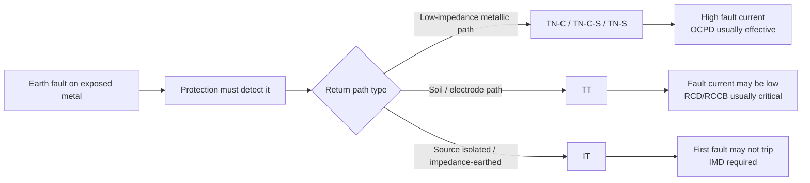
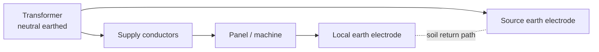
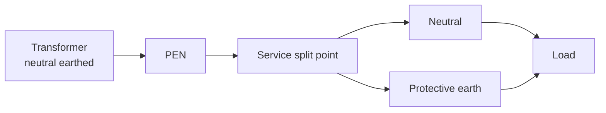
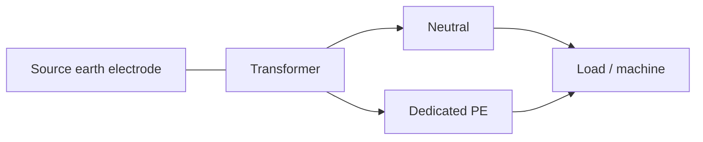
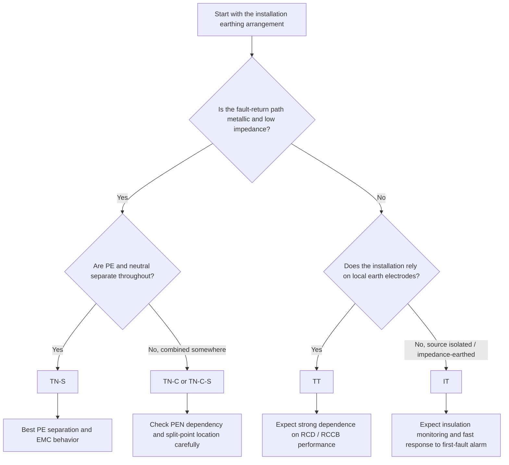

## Purpose

Use this module to understand how the earthing arrangement of an electrical installation affects fault-current path, protective-device operation, and touch-voltage risk.

The earthing system must be known early in a machine or panel design project. It affects protective-device strategy, bonding design, touch-voltage risk, and whether control circuits can reference earth directly.

## The IEC letter code

The IEC earthing classification uses two or three letters:

### First letter — source connection to earth

| Letter | Meaning |
|---|---|
| `T` | Source neutral directly connected to earth |
| `I` | Source isolated from earth, or connected through high impedance |

### Second letter — exposed-part connection method

| Letter | Meaning |
|---|---|
| `T` | Exposed conductive parts connected to a **local** earth electrode |
| `N` | Exposed conductive parts connected to the **supply-system** neutral or protective conductor |

### Additional letters — neutral and PE relationship (TN systems only)

| Letter | Meaning |
|---|---|
| `C` | Neutral and protective-earth functions **combined** in one conductor (PEN conductor) |
| `S` | Neutral and protective-earth functions **separate** conductors |

## Visual summary — what changes between systems?



## TN-C

Source neutral earthed. Exposed parts connected to a combined PEN conductor (neutral = PE).

**Characteristics:**
- Fault current returns through the PEN conductor — metallic path, low impedance
- Overcurrent protective devices can clear faults reliably
- No separate PE conductor required — lower conductor cost

**Key risk:** A break in the upstream PEN conductor can elevate all bonded metalwork (motor frames, machine casings, panel enclosures) to a dangerous voltage.

**Typical context:** Distribution network sections; not recommended inside buildings or industrial facilities.


> **Fault return:** Metallic PEN
> **Protection:** Overcurrent device
> **Main risk:** Broken PEN can energize bonded metalwork

**Machine designer takeaway:** Avoid assuming TN-C is acceptable inside machine internals; PEN dependency creates a severe metalwork-voltage failure mode.

## TT

Source neutral earthed. Exposed parts connected to a **local** earth electrode independent of the supply neutral.

**Characteristics:**
- No dependency on a combined PEN conductor
- Fault current returns through soil back to the transformer neutral — high loop impedance
- Low fault-current magnitude may be insufficient to operate overcurrent devices quickly

**Protection dependency:** TT systems depend heavily on residual-current circuit breakers (RCCB / RCD) for fault detection and earth-electrode performance.

**Typical context:** Rural areas, standalone buildings where a utility earth conductor is not extended to the installation.



> **Fault return:** Through soil / electrodes
> **Protection:** RCD / RCCB usually essential
> **Main risk:** High loop impedance may limit fault current

**Machine designer takeaway:** Do not assume breaker-only protection is enough; TT designs usually need RCD strategy and verified earth-electrode performance.

## TN-C-S (PME)

Neutral and PE combined for part of the supply path (PEN), then separated at a defined split point inside the installation. Also known as Protective Multiple Earthing (PME).

**Characteristics:**
- Inside the installation, equipment connects to a dedicated PE conductor after the split point
- Fault current returns through a low-impedance metallic path after separation
- Overcurrent devices operate faster than TT for internal faults

**Remaining risk:** An upstream PEN break before the split point can still elevate metalwork to dangerous voltage — the same failure mode as TN-C, but only upstream of the separation point.

**Typical context:** Urban residential supplies; the utility brings a PEN conductor and neutral/PE are split at the consumer unit or service entrance.



> **Fault return:** Metallic path after PE/N split
> **Protection:** Overcurrent device
> **Main risk:** Upstream PEN failure still matters

**Machine designer takeaway:** Treat the service split point as a critical design boundary; upstream PEN issues still affect downstream exposed metalwork.

## TN-S

Neutral and protective earth are separate conductors from the transformer onward. No combined PEN section exists anywhere in the system.

**Characteristics:**
- Dedicated low-impedance PE path from source to load
- No combined-conductor failure mode
- Faster and more reliable operation of protective devices
- Lower touch-voltage risk
- Better electromagnetic compatibility (EMC) — cleaner separation of return and earth paths

**Tradeoff:** Higher conductor cost — a dedicated PE conductor must run from the source throughout the system.

**Typical context:** Large industrial plants, hospitals, data centers, high-reliability installations.



> **Fault return:** Dedicated metallic PE
> **Protection:** Overcurrent device
> **Main risk:** None distinct — touch-voltage exposure is lowest of the TN types

**Machine designer takeaway:** TN-S is usually the cleanest arrangement for industrial machines where predictable PE behavior and EMC matter.

## IT

Source isolated from earth or connected through high impedance. Exposed parts are earthed locally.

**Characteristics:**
- First phase-to-earth fault does not immediately trip the system
- Supply continuity is maintained after the first fault
- Insulation monitoring device (IMD) required to detect the first fault
- Second earth fault on a different phase creates a short circuit — action required after first-fault detection

**Tradeoff:** Requires disciplined insulation monitoring and a design culture that responds promptly to first-fault alarms.

**Typical context:** Hospitals (operating theatres), mines, critical process industries where loss of supply is more dangerous than a first earth fault.

```mermaid
flowchart LR
    S[Isolated source<br/>or impedance-earthed source] --> L[Load / machine]
    L --> PE[Local earth / bonded metal]
    S -. monitors insulation .- IMD[Insulation Monitoring Device]
    IMD -. .- PE
```

> **Fault return:** No solid earth-return path on first fault
> **Protection:** IMD first, then fault-clearing action on second fault
> **Main risk:** First fault must be acted on promptly

**Machine designer takeaway:** IT is not "safer by default"; it is safer only when the IMD alarm is monitored and the first fault is handled quickly and consistently.

## Practical comparison

| System | Fault-return path | Typical clearing method | Main risk | Typical context |
|---|---|---|---|---|
| **TN-C** | Metallic PEN | Overcurrent device | PEN break can energize metalwork | Distribution, older workshops |
| **TT** | Soil / local electrode back to source | RCD / RCCB usually essential | High loop impedance; electrode dependent | Rural or standalone installations |
| **TN-C-S** | Metallic PE after split point | Overcurrent device | Upstream PEN break still possible | Urban residential, PME supply |
| **TN-S** | Dedicated metallic PE | Overcurrent device | None distinct — lowest touch-voltage of TN types | Industrial, hospital, data centre |
| **IT** | Isolated / impedance-earthed source | IMD on first fault; protective clearing on second fault | First fault can persist if ignored | Hospital theatres, mines, critical process |

## Selection logic — what are you optimizing for?



## The practical questions to ask

When assessing or designing for any earthing system:

1. Does fault current return through a metallic path or through soil?
2. Is protection primarily relying on overcurrent devices or residual-current devices?
3. Is there a dependency on a combined PEN conductor — and where?
4. Is continuity of service more important than immediate trip on first earth fault?
5. What earthing arrangement does the utility actually deliver to the installation boundary?

## Related standards

- IEC 60204-1 Clause 5 — Incoming supply requirements for machine electrical equipment
- IEC 60204-1 Clause 8 — Equipotential bonding requirements
- IEC 60364 — Low-voltage electrical installations (earthing arrangements defined here)
- NEC Article 250 — US grounding and bonding (different terminology, different classification model)

## See also

The US counterpart to this topic is the [NEC Grounding and Bonding module]({{ '/training/nec-application/grounding-bonding-control-panels/' | relative_url }}), which covers Art. 250 grounding using NEC terminology and classification.

---

<div style="display:flex; justify-content:space-between; margin-top:2rem; font-size:0.9rem;">
  <span></span>
  <a href="{{ '/training/fundamentals/' | relative_url }}">↑ Electrical Fundamentals</a>
  <span></span>
</div>
