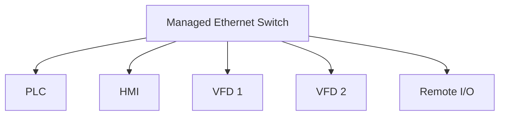
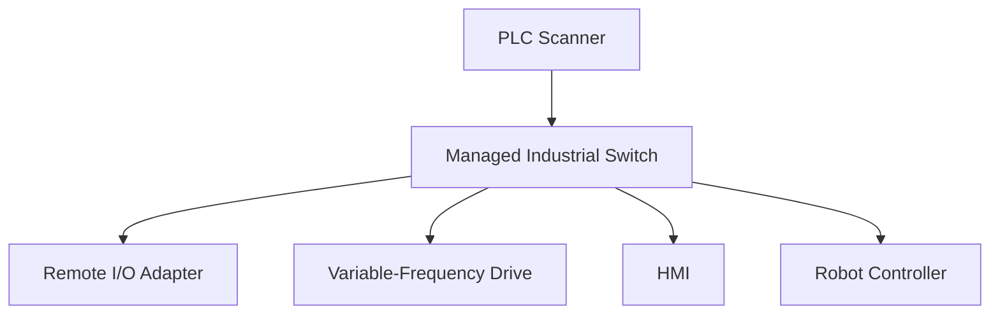

## Overall assessment

The site has strong technical depth and could become a useful engineering portfolio project. It shows that you understand control-system standards, functional safety, commissioning, industrial electrical design, and how these areas connect.

The main weakness is **not lack of content**. It is that the site currently looks like an internal engineering knowledge base that was published before the content, navigation, and verification states were fully cleaned up.

## Highest-priority improvements

### 1. Fix the conflicting content-status information

This is the most serious issue.

The homepage says several functional-safety sections are **planned**, while the Standards page labels the same sections **Complete**:

| Standard    | Homepage | Standards page |
| ----------- | -------- | -------------- |
| ISO 12100   | Planned  | Complete       |
| ISO 13849-1 | Planned  | Complete       |
| IEC 62061   | Planned  | Complete       |
| IEC 61508   | Planned  | Complete       |
| IEC 61511   | Planned  | Complete       |

The homepage also marks IEC 62443 content as “TO VERIFY,” while the Standards page calls it “Complete.” ([Kyaw Min Thu][1])

This undermines trust because users cannot determine what has actually been reviewed.

Use one controlled status vocabulary everywhere:

- **Draft** — generated or assembled, not technically reviewed
- **Reviewed** — checked against the identified edition
- **Partial** — only selected clauses or topics covered
- **Reference only** — secondary-source summary
- **Planned** — page structure exists, content unfinished
- **Needs revalidation** — reviewed previously but edition may be outdated

Avoid “Complete.” For standards work, “complete” implies much more confidence than the site can currently support.

---

### 2. Repair the diagrams

Several Mermaid diagrams appear as raw code rather than rendered graphics. For example, the homepage displays `graph TD`, and the lifecycle page displays `flowchart LR` as text. ([Kyaw Min Thu][1])

This makes the site feel unfinished and makes key relationships difficult to understand.

For MkDocs Material, confirm that Mermaid support is enabled, typically through something equivalent to:

```yaml
markdown_extensions:
  - pymdownx.superfences:
      custom_fences:
        - name: mermaid
          class: mermaid
          format: !!python/name:pymdownx.superfences.fence_code_format
```

Then ensure the Markdown uses fenced blocks:

````markdown

````

````

The lifecycle and relationship diagrams should be visual centerpieces, not raw source text.

---

### 3. Resolve the homepage/navigation mismatch

The homepage navigation shows:

- Standards
- Lifecycle
- Industries
- Scenarios
- Crosswalks
- Software Stack
- About

But internal pages show a substantially expanded structure:

- Fundamentals
- Standards
- Design
- Lifecycle
- Industries
- Tools

The internal navigation includes motors, electrical fundamentals, commissioning templates, troubleshooting, glossary, RAG Browser, cybersecurity, hazardous areas, and other sections that are not discoverable from the homepage navigation. :contentReference[oaicite:2]{index=2}

This suggests either:

1. the homepage was built from an older navigation structure, or
2. different pages are loading different templates/configurations.

Use one global navigation system throughout the site.

A cleaner top-level structure would be:

```text
Home
Learn
Standards
Design
Lifecycle
Industries
Engineering Tools
About
````

Then group the details under those headings.

---

### 4. Clarify what the product actually is

The repository is named **Control-System-Tools**, the header says **CS Standards Atlas**, and the homepage title says **Control System Standards Atlas**. However, the site now includes:

- control theory,
- electrical fundamentals,
- motor selection,
- commissioning,
- troubleshooting,
- cybersecurity,
- safety lifecycle,
- standards crosswalks,
- industry guidance.

That is broader than a standards atlas. ([Kyaw Min Thu][2])

Choose one clear identity.

A stronger name would be:

> **Control Systems Engineering Field Guide**

Possible subtitle:

> Practical standards, design workflows, commissioning references, and engineering tools for industrial automation.

That description better matches the current scope. Keep “Standards Atlas” as one section rather than the entire product identity.

---

### 5. Replace repository-oriented language with user-oriented language

The homepage exposes internal paths such as:

```text
rag/us/
rag/reference_models/
control-standards/rag/standards_intelligence/
```

It also contains language such as “local RAG corpus,” “routing,” “source of truth,” and “NOT IN CORPUS.” ([Kyaw Min Thu][1])

Those terms are useful for maintainers, but distracting for engineers using the site.

Move repository details to a dedicated **Development / Methodology** page. On normal pages, use plain labels:

| Current wording    | Better public wording            |
| ------------------ | -------------------------------- |
| NOT IN CORPUS      | Source material not yet reviewed |
| TO VERIFY          | Technical review pending         |
| Local RAG coverage | Reference coverage               |
| Repository path    | Source notes                     |
| Routing guide      | Standards selection guide        |

The homepage should explain what users can accomplish, not how your internal file hierarchy works.

---

### 6. Make the homepage task-driven

The homepage currently begins with standards families and repository organization. That is logical for the author, but engineers usually arrive with a problem:

- Which standard applies?
- What documents do I need before commissioning?
- Is this a machinery safety or process-safety application?
- What should be checked during a panel review?
- How do NFPA 79 and IEC 60204-1 differ?
- Which motor or drive type should I select?

A better opening section:

## What are you working on?

- Design a US industrial control panel
- Design a machine for the US and EU
- Perform a machinery risk assessment
- Design a safety function
- Commission a VFD or servo
- Review an electrical drawing
- Select a motor and drive
- Troubleshoot an automation system

This would make the site immediately useful rather than primarily descriptive.

---

### 7. Separate general lifecycle guidance from safety lifecycle guidance

The lifecycle page is titled **Control System Engineering Lifecycle**, but its content explicitly says it defines a **Safety Engineering Lifecycle**, particularly for systems with safety functions. ([Kyaw Min Thu][3])

Those are not identical.

Use two distinct models:

#### General control-system lifecycle

```text
Requirements
Architecture
I/O and instrumentation design
Electrical design
Software design
Panel build
Integration
FAT
Installation
SAT
Handover
Maintenance
Management of change
```

#### Functional-safety lifecycle

```text
Hazard identification
Risk assessment
PLr/SIL determination
Safety requirements specification
Architecture
Implementation
Verification
Validation
Proof testing
Management of change
Decommissioning
```

Then show how the safety lifecycle overlays the general project lifecycle.

---

### 8. Reduce overconfident or overly absolute engineering language

Some content uses strong declarations such as:

- “This lifecycle is mandatory”
- “These are non-negotiable principles”
- “No single engineer owns every stage”
- formal independence “required at SIL 2+”

The problem is not necessarily the engineering direction; it is that requirements depend on the exact standard, edition, jurisdiction, application sector, project governance, and interpretation. The site itself says it has not been independently verified against current published editions. ([Kyaw Min Thu][3])

Use calibrated wording:

> “Projects involving safety-related control functions should normally follow a documented functional-safety lifecycle appropriate to the applicable standard.”

And:

> “Verification independence requirements vary by applicable standard, integrity level, lifecycle phase, and organizational structure. Confirm the required independence against the governing edition.”

This is more defensible and technically professional.

---

## Content improvements

### 9. Add sources and review metadata to every technical page

The disclaimer is good, but it is too general. Each standard page should state:

```text
Standard: ISO 13849-1
Edition covered: 2023
Page status: Technical review pending
Last reviewed: July 2026
Primary source used: Licensed standard
Secondary sources: [identified references]
Reviewer: Kyaw Min Thu
Known limitations: Excludes Part 2 validation details
```

For every specific technical claim, distinguish:

- normative requirement,
- informative guidance,
- your interpretation,
- common industry practice,
- example only.

A small label system would help:

- **Requirement**
- **Guidance**
- **Interpretation**
- **Example**
- **Verify in standard**

---

### 10. Add jurisdiction and applicability warnings near decisions

For example, the quick-decision page currently simplifies US panel/machinery selection to NEC, NFPA 79, and UL 508A. ([Kyaw Min Thu][2])

That is useful as orientation, but actual applicability can depend on:

- authority having jurisdiction,
- listing requirements,
- machine versus process-equipment scope,
- customer specifications,
- state or local code adoption,
- hazardous location classification,
- product-specific standards,
- installation versus equipment boundaries.

Put a short applicability note directly below each decision table rather than relying only on the footer disclaimer.

---

### 11. Add worked engineering examples

The scenarios are a strong idea. Expand them into realistic engineering packages.

For a US industrial control panel, include:

```text
1. Project assumptions
2. Applicable standards
3. Boundary between NEC, NFPA 79 and UL 508A
4. Incoming power and disconnect selection
5. SCCR workflow
6. Branch-circuit protection
7. control-circuit protection
8. grounding and bonding
9. wire color and identification
10. drawing package
11. inspection checklist
12. FAT checklist
13. unresolved engineering questions
```

Avoid reproducing protected standards text. Use original explanations, decision logic, and examples.

---

### 12. Add downloadable original templates

This is where the site can become more than a reference library.

High-value templates:

- controls design basis
- standards applicability register
- I/O list
- instrument index
- control narrative
- cause-and-effect matrix
- safety requirements specification
- electrical drawing review checklist
- panel FAT checklist
- VFD commissioning sheet
- servo commissioning sheet
- loop-check form
- alarm rationalization sheet
- management-of-change form
- commissioning punch list
- test-instrument record
- cybersecurity asset inventory

Clearly mark them as examples requiring project-specific review.

---

## Design and usability improvements

### 13. Shorten very long pages

The lifecycle page is extensive and reads like a full procedure manual. It combines scope, principles, role definitions, diagrams, stages, standards, and instructions on one page. ([Kyaw Min Thu][3])

Break it into:

```text
Lifecycle overview
General engineering lifecycle
Functional-safety lifecycle
Stage gates
Roles and responsibilities
Deliverables matrix
Management of change
Decommissioning
Templates
```

Use an overview page with brief summaries and links.

---

### 14. Add search as a primary interface

For a site with this much material, search should be highly visible.

Useful search examples:

- “SCCR”
- “emergency stop”
- “Category 3”
- “PL d”
- “servo commissioning”
- “shield grounding”
- “IEC 62443 zone”
- “NEC Article 409”

Add tags and aliases so searches work across abbreviations and full names.

---

### 15. Improve page-level navigation

Each technical page should contain:

- a short summary,
- prerequisites,
- applicable standards,
- key decisions,
- deliverables,
- common mistakes,
- related pages,
- previous/next stage,
- review status.

For lifecycle pages, a persistent stage indicator would help:

```text
Concept → Standards → Risk → SRS → Architecture → Design → Build → Commission
                         YOU ARE HERE
```

---

### 16. Remove visible draft markers from normal reading flow

Labels such as `TO VERIFY`, `NOT IN CORPUS`, and `LIMITED LOCAL COVERAGE` are useful, but their current presentation looks like unfinished author notes. ([Kyaw Min Thu][1])

Convert them into styled status badges:

> **Review status: Pending**

> **Coverage: Partial**

> **Source limitation: Primary standard not yet checked**

That preserves transparency while looking deliberate.

---

## Portfolio positioning

Because this site is associated with your professional identity, add an About section that explains your contribution without overstating authority:

> Developed by Kyaw Min Thu, a controls engineer working across industrial automation, instrumentation, machine controls, commissioning, and facility control systems. This project organizes engineering references and reusable workflows for practical controls work. It is an independent educational project and is not affiliated with NFPA, IEC, ISO, UL, SEMI, or any employer.

Also add:

- GitHub repository link
- issue-reporting link
- change log
- contribution policy
- license for your original content
- copyright/trademark acknowledgment
- contact or LinkedIn link

Do not publish employer-confidential methods, screenshots, naming conventions, or project data.

## Recommended implementation order

### Immediate

1. Fix Mermaid rendering.
2. Make navigation identical on every page.
3. Reconcile all “planned,” “complete,” and “to verify” statuses.
4. Remove raw internal repository paths from the homepage.
5. Clarify whether the product is a standards atlas or a broader control-systems field guide.

### Next release

6. Rebuild the homepage around engineering tasks.
7. Split the lifecycle page into smaller pages.
8. Add page-level source, edition, status, and review metadata.
9. Convert draft warnings into professional status badges.
10. Add search and better cross-linking.

### Longer term

11. Add worked examples.
12. Add original engineering templates.
13. Add automated link checking and content-status validation.
14. Add a revision history and technical review workflow.
15. Add interactive decision tools only after the underlying content has been reviewed.

## Bottom line

The technical foundation is strong, but the site is presently **too broad, internally oriented, and inconsistent in its verification claims**. The best move is not to add more pages yet. Stabilize the structure, status model, diagrams, and public-facing language first.

Once those are fixed, this can be a credible portfolio piece that demonstrates systems thinking rather than merely a large collection of AI-assisted documentation.

[1]: https://kyawminthu20.github.io/Control-System-Tools/ "Home — Control System Standards Atlas"
[2]: https://kyawminthu20.github.io/Control-System-Tools/standards/ "Standards Explorer — Control System Standards Atlas"
[3]: https://kyawminthu20.github.io/Control-System-Tools/lifecycle/ "Engineering Lifecycle — Control System Standards Atlas"

Your current homepage has already improved substantially: it now starts with project-driven entry points, uses consistent top-level navigation, and separates scenarios, standards families, lifecycle stages, and industries. The remaining weak points are internal terms such as **“CORPUS COMPLETE,” “local corpus,”** and the exposed repository tree near the bottom. ([Kyaw Min Thu][1])

Below is a complete example of how I would rewrite the public homepage.

# Control Systems Engineering Field Guide

## Practical standards, design workflows, commissioning guidance, and engineering tools for industrial automation

Use this field guide to identify applicable standards, plan control-system deliverables, develop safety functions, review electrical designs, and prepare equipment for commissioning.

This is an independent educational and engineering-reference project. It does not replace published standards, project specifications, professional engineering review, or decisions by the authority having jurisdiction.

[Find Applicable Standards](standards/finder.md){ .md-button .md-button--primary }
[Choose a Project Scenario](scenarios/index.md){ .md-button }
[Browse Engineering Tools](tools/index.md){ .md-button }

---

## What are you working on?

Choose the task that most closely matches your current project.

<div class="grid cards" markdown>

- :material-view-dashboard-outline:{ .lg .middle } **Designing a US industrial control panel**

  ***

  Identify the roles of the NEC, UL 508A, and NFPA 79. Follow a practical workflow covering panel boundaries, overcurrent protection, SCCR, grounding, documentation, inspection, and testing.

  [Open the US panel workflow](scenarios/us-industrial-control-panel.md)

- :material-robot-industrial:{ .lg .middle } **Designing machinery for the US and EU**

  ***

  Compare NFPA 79 and IEC 60204-1, establish the machinery risk-assessment process, and identify the documentation needed for each market.

  [Open the global machinery workflow](scenarios/global-machine.md)

- :material-shield-check-outline:{ .lg .middle } **Designing a safety-related control function**

  ***

  Select an appropriate PL or SIL design path, define the safety function, evaluate the architecture, and plan verification and validation.

  [Open the safety workflow](design/safety-functions/index.md)

- :material-cog-sync-outline:{ .lg .middle } **Selecting or commissioning a motor drive**

  ***

  Compare VFD, servo, and BLDC applications. Review motor data, feedback devices, braking, control modes, tuning, interlocks, and commissioning checks.

  [Open motors and drives](fundamentals/motors-drives/index.md)

- :material-clipboard-check-outline:{ .lg .middle } **Preparing for FAT or SAT**

  ***

  Build a test plan, confirm prerequisites, record results, manage punch-list items, and define acceptance criteria.

  [Open commissioning resources](lifecycle/commissioning/index.md)

- :material-tools:{ .lg .middle } **Troubleshooting a control system**

  ***

  Use structured troubleshooting workflows for PLC I/O, field instruments, networks, VFDs, servos, safety circuits, and control panels.

  [Open troubleshooting guides](tools/troubleshooting/index.md)

</div>

---

## Standards selection

Standards applicability depends on the equipment, installation, jurisdiction, target market, industry, risk profile, and customer requirements.

Use the Standards Finder as an engineering starting point. Final applicability must be confirmed against the governing editions, contract documents, and authority having jurisdiction.

### Common starting paths

| Project type                      | Typical starting references                                          | Important qualification                                                                 |
| --------------------------------- | -------------------------------------------------------------------- | --------------------------------------------------------------------------------------- |
| US industrial control panel       | NEC Article 409, UL 508A                                             | NFPA 79 may also apply when the panel is part of industrial machinery                   |
| Industrial machinery for the US   | NFPA 79, NEC, applicable product standards                           | Local code adoption and listing requirements must be confirmed                          |
| Machinery for the European market | IEC 60204-1, ISO 12100                                               | Applicable regulations and harmonized standards must be evaluated                       |
| Machinery safety function         | ISO 13849-1 or IEC 62061                                             | Selection depends on the application and project requirements                           |
| Process safety system             | IEC 61511, supported by IEC 61508                                    | Intended for safety instrumented systems in the process sector                          |
| Industrial cybersecurity          | IEC 62443 series                                                     | Applicable parts depend on the asset owner, integrator, product, and lifecycle activity |
| Hazardous location installation   | NEC Articles 500–506 or IEC 60079 series                             | Classification system depends on the jurisdiction and project basis                     |
| Semiconductor equipment           | Applicable SEMI standards plus electrical and machinery requirements | Customer specifications often add substantial requirements                              |

[Open the Standards Finder](standards/finder.md){ .md-button .md-button--primary }

---

## Worked engineering scenarios

Worked scenarios combine standards selection, lifecycle planning, design decisions, required deliverables, and verification activities.

### Scenario 01 — US industrial control panel

**Application:** Industrial machinery installed in the United States
**Starting references:** NEC Article 409, UL 508A, and NFPA 79

Topics include:

- equipment and installation boundaries;
- incoming supply and disconnecting means;
- feeder and branch-circuit protection;
- control-circuit protection;
- short-circuit current rating;
- grounding and bonding;
- conductor identification;
- panel documentation;
- inspection and test records.

[Open Scenario 01](scenarios/us-industrial-control-panel.md)

---

### Scenario 02 — Machinery for the US and EU

**Application:** A machine intended for both US and European markets
**Starting references:** NFPA 79, IEC 60204-1, and ISO 12100

Topics include:

- common and market-specific requirements;
- machinery risk assessment;
- electrical design differences;
- emergency-stop and protective-stop considerations;
- technical documentation;
- conformity and inspection planning.

[Open Scenario 02](scenarios/global-machine.md)

---

### Scenario 03 — Process skid shutdown system

**Application:** An automated process skid containing safety instrumented shutdown functions
**Starting references:** IEC 61511 and applicable IEC 61508 principles

Topics include:

- hazard and risk information;
- safety requirements specification;
- sensor, logic-solver, and final-element architecture;
- independence and common-cause considerations;
- validation planning;
- proof-test and maintenance requirements.

**Content status:** Engineering review in progress. Confirm all requirements against the governing standard editions.

[Open Scenario 03](scenarios/process-skid-shutdown.md)

---

### Scenario 04 — Networked safety PLC system

**Application:** Safety PLC architecture connected to industrial networks
**Starting references:** ISO 13849-1 or IEC 62061, with an IEC 62443 cybersecurity overlay

Topics include:

- safety-function boundaries;
- safety communications;
- network segmentation;
- zones and conduits;
- remote-access controls;
- failure-response behavior;
- cybersecurity and functional-safety coordination.

[Open Scenario 04](scenarios/networked-safety-plc.md)

---

### Scenario 05 — Semiconductor equipment compliance

**Application:** Automated equipment intended for installation in a semiconductor fabrication facility

Topics include:

- machinery and electrical safety;
- facility interface requirements;
- hazardous materials and exhaust interfaces;
- emergency shutdown;
- ergonomics;
- seismic and installation considerations;
- customer-specific compliance requirements.

**Content status:** Partial coverage. Project and customer requirements must be reviewed independently.

[Open Scenario 05](scenarios/semiconductor-equipment.md)

[Browse all scenarios](scenarios/index.md){ .md-button }

---

## Browse by engineering area

<div class="grid cards" markdown>

- **Electrical fundamentals**

  Circuit protection, grounding, transformers, control power, relays, contactors, sensors, signal types, and industrial wiring principles.

  [Browse fundamentals](fundamentals/electrical/index.md)

- **Motors and drives**

  Induction motors, permanent-magnet motors, BLDC motors, VFDs, servo systems, encoders, braking, sizing, control modes, and tuning.

  [Browse motors and drives](fundamentals/motors-drives/index.md)

- **Industrial control systems**

  PLC architecture, I/O, instrumentation, control narratives, interlocks, alarms, networks, HMI design, and software structure.

  [Browse control systems](design/control-systems/index.md)

- **Functional safety**

  Risk assessment, safety functions, PL and SIL approaches, architecture, diagnostic coverage, validation, proof testing, and management of change.

  [Browse functional safety](design/functional-safety/index.md)

- **Industrial cybersecurity**

  Asset inventory, zones and conduits, secure remote access, account management, backups, patching, logging, and incident preparation.

  [Browse cybersecurity](design/cybersecurity/index.md)

- **Commissioning and troubleshooting**

  FAT, SAT, loop checks, energization, functional testing, tuning, fault isolation, punch-list management, and handover.

  [Browse field engineering](tools/field-engineering/index.md)

</div>

---

## Engineering lifecycle

The general control-system lifecycle and the functional-safety lifecycle overlap, but they are not identical.

### General control-system lifecycle


### Typical project stages

1. **Concept and requirements**
   Define the process, machine, operating modes, boundaries, stakeholders, and performance requirements.

2. **Standards and compliance planning**
   Identify applicable codes, standards, regulations, customer requirements, and inspection expectations.

3. **Risk assessment**
   Identify hazards, estimate risk, define protective measures, and determine whether safety-related control functions are required.

4. **System architecture**
   Develop the control, electrical, instrumentation, network, and safety architectures.

5. **Detailed design**
   Produce drawings, calculations, I/O lists, instrument data, control narratives, cause-and-effect matrices, and software specifications.

6. **Implementation and build**
   Develop control software, configure equipment, manufacture panels, and assemble systems.

7. **Factory acceptance testing**
   Verify the equipment and software before shipment or field installation.

8. **Installation and pre-commissioning**
   Confirm installation quality, wiring, calibration, network configuration, mechanical readiness, and safe energization conditions.

9. **Commissioning and validation**
   Test operating sequences, interlocks, alarms, safety functions, abnormal conditions, and performance.

10. **Handover and operation**
    Transfer approved documentation, backups, training records, spare-parts information, and maintenance requirements.

11. **Maintenance and management of change**
    Control modifications, preserve configuration records, retest affected functions, and maintain system integrity.

[Explore the complete lifecycle](lifecycle/index.md){ .md-button .md-button--primary }

---

## Browse by industry

Industry overlays add project-specific requirements to the general engineering framework.

| Industry                          | Typical focus areas                                                                                              |
| --------------------------------- | ---------------------------------------------------------------------------------------------------------------- |
| Semiconductor                     | Equipment safety, facilities interfaces, hazardous materials, exhaust, seismic considerations, SEMI requirements |
| Oil and gas                       | Process safety, hazardous areas, fire and gas systems, shutdown systems, proof testing                           |
| Energy                            | Plant controls, electrical protection, safety systems, cybersecurity, availability                               |
| Food and beverage                 | Hygienic design, washdown, material compatibility, batch control, traceability                                   |
| Water and wastewater              | Process control, remote stations, alarming, communications, redundancy, cybersecurity                            |
| Pharmaceutical and biotechnology  | Validation, audit trails, data integrity, environmental control, batch records                                   |
| Warehousing and material handling | Machinery safety, conveyor controls, scanners, drives, networked automation                                      |
| Building and facility controls    | BMS, FMS, life-safety interfaces, HVAC controls, monitoring, alarming                                            |
| Offshore and marine               | Classification rules, environmental conditions, hazardous areas, redundancy                                      |

[Browse industry guidance](industries/index.md)

---

## Engineering templates and tools

Downloadable resources are original examples intended to help structure engineering work.

Available or planned tools include:

- standards applicability register;
- controls design basis;
- I/O list;
- instrument index;
- control narrative template;
- cause-and-effect matrix;
- safety requirements specification;
- electrical drawing review checklist;
- panel inspection checklist;
- FAT and SAT test forms;
- loop-check sheet;
- VFD commissioning record;
- servo commissioning record;
- alarm rationalization worksheet;
- management-of-change form;
- commissioning punch list;
- cybersecurity asset inventory.

Each template must be adapted to the equipment, organization, jurisdiction, and project requirements.

[Browse engineering tools](tools/index.md){ .md-button .md-button--primary }

---

## Content review status

Every technical page should display a review-status panel.

| Status                         | Meaning                                                                                |
| ------------------------------ | -------------------------------------------------------------------------------------- |
| **Reviewed**                   | Compared against the identified primary reference and internally checked               |
| **Partial coverage**           | Only selected topics or clauses are addressed                                          |
| **Engineering review pending** | Draft content exists but has not completed technical review                            |
| **Needs revalidation**         | Previously reviewed, but the referenced edition or project assumptions may be outdated |
| **Planned**                    | Page or tool has not yet been developed                                                |

Do not interpret a page status as certification, regulatory approval, or confirmation of project compliance.

---

## How to use this field guide

1. Start with the project scenario closest to your application.
2. Use the Standards Finder to establish an initial applicability list.
3. Confirm editions, jurisdiction, contract requirements, and customer specifications.
4. Follow the relevant lifecycle stages.
5. Use the templates to structure project deliverables.
6. Record assumptions, open questions, and required professional reviews.
7. Verify final decisions using the official published standards.

---

## About this project

The Control Systems Engineering Field Guide is developed by **Kyaw Min Thu**, a controls engineer with experience in industrial automation, instrumentation, electrical controls, machinery, semiconductor systems, field service, commissioning, and facilities control systems.

The objective is to organize practical engineering knowledge into reusable workflows that connect:

- standards selection;
- requirements development;
- electrical and control-system design;
- functional safety;
- commissioning;
- troubleshooting;
- maintenance;
- industrial cybersecurity.

This project is independent and is not affiliated with or endorsed by IEC, ISO, NFPA, UL Solutions, ISA, SEMI, any regulatory authority, or any employer.

[About the author](about.md)
[View project methodology](methodology.md)
[Report a technical issue](contributing.md)

---

## Important notice

This website provides educational summaries, engineering examples, and workflow guidance. It is not a substitute for:

- official published standards;
- applicable laws and regulations;
- project specifications;
- equipment-manufacturer instructions;
- authority-having-jurisdiction decisions;
- licensed professional engineering services;
- certified functional-safety assessment;
- independent verification or validation.

Standards are copyrighted publications. This site should summarize and interpret requirements using original language rather than reproducing protected clauses or tables.

Always verify critical technical and compliance decisions against the official governing documents.

## Recommended `mkdocs.yml` navigation

```yaml
site_name: Control Systems Engineering Field Guide
site_description: >
  Practical standards, design workflows, commissioning guidance,
  and engineering tools for industrial automation.

nav:
  - Home: index.md

  - Start Here:
      - Standards Finder: standards/finder.md
      - Project Scenarios: scenarios/index.md
      - Engineering Lifecycle: lifecycle/index.md
      - Content Status: methodology/content-status.md

  - Fundamentals:
      - Overview: fundamentals/index.md
      - Electrical:
          - Electrical Fundamentals: fundamentals/electrical/index.md
          - Control Power: fundamentals/electrical/control-power.md
          - Protection: fundamentals/electrical/protection.md
          - Grounding and Bonding: fundamentals/electrical/grounding.md
      - Motors and Drives:
          - Overview: fundamentals/motors-drives/index.md
          - Induction Motors: fundamentals/motors-drives/induction-motors.md
          - BLDC and PM Motors: fundamentals/motors-drives/bldc-pm.md
          - VFDs: fundamentals/motors-drives/vfd.md
          - Servo Systems: fundamentals/motors-drives/servo.md
          - Encoders: fundamentals/motors-drives/encoders.md

  - Standards:
      - Overview: standards/index.md
      - United States:
          - NEC: standards/us/nec.md
          - NFPA 79: standards/us/nfpa-79.md
          - UL 508A: standards/us/ul-508a.md
      - International Machinery:
          - IEC 60204-1: standards/international/iec-60204-1.md
          - ISO 12100: standards/international/iso-12100.md
      - Functional Safety:
          - Overview: standards/functional-safety/index.md
          - ISO 13849-1: standards/functional-safety/iso-13849-1.md
          - IEC 62061: standards/functional-safety/iec-62061.md
          - IEC 61508: standards/functional-safety/iec-61508.md
          - IEC 61511: standards/functional-safety/iec-61511.md
      - Cybersecurity:
          - IEC 62443: standards/cybersecurity/iec-62443.md
      - Hazardous Areas:
          - IEC 60079: standards/hazardous-areas/iec-60079.md
      - Semiconductor:
          - SEMI Standards: standards/semiconductor/index.md
      - Crosswalks:
          - NFPA 79 vs IEC 60204-1: standards/crosswalks/nfpa79-iec60204.md
          - NEC vs UL 508A: standards/crosswalks/nec-ul508a.md

  - Design:
      - Overview: design/index.md
      - Requirements: design/requirements.md
      - Control Architecture: design/control-architecture.md
      - Electrical Design: design/electrical.md
      - Instrumentation: design/instrumentation.md
      - Control Narratives: design/control-narratives.md
      - Alarms and Interlocks: design/alarms-interlocks.md
      - Functional Safety: design/functional-safety/index.md
      - Industrial Networks: design/networks.md
      - Cybersecurity: design/cybersecurity/index.md
      - Documentation: design/documentation.md

  - Lifecycle:
      - Overview: lifecycle/index.md
      - Concept: lifecycle/concept.md
      - Standards Selection: lifecycle/standards-selection.md
      - Risk Assessment: lifecycle/risk-assessment.md
      - Architecture: lifecycle/architecture.md
      - Detailed Design: lifecycle/detailed-design.md
      - Build and Integration: lifecycle/build.md
      - FAT: lifecycle/fat.md
      - Installation: lifecycle/installation.md
      - Pre-Commissioning: lifecycle/pre-commissioning.md
      - SAT and Commissioning: lifecycle/commissioning.md
      - Handover: lifecycle/handover.md
      - Maintenance: lifecycle/maintenance.md
      - Management of Change: lifecycle/management-of-change.md

  - Scenarios:
      - Overview: scenarios/index.md
      - US Industrial Control Panel: scenarios/us-industrial-control-panel.md
      - Global Machine: scenarios/global-machine.md
      - Process Skid Shutdown: scenarios/process-skid-shutdown.md
      - Networked Safety PLC: scenarios/networked-safety-plc.md
      - Semiconductor Equipment: scenarios/semiconductor-equipment.md

  - Industries:
      - Overview: industries/index.md
      - Semiconductor: industries/semiconductor.md
      - Oil and Gas: industries/oil-gas.md
      - Energy: industries/energy.md
      - Food and Beverage: industries/food-beverage.md
      - Water and Wastewater: industries/water-wastewater.md
      - Pharmaceutical: industries/pharmaceutical.md
      - Material Handling: industries/material-handling.md
      - Building and Facilities: industries/building-facilities.md
      - Offshore and Marine: industries/offshore-marine.md

  - Tools:
      - Overview: tools/index.md
      - Engineering Templates: tools/templates/index.md
      - Calculators: tools/calculators/index.md
      - Commissioning: tools/commissioning/index.md
      - Troubleshooting: tools/troubleshooting/index.md
      - Glossary: tools/glossary.md

  - About:
      - Project: about.md
      - Methodology: methodology.md
      - Content Review: methodology/content-status.md
      - Contributing: contributing.md
      - Changelog: changelog.md
      - Disclaimer: disclaimer.md
```

## Standard page header example

Use this at the top of every standards page:

```markdown
---
title: ISO 13849-1
description: Safety-related parts of machinery control systems
standard: ISO 13849-1
edition_covered: "2023"
content_status: "Engineering review pending"
last_reviewed: "2026-07-10"
coverage: "Selected concepts and application workflow"
---

# ISO 13849-1

!!! info "Page review information"
**Edition covered:** ISO 13849-1:2023  
 **Content status:** Engineering review pending  
 **Coverage:** Selected concepts and application workflow  
 **Last reviewed:** July 10, 2026  
 **Primary reference:** Official published standard required for final decisions

!!! warning "Applicability"
This page provides an engineering overview. Confirm the applicable
edition, jurisdiction, machinery scope, required performance level,
validation requirements, and project-specific interpretations before use.
```

The strongest immediate change would be to remove the public **repository layout** from the homepage and replace it with the **Engineering templates and tools** section above. The repository structure can remain on a separate methodology page for developers.

[1]: https://kyawminthu20.github.io/Control-System-Tools/ "Home — Control System Standards Atlas"

A literal list of **every manufacturer worldwide** is not practical because there are thousands of regional, private-label, discontinued, and specialized vendors. For your website, use a **curated global manufacturer directory** and label it “major and notable manufacturers,” not “all manufacturers.”

Many companies also appear in several categories. Siemens, Rockwell Automation, Schneider Electric, ABB, Mitsubishi Electric, Omron, Emerson, and Honeywell offer products across multiple control-system layers. Current industry references consistently identify these companies among the major PLC, SCADA, drive, and sensor suppliers. ([Hars VFD][1])

Here is a complete website-ready example.

# Industrial Control-System Manufacturers Directory

This directory organizes major and notable manufacturers of industrial control systems, PLCs, PACs, DCS platforms, remote I/O, VFDs, servo drives, SCADA software, HMIs, industrial computers, instrumentation, and industrial sensors.

## Directory scope

The industrial automation market contains thousands of manufacturers. This directory therefore focuses on:

- major global automation suppliers;
- established regional manufacturers;
- specialized control and motion suppliers;
- widely deployed SCADA and HMI platforms;
- industrial sensor and instrumentation manufacturers;
- vendors with products used in manufacturing, process industries, utilities, buildings, infrastructure, and machine automation.

A manufacturer may appear in more than one category.

Product availability, ownership, branding, support, and regional distribution can change. Confirm current products directly with the manufacturer before specifying equipment.

---

# 1. Full-line industrial automation manufacturers

These companies supply multiple parts of the automation stack, such as PLCs, I/O, drives, motion control, HMIs, SCADA, DCS, instrumentation, industrial networks, and safety products.

| Manufacturer        | Primary region     | Typical product areas                                                  |
| ------------------- | ------------------ | ---------------------------------------------------------------------- |
| ABB                 | Switzerland/Sweden | PLCs, DCS, VFDs, servo products, motors, instrumentation, SCADA        |
| Beckhoff Automation | Germany            | PC-based control, PLCs, EtherCAT I/O, motion, servos, HMIs             |
| Bosch Rexroth       | Germany            | PLCs, motion control, servo drives, hydraulics, machine automation     |
| Delta Electronics   | Taiwan             | PLCs, HMIs, VFDs, servo drives, motion control, power products         |
| Emerson             | United States      | DCS, PLC/PAC, SCADA, instrumentation, valves, asset management         |
| Fuji Electric       | Japan              | PLCs, VFDs, HMIs, power electronics, instrumentation                   |
| GE Vernova          | United States      | SCADA, power-system control, industrial software, grid automation      |
| Hitachi             | Japan              | PLCs, drives, industrial control, power and infrastructure systems     |
| Honeywell           | United States      | DCS, SCADA, safety systems, process control, instrumentation           |
| Inovance            | China              | PLCs, VFDs, servo drives, motion control, HMIs                         |
| LS Electric         | South Korea        | PLCs, VFDs, HMIs, industrial power and automation                      |
| Mitsubishi Electric | Japan              | PLCs, VFDs, servo drives, CNC, robots, HMIs, SCADA                     |
| Omron               | Japan              | PLCs, safety, motion, servo drives, sensors, machine vision            |
| Panasonic Industry  | Japan              | PLCs, servo drives, sensors, machine automation                        |
| Rockwell Automation | United States      | Allen-Bradley PLCs, drives, motion, HMIs, safety, FactoryTalk software |
| Schneider Electric  | France             | PLCs, PACs, VFDs, SCADA, HMIs, power and process automation            |
| Siemens             | Germany            | PLCs, DCS, VFDs, servo drives, HMIs, SCADA, process instrumentation    |
| Toshiba             | Japan              | PLCs, VFDs, motors, power and industrial control systems               |
| Yokogawa Electric   | Japan              | DCS, PLCs, SCADA, process instrumentation, safety systems              |

---

# 2. PLC, PAC and programmable-controller manufacturers

## 2.1 Major global PLC and PAC manufacturers

| Manufacturer                        | Common product families or technologies    |
| ----------------------------------- | ------------------------------------------ |
| Rockwell Automation / Allen-Bradley | ControlLogix, CompactLogix, Micro800       |
| Siemens                             | SIMATIC S7-1200, S7-1500, ET 200 CPUs      |
| Schneider Electric                  | Modicon M221, M241, M251, M262, M340, M580 |
| Mitsubishi Electric                 | MELSEC iQ-R, iQ-F, Q, L, FX                |
| Omron                               | NX, NJ, CJ, CP                             |
| ABB                                 | AC500                                      |
| Beckhoff Automation                 | TwinCAT PLC and industrial PCs             |
| Bosch Rexroth                       | ctrlX CORE and IndraControl                |
| Emerson                             | PACSystems, DeltaV controllers             |
| Honeywell                           | ControlEdge PLC                            |
| Yokogawa                            | FA-M3 and process controllers              |
| Delta Electronics                   | DVP, AS and AH series                      |
| Panasonic Industry                  | FP series                                  |
| Keyence                             | KV series                                  |
| B&R Industrial Automation           | X20 and Automation PC systems              |
| WAGO                                | PFC and Compact Controller systems         |
| Phoenix Contact                     | PLCnext Control                            |
| Eaton                               | easyE4 and XC controllers                  |
| AutomationDirect                    | Productivity, BRX, CLICK and Do-more       |
| IDEC                                | MicroSmart controllers                     |

## 2.2 Additional and regional PLC manufacturers

- Advantech
- AMKmotion
- Arduino Pro
- Array Electronic
- Autonics
- Beijer Electronics
- Berghof Automation
- CODESYS-based controller manufacturers
- Control Technology Corporation
- Crouzet
- Danfoss
- Fatek Automation
- Fuji Electric
- General Industrial Controls
- Hitachi Industrial Equipment Systems
- HollySys
- Horner Automation
- ICP DAS
- Industrial Shields
- INVT
- Inovance
- JTEKT Electronics
- Koyo Electronics
- KUNBUS
- LS Electric
- Moxa
- Opto 22
- Pilz
- Red Lion
- Saia Burgess Controls
- SELEC Controls
- Sigmatek
- Sprecher + Schuh
- Unitronics
- Vigor Electric
- Wecon
- Weidmüller
- Yaskawa

## 2.3 Safety-controller manufacturers

- ABB
- Beckhoff
- Bihl+Wiedemann
- Bosch Rexroth
- Datalogic
- Euchner
- HIMA
- Honeywell
- IDEC
- Keyence
- Mitsubishi Electric
- Omron
- Pilz
- Rockwell Automation
- Schneider Electric
- Sick
- Siemens
- Wieland Electric

---

# 3. Distributed control system manufacturers

DCS platforms are commonly used in continuous and batch processes such as chemical plants, refineries, pharmaceutical facilities, power plants, pulp and paper mills, water systems, and large manufacturing facilities.

| Manufacturer        | Major DCS or process-control platform              |
| ------------------- | -------------------------------------------------- |
| ABB                 | ABB Ability System 800xA, Symphony Plus, Freelance |
| Emerson             | DeltaV, Ovation                                    |
| Honeywell           | Experion Process Knowledge System                  |
| Siemens             | SIMATIC PCS 7, PCS neo                             |
| Schneider Electric  | EcoStruxure Foxboro DCS                            |
| Yokogawa            | CENTUM VP                                          |
| Rockwell Automation | PlantPAx                                           |
| Valmet              | Valmet DNA                                         |
| Mitsubishi Power    | DIASYS                                             |
| Toshiba             | TOSDIC and process-control platforms               |
| Azbil               | Harmonas                                           |
| HollySys            | MACS                                               |
| Hitachi             | Process and power-control platforms                |
| Fuji Electric       | MICREX and process-control systems                 |
| Supcon              | ECS and process-control platforms                  |
| Ingeteam            | Process and power automation                       |
| Bachmann Electronic | Process, energy and turbine control                |

---

# 4. Safety instrumented system manufacturers

Safety instrumented systems and safety PLCs are used for emergency shutdown, burner management, fire and gas functions, turbomachinery protection, and other safety-related applications.

- ABB
- Emerson
- HIMA
- Honeywell
- ICS Triplex / Rockwell Automation
- Mitsubishi Electric
- Omron
- Pilz
- Rockwell Automation
- Schneider Electric
- Siemens
- Yokogawa

Common safety-system platforms include:

- HIMA HIMax and HIMatrix
- Honeywell Safety Manager
- Schneider Electric Triconex
- Rockwell Automation GuardLogix
- Siemens SIMATIC Safety
- Yokogawa ProSafe-RS
- Emerson DeltaV SIS
- ABB AC 800M High Integrity

---

# 5. Remote terminal unit manufacturers

RTUs are commonly used in water systems, pipelines, oil and gas fields, electrical utilities, rail systems, telecommunications sites, and geographically distributed infrastructure.

- ABB
- Advantech
- Arteche
- Brodersen
- Campbell Scientific
- Emerson
- General Electric / GE Vernova
- Hitachi Energy
- Honeywell
- ICP DAS
- Kingfisher
- Motorola Solutions
- Moxa
- Ovarro
- Phoenix Contact
- Red Lion
- Rockwell Automation
- Schneider Electric
- Schweitzer Engineering Laboratories
- Siemens
- Sixnet
- SoftPLC
- Triangle MicroWorks
- Yokogawa

---

# 6. Variable-frequency drive manufacturers

## 6.1 Major global VFD manufacturers

| Manufacturer                         | Common drive families               |
| ------------------------------------ | ----------------------------------- |
| ABB                                  | ACS series                          |
| Siemens                              | SINAMICS                            |
| Schneider Electric                   | Altivar                             |
| Rockwell Automation / Allen-Bradley  | PowerFlex                           |
| Danfoss                              | VLT and VACON                       |
| Yaskawa                              | GA, A1000 and related series        |
| Mitsubishi Electric                  | FREQROL                             |
| Fuji Electric                        | FRENIC                              |
| Delta Electronics                    | MS, C2000, CH200 and related series |
| Invertek Drives                      | Optidrive                           |
| Nidec Drives                         | Commander and Unidrive              |
| WEG                                  | CFW series                          |
| Eaton                                | PowerXL                             |
| Parker Hannifin                      | AC drive families                   |
| Bosch Rexroth                        | IndraDrive and ctrlX DRIVE          |
| Lenze                                | i500 and i700 families              |
| Bonfiglioli                          | ACU and related drives              |
| Toshiba                              | AS and VF series                    |
| Hitachi Industrial Equipment Systems | WJ, SJ and NE series                |
| LS Electric                          | G100, S100 and related series       |
| Omron                                | MX2 and RX families                 |

## 6.2 Additional VFD manufacturers

- Anaheim Automation
- B&R Industrial Automation
- Bardac
- Baumüller
- Benshaw
- CG Power and Industrial Solutions
- Control Techniques / Nidec Drives
- Dart Controls
- Emerson
- Gefran
- Hiconics
- Hyundai Electric
- Inovance
- INVT
- KEB Automation
- Kollmorgen
- Lafert
- L&T Electrical and Automation
- Marathon Electric
- Motortronics
- NORD Drivesystems
- Parker SSD Drives
- Phase Technologies
- Reo
- SEW-EURODRIVE
- Sprint Electric
- Teco-Westinghouse
- Vacon / Danfoss
- Veichi Electric
- Vem
- Yaskawa
- Zener Electric

## 6.3 Medium-voltage drive manufacturers

- ABB
- CG Power
- Eaton
- Fuji Electric
- GE Vernova
- Hitachi
- Ingeteam
- Mitsubishi Electric
- Rockwell Automation
- Schneider Electric
- Siemens
- TMEIC
- Toshiba
- WEG
- Yaskawa

---

# 7. Servo-drive and motion-control manufacturers

## 7.1 Major industrial servo manufacturers

| Manufacturer              | Common servo platform                   |
| ------------------------- | --------------------------------------- |
| Rockwell Automation       | Kinetix                                 |
| Siemens                   | SINAMICS S and SIMOTICS                 |
| Mitsubishi Electric       | MELSERVO                                |
| Yaskawa                   | Sigma series                            |
| Omron                     | 1S and G5                               |
| Beckhoff                  | AX and AMP servo systems                |
| Bosch Rexroth             | IndraDrive and ctrlX DRIVE              |
| Schneider Electric        | Lexium                                  |
| ABB                       | Machine and motion-control drives       |
| B&R Industrial Automation | ACOPOS                                  |
| Delta Electronics         | ASDA                                    |
| Panasonic Industry        | MINAS                                   |
| Kollmorgen                | AKD and AKD2G                           |
| Parker Hannifin           | Compax3 and related platforms           |
| Lenze                     | i700 and servo systems                  |
| SEW-EURODRIVE             | MOVI-C and MOVIDRIVE                    |
| KEB Automation            | COMBIVERT                               |
| Baumüller                 | b maXX                                  |
| Moog                      | High-performance motion-control systems |
| Elmo Motion Control       | Gold and Platinum servo drives          |

## 7.2 Additional servo and motion manufacturers

- ACS Motion Control
- ADVANCED Motion Controls
- Aerotech
- Allied Motion
- AMKmotion
- Anaheim Automation
- Applied Motion Products
- AutomationDirect
- Copley Controls
- DMM Technology
- ESR Pollmeier
- Estun Automation
- Fagor Automation
- Faulhaber
- Fuji Electric
- Galil Motion Control
- Gefran
- Harmonic Drive
- Hiwin
- Inovance
- INVT
- JVL
- Leadshine
- LS Electric
- Mclennan
- Nanotec
- Nidec Drives
- Oriental Motor
- Omron Delta Tau
- Performance Motion Devices
- Pilz
- Sanyo Denki
- Servotronix
- Sigmatek
- Technosoft
- Trio Motion Technology
- Wittenstein
- Yamaha Motor Robotics

## 7.3 CNC and machine-tool control manufacturers

- Beckhoff
- Bosch Rexroth
- Fagor Automation
- FANUC
- Heidenhain
- Mitsubishi Electric
- NUM
- Okuma
- Siemens
- Syntec Technology

---

# 8. SCADA and industrial HMI software manufacturers

SCADA software normally communicates with PLCs, RTUs, intelligent devices, databases, historians, and industrial networks. It provides visualization, alarming, trending, reporting, remote supervision, and supervisory control.

## 8.1 Major SCADA and HMI platforms

| Company                   | Platform or product family                                      |
| ------------------------- | --------------------------------------------------------------- |
| Inductive Automation      | Ignition                                                        |
| Siemens                   | WinCC, WinCC Unified, PCS 7 visualization                       |
| Rockwell Automation       | FactoryTalk View, FactoryTalk Optix                             |
| Schneider Electric        | AVEVA Plant SCADA, AVEVA System Platform, Geo SCADA Expert      |
| AVEVA                     | System Platform, Plant SCADA, InTouch HMI, Enterprise SCADA     |
| GE Vernova                | CIMPLICITY, iFIX                                                |
| Emerson                   | Movicon.NExT, DeltaV Operate, Ovation                           |
| Honeywell                 | Experion HMI and SCADA platforms                                |
| ABB                       | System 800xA, Symphony Plus, Ability-based operations platforms |
| Mitsubishi Electric       | ICONICS GENESIS64, MC Works64                                   |
| ICONICS                   | GENESIS64 and related platforms                                 |
| COPA-DATA                 | zenon                                                           |
| Tatsoft                   | FactoryStudio                                                   |
| PcVue                     | PcVue Platform                                                  |
| Progea / Emerson          | Movicon                                                         |
| Yokogawa                  | FAST/TOOLS, CENTUM operator platforms                           |
| Beckhoff                  | TwinCAT HMI                                                     |
| B&R Industrial Automation | mapp View                                                       |
| Omron                     | Sysmac Studio visualization, NA HMI                             |
| Delta Electronics         | DIAView and HMI software                                        |

## 8.2 Additional commercial SCADA platforms

- Advantech WebAccess
- AIS / AIPOS
- ARC Informatique PcVue
- AutomationDirect Point of View
- Beijer iX and WebIQ
- Canary Labs
- Copa-Data zenon
- DAQFactory
- DataHub
- Decisyon
- Elipse Software
- ETM professional control / WinCC Open Architecture
- Fernhill SCADA
- ICONICS
- InduSoft Web Studio legacy platforms
- IntegraXor
- JMobile
- Kepware
- Litmus
- Maple Systems AVEVA Edge offerings
- Mitsubishi Electric MC Works
- OAS Open Automation Software
- Opto 22 groov
- Progea Movicon
- Pro-face BLUE and GP-Pro EX
- Red Lion Crimson
- Reliance SCADA/HMI
- RRAMAC
- Schneider Electric EcoStruxure Operator Terminal Expert
- Siemens WinCC OA
- Softing
- Tatsoft FactoryStudio
- Trihedral VTScada
- Unitronics UniLogic and VisiLogic HMI
- Weintek EasyBuilder Pro
- Wonderware legacy product families

## 8.3 Open-source and community SCADA platforms

- Eclipse SCADA
- FUXA
- Rapid SCADA
- ScadaBR
- Scada-LTS
- Ignition Maker Edition
- Mango Automation
- OpenMUC
- OpenSCADA
- Node-RED-based industrial dashboards

Open-source products require careful evaluation of cybersecurity, support, validation, update management, redundancy, and long-term maintenance before industrial deployment.

---

# 9. Standalone HMI and operator-interface manufacturers

- ABB
- Advantech
- AutomationDirect
- B&R Industrial Automation
- Beckhoff
- Beijer Electronics
- C-more / AutomationDirect
- Delta Electronics
- Eaton
- ESA Automation
- Exor International
- Fuji Electric
- General Electric / GE Vernova
- Hakko Electronics / Monitouch
- Horner Automation
- IDEC
- Keyence
- Maple Systems
- Mitsubishi Electric
- Omron
- Panasonic
- Parker Hannifin
- Phoenix Contact
- Pro-face
- Red Lion
- Rockwell Automation
- Schneider Electric
- Siemens
- Unitronics
- Wecon
- Weintek
- WAGO

---

# 10. Industrial computer and edge-controller manufacturers

- Aaeon
- ABB
- Adlink
- Advantech
- Axiomtek
- Beckhoff
- B&R Industrial Automation
- Cincoze
- CompuLab
- Contec
- Dell Technologies
- Emerson
- Hatteland Technology
- Hewlett Packard Enterprise
- Kontron
- Lenovo
- Moxa
- Neousys Technology
- OnLogic
- Phoenix Contact
- Pro-face
- Rockwell Automation
- Siemens
- Supermicro
- Vecow
- WAGO
- WinSystems

---

# 11. Industrial sensor manufacturers

The sensor market should be divided by measurement type because many manufacturers specialize in only one or two technologies.

## 11.1 General factory-automation sensors

These companies commonly manufacture proximity, photoelectric, ultrasonic, vision, identification, position, and machine-safety sensors.

- Autonics
- Balluff
- Banner Engineering
- Baumer
- Carlo Gavazzi
- Contrinex
- Datalogic
- Eaton
- Festo
- ifm electronic
- Keyence
- Leuze
- Micro-Epsilon
- Omron
- Panasonic Industry
- Pepperl+Fuchs
- Pilz
- Rockwell Automation / Allen-Bradley
- Schneider Electric
- Sensopart
- Sick
- Turck
- Wenglor

## 11.2 Inductive and capacitive proximity sensor manufacturers

- Balluff
- Baumer
- Carlo Gavazzi
- Contrinex
- Datalogic
- Eaton
- ifm electronic
- Keyence
- Leuze
- Omron
- Pepperl+Fuchs
- Rockwell Automation
- Schneider Electric
- Sick
- Turck
- Wenglor

## 11.3 Photoelectric sensor manufacturers

- Banner Engineering
- Baumer
- Contrinex
- Datalogic
- ifm electronic
- Keyence
- Leuze
- Omron
- Panasonic Industry
- Pepperl+Fuchs
- Rockwell Automation
- Schneider Electric
- Sensopart
- Sick
- Turck
- Wenglor

## 11.4 Ultrasonic sensor manufacturers

- Baumer
- Banner Engineering
- ifm electronic
- Keyence
- Migatron
- Microsonic
- Omron
- Pepperl+Fuchs
- Siemens
- Sick
- Turck

## 11.5 Laser displacement and precision measurement

- Baumer
- Banner Engineering
- Cognex
- Keyence
- Leuze
- Micro-Epsilon
- Omron
- Panasonic
- Sick
- Wenglor

---

# 12. Process-instrumentation manufacturers

## 12.1 Pressure measurement

- ABB
- Anderson-Negele
- Ashcroft
- Automation Products Group
- Badotherm
- Baumer
- BD Sensors
- Brooks Instrument
- DwyerOmega
- Emerson / Rosemount
- Endress+Hauser
- Fuji Electric
- Gems Sensors
- Honeywell
- ifm electronic
- Keller
- Kobold
- NOSHOK
- Parker Hannifin
- Pepperl+Fuchs
- Schneider Electric / Foxboro
- Sensata Technologies
- Setra Systems
- Siemens
- Trafag
- WIKA
- Yokogawa

## 12.2 Temperature measurement

- ABB
- Anderson-Negele
- Ashcroft
- Azbil
- Baumer
- Burns Engineering
- DwyerOmega
- Emerson / Rosemount
- Endress+Hauser
- Fluke Process Instruments
- Gefran
- Honeywell
- ifm electronic
- JUMO
- Kobold
- Lake Shore Cryotronics
- Minco
- Moore Industries
- OMEGA Engineering
- Pyromation
- Reotemp
- Siemens
- Watlow
- WIKA
- Yokogawa

## 12.3 Flow measurement

- ABB
- Alicat Scientific
- Anderson-Negele
- AW-Lake
- Badger Meter
- Bronkhorst
- Brooks Instrument
- Bürkert
- Endress+Hauser
- Emerson / Micro Motion
- Emerson / Rosemount
- Flexim
- Fuji Electric
- Gems Sensors
- Greyline Instruments
- Honeywell
- ifm electronic
- Keyence
- KROHNE
- McCrometer
- OMEGA Engineering
- ONICON
- OVAL Corporation
- Parker Hannifin
- Schneider Electric / Foxboro
- Sensirion
- Siemens
- Sierra Instruments
- SMC
- Spirax Sarco
- Tokyo Keiso
- Yokogawa

## 12.4 Level measurement

- ABB
- AMETEK Drexelbrook
- Anderson-Negele
- Automation Products Group
- Baumer
- Bindicator
- BinMaster
- Bürkert
- DwyerOmega
- Emerson / Rosemount
- Endress+Hauser
- Gems Sensors
- ifm electronic
- KROHNE
- Magnetrol
- Mobrey
- Pepperl+Fuchs
- Schneider Electric / Foxboro
- Siemens
- Sitron
- UWT
- VEGA
- WIKA
- Yokogawa

## 12.5 Analytical instrumentation

Analytical instruments measure properties such as pH, conductivity, dissolved oxygen, turbidity, chlorine, gas concentration, moisture, density, and composition.

- ABB
- Analytical Technology
- Anton Paar
- Emerson / Rosemount Analytical
- Endress+Hauser
- Hach
- Hanna Instruments
- Honeywell
- Mettler Toledo
- Metrohm
- Panametrics
- Schneider Electric
- Siemens
- Thermo Fisher Scientific
- Yokogawa

---

# 13. Force, load, torque and strain measurement manufacturers

- ATI Industrial Automation
- BCM Sensor
- Burster
- Futek
- HBK
- Honeywell
- Interface
- Kistler
- Lorenz Messtechnik
- Magtrol
- MinebeaMitsumi
- Montalvo
- PCB Piezotronics
- Sensor Technology
- Sensotec
- Sensing Systems
- Strainsert
- TE Connectivity
- Thames Side Sensors
- Transducer Techniques
- Vishay Precision Group

---

# 14. Vibration and condition-monitoring manufacturers

- Analog Devices
- Banner Engineering
- Brüel & Kjær
- CTC
- Emerson
- Fluke Reliability
- Hansford Sensors
- ifm electronic
- KCF Technologies
- Meggitt
- Monitran
- National Instruments
- PCB Piezotronics
- Pepperl+Fuchs
- Petasense
- Prüftechnik
- Rockwell Automation
- Schaeffler
- Sensoteq
- SKF
- Wilcoxon Sensing Technologies

---

# 15. Machine-vision manufacturers

- Allied Vision
- Basler
- Baumer
- Banner Engineering
- Cognex
- Datalogic
- IDS Imaging
- ifm electronic
- Keyence
- Leuze
- Omron
- Opto Engineering
- Photoneo
- Sick
- Teledyne DALSA
- Zebra Technologies

---

# 16. Encoder and position-feedback manufacturers

- Baumer
- Balluff
- BEI Sensors
- Broadcom
- CUI Devices
- Dynapar
- Eltra
- Encoder Products Company
- FRABA / POSITAL
- Heidenhain
- Hengstler
- Honeywell
- Kübler
- Leine Linde
- Lika Electronic
- Magnescale
- Netzer Precision Motion Sensors
- Omron
- Pepperl+Fuchs
- Renishaw
- Rockwell Automation
- Sick Stegmann
- Tamagawa Seiki
- TE Connectivity
- TR-Electronic

---

# 17. Linear-position and displacement sensor manufacturers

- Balluff
- Baumer
- Gefran
- Heidenhain
- Honeywell
- Keyence
- Macro Sensors
- Micro-Epsilon
- MTS Sensors / Temposonics
- Novotechnik
- Pepperl+Fuchs
- Renishaw
- Sick
- Solartron Metrology
- TE Connectivity
- Turck

---

# 18. Industrial safety sensor and device manufacturers

- ABB
- Banner Engineering
- Bernstein
- Bihl+Wiedemann
- Datalogic
- Euchner
- Fortress Safety
- IDEC
- Keyence
- Leuze
- Omron
- Pepperl+Fuchs
- Pilz
- Rockwell Automation
- Schmersal
- Schneider Electric
- Sick
- Siemens
- Wieland Electric

Products include:

- safety light curtains;
- safety laser scanners;
- interlock switches;
- guard-locking switches;
- emergency-stop devices;
- safety mats;
- two-hand controls;
- safety relays;
- safety controllers;
- safe network I/O.

---

# 19. Gas-detection manufacturers

- AMETEK MOCON
- Bacharach
- Blackline Safety
- Crowcon
- Det-Tronics
- Dräger
- Emerson / Net Safety
- General Monitors
- GfG Instrumentation
- Honeywell Analytics
- Industrial Scientific
- International Gas Detectors
- MSA Safety
- Oldham
- RKI Instruments
- Sensidyne
- Teledyne Gas and Flame Detection
- United Electric Controls

---

# 20. Industrial networking and remote-I/O manufacturers

- ABB
- Advantech
- Beckhoff
- Belden / Hirschmann
- Bihl+Wiedemann
- Cisco
- Emerson
- Hilscher
- HMS Networks
- ICP DAS
- Moxa
- Opto 22
- Phoenix Contact
- Red Lion
- Rockwell Automation
- Schneider Electric
- Siemens
- Softing
- Turck
- WAGO
- Weidmüller

---

# 21. Building automation and facility control manufacturers

- ABB
- Automated Logic
- Beckhoff
- Carrier
- Delta Controls
- Distech Controls
- EasyIO
- Honeywell
- Johnson Controls
- KMC Controls
- Loytec
- Reliable Controls
- Schneider Electric
- Siemens
- Trane
- Trend Controls
- Tridium
- Veris Industries

---

# 22. Power and utility automation manufacturers

- ABB
- Arteche
- Beckwith Electric
- Eaton
- GE Vernova
- Hitachi Energy
- Honeywell
- Ingeteam
- Mitsubishi Electric
- NR Electric
- NovaTech Automation
- Rockwell Automation
- Schneider Electric
- Schweitzer Engineering Laboratories
- Siemens
- Toshiba
- Yokogawa

---

# 23. Robot-controller manufacturers

- ABB Robotics
- Comau
- Denso Robotics
- Epson Robots
- FANUC
- Kawasaki Robotics
- KUKA
- Mitsubishi Electric
- Nachi-Fujikoshi
- Omron Robotics
- Stäubli Robotics
- Universal Robots
- Yaskawa Motoman
- Yamaha Robotics

---

# 24. Manufacturer profile format

Each manufacturer page should use the same format.

## Example: Siemens

**Headquarters:** Germany
**Primary markets:** Global
**Manufacturer type:** Full-line automation supplier

### Product areas

- SIMATIC PLC and distributed I/O;
- SINAMICS VFD and servo drives;
- SIMOTICS motors;
- WinCC HMI and SCADA;
- PCS 7 and PCS neo process control;
- industrial networking;
- safety automation;
- process instrumentation;
- CNC and motion control;
- power and building automation.

### Common industrial protocols

- PROFINET
- PROFIBUS
- Industrial Ethernet
- OPC UA
- Modbus TCP
- AS-Interface
- IO-Link

### Typical industries

- automotive;
- machinery;
- semiconductor;
- manufacturing;
- material handling;
- water and wastewater;
- energy;
- chemical processing;
- buildings and infrastructure.

### Selection considerations

- regional engineering support;
- installed base;
- software licensing;
- network compatibility;
- cybersecurity support;
- lifecycle status;
- replacement-part availability;
- required safety certification;
- integration with existing plant standards.

---

# 25. Recommended website filters

The directory should allow users to filter manufacturers by:

## Product category

- PLC
- PAC
- DCS
- safety PLC
- RTU
- remote I/O
- VFD
- servo drive
- motor
- HMI
- SCADA
- historian
- industrial computer
- industrial network
- process instrumentation
- factory sensor
- safety sensor
- machine vision
- encoder
- condition monitoring

## Industry

- semiconductor
- automotive
- material handling
- food and beverage
- water and wastewater
- pharmaceutical
- oil and gas
- chemical
- energy
- building automation
- marine
- mining
- general manufacturing

## Region

- North America
- Europe
- Japan
- South Korea
- Taiwan
- China
- India
- Australia and New Zealand
- Middle East
- Latin America

## Communication protocol

- EtherNet/IP
- PROFINET
- EtherCAT
- Modbus TCP
- Modbus RTU
- PROFIBUS
- CANopen
- DeviceNet
- CC-Link
- POWERLINK
- Sercos
- BACnet
- OPC UA
- IO-Link
- HART
- Foundation Fieldbus

## Application scale

- micro machine
- standalone machine
- production line
- process skid
- building or facility
- plant-wide system
- geographically distributed system
- safety-critical system

---

# 26. Selection warning

A manufacturer should not be selected only because it appears in this directory.

Evaluate:

1. application requirements;
2. environmental ratings;
3. control and motion performance;
4. required I/O capacity;
5. industrial-network compatibility;
6. safety certification;
7. cybersecurity capabilities;
8. engineering-software quality;
9. licensing model;
10. integration with existing plant standards;
11. local technical support;
12. distributor inventory;
13. replacement-part availability;
14. expected product lifecycle;
15. total installed cost;
16. maintenance-team experience;
17. documentation quality;
18. validation and regulatory requirements.

---

# Important notice

This directory is an informational reference. Inclusion does not represent endorsement, certification, market ranking, or confirmation that a product is suitable for a particular project.

Manufacturer names and product names may be trademarks of their respective owners. Product families, ownership, licensing, and availability should be confirmed through official manufacturer documentation.

## Recommended page organization

Do **not** put the entire directory on one page. Use this structure:

```text
manufacturers/
├── index.md
├── full-line-automation.md
├── plc-pac/
│   ├── index.md
│   ├── rockwell-automation.md
│   ├── siemens.md
│   ├── schneider-electric.md
│   ├── mitsubishi-electric.md
│   └── omron.md
├── dcs-sis/
│   ├── index.md
│   ├── dcs.md
│   └── safety-systems.md
├── drives-motion/
│   ├── index.md
│   ├── vfd.md
│   ├── servo-drives.md
│   └── cnc-motion.md
├── scada-hmi/
│   ├── index.md
│   ├── scada.md
│   ├── hmi.md
│   └── open-source.md
├── sensors/
│   ├── index.md
│   ├── factory-automation.md
│   ├── pressure.md
│   ├── temperature.md
│   ├── flow.md
│   ├── level.md
│   ├── force-torque.md
│   ├── vibration.md
│   ├── encoders.md
│   ├── machine-vision.md
│   └── safety-sensors.md
└── networks-edge/
    ├── industrial-networks.md
    ├── remote-io.md
    └── industrial-computers.md
```

The directory should be called **“Major and Notable Manufacturers”** rather than “All Manufacturers.” This keeps it credible and lets you expand it continuously without making an impossible completeness claim.

[1]: https://www.hars-vfd.com/top-10-variable-frequency-drive-vfd-manufacturers-in-2025.html?utm_source=chatgpt.com "Top 10 Variable Frequency Drive (VFD) Manufacturers in ..."

Yes. Add a full **Industrial Communications and Network Diagnostics** section. This will make the website much more useful than a simple protocol list.

The section should answer six questions for every protocol:

1. What is it?
2. Where is it used?
3. How is the network designed?
4. How are devices configured?
5. How is it commissioned?
6. How is it diagnosed?

Wireshark should be a core tool, but not the only one. Wireshark is strongest for Ethernet-based protocols. Serial buses and some deterministic fieldbuses require protocol-specific interfaces, taps, or diagnostic tools.

## Recommended site structure

```text
communications/
├── index.md
├── fundamentals/
│   ├── osi-model.md
│   ├── ethernet-fundamentals.md
│   ├── serial-fundamentals.md
│   ├── addressing.md
│   ├── switching-routing.md
│   ├── multicast-broadcast.md
│   ├── qos-vlans.md
│   ├── redundancy.md
│   ├── time-synchronization.md
│   ├── physical-layer.md
│   └── cybersecurity.md
│
├── ethernet-protocols/
│   ├── ethernet-ip.md
│   ├── profinet.md
│   ├── ethercat.md
│   ├── modbus-tcp.md
│   ├── opc-ua.md
│   ├── powerlink.md
│   ├── sercos.md
│   ├── cc-link-ie.md
│   ├── ethernet-powerlink.md
│   └── hsr-prp.md
│
├── serial-fieldbus/
│   ├── modbus-rtu.md
│   ├── profibus-dp.md
│   ├── canopen.md
│   ├── devicenet.md
│   ├── asi.md
│   ├── hart.md
│   ├── foundation-fieldbus.md
│   ├── rs232.md
│   ├── rs422.md
│   └── rs485.md
│
├── building-utility/
│   ├── bacnet.md
│   ├── bacnet-ip.md
│   ├── bacnet-ms-tp.md
│   ├── dnp3.md
│   ├── iec-60870-5-104.md
│   ├── iec-61850.md
│   ├── lonworks.md
│   ├── knx.md
│   └── mqtt.md
│
├── wireless/
│   ├── industrial-wifi.md
│   ├── wirelesshart.md
│   ├── isa100.md
│   ├── bluetooth-le.md
│   ├── zigbee.md
│   ├── lora-lorawan.md
│   └── private-5g.md
│
├── design/
│   ├── machine-network.md
│   ├── plant-network.md
│   ├── process-network.md
│   ├── scada-network.md
│   ├── safety-network.md
│   ├── motion-network.md
│   ├── ring-star-line.md
│   ├── vlan-design.md
│   └── network-documentation.md
│
├── configuration/
│   ├── ip-address-plan.md
│   ├── managed-switch-setup.md
│   ├── plc-network-setup.md
│   ├── device-description-files.md
│   ├── multicast-management.md
│   ├── snmp-syslog.md
│   └── time-sync-setup.md
│
├── diagnostics/
│   ├── methodology.md
│   ├── wireshark.md
│   ├── packet-capture-methods.md
│   ├── managed-switch-diagnostics.md
│   ├── serial-bus-diagnostics.md
│   ├── physical-layer-testing.md
│   ├── common-faults.md
│   └── capture-library.md
│
└── labs/
    ├── modbus-tcp-lab.md
    ├── ethernet-ip-lab.md
    ├── profinet-lab.md
    ├── opc-ua-lab.md
    ├── bacnet-ip-lab.md
    └── managed-switch-lab.md
```

# Protocols to include

## Industrial Ethernet

| Protocol     | Typical use                                                    | Common ecosystem                    |
| ------------ | -------------------------------------------------------------- | ----------------------------------- |
| EtherNet/IP  | PLCs, remote I/O, VFDs, servos, safety and machine automation  | Rockwell, Omron, Schneider, Keyence |
| PROFINET     | PLCs, I/O, drives, motion and safety                           | Siemens and many European vendors   |
| EtherCAT     | High-speed motion, robotics, synchronized I/O                  | Beckhoff and motion-control vendors |
| Modbus TCP   | Simple PLC, meter, VFD and instrument communication            | Multi-vendor                        |
| OPC UA       | Controller-to-SCADA, MES, historian and enterprise integration | Multi-vendor                        |
| POWERLINK    | Deterministic machine control and motion                       | B&R ecosystem                       |
| Sercos III   | Servo and motion control                                       | Bosch Rexroth and motion vendors    |
| CC-Link IE   | PLC, remote I/O and machine networks                           | Mitsubishi ecosystem                |
| FL-net       | Factory automation                                             | Japanese automation systems         |
| Ethernet-APL | Ethernet instrumentation in process plants                     | Process automation vendors          |

EtherNet/IP uses the Common Industrial Protocol at its upper layers. PROFINET combines normal Ethernet communications with real-time automation communications and diagnostics. ([ODVA][1])

## Serial and fieldbus protocols

| Protocol               | Typical use                                                     |
| ---------------------- | --------------------------------------------------------------- |
| Modbus RTU             | VFDs, meters, temperature controllers and simple instruments    |
| PROFIBUS DP            | Remote I/O, drives and legacy Siemens systems                   |
| PROFIBUS PA            | Process instruments                                             |
| CANopen                | Machines, vehicles, mobile equipment and motion                 |
| DeviceNet              | Legacy Rockwell distributed I/O and devices                     |
| AS-Interface           | Simple sensors, actuators and safety devices                    |
| HART                   | Configuration and diagnostics of 4–20 mA instruments            |
| Foundation Fieldbus H1 | Process-control instrumentation                                 |
| RS-232                 | Point-to-point device communication                             |
| RS-422                 | Differential point-to-point or multidrop communication          |
| RS-485                 | Multidrop physical layer used by Modbus RTU and other protocols |

Modbus is an application protocol, while RS-485 is an electrical physical layer. They should not be presented as interchangeable terms. The official Modbus documentation defines the protocol’s messages and function codes. ([Modbus Organization][2])

## Buildings, utilities and infrastructure

- BACnet/IP
- BACnet MS/TP
- Modbus TCP and RTU
- DNP3
- IEC 60870-5-101
- IEC 60870-5-104
- IEC 61850
- LonWorks
- KNX
- M-Bus
- DLMS/COSEM
- MQTT
- Sparkplug B

## Wireless industrial communications

- Industrial Wi-Fi
- WirelessHART
- ISA100.11a
- Bluetooth Low Energy
- Zigbee
- LoRaWAN
- private LTE and 5G
- cellular telemetry

# Fundamental topics

Do not begin each page directly with configuration instructions. First teach the network concepts that explain why the configuration works.

## Physical layer

Cover:

- copper versus fiber;
- shielded versus unshielded cable;
- connector types;
- maximum segment length;
- grounding and shield termination;
- bend radius;
- termination resistance;
- polarity;
- common-mode voltage;
- electromagnetic interference;
- link speed and duplex;
- Auto-Negotiation;
- media converters;
- fiber wavelength and mode;
- cable certification.

## Ethernet fundamentals

Include:

- MAC addresses;
- IP addresses;
- subnet masks;
- default gateways;
- ARP;
- TCP versus UDP;
- unicast;
- multicast;
- broadcast;
- Ethernet frames;
- VLANs;
- Quality of Service;
- managed versus unmanaged switches;
- Spanning Tree;
- ring redundancy;
- Network Address Translation;
- routing;
- firewalling.

## Serial fundamentals

Include:

- point-to-point versus multidrop;
- baud rate;
- data bits;
- parity;
- stop bits;
- node addressing;
- master/client and slave/server relationships;
- line termination;
- biasing;
- grounding;
- polling rate;
- response timeout;
- CRC;
- cable topology.

# Common network topologies

## Star



**Use:** Most plant and machine Ethernet networks.

**Advantages:**

- simple fault isolation;
- each device has a separate connection;
- easy packet capture through a managed switch;
- one cable fault usually affects one device.

**Disadvantages:**

- switch is a common point of failure;
- more cable is required.

## Line topology


**Use:** Machine networks using devices with integrated two-port switches.

**Advantages:**

- reduced switch and cable requirements;
- simple physical layout.

**Disadvantages:**

- failure or power loss at one device may disconnect downstream devices;
- troubleshooting can be harder;
- packet capture access may be limited.

## Ring


**Use:** Networks requiring path redundancy.

**Important:** A physical ring must use a supported redundancy protocol. Connecting switches in a loop without proper loop control can create a broadcast storm.

## RS-485 multidrop


Termination should normally be placed at the two physical ends of the trunk. Avoid long star branches unless the system design explicitly supports them.

# Standard protocol-page template

Use the same structure for every protocol.

# EtherNet/IP

## Overview

EtherNet/IP is an industrial Ethernet protocol used for communication among PLCs, remote I/O, drives, motor-control equipment, safety devices, HMIs, robots, and other automation components.

It uses standard Ethernet and Internet Protocol technologies together with the Common Industrial Protocol.

## Typical applications

- PLC-to-remote-I/O communication;
- PLC-to-VFD communication;
- PLC-to-servo-drive communication;
- PLC-to-HMI and SCADA communication;
- safety I/O and safety controllers;
- robot and machine-device integration;
- controller-to-controller data exchange.

## Fundamental communication types

### Explicit messaging

Explicit messaging is typically used for:

- configuration;
- parameter reads and writes;
- diagnostics;
- non-cyclic information exchange.

It generally uses a request-and-response model.

### Implicit messaging

Implicit messaging is commonly used for cyclic real-time I/O data.

Examples:

- input data from remote I/O;
- output commands to remote I/O;
- speed reference and status data for a VFD;
- cyclic servo or device status.

## Typical architecture



## Initial design information

Record:

- controller model;
- device model;
- firmware revision;
- IP address;
- subnet mask;
- gateway;
- device name;
- Electronic Data Sheet file;
- requested packet interval;
- input and output assembly instances;
- input and output data sizes;
- multicast or unicast setting;
- safety requirements;
- managed-switch port;
- cable identifier.

## Device setup

### Step 1 — Establish the IP-address plan

Example:

| Device                  |        Address | Purpose                       |
| ----------------------- | -------------: | ----------------------------- |
| PLC                     |  192.168.10.10 | Network scanner               |
| HMI                     |  192.168.10.20 | Operator interface            |
| Remote I/O              |  192.168.10.30 | Distributed I/O               |
| VFD                     |  192.168.10.40 | Motor drive                   |
| Engineering workstation | 192.168.10.100 | Configuration and diagnostics |

Subnet mask:

```text
255.255.255.0
```

Default gateway:

```text
Leave blank when communication remains in the local subnet, unless required by the site design.
```

### Step 2 — Assign addresses

Depending on the device, use:

- device rotary switches;
- a vendor commissioning utility;
- BOOTP or DHCP;
- embedded web interface;
- local keypad;
- USB configuration;
- controller programming software.

After assigning the address, confirm whether the device should retain a static address or obtain it from a controlled DHCP system.

### Step 3 — Install the device description

Obtain the correct EDS file when required.

Confirm compatibility with:

- device catalog number;
- firmware revision;
- engineering software version;
- communication adapter revision.

### Step 4 — Add the device to the controller project

Configure:

- device type;
- IP address;
- input assembly;
- output assembly;
- configuration assembly;
- data size;
- requested packet interval;
- unicast or multicast;
- electronic keying;
- fault behavior.

### Step 5 — Configure the switch

For a managed switch, review:

- port speed and duplex;
- VLAN assignment;
- IGMP snooping;
- querier availability;
- QoS;
- ring redundancy;
- port-security settings;
- SNMP;
- syslog;
- time synchronization;
- port mirroring.

### Step 6 — Commission

Verify:

1. physical link is active;
2. device responds to ARP and ping where supported;
3. controller can establish the I/O connection;
4. input and output data sizes are correct;
5. device status is healthy;
6. cyclic data updates correctly;
7. device fault behavior is correct;
8. communication recovers after cable or power interruption;
9. alarms are recorded;
10. the final configuration is documented.

## Diagnostic sequence

### Layer 1 — Physical

Check:

- link LEDs;
- cable condition;
- connectors;
- shield termination;
- switch-port error counters;
- speed and duplex;
- device power;
- electrical noise.

### Layer 2 — Ethernet

Check:

- MAC address learning;
- VLAN membership;
- broadcast rate;
- multicast behavior;
- duplicate MAC events;
- switch-loop indications.

### Layer 3 — IP

Check:

- duplicate IP address;
- subnet mask;
- gateway;
- ARP table;
- routing;
- ping response;
- address conflicts.

### Application layer

Check:

- CIP connection status;
- assembly instances;
- connection size;
- requested packet interval;
- connection timeout;
- electronic keying;
- ownership conflicts;
- device-specific fault codes.

## Wireshark capture setup

A laptop connected to an ordinary unused switch port usually cannot see traffic exchanged between two other switch ports.

Use one of these methods:

1. managed-switch port mirroring;
2. an Ethernet network tap;
3. an industrial diagnostic tap;
4. capture directly on the controller or engineering computer when supported;
5. temporary inline capture hardware approved for the application.

### Port-mirroring example

Mirror both transmit and receive traffic from the PLC port to the analyzer port.

```text
Source port: PLC port
Destination port: Wireshark laptop port
Direction: RX and TX
```

Be careful not to overload the mirror destination when mirroring multiple high-traffic ports.

## Useful Wireshark display filters

```text
cip
```

```text
enip
```

```text
udp.port == 2222
```

```text
tcp.port == 44818
```

```text
arp
```

```text
icmp
```

```text
ip.addr == 192.168.10.40
```

```text
eth.addr == 00:11:22:33:44:55
```

Display filters control which captured packets are shown. Capture filters limit what is collected and use a different syntax. ([Wireshark][3])

## Symptoms and likely causes

| Symptom                                  | Possible causes                                                                 |
| ---------------------------------------- | ------------------------------------------------------------------------------- |
| Device cannot be pinged                  | Wrong IP, mask, VLAN, cable, power or duplicate address                         |
| Device pings but no I/O connection       | Wrong assembly, size, RPI, keying or ownership                                  |
| Connection periodically drops            | Cable fault, switch errors, excessive load, duplicate IP, multicast issue       |
| Many devices fail simultaneously         | Switch failure, ring fault, broadcast storm, controller issue                   |
| Drive appears connected but does not run | Drive control source, safety input, enable chain or command-word issue          |
| High packet jitter                       | Network congestion, switch configuration, excessive multicast or topology issue |
| Frequent ARP messages                    | Address resolution issue, duplicate IP or unstable device                       |
| Repeated connection requests             | Device rejects configuration or connection parameters                           |

## Documentation to retain

- network drawing;
- IP-address register;
- switch configuration backup;
- device EDS files;
- PLC project;
- firmware list;
- Wireshark baseline capture;
- fault capture;
- managed-switch diagnostic report;
- cable-test results;
- commissioning record.

# Wireshark diagnostics section

## What Wireshark can do

Wireshark can help identify:

- incorrect IP addresses;
- duplicate-IP behavior;
- ARP issues;
- TCP resets;
- connection timeouts;
- retransmissions;
- protocol error responses;
- Modbus exception codes;
- cyclic I/O interruptions;
- excessive broadcast or multicast traffic;
- repeated connection attempts;
- device discovery;
- slow-response patterns;
- unexpected communication partners.

Wireshark and TShark use the same display-filter engine, allowing protocol fields and values to be searched precisely. ([Wireshark][4])

## What Wireshark cannot prove by itself

It does not replace:

- cable certification;
- oscilloscope testing;
- RS-485 signal analysis;
- fiber power measurement;
- industrial switch diagnostics;
- PLC diagnostic buffers;
- drive fault history;
- network-load calculations;
- functional-safety validation;
- cybersecurity monitoring systems.

A clean packet capture does not prove that the physical layer is healthy under all operating conditions.

# Packet-capture methods

## 1. Capture on the engineering workstation

Useful when the traffic originates or terminates at that computer.

Examples:

- OPC UA;
- SCADA;
- programming software;
- web interfaces;
- Modbus TCP test clients.

It will normally not reveal PLC-to-drive traffic passing elsewhere through the switch.

## 2. Managed-switch port mirroring

Usually the best general-purpose method.

Configure:

- source port;
- destination port;
- RX only, TX only or both;
- optional VLAN source.

Risks:

- oversubscribing the destination;
- mirroring the wrong direction;
- dropping packets at the capture port;
- accidentally altering production switch settings.

## 3. Network TAP

A TAP is installed in the communication path and copies traffic to the analyzer.

Advantages:

- more reliable than a basic mirror port;
- observes both directions;
- usually does not depend on switch configuration.

Risks:

- insertion may interrupt the network;
- copper TAPs can influence link negotiation;
- must be suitable for the network speed and industrial environment.

## 4. Hub

An old Ethernet hub can expose all traffic, but it is generally a poor production diagnostic method because it may force half-duplex operation or alter network behavior. Do not use it on real-time or safety-related networks without a controlled test plan.

# Essential Wireshark filters

## General Ethernet and IP

```text
arp
```

```text
icmp
```

```text
tcp.analysis.retransmission
```

```text
tcp.flags.reset == 1
```

```text
eth.dst == ff:ff:ff:ff:ff:ff
```

```text
ip.addr == 192.168.1.10
```

## Modbus TCP

```text
modbus
```

```text
mbtcp
```

```text
tcp.port == 502
```

```text
modbus.exception_code
```

## EtherNet/IP

```text
enip
```

```text
cip
```

```text
tcp.port == 44818
```

```text
udp.port == 2222
```

## PROFINET

```text
pn_io
```

```text
pn_dcp
```

```text
lldp
```

## OPC UA

```text
opcua
```

```text
tcp.port == 4840
```

## BACnet/IP

```text
bacnet
```

```text
bacnet && udp.port == 47808
```

## DNP3

```text
dnp3
```

The exact dissector and field names should be checked using the Wireshark Display Filter Reference for the version being used. ([Wireshark][5])

# Diagnostic methodology

Use a consistent workflow instead of immediately opening Wireshark.

## Step 1 — Define the symptom

Bad:

> Network communication is not working.

Better:

> PLC 192.168.10.10 loses its cyclic I/O connection to VFD 192.168.10.40 approximately twice per shift for two to five seconds.

Record:

- affected devices;
- start time;
- duration;
- frequency;
- operating mode;
- recent changes;
- whether the fault clears automatically;
- controller and switch fault messages.

## Step 2 — Establish the network boundary

Determine whether the fault involves:

- one device;
- one switch port;
- one VLAN;
- one machine;
- multiple devices;
- an uplink;
- a router or firewall;
- a serial gateway;
- the complete plant network.

## Step 3 — Check physical conditions

- device power;
- link LEDs;
- connector seating;
- cable damage;
- shield and grounding;
- port error counters;
- environmental noise;
- temperature;
- vibration.

## Step 4 — Check configuration

- IP address;
- subnet mask;
- gateway;
- device name;
- node address;
- baud rate;
- parity;
- VLAN;
- multicast configuration;
- PLC device settings;
- firmware compatibility.

## Step 5 — Collect device diagnostics

Collect:

- PLC fault buffer;
- device fault history;
- drive alarm history;
- switch logs;
- SNMP counters;
- web-interface diagnostics;
- topology information.

## Step 6 — Capture traffic

Capture before, during and after the failure.

Synchronize the clocks of:

- PLC;
- SCADA;
- managed switch;
- laptop;
- historian;
- drive or device logs.

## Step 7 — Compare against a healthy baseline

A baseline capture is more useful than an isolated fault capture.

Compare:

- packet interval;
- sequence numbers;
- response time;
- retries;
- multicast volume;
- error responses;
- connection setup;
- device identities.

## Step 8 — Prove the root cause

Do not stop at correlation.

Example:

> Communication dropped when the cable moved.

Better evidence:

- switch port showed CRC errors;
- packet loss occurred at the same timestamp;
- cable certification failed;
- replacing the cable eliminated the errors;
- repeated testing confirmed the correction.

# Serial-network diagnosis

Wireshark alone cannot normally capture raw RS-485 or PROFIBUS traffic through a laptop Ethernet interface.

You may need:

- isolated USB-to-RS-485 adapter;
- serial protocol analyzer;
- PROFIBUS diagnostic tool;
- CAN interface;
- HART modem;
- oscilloscope;
- differential probe;
- bus-health analyzer.

## RS-485 checks

- A/B polarity;
- termination;
- bias resistance;
- common reference;
- baud rate;
- parity;
- node address;
- duplicate nodes;
- response timeout;
- cable branches;
- signal amplitude;
- reflections;
- noise;
- CRC errors.

## PROFIBUS checks

- segment length;
- baud rate;
- connector termination;
- spur length;
- shield bonding;
- duplicate station address;
- diagnostic repeater data;
- bus waveform;
- device GSD compatibility.

## CAN and CANopen checks

- termination resistance;
- bit rate;
- node ID;
- bus load;
- error frames;
- arbitration;
- CAN high and low signal levels;
- heartbeat and node guarding;
- PDO and SDO configuration.

# Configuration files to explain

Your site should explain the role of vendor/device-description files.

| File        | Protocol or ecosystem             | Purpose                                               |
| ----------- | --------------------------------- | ----------------------------------------------------- |
| EDS         | EtherNet/IP, DeviceNet, CANopen   | Device identity, parameters and communication objects |
| GSD/GSDML   | PROFIBUS and PROFINET             | Device capabilities and module configuration          |
| ESI         | EtherCAT                          | Slave-device description                              |
| XDD/XDC     | CANopen                           | Device profile and configuration                      |
| IODD        | IO-Link                           | Sensor or actuator description                        |
| DD/EDD      | HART and fieldbus instrumentation | Device parameters and diagnostic representation       |
| FDI package | Process instruments               | Standardized device integration                       |
| MIB         | SNMP                              | Managed-network object definitions                    |

Teach users to verify:

- exact model;
- firmware revision;
- file version;
- engineering software compatibility;
- module type;
- input/output data length;
- safety approval.

# Recommended first release

Do not attempt every protocol at once. Start with the protocols that match your actual controls background:

1. Ethernet and IP fundamentals
2. managed industrial switches
3. EtherNet/IP
4. Modbus TCP
5. Modbus RTU over RS-485
6. PROFINET
7. PROFIBUS DP
8. OPC UA
9. BACnet/IP
10. IO-Link
11. Wireshark diagnostics
12. packet-capture methods

Then add EtherCAT, DNP3, IEC 61850, HART, Foundation Fieldbus and industrial wireless.

## Naming recommendation

Use this main menu:

```text
Industrial Communications
```

Submenus:

```text
Fundamentals
Protocols
Network Design
Configuration
Commissioning
Diagnostics
Wireshark Labs
Reference Tables
```

The most valuable feature will be a **capture library** containing sanitized packet captures, symptoms, analysis steps and confirmed root causes. Do not upload packet captures from an employer or customer network; captures may expose IP addresses, hostnames, device identities, firmware information and operational data.

[1]: https://www.odva.org/technology-standards/key-technologies/ethernet-ip/?utm_source=chatgpt.com "EtherNet/IP™ | ODVA Technologies | Industrial Automation"
[2]: https://www.modbus.org/?utm_source=chatgpt.com "Modbus Organization"
[3]: https://www.wireshark.org/docs/wsug_html_chunked/ChWorkBuildDisplayFilterSection.html?utm_source=chatgpt.com "6.4. Building Display Filter Expressions"
[4]: https://www.wireshark.org/docs/man-pages/wireshark-filter.html?utm_source=chatgpt.com "wireshark-filter(4) Manual Page"
[5]: https://www.wireshark.org/docs/dfref/?utm_source=chatgpt.com "Go Deep | Display Filter Reference: Index"
