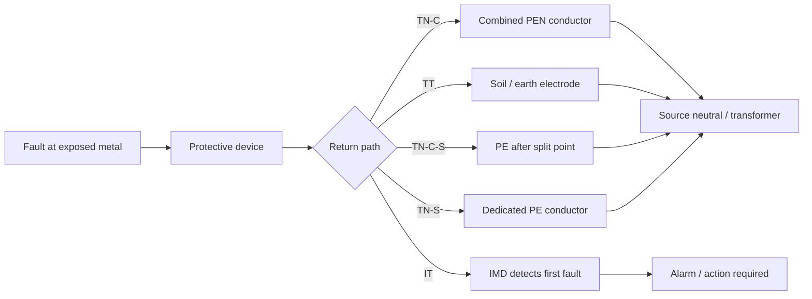
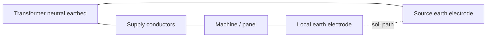
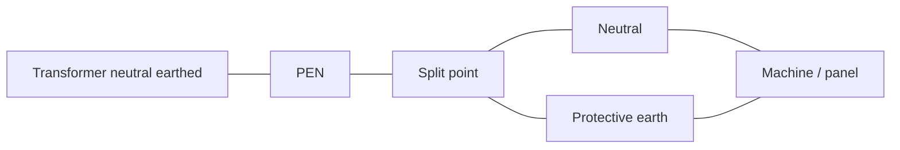
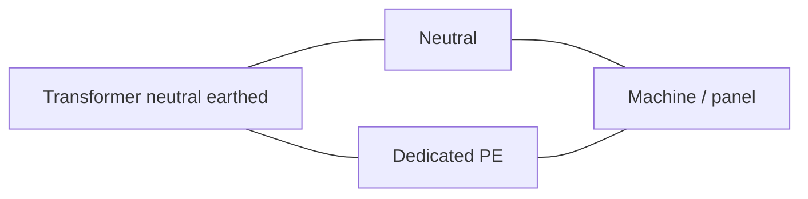
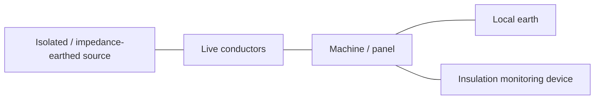
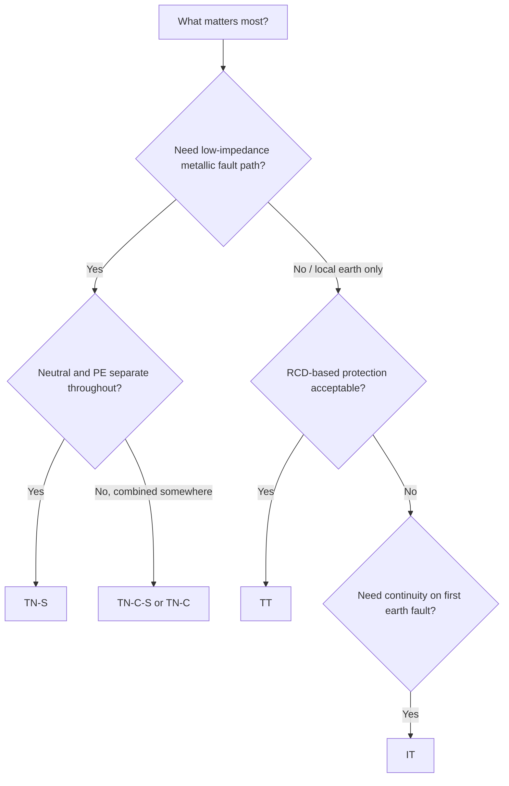
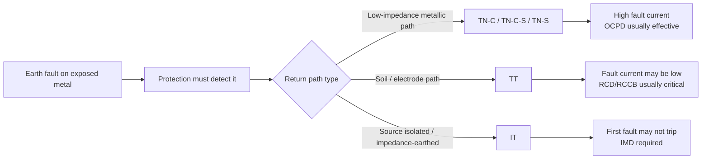

Yes. This page would benefit a lot from **3 compact visual aids** because the content is conceptually good but still text-heavy. The best places to add them are after the IEC letter-code section, after the five system descriptions, and before the practical questions section. ([Kyaw Min Thu][1])

## What to add

### 1. One-line “how current returns” visual

Put this right after **“The IEC letter code”** section. The page explains the letters well, but readers still have to mentally assemble the fault path themselves. ([Kyaw Min Thu][1])

Use a simple Mermaid flowchart like this:



### 2. Side-by-side earthing system mini-diagrams

This is the most important addition. The page currently describes TN-C, TT, TN-C-S, TN-S, and IT in words, but these topics are much easier when the reader sees the **neutral, PE, PEN, local electrode, and fault path**. ([Kyaw Min Thu][1])

Use a compact block for each system. Example:

#### TN-C


#### TT



#### TN-C-S



#### TN-S



#### IT



## 3. Fast decision matrix

Your page already has a text comparison table and practical questions. A visual “selection aid” would make it easier to remember. ([Kyaw Min Thu][1])

Put this just before **“The practical questions to ask”**:



---

## Best visual hierarchy for this page

### Add small callout cards

Under each earthing type, add three short labels:

- **Fault return:** Metallic / soil / isolated
- **Protection:** OCPD / RCCB-RCD / IMD
- **Main risk:** PEN break / high impedance / second fault

That directly reinforces what the page is already teaching about fault-current path, protective-device operation, and touch-voltage risk. ([Kyaw Min Thu][1])

Example format:

```md
> **Fault return:** Metallic PEN  
> **Protection:** Overcurrent device  
> **Main risk:** Broken PEN can raise bonded metalwork to dangerous voltage
```

---

## What I would change structurally

### Keep

- Letter-code explanation
- Per-system breakdown
- Practical comparison
- Practical questions
- Related standards section ([Kyaw Min Thu][1])

### Improve

- Break the dense sections with one visual every 2–3 paragraphs
- Convert the comparison table into a cleaner markdown table
- Add one “machine designer takeaway” line below each system

Example:

```md
**Machine designer takeaway:** TN-S is generally the cleanest arrangement for EMC and predictable protective-earth behavior in industrial facilities.
```

---

## Strongest single addition

If you only add **one** visual, add this:

### “Fault path + protection method” matrix

```md
| System | Fault return path            | Primary protection behavior     | Main design concern    |
| ------ | ---------------------------- | ------------------------------- | ---------------------- |
| TN-C   | Metallic PEN                 | OCPD trips quickly              | PEN break danger       |
| TT     | Soil / electrode path        | RCD usually essential           | High loop impedance    |
| TN-C-S | Metallic path after split    | OCPD effective internally       | Upstream PEN failure   |
| TN-S   | Dedicated metallic PE        | OCPD effective                  | More conductors / cost |
| IT     | First fault not solid return | IMD first, OCPD on second fault | Must respond to alarm  |
```

That mirrors the content already on the page, but in a format that is easier to scan. ([Kyaw Min Thu][1])

## Recommendation

Add:

1. **One overview fault-path diagram**
2. **Five mini system diagrams**
3. **One decision tree**
4. **Three-line callout box under each system**

That will make the page much more teachable without making it look busy.

I can turn this into a ready-to-paste Jekyll markdown section for that page.

[1]: https://kyawminthu20.github.io/Control-System-Tools/training/fundamentals/earthing-systems-iec/ "IEC Earthing System Types — Control System Standards Atlas"

Below is a **paste-ready visual upgrade** for that page. I mapped it to the current structure:

- insert visual 1 after **“The IEC letter code”** at line 108
- insert visual 2 under each system section
- insert visual 3 before **“The practical questions to ask”** at line 179
- replace the current dense comparison lines at 172–178 with a real markdown table. ([Kyaw Min Thu][1])

## 1) Add this after “The IEC letter code”

This bridges the letters to the actual engineering question: **where does fault current go?** The page already emphasizes fault-current path, protective-device operation, and touch-voltage risk, so this fits the teaching goal directly. ([Kyaw Min Thu][1])

````md
## Visual summary — what changes between systems?


````

````

## 2) Add a compact visual under each earthing type

Your sections for TN-C, TT, TN-C-S, TN-S, and IT are solid, but they are still mostly verbal. These mini-diagrams make the neutral/PE/PEN arrangement immediately visible. That matters because the current page is teaching the differences between combined PEN, separate PE, local electrode, and isolated source. :contentReference[oaicite:2]{index=2}

### TN-C
Place this under the TN-C introduction.

```md
### TN-C visual

```mermaid
flowchart LR
    S[Transformer<br/>neutral earthed] --> PEN[PEN conductor]
    PEN --> L[Load / panel / machine]
    L --> M[Exposed metal bonded to PEN]

    classDef risk fill:#3a1f1f,stroke:#aa6666,color:#fff;
    B[Upstream PEN break = bonded metal can rise to dangerous voltage]:::risk
    PEN -.failure mode.- B
````

> **Fault return:** Metallic PEN
> **Protection:** Overcurrent device
> **Main risk:** Broken PEN can energize bonded metalwork

````

### TT
```md
### TT visual

```mermaid
flowchart LR
    S[Transformer<br/>neutral earthed] --> L[Supply conductors]
    L --> P[Panel / machine]
    P --> E1[Local earth electrode]
    S --> E2[Source earth electrode]
    E1 -. soil return path .- E2
````

> **Fault return:** Through soil / electrodes
> **Protection:** RCD / RCCB usually essential
> **Main risk:** High loop impedance may limit fault current

````

### TN-C-S
```md
### TN-C-S visual

```mermaid
flowchart LR
    S[Transformer<br/>neutral earthed] --> PEN[PEN]
    PEN --> X[Service split point]
    X --> N[Neutral]
    X --> PE[Protective earth]
    N --> L[Load]
    PE --> L

    classDef risk fill:#3a1f1f,stroke:#aa6666,color:#fff;
    R[Upstream PEN break before split can still raise metalwork voltage]:::risk
    PEN -.failure mode.- R
````

> **Fault return:** Metallic path after PE/N split
> **Protection:** Overcurrent device
> **Main risk:** Upstream PEN failure still matters

````

### TN-S
```md
### TN-S visual

```mermaid
flowchart LR
    S[Transformer] --> N[Neutral]
    S --> PE[Dedicated PE]
    N --> L[Load / machine]
    PE --> L
````

> **Fault return:** Dedicated metallic PE
> **Protection:** Overcurrent device
> **Main risk:** Higher installation cost, but cleaner PE arrangement

````

### IT
```md
### IT visual

```mermaid
flowchart LR
    S[Isolated source<br/>or impedance-earthed source] --> L[Load / machine]
    L --> PE[Local earth / bonded metal]
    L --> IMD[Insulation Monitoring Device]

    F1[First earth fault] --> A1[Alarm / investigation]
    F2[Second fault on another phase] --> A2[Short circuit / trip]
````

> **Fault return:** No solid earth-return path on first fault
> **Protection:** IMD first, then fault-clearing action on second fault
> **Main risk:** First fault must be acted on promptly

````

## 3) Replace the current “Practical comparison” lines with a real table

The current comparison block at lines 172–178 is compact, but it reads like plain text instead of a scannable table. This is the easiest improvement with the best readability gain. :contentReference[oaicite:3]{index=3}

```md
## Practical comparison

| System | Fault-return path | Typical clearing method | Main risk | Typical context |
|---|---|---|---|---|
| **TN-C** | Metallic PEN | Overcurrent device | PEN break can energize metalwork | Distribution, older workshops |
| **TT** | Soil / local electrode back to source | RCD / RCCB usually essential | High loop impedance; electrode dependent | Rural or standalone installations |
| **TN-C-S** | Metallic PE after split point | Overcurrent device | Upstream PEN break still possible | Urban residential, PME supply |
| **TN-S** | Dedicated metallic PE | Overcurrent device | Higher conductor cost | Industrial, hospital, data centre |
| **IT** | Isolated / impedance-earthed source | IMD on first fault; protective clearing on second fault | First fault can persist if ignored | Hospital theatres, mines, critical process |
````

## 4) Add this before “The practical questions to ask”

This turns the content into a mental selection tool. It also matches the page’s stated purpose: understanding how the earthing arrangement affects protection strategy and risk. ([Kyaw Min Thu][1])

````md
## Selection logic — what are you optimizing for?

```mermaid
flowchart TD
    A[Start with the installation earthing arrangement] --> B{Is the fault-return path metallic and low impedance?}

    B -->|Yes| C{Are PE and neutral separate throughout?}
    C -->|Yes| TNS[TN-S]
    C -->|No, combined somewhere| TNCS[TN-C or TN-C-S]

    B -->|No| D{Does the installation rely on local earth electrodes?}
    D -->|Yes| TT[TT]
    D -->|No, source isolated / impedance-earthed| IT[IT]

    TT --> TTN[Expect strong dependence on RCD / RCCB performance]
    IT --> ITN[Expect insulation monitoring and fast response to first-fault alarm]
    TNS --> TNSN[Best PE separation and EMC behavior]
    TNCS --> TNCSN[Check PEN dependency and split-point location carefully]
```
````

````

## 5) Add one “designer takeaway” line under each system

Your current page is already aimed at machine and panel design. One practical sentence under each system will make it more useful for controls engineers. :contentReference[oaicite:5]{index=5}

Use this pattern:

```md
**Machine designer takeaway:** Verify what earthing arrangement actually arrives at the installation boundary before finalizing bonding, protective-device strategy, or 0 V / PE reference assumptions.
````

Suggested per section:

### TN-C takeaway

```md
**Machine designer takeaway:** Avoid assuming TN-C is acceptable inside machine internals; PEN dependency creates a severe metalwork-voltage failure mode.
```

### TT takeaway

```md
**Machine designer takeaway:** Do not assume breaker-only protection is enough; TT designs usually need RCD strategy and verified earth-electrode performance.
```

### TN-C-S takeaway

```md
**Machine designer takeaway:** Treat the service split point as a critical design boundary; upstream PEN issues still affect downstream exposed metalwork.
```

### TN-S takeaway

```md
**Machine designer takeaway:** TN-S is usually the cleanest arrangement for industrial machines where predictable PE behavior and EMC matter.
```

### IT takeaway

```md
**Machine designer takeaway:** IT is not “safer by default”; it is safer only when the IMD alarm is monitored and the first fault is handled quickly and consistently.
```

## 6) Best page layout order

Based on the current page flow, I would reorder it like this for readability:

1. Purpose
2. IEC letter code
3. **Visual summary — what changes between systems?**
4. TN-C
5. TT
6. TN-C-S
7. TN-S
8. IT
9. Practical comparison table
10. **Selection logic diagram**
11. Practical questions
12. Related standards
13. See also ([Kyaw Min Thu][1])

## 7) Minimal visual polish rules

Use these rules so the page looks more like a training module and less like a text dump:

- Keep each Mermaid block narrow and simple.
- Add one short callout below each diagram, not a long paragraph.
- Bold only the engineering decision words: **fault return**, **protection**, **main risk**, **takeaway**.
- Convert all pseudo-tables into real markdown tables.
- Do not add decorative icons everywhere; this topic needs clarity, not flair.

## Strongest immediate improvement

If you only want the highest-value edit today, do these three things:

1. Add the **overview fault-return visual**
2. Replace the current comparison lines with the **real markdown table**
3. Add the **selection logic diagram**

That alone will make the page much easier to teach and review. ([Kyaw Min Thu][1])

I can also turn this into a **single finished markdown file section** with your site’s heading style so you can paste it directly into the source file.

[1]: https://kyawminthu20.github.io/Control-System-Tools/training/fundamentals/earthing-systems-iec/ "IEC Earthing System Types — Control System Standards Atlas"
