# How to Use Mermaid Diagrams

Mermaid is a JavaScript-based tool that creates diagrams using text definitions. Here's a guide to get you started:

## 1. Basic Syntax

All Mermaid diagrams start with a diagram type declaration:

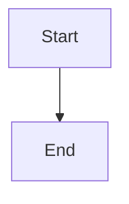

---

## 2. Common Diagram Types

### **Flowchart**
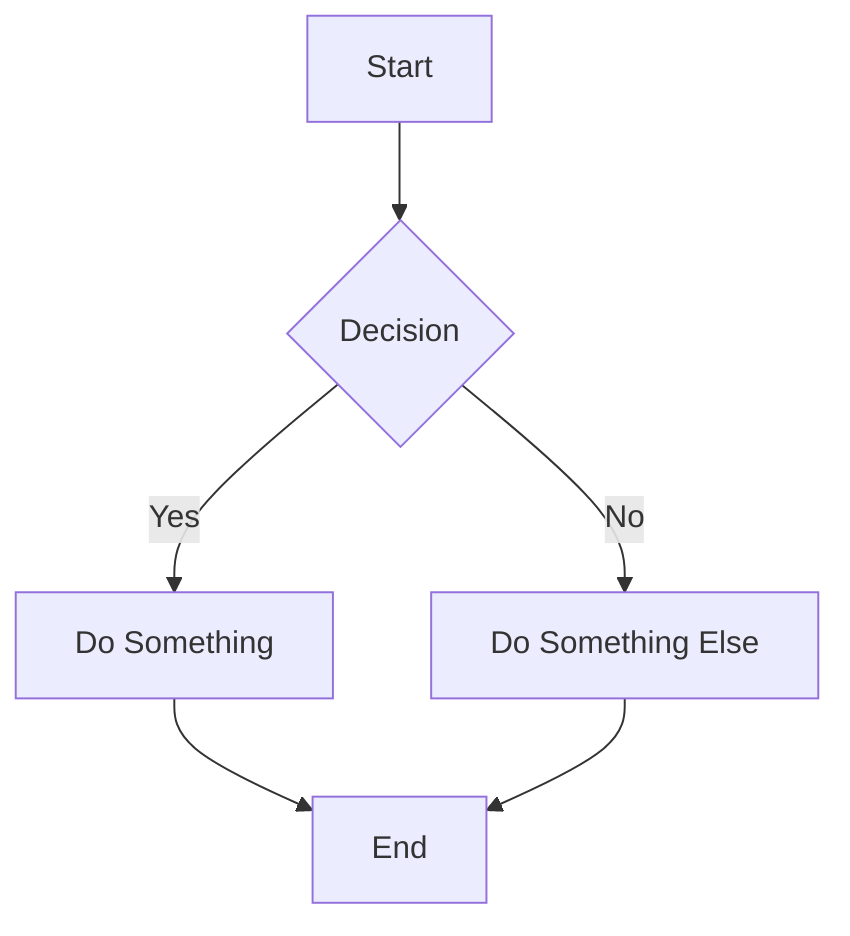

### **Sequence Diagram**
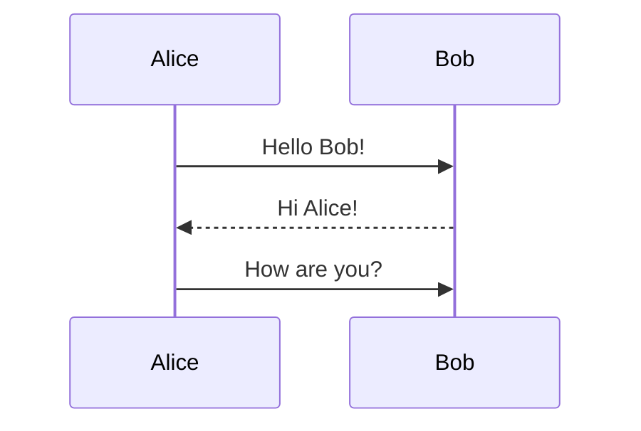

### **Class Diagram**
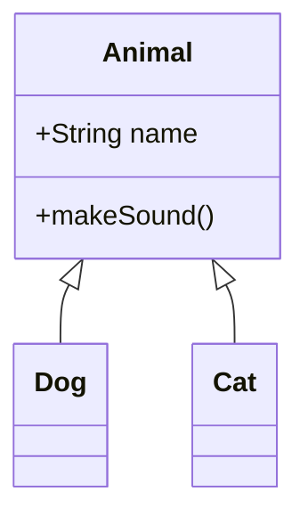

### **Pie Chart**
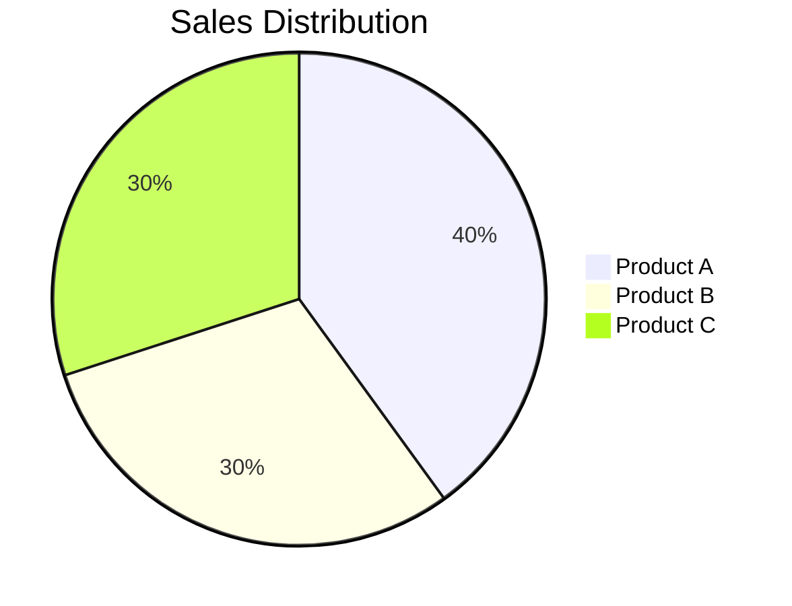

### **Gantt Chart**
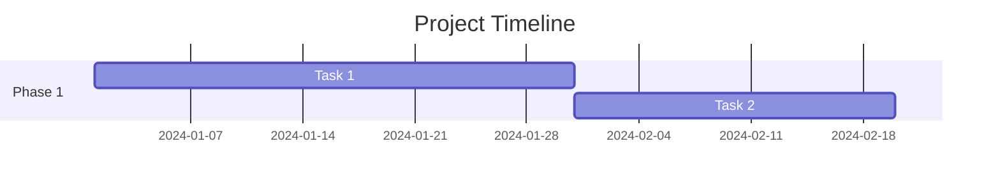

---

## 3. Node Shapes (Flowcharts)

| Syntax | Shape |
|--------|-------|
| `[text]` | Rectangle |
| `(text)` | Rounded rectangle |
| `{text}` | Diamond |
| `([text])` | Stadium |
| `[[text]]` | Subroutine |
| `[(text)]` | Cylinder |

---

## 4. Arrow Types

| Syntax | Description |
|--------|-------------|
| `-->` | Arrow |
| `---` | Line |
| `-.->` | Dotted arrow |
| `==>` | Thick arrow |
| `--text-->` | Arrow with text |

---

## 5. Where to Use Mermaid

| Platform | Support |
|----------|---------|
| GitHub | ✅ Native support in markdown |
| GitLab | ✅ Native support |
| Notion | ✅ Code block with mermaid |
| VS Code | ✅ With extensions |
| Obsidian | ✅ Built-in |
| Online | [Mermaid Live Editor](https://mermaid.live) |

---

## 6. Quick Example

```markdown
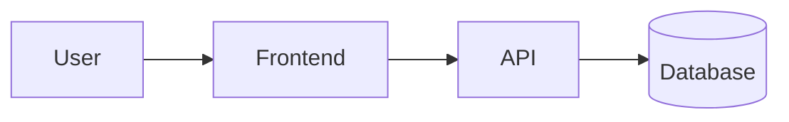

This renders as:
```
User → Frontend → API → Database
```

---

## Tips

1. **Use the Live Editor** - [mermaid.live](https://mermaid.live) for testing
2. **Keep it simple** - Complex diagrams can become hard to read
3. **Add comments** - Use `%%` for comments
4. **Direction**: `TD` (top-down), `LR` (left-right), `BT` (bottom-top), `RL` (right-left)

Would you like more details on any specific diagram type?

# How mermaid can be used to explain ladder logic

# Using Mermaid to Explain Ladder Logic

Mermaid doesn't have native ladder logic support, but we can creatively represent ladder logic concepts using flowcharts, state diagrams, and other diagram types.

---

## 1. Basic Ladder Logic Elements

### **Representing Contacts and Coils**

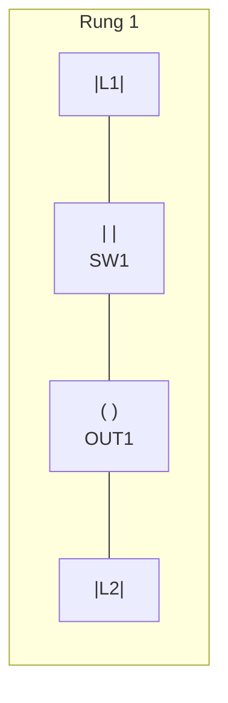

| Symbol | Ladder Logic | Mermaid Representation |
|--------|--------------|------------------------|
| `--| |--` | Normally Open (NO) | `[ \| \| ]` |
| `--|/|--` | Normally Closed (NC) | `[ / ]` |
| `--( )--` | Output Coil | `(( ))` |
| `--[/]--` | Timer | `[[ ]]` |

---

## 2. Series Circuit (AND Logic)

**Ladder Logic:**
```
|--[ SW1 ]---[ SW2 ]---( LAMP )--|
```

**Mermaid Flowchart:**
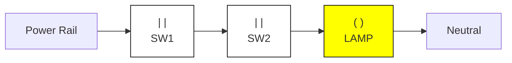

**Truth Table:**
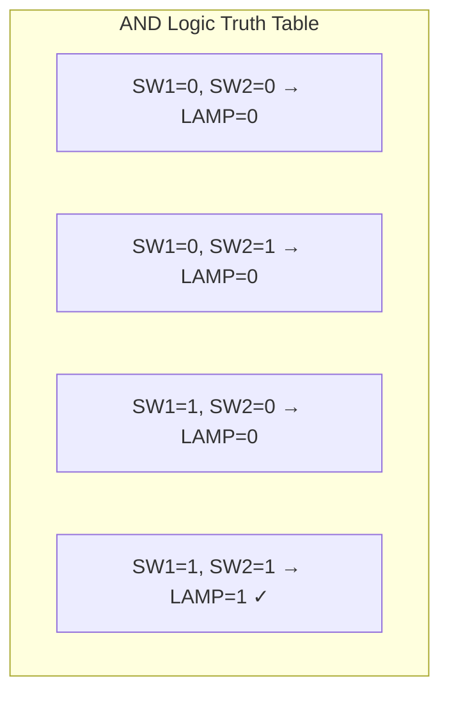

---

## 3. Parallel Circuit (OR Logic)

**Ladder Logic:**
```
|--[ SW1 ]--+---( LAMP )--|
|           |             |
|--[ SW2 ]--+             |
```

**Mermaid Flowchart:**
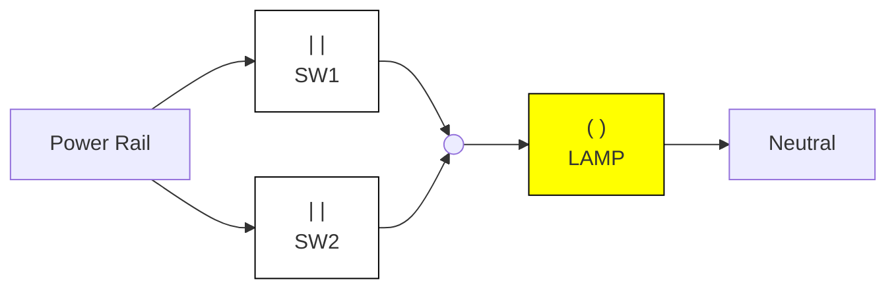

---

## 4. Seal-In (Latch) Circuit

**Ladder Logic:**
```
|--[ START ]--+---[ STOP ]---( MOTOR )--|
|             |                         |
|--[ MOTOR ]--+                         |
```

**Mermaid Flowchart:**
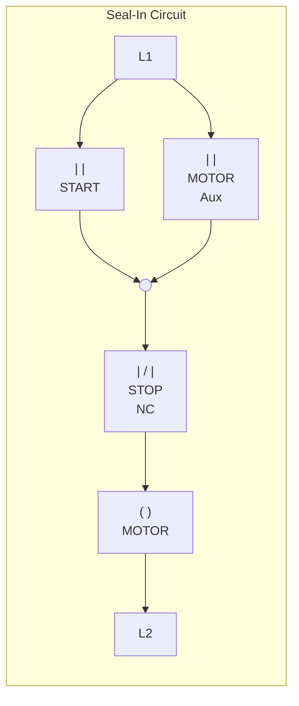

**State Diagram for Latch:**
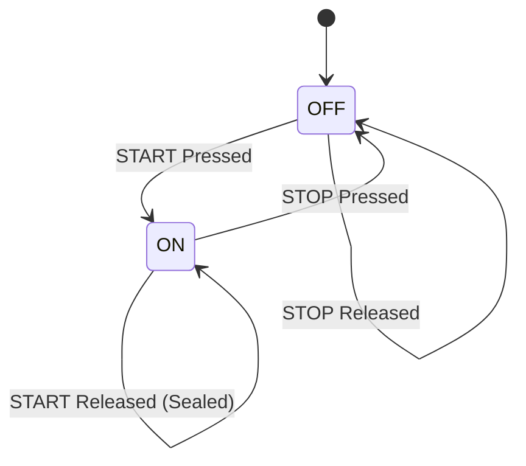

---

## 5. Timer Logic (TON - Timer On Delay)

**Ladder Logic:**
```
|--[ INPUT ]---[TON T1, 5s]--|
|                            |
|--[ T1.DN ]---( OUTPUT )---|
```

**Mermaid Sequence Diagram:**
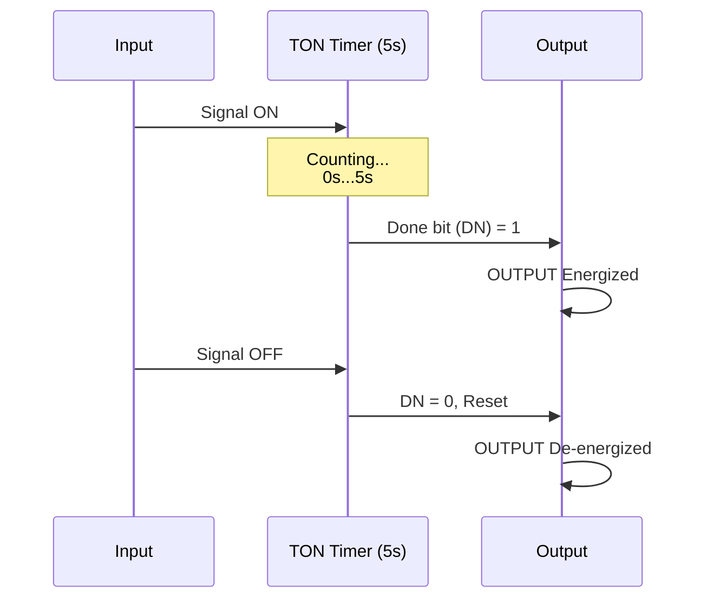

**Timer Timing Diagram:**
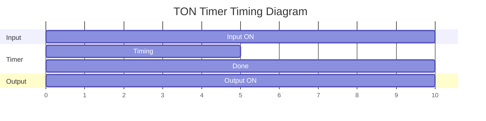

---

## 6. Counter Logic (CTU - Count Up)

**Mermaid Flowchart:**
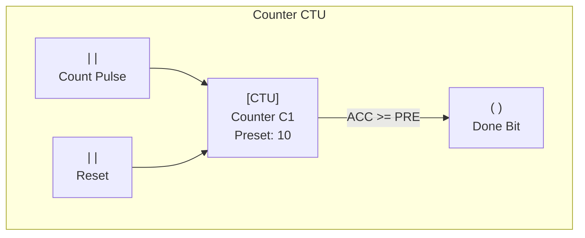

**Counter State Diagram:**
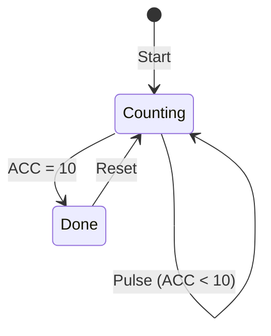

---

## 7. Complete PLC Program Example

**Motor Start/Stop with Overload Protection:**

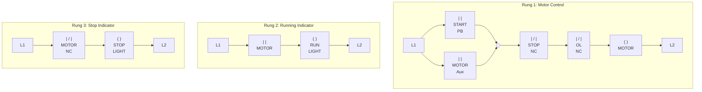

---

## 8. Logic Flow Representation

**Decision-based Flowchart:**
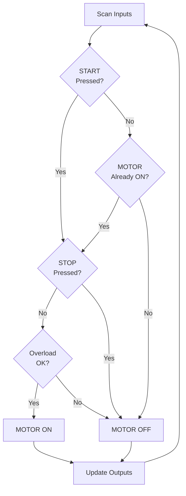

---

## 9. Comparison Table

| Ladder Logic Concept | Best Mermaid Diagram |
|---------------------|---------------------|
| Basic circuits | `graph LR` flowchart |
| AND/OR logic | Flowchart with branches |
| Latching/Sealing | `stateDiagram-v2` |
| Timers | `sequenceDiagram` or `gantt` |
| Counters | `stateDiagram-v2` |
| Program flow | `flowchart TD` |
| Multiple rungs | Subgraphs |

---

## 10. Tips for Ladder Logic in Mermaid

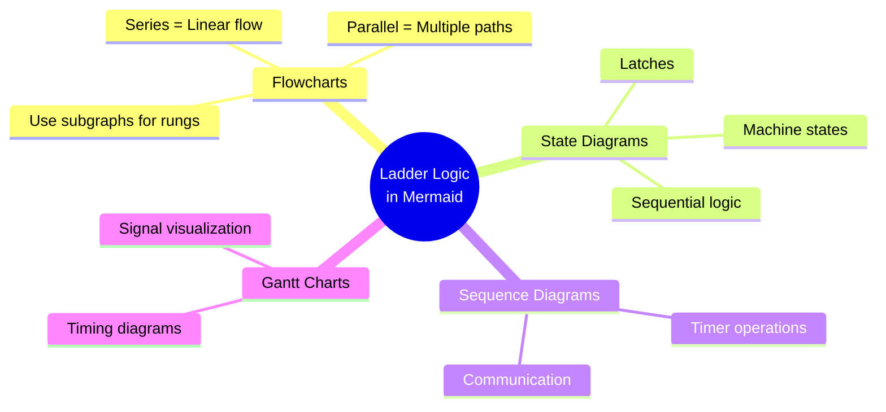

---

## Quick Reference Template

```markdown
```mermaid
graph LR
    subgraph "Rung 1"
        L1[L1] --> Contact1["|  |<br>Input1"]
        Contact1 --> Coil1["( )<br>Output1"]
        Coil1 --> L2[L2]
    end
```
```

Would you like me to create a specific ladder logic diagram for a particular application (motor control, traffic light, conveyor system, etc.)?

# Mermaid Templates for Algorithms

A comprehensive collection of diagram templates for state machines, FIFO, sorting, and searching algorithms.

---

# 1. STATE MACHINE CONTROLS

## 1.1 Basic State Machine Template

```mermaid
stateDiagram-v2
    [*] --> IDLE
    IDLE --> STATE_1 : Trigger Event
    STATE_1 --> STATE_2 : Condition Met
    STATE_2 --> STATE_1 : Retry
    STATE_2 --> IDLE : Complete/Reset
    STATE_1 --> ERROR : Fault
    STATE_2 --> ERROR : Fault
    ERROR --> IDLE : Reset
```

---

## 1.2 Motor Control State Machine

```mermaid
stateDiagram-v2
    [*] --> STOPPED
    
    STOPPED --> STARTING : Start Command
    STARTING --> RUNNING : Motor Up to Speed
    STARTING --> FAULT : Start Timeout
    
    RUNNING --> STOPPING : Stop Command
    RUNNING --> FAULT : Overload/Thermal
    
    STOPPING --> STOPPED : Motor Stopped
    STOPPING --> FAULT : Stop Timeout
    
    FAULT --> STOPPED : Reset & Fault Clear
    
    note right of STARTING : Monitor Start Time<br>Check Current Draw
    note right of RUNNING : Monitor Temperature<br>Check Vibration
    note right of FAULT : Log Error Code<br>Alert Operator
```

---

## 1.3 Conveyor System State Machine

```mermaid
stateDiagram-v2
    [*] --> INIT
    
    state INIT {
        [*] --> CheckSensors
        CheckSensors --> CheckMotors
        CheckMotors --> Ready
    }
    
    INIT --> IDLE : Init Complete
    
    state IDLE {
        [*] --> WaitingForProduct
        WaitingForProduct --> ProductDetected : Sensor Triggered
    }
    
    IDLE --> RUNNING : Product Detected
    
    state RUNNING {
        [*] --> Transporting
        Transporting --> AtDestination : Exit Sensor
    }
    
    RUNNING --> IDLE : Product Delivered
    RUNNING --> STOPPED : E-Stop
    RUNNING --> JAM : Jam Detected
    
    JAM --> IDLE : Jam Cleared
    JAM --> STOPPED : Manual Intervention
    
    STOPPED --> INIT : Restart
```

---

## 1.4 Traffic Light Controller

```mermaid
stateDiagram-v2
    direction LR
    
    [*] --> NS_GREEN
    
    NS_GREEN --> NS_YELLOW : Timer 30s
    note right of NS_GREEN : North-South: GREEN<br>East-West: RED
    
    NS_YELLOW --> NS_RED : Timer 5s
    note right of NS_YELLOW : North-South: YELLOW<br>East-West: RED
    
    NS_RED --> EW_GREEN : Timer 2s (All Red)
    note right of NS_RED : All: RED<br>(Safety Delay)
    
    EW_GREEN --> EW_YELLOW : Timer 30s
    note left of EW_GREEN : North-South: RED<br>East-West: GREEN
    
    EW_YELLOW --> EW_RED : Timer 5s
    note left of EW_YELLOW : North-South: RED<br>East-West: YELLOW
    
    EW_RED --> NS_GREEN : Timer 2s (All Red)
```

---

## 1.5 Batch Process State Machine

```mermaid
stateDiagram-v2
    [*] --> RECIPE_LOAD
    
    RECIPE_LOAD --> MATERIAL_CHARGE : Recipe Valid
    RECIPE_LOAD --> ABORT : Invalid Recipe
    
    state MATERIAL_CHARGE {
        [*] --> Ingredient1
        Ingredient1 --> Ingredient2 : Weight OK
        Ingredient2 --> Ingredient3 : Weight OK
        Ingredient3 --> ChargeComplete : Weight OK
    }
    
    MATERIAL_CHARGE --> MIXING : Charge Complete
    MATERIAL_CHARGE --> ABORT : Weight Error
    
    state MIXING {
        [*] --> SlowMix
        SlowMix --> FastMix : Timer
        FastMix --> MixComplete : Timer
    }
    
    MIXING --> HEATING : Mix Complete
    
    state HEATING {
        [*] --> RampUp
        RampUp --> HoldTemp : Setpoint Reached
        HoldTemp --> CoolDown : Hold Timer
        CoolDown --> HeatComplete : Temp < Threshold
    }
    
    HEATING --> DISCHARGE : Heat Complete
    HEATING --> ABORT : Over Temperature
    
    DISCHARGE --> COMPLETE : Tank Empty
    DISCHARGE --> ABORT : Discharge Timeout
    
    COMPLETE --> [*]
    ABORT --> [*]
```

---

## 1.6 Hierarchical State Machine (HVAC System)

```mermaid
stateDiagram-v2
    [*] --> OFF
    
    OFF --> STANDBY : Power On
    
    state STANDBY {
        [*] --> Monitoring
        Monitoring --> NeedCooling : Temp > Setpoint + 2
        Monitoring --> NeedHeating : Temp < Setpoint - 2
    }
    
    STANDBY --> COOLING : Need Cooling
    STANDBY --> HEATING : Need Heating
    
    state COOLING {
        [*] --> CompressorStart
        CompressorStart --> FanOn : Delay 5s
        FanOn --> CoolingActive : Fan Running
        
        state CoolingActive {
            [*] --> Stage1
            Stage1 --> Stage2 : High Demand
            Stage2 --> Stage1 : Low Demand
        }
    }
    
    state HEATING {
        [*] --> IgnitionCheck
        IgnitionCheck --> BurnerOn : Ignition OK
        BurnerOn --> HeatingActive : Flame Proved
        
        state HeatingActive {
            [*] --> LowFire
            LowFire --> HighFire : High Demand
            HighFire --> LowFire : Low Demand
        }
    }
    
    COOLING --> STANDBY : Temp Satisfied
    HEATING --> STANDBY : Temp Satisfied
    COOLING --> FAULT : Compressor Fault
    HEATING --> FAULT : Flame Failure
    
    FAULT --> OFF : Reset
```

---

## 1.7 State Machine with Actions (Flowchart Style)

```mermaid
flowchart TD
    subgraph "State Machine Engine"
        START([Start]) --> INIT[/"State = IDLE<br>Timer = 0"/]
        INIT --> READ[Read Inputs]
        READ --> EVAL{Evaluate<br>Current State}
        
        EVAL -->|IDLE| IDLE_CHECK{Start<br>Command?}
        EVAL -->|RUNNING| RUN_CHECK{Stop Command<br>OR Fault?}
        EVAL -->|STOPPING| STOP_CHECK{Motor<br>Stopped?}
        EVAL -->|FAULT| FAULT_CHECK{Reset<br>Command?}
        
        IDLE_CHECK -->|Yes| SET_RUN[/"State = RUNNING<br>Start Motor<br>Reset Timer"/]
        IDLE_CHECK -->|No| OUTPUT
        
        RUN_CHECK -->|Stop| SET_STOP[/"State = STOPPING<br>Stop Motor"/]
        RUN_CHECK -->|Fault| SET_FAULT[/"State = FAULT<br>Log Error"/]
        RUN_CHECK -->|No| OUTPUT
        
        STOP_CHECK -->|Yes| SET_IDLE[/"State = IDLE"/]
        STOP_CHECK -->|No| OUTPUT
        
        FAULT_CHECK -->|Yes| CLEAR[/"Clear Faults<br>State = IDLE"/]
        FAULT_CHECK -->|No| OUTPUT
        
        SET_RUN --> OUTPUT
        SET_STOP --> OUTPUT
        SET_FAULT --> OUTPUT
        SET_IDLE --> OUTPUT
        CLEAR --> OUTPUT
        
        OUTPUT[Write Outputs] --> READ
    end
```

---

# 2. FIFO CONTROL (First In First Out)

## 2.1 Basic FIFO Structure

```mermaid
flowchart LR
    subgraph "FIFO Buffer"
        direction LR
        IN([ENQUEUE]) --> P0[Position 0<br>HEAD]
        P0 --> P1[Position 1]
        P1 --> P2[Position 2]
        P2 --> P3[Position 3]
        P3 --> P4[Position 4<br>TAIL]
        P4 --> OUT([DEQUEUE])
    end
    
    DATA[New Data] --> IN
    OUT --> PROCESS[Process Data]
```

---

## 2.2 FIFO Enqueue Operation

```mermaid
flowchart TD
    START([Enqueue Item]) --> CHECK{Is FIFO<br>Full?}
    CHECK -->|Yes| FULL[/"Return ERROR<br>Buffer Overflow"/]
    CHECK -->|No| WRITE[/"Write Item to<br>Buffer[Tail]"/]
    WRITE --> INC[/"Tail = Tail + 1"/]
    INC --> WRAP{Tail >=<br>Buffer Size?}
    WRAP -->|Yes| RESET[/"Tail = 0<br>(Wrap Around)"/]
    WRAP -->|No| COUNT
    RESET --> COUNT[/"Count = Count + 1"/]
    COUNT --> SUCCESS[/"Return SUCCESS"/]
    
    FULL --> END([End])
    SUCCESS --> END
```

---

## 2.3 FIFO Dequeue Operation

```mermaid
flowchart TD
    START([Dequeue Item]) --> CHECK{Is FIFO<br>Empty?}
    CHECK -->|Yes| EMPTY[/"Return ERROR<br>Buffer Empty"/]
    CHECK -->|No| READ[/"Item = Buffer[Head]"/]
    READ --> INC[/"Head = Head + 1"/]
    INC --> WRAP{Head >=<br>Buffer Size?}
    WRAP -->|Yes| RESET[/"Head = 0<br>(Wrap Around)"/]
    WRAP -->|No| COUNT
    RESET --> COUNT[/"Count = Count - 1"/]
    COUNT --> SUCCESS[/"Return Item"/]
    
    EMPTY --> END([End])
    SUCCESS --> END
```

---

## 2.4 Circular FIFO Buffer Visualization

```mermaid
flowchart TD
    subgraph "Circular Buffer (Size=8)"
        P0((0)) --> P1((1))
        P1 --> P2((2))
        P2 --> P3((3))
        P3 --> P4((4))
        P4 --> P5((5))
        P5 --> P6((6))
        P6 --> P7((7))
        P7 --> P0
    end
    
    HEAD[/"HEAD Pointer<br>Read Position"/] -.-> P2
    TAIL[/"TAIL Pointer<br>Write Position"/] -.-> P6
    
    subgraph "Buffer Status"
        STATUS["Count: 4<br>Empty: 4<br>Full: No"]
    end
```

---

## 2.5 FIFO Conveyor Control System

```mermaid
sequenceDiagram
    participant Sensor as Entry Sensor
    participant FIFO as FIFO Buffer
    participant PLC as PLC Controller
    participant Conv as Conveyor
    participant Exit as Exit Station
    
    Note over FIFO: Buffer Empty<br>Count = 0
    
    Sensor->>FIFO: Product A Detected (ID: 001)
    FIFO->>FIFO: Enqueue(001)
    Note over FIFO: [001, _, _, _]<br>Count = 1
    
    Sensor->>FIFO: Product B Detected (ID: 002)
    FIFO->>FIFO: Enqueue(002)
    Note over FIFO: [001, 002, _, _]<br>Count = 2
    
    Sensor->>FIFO: Product C Detected (ID: 003)
    FIFO->>FIFO: Enqueue(003)
    Note over FIFO: [001, 002, 003, _]<br>Count = 3
    
    PLC->>Conv: Transport to Exit
    Exit->>FIFO: Ready for Product
    FIFO->>FIFO: Dequeue()
    FIFO->>Exit: Product 001
    Note over FIFO: [002, 003, _, _]<br>Count = 2
    
    Exit->>FIFO: Ready for Product
    FIFO->>FIFO: Dequeue()
    FIFO->>Exit: Product 002
    Note over FIFO: [003, _, _, _]<br>Count = 1
```

---

## 2.6 FIFO State Machine

```mermaid
stateDiagram-v2
    [*] --> EMPTY
    
    EMPTY --> PARTIAL : Enqueue (Count < Max)
    EMPTY --> EMPTY : Dequeue (Error: Empty)
    
    PARTIAL --> PARTIAL : Enqueue (Count < Max-1)
    PARTIAL --> PARTIAL : Dequeue (Count > 1)
    PARTIAL --> FULL : Enqueue (Count = Max-1)
    PARTIAL --> EMPTY : Dequeue (Count = 1)
    
    FULL --> FULL : Enqueue (Error: Full)
    FULL --> PARTIAL : Dequeue
    
    note right of EMPTY : Head = Tail<br>Count = 0
    note right of FULL : Count = Max Size
    note right of PARTIAL : 0 < Count < Max
```

---

## 2.7 Priority FIFO (Multiple Queues)

```mermaid
flowchart TD
    subgraph "Priority FIFO System"
        INPUT[/Incoming Item/] --> CLASSIFY{Priority<br>Level?}
        
        CLASSIFY -->|High| HQ[High Priority Queue]
        CLASSIFY -->|Medium| MQ[Medium Priority Queue]
        CLASSIFY -->|Low| LQ[Low Priority Queue]
        
        subgraph "High Priority"
            HQ --> H1[Item] --> H2[Item] --> H3[Item]
        end
        
        subgraph "Medium Priority"
            MQ --> M1[Item] --> M2[Item] --> M3[Item]
        end
        
        subgraph "Low Priority"
            LQ --> L1[Item] --> L2[Item] --> L3[Item]
        end
        
        H3 --> SELECTOR{Select<br>Next}
        M3 --> SELECTOR
        L3 --> SELECTOR
        
        SELECTOR --> OUTPUT[/Process Item/]
    end
    
    note1[/"Priority Order:<br>1. High Queue<br>2. Medium Queue<br>3. Low Queue"/]
```

---

## 2.8 Complete FIFO Control Logic

```mermaid
flowchart TD
    subgraph "FIFO Control Block"
        START([Start Scan]) --> READ_IN[Read Inputs]
        
        READ_IN --> CHK_ENQ{Enqueue<br>Trigger?}
        CHK_ENQ -->|Yes| ENQ_OP[Enqueue Operation]
        CHK_ENQ -->|No| CHK_DEQ
        
        ENQ_OP --> FULL_CHK{Buffer<br>Full?}
        FULL_CHK -->|Yes| SET_FULL[Set Full Flag]
        FULL_CHK -->|No| DO_ENQ[/"Buffer[Tail] = Data<br>Tail++<br>Count++"/]
        
        SET_FULL --> CHK_DEQ
        DO_ENQ --> CHK_DEQ
        
        CHK_DEQ{Dequeue<br>Trigger?}
        CHK_DEQ -->|Yes| DEQ_OP[Dequeue Operation]
        CHK_DEQ -->|No| UPDATE
        
        DEQ_OP --> EMPTY_CHK{Buffer<br>Empty?}
        EMPTY_CHK -->|Yes| SET_EMPTY[Set Empty Flag]
        EMPTY_CHK -->|No| DO_DEQ[/"Output = Buffer[Head]<br>Head++<br>Count--"/]
        
        SET_EMPTY --> UPDATE
        DO_DEQ --> UPDATE
        
        UPDATE[Update Status Bits] --> WRITE_OUT[Write Outputs]
        WRITE_OUT --> START
    end
```

---

# 3. SORTATION ALGORITHMS

## 3.1 Bubble Sort

```mermaid
flowchart TD
    START([Start Bubble Sort]) --> INIT[/"n = array.length<br>swapped = true"/]
    INIT --> OUTER{swapped<br>== true?}
    
    OUTER -->|No| DONE([Array Sorted])
    OUTER -->|Yes| RESET[/"swapped = false<br>i = 0"/]
    
    RESET --> INNER{i < n-1?}
    INNER -->|No| OUTER
    INNER -->|Yes| COMPARE{"array[i] ><br>array[i+1]?"}
    
    COMPARE -->|Yes| SWAP[/"temp = array[i]<br>array[i] = array[i+1]<br>array[i+1] = temp<br>swapped = true"/]
    COMPARE -->|No| INCREMENT
    
    SWAP --> INCREMENT[/"i = i + 1"/]
    INCREMENT --> INNER
```

**Bubble Sort Visualization:**

```mermaid
flowchart LR
    subgraph "Pass 1"
        A1["[5,3,8,4,2]"] --> A2["[3,5,8,4,2]"] --> A3["[3,5,8,4,2]"] --> A4["[3,5,4,8,2]"] --> A5["[3,5,4,2,8]"]
    end
    
    subgraph "Pass 2"
        B1["[3,5,4,2,8]"] --> B2["[3,5,4,2,8]"] --> B3["[3,4,5,2,8]"] --> B4["[3,4,2,5,8]"]
    end
    
    subgraph "Pass 3"
        C1["[3,4,2,5,8]"] --> C2["[3,4,2,5,8]"] --> C3["[3,2,4,5,8]"]
    end
    
    subgraph "Pass 4"
        D1["[3,2,4,5,8]"] --> D2["[2,3,4,5,8]"]
    end
    
    A5 --> B1
    B4 --> C1
    C3 --> D1
    D2 --> SORTED(["Sorted!"])
```

---

## 3.2 Selection Sort

```mermaid
flowchart TD
    START([Start Selection Sort]) --> INIT[/"n = array.length<br>i = 0"/]
    
    INIT --> OUTER{i < n-1?}
    OUTER -->|No| DONE([Array Sorted])
    OUTER -->|Yes| SET_MIN[/"minIndex = i<br>j = i + 1"/]
    
    SET_MIN --> INNER{j < n?}
    INNER -->|No| SWAP_CHECK{"minIndex<br>!= i?"}
    INNER -->|Yes| COMPARE{"array[j] <<br>array[minIndex]?"}
    
    COMPARE -->|Yes| UPDATE_MIN[/"minIndex = j"/]
    COMPARE -->|No| INC_J
    UPDATE_MIN --> INC_J[/"j = j + 1"/]
    INC_J --> INNER
    
    SWAP_CHECK -->|Yes| SWAP[/"Swap array[i]<br>and array[minIndex]"/]
    SWAP_CHECK -->|No| INC_I
    SWAP --> INC_I[/"i = i + 1"/]
    INC_I --> OUTER
```

---

## 3.3 Insertion Sort

```mermaid
flowchart TD
    START([Start Insertion Sort]) --> INIT[/"n = array.length<br>i = 1"/]
    
    INIT --> OUTER{i < n?}
    OUTER -->|No| DONE([Array Sorted])
    OUTER -->|Yes| STORE[/"key = array[i]<br>j = i - 1"/]
    
    STORE --> INNER{"j >= 0 AND<br>array[j] > key?"}
    INNER -->|Yes| SHIFT[/"array[j+1] = array[j]<br>j = j - 1"/]
    INNER -->|No| INSERT[/"array[j+1] = key"/]
    
    SHIFT --> INNER
    INSERT --> INC[/"i = i + 1"/]
    INC --> OUTER
```

---

## 3.4 Quick Sort

```mermaid
flowchart TD
    START([QuickSort arr, low, high]) --> CHECK{low < high?}
    CHECK -->|No| RETURN([Return])
    CHECK -->|Yes| PARTITION[/"pi = Partition arr, low, high"/]
    
    PARTITION --> LEFT[/"QuickSort arr, low, pi-1"/]
    LEFT --> RIGHT[/"QuickSort arr, pi+1, high"/]
    RIGHT --> RETURN
    
    subgraph "Partition Function"
        P_START([Partition arr, low, high]) --> P_INIT[/"pivot = arr[high]<br>i = low - 1<br>j = low"/]
        P_INIT --> P_LOOP{j < high?}
        P_LOOP -->|No| P_SWAP[/"Swap arr[i+1], arr[high]"/]
        P_LOOP -->|Yes| P_COMPARE{"arr[j] <<br>pivot?"}
        P_COMPARE -->|Yes| P_INC_SWAP[/"i = i + 1<br>Swap arr[i], arr[j]"/]
        P_COMPARE -->|No| P_INC_J
        P_INC_SWAP --> P_INC_J[/"j = j + 1"/]
        P_INC_J --> P_LOOP
        P_SWAP --> P_RETURN([Return i + 1])
    end
```

**Quick Sort Visualization:**

```mermaid
flowchart TD
    subgraph "Quick Sort Tree"
        ROOT["[3,6,8,10,1,2,1]<br>pivot=1"]
        ROOT --> L1["[1]"]
        ROOT --> R1["[3,6,8,10,2,1]<br>pivot=1"]
        
        R1 --> L2["[1]"]
        R1 --> R2["[3,6,8,10,2]<br>pivot=2"]
        
        R2 --> L3["[ ]"]
        R2 --> R3["[3,6,8,10]<br>pivot=10"]
        
        R3 --> L4["[3,6,8]<br>pivot=8"]
        R3 --> R4["[ ]"]
        
        L4 --> L5["[3,6]<br>pivot=6"]
        L4 --> R5["[ ]"]
        
        L5 --> L6["[3]"]
        L5 --> R6["[ ]"]
    end
```

---

## 3.5 Merge Sort

```mermaid
flowchart TD
    START([MergeSort arr]) --> CHECK{arr.length<br>> 1?}
    CHECK -->|No| RETURN([Return arr])
    CHECK -->|Yes| SPLIT[/"mid = arr.length / 2<br>left = arr[0..mid]<br>right = arr[mid..end]"/]
    
    SPLIT --> SORT_L[/"left = MergeSort left"/]
    SORT_L --> SORT_R[/"right = MergeSort right"/]
    SORT_R --> MERGE[/"result = Merge left, right"/]
    MERGE --> RETURN
    
    subgraph "Merge Function"
        M_START([Merge left, right]) --> M_INIT[/"result = []<br>i = 0, j = 0"/]
        M_INIT --> M_LOOP{"i < left.length<br>AND j < right.length?"}
        M_LOOP -->|No| M_REMAIN[/"Append remaining<br>elements to result"/]
        M_LOOP -->|Yes| M_COMPARE{"left[i] <<br>right[j]?"}
        M_COMPARE -->|Yes| M_ADD_L[/"result.add left[i]<br>i++"/]
        M_COMPARE -->|No| M_ADD_R[/"result.add right[j]<br>j++"/]
        M_ADD_L --> M_LOOP
        M_ADD_R --> M_LOOP
        M_REMAIN --> M_RETURN([Return result])
    end
```

**Merge Sort Visualization:**

```mermaid
flowchart TD
    subgraph "Divide"
        A["[38,27,43,3,9,82,10]"]
        A --> B["[38,27,43,3]"]
        A --> C["[9,82,10]"]
        B --> D["[38,27]"]
        B --> E["[43,3]"]
        C --> F["[9,82]"]
        C --> G["[10]"]
        D --> H["[38]"]
        D --> I["[27]"]
        E --> J["[43]"]
        E --> K["[3]"]
        F --> L["[9]"]
        F --> M["[82]"]
    end
    
    subgraph "Merge"
        H1["[38]"] --> N["[27,38]"]
        I1["[27]"] --> N
        J1["[43]"] --> O["[3,43]"]
        K1["[3]"] --> O
        L1["[9]"] --> P["[9,82]"]
        M1["[82]"] --> P
        
        N --> Q["[3,27,38,43]"]
        O --> Q
        P --> R["[9,10,82]"]
        G1["[10]"] --> R
        
        Q --> S["[3,9,10,27,38,43,82]"]
        R --> S
    end
```

---

## 3.6 Sorting Algorithm Comparison

```mermaid
flowchart TD
    subgraph "Algorithm Selection Guide"
        START([Select Sort Algorithm]) --> SIZE{Data Size?}
        
        SIZE -->|Small n < 50| SIMPLE{Simplicity<br>Priority?}
        SIZE -->|Medium| QUICK[Quick Sort<br>O n log n avg]
        SIZE -->|Large| CONSIDER{Memory<br>Constraint?}
        
        SIMPLE -->|Yes| INSERTION[Insertion Sort<br>O n² worst<br>Simple Implementation]
        SIMPLE -->|No| SHELL[Shell Sort<br>O n log² n]
        
        CONSIDER -->|Limited| HEAP[Heap Sort<br>O n log n<br>In-place]
        CONSIDER -->|Available| MERGE[Merge Sort<br>O n log n<br>Stable]
        
        STABLE{Need<br>Stability?}
        QUICK --> STABLE
        STABLE -->|Yes| MERGE
        STABLE -->|No| DONE([Use Selected])
        
        INSERTION --> DONE
        SHELL --> DONE
        HEAP --> DONE
        MERGE --> DONE
    end
```

---

## 3.7 Physical Sortation System (Conveyor)

```mermaid
stateDiagram-v2
    [*] --> SCAN
    
    SCAN --> CLASSIFY : Barcode Read
    SCAN --> REJECT : No Read
    
    state CLASSIFY {
        [*] --> CheckDestination
        CheckDestination --> Lane1 : Dest = A
        CheckDestination --> Lane2 : Dest = B
        CheckDestination --> Lane3 : Dest = C
        CheckDestination --> DefaultLane : Unknown
    }
    
    CLASSIFY --> DIVERT : Classification Done
    
    state DIVERT {
        [*] --> TrackPosition
        TrackPosition --> ActivateDiverter : At Divert Point
        ActivateDiverter --> ConfirmDivert : Product Diverted
    }
    
    DIVERT --> COMPLETE : Divert Confirmed
    DIVERT --> ERROR : Divert Failed
    
    REJECT --> MANUAL_SORT : Send to Reject Lane
    ERROR --> MANUAL_SORT
    
    COMPLETE --> [*]
    MANUAL_SORT --> [*]
```

---

# 4. SEARCH ALGORITHMS

## 4.1 Linear Search

```mermaid
flowchart TD
    START([Linear Search<br>arr, target]) --> INIT[/"i = 0<br>n = arr.length"/]
    
    INIT --> LOOP{i < n?}
    LOOP -->|No| NOT_FOUND([Return -1<br>Not Found])
    LOOP -->|Yes| COMPARE{"arr[i] ==<br>target?"}
    
    COMPARE -->|Yes| FOUND([Return i<br>Found at index i])
    COMPARE -->|No| INCREMENT[/"i = i + 1"/]
    INCREMENT --> LOOP
```

**Linear Search Visualization:**

```mermaid
flowchart LR
    subgraph "Search for 7 in array"
        A["[2]<br>i=0<br>2≠7"] --> B["[5]<br>i=1<br>5≠7"]
        B --> C["[8]<br>i=2<br>8≠7"]
        C --> D["[7]<br>i=3<br>7=7 ✓"]
        D --> FOUND([Found at index 3])
    end
    
    style D fill:#90EE90
```

---

## 4.2 Binary Search

```mermaid
flowchart TD
    START([Binary Search<br>arr, target]) --> INIT[/"low = 0<br>high = arr.length - 1"/]
    
    INIT --> LOOP{low <= high?}
    LOOP -->|No| NOT_FOUND([Return -1<br>Not Found])
    LOOP -->|Yes| CALC_MID[/"mid = low + high / 2"/]
    
    CALC_MID --> CHECK_MID{"arr[mid] ==<br>target?"}
    CHECK_MID -->|Yes| FOUND([Return mid])
    CHECK_MID -->|No| COMPARE{"arr[mid] <<br>target?"}
    
    COMPARE -->|Yes| GO_RIGHT[/"low = mid + 1<br>Search Right Half"/]
    COMPARE -->|No| GO_LEFT[/"high = mid - 1<br>Search Left Half"/]
    
    GO_RIGHT --> LOOP
    GO_LEFT --> LOOP
```

**Binary Search Visualization:**

```mermaid
flowchart TD
    subgraph "Search for 23 in sorted array"
        STEP1["[2,5,8,12,16,23,38,56,72,91]<br>low=0, high=9, mid=4<br>arr[4]=16 < 23 → Go Right"]
        STEP2["[23,38,56,72,91]<br>low=5, high=9, mid=7<br>arr[7]=56 > 23 → Go Left"]
        STEP3["[23,38]<br>low=5, high=6, mid=5<br>arr[5]=23 = 23 ✓"]
        
        STEP1 --> STEP2 --> STEP3 --> FOUND([Found at index 5])
    end
    
    style STEP3 fill:#90EE90
```

---

## 4.3 Binary Search Tree (BST) Search

```mermaid
flowchart TD
    subgraph "BST Structure"
        ROOT((50)) --> L1((30))
        ROOT --> R1((70))
        L1 --> L2((20))
        L1 --> R2((40))
        R1 --> L3((60))
        R1 --> R3((80))
        L2 --> L4((10))
        L2 --> R4((25))
    end
```

```mermaid
flowchart TD
    START([BST Search<br>node, target]) --> NULL_CHECK{node ==<br>null?}
    
    NULL_CHECK -->|Yes| NOT_FOUND([Return null<br>Not Found])
    NULL_CHECK -->|No| EQUAL{"target ==<br>node.value?"}
    
    EQUAL -->|Yes| FOUND([Return node])
    EQUAL -->|No| COMPARE{"target <<br>node.value?"}
    
    COMPARE -->|Yes| LEFT[/"Search node.left"/]
    COMPARE -->|No| RIGHT[/"Search node.right"/]
    
    LEFT --> RECURSE([Recursive Call])
    RIGHT --> RECURSE
```

---

## 4.4 Interpolation Search

```mermaid
flowchart TD
    START([Interpolation Search<br>arr, target]) --> INIT[/"low = 0<br>high = n - 1"/]
    
    INIT --> LOOP{"low <= high AND<br>target >= arr[low] AND<br>target <= arr[high]?"}
    
    LOOP -->|No| NOT_FOUND([Return -1])
    LOOP -->|Yes| CALC[/"pos = low + <br>target - arr[low] * high - low<br>/ arr[high] - arr[low]"/]
    
    CALC --> CHECK{"arr[pos] ==<br>target?"}
    CHECK -->|Yes| FOUND([Return pos])
    CHECK -->|No| COMPARE{"arr[pos] <<br>target?"}
    
    COMPARE -->|Yes| RIGHT[/"low = pos + 1"/]
    COMPARE -->|No| LEFT[/"high = pos - 1"/]
    
    RIGHT --> LOOP
    LEFT --> LOOP
```

---

## 4.5 Jump Search

```mermaid
flowchart TD
    START([Jump Search<br>arr, target]) --> INIT[/"n = arr.length<br>step = √n<br>prev = 0"/]
    
    INIT --> JUMP{"arr[min step,n - 1]<br>< target?"}
    JUMP -->|Yes| ADVANCE[/"prev = step<br>step += √n"/]
    JUMP -->|No| LINEAR_START[/"Start Linear Search"/]
    
    ADVANCE --> BOUND{prev >= n?}
    BOUND -->|Yes| NOT_FOUND([Return -1])
    BOUND -->|No| JUMP
    
    LINEAR_START --> LINEAR[/"i = prev"/]
    LINEAR --> LINEAR_LOOP{"i < min step, n<br>AND arr[i] < target?"}
    LINEAR_LOOP -->|Yes| INC[/"i++"/]
    LINEAR_LOOP -->|No| CHECK{"arr[i] ==<br>target?"}
    
    INC --> LINEAR_LOOP
    CHECK -->|Yes| FOUND([Return i])
    CHECK -->|No| NOT_FOUND
```

**Jump Search Visualization:**

```mermaid
flowchart LR
    subgraph "Search for 55 step=3"
        J1["Jump 1<br>[0,1,2]<br>arr[2]=5<55"] --> J2["Jump 2<br>[3,4,5]<br>arr[5]=25<55"]
        J2 --> J3["Jump 3<br>[6,7,8]<br>arr[8]=64>55"]
        J3 --> L1["Linear<br>arr[6]=36"]
        L1 --> L2["Linear<br>arr[7]=55 ✓"]
    end
    
    style L2 fill:#90EE90
```

---

## 4.6 Hash Table Search

```mermaid
flowchart TD
    subgraph "Hash Table Search"
        INPUT[/"Key to Search"/] --> HASH[/"hash = HashFunction key"/]
        HASH --> INDEX[/"index = hash % tableSize"/]
        INDEX --> CHECK{"table[index]<br>empty?"}
        
        CHECK -->|Yes| NOT_FOUND([Not Found])
        CHECK -->|No| COMPARE{"table[index].key<br>== key?"}
        
        COMPARE -->|Yes| FOUND([Return Value])
        COMPARE -->|No| COLLISION{Collision<br>Resolution}
        
        COLLISION -->|Linear Probing| LINEAR[/"index = index + 1 % size"/]
        COLLISION -->|Chaining| CHAIN[/"Search Linked List"/]
        
        LINEAR --> CHECK
        CHAIN --> CHAIN_CHECK{"Found in<br>chain?"}
        CHAIN_CHECK -->|Yes| FOUND
        CHAIN_CHECK -->|No| NOT_FOUND
    end
```

---

## 4.7 Depth-First Search (DFS)

```mermaid
flowchart TD
    START([DFS graph, start, target]) --> INIT[/"stack = [start]<br>visited = {}"/]
    
    INIT --> LOOP{stack not<br>empty?}
    LOOP -->|No| NOT_FOUND([Return Not Found])
    LOOP -->|Yes| POP[/"node = stack.pop"/]
    
    POP --> VISITED{node in<br>visited?}
    VISITED -->|Yes| LOOP
    VISITED -->|No| MARK[/"visited.add node"/]
    
    MARK --> CHECK{"node ==<br>target?"}
    CHECK -->|Yes| FOUND([Return Found])
    CHECK -->|No| NEIGHBORS[/"Push all unvisited<br>neighbors to stack"/]
    
    NEIGHBORS --> LOOP
```

**DFS Visualization:**

```mermaid
flowchart TD
    subgraph "Graph"
        A((A)) --- B((B))
        A --- C((C))
        B --- D((D))
        B --- E((E))
        C --- F((F))
        D --- G((G))
    end
```

```mermaid
flowchart LR
    subgraph "DFS Order: A→B→D→G→E→C→F"
        S1["Visit A<br>Stack:[B,C]"] --> S2["Visit B<br>Stack:[D,E,C]"]
        S2 --> S3["Visit D<br>Stack:[G,E,C]"]
        S3 --> S4["Visit G<br>Stack:[E,C]"]
        S4 --> S5["Visit E<br>Stack:[C]"]
        S5 --> S6["Visit C<br>Stack:[F]"]
        S6 --> S7["Visit F<br>Stack:[]"]
    end
```

---

## 4.8 Breadth-First Search (BFS)

```mermaid
flowchart TD
    START([BFS graph, start, target]) --> INIT[/"queue = [start]<br>visited = {start}"/]
    
    INIT --> LOOP{queue not<br>empty?}
    LOOP -->|No| NOT_FOUND([Return Not Found])
    LOOP -->|Yes| DEQUEUE[/"node = queue.dequeue"/]
    
    DEQUEUE --> CHECK{"node ==<br>target?"}
    CHECK -->|Yes| FOUND([Return Found])
    CHECK -->|No| PROCESS[/"For each neighbor<br>of node"/]
    
    PROCESS --> NEIGHBOR_CHECK{neighbor<br>visited?}
    NEIGHBOR_CHECK -->|Yes| NEXT_NEIGHBOR
    NEIGHBOR_CHECK -->|No| ADD[/"visited.add neighbor<br>queue.enqueue neighbor"/]
    ADD --> NEXT_NEIGHBOR{More<br>neighbors?}
    NEXT_NEIGHBOR -->|Yes| NEIGHBOR_CHECK
    NEXT_NEIGHBOR -->|No| LOOP
```

**BFS Visualization:**

```mermaid
flowchart LR
    subgraph "BFS Order: A→B→C→D→E→F→G Level by Level"
        L0["Level 0<br>A"] --> L1["Level 1<br>B, C"]
        L1 --> L2["Level 2<br>D, E, F"]
        L2 --> L3["Level 3<br>G"]
    end
```

---

## 4.9 Search Algorithm Comparison

```mermaid
flowchart TD
    subgraph "Search Algorithm Selection"
        START([Choose Search Algorithm]) --> SORTED{Data<br>Sorted?}
        
        SORTED -->|No| STRUCTURE{Data<br>Structure?}
        SORTED -->|Yes| SIZE{Data<br>Size?}
        
        STRUCTURE -->|Array/List| LINEAR[Linear Search<br>O n]
        STRUCTURE -->|Hash Table| HASH[Hash Search<br>O 1 avg]
        STRUCTURE -->|Tree| TREE{Balanced?}
        STRUCTURE -->|Graph| GRAPH{Search<br>Type?}
        
        TREE -->|Yes| BST[BST Search<br>O log n]
        TREE -->|No| LINEAR
        
        GRAPH -->|Shortest Path| BFS[BFS<br>O V+E]
        GRAPH -->|Deep Exploration| DFS[DFS<br>O V+E]
        
        SIZE -->|Small < 100| LINEAR
        SIZE -->|Large| UNIFORM{Uniform<br>Distribution?}
        
        UNIFORM -->|Yes| INTERP[Interpolation<br>O log log n]
        UNIFORM -->|No| BINARY[Binary Search<br>O log n]
    end
```

---

## 4.10 Summary Comparison Table

```mermaid
mindmap
    root((Search & Sort<br>Algorithms))
        Search
            Linear O n
                Unsorted data
                Small datasets
            Binary O log n
                Sorted arrays
                Large datasets
            Hash O 1
                Key-value pairs
                Fast lookup
            BFS/DFS O V+E
                Graphs
                Trees
        Sort
            Bubble O n²
                Educational
                Small data
            Quick O n log n
                General purpose
                In-place
            Merge O n log n
                Stable sort
                Linked lists
            Heap O n log n
                Priority queues
                Memory efficient
        State Machines
            Mealy
                Output depends on<br>state + input
            Moore
                Output depends on<br>state only
        FIFO
            Circular Buffer
            Priority Queue
            Message Queue
```

---

# Quick Reference Templates

## Copy-Paste Templates

### State Machine Template
```
stateDiagram-v2
    [*] --> STATE1
    STATE1 --> STATE2 : Event
    STATE2 --> STATE1 : Reset
    STATE2 --> [*] : Complete
```

### FIFO Template
```
flowchart LR
    IN([Input]) --> BUFFER[FIFO Buffer]
    BUFFER --> OUT([Output])
```

### Sort Algorithm Template
```
flowchart TD
    START([Start]) --> INIT[Initialize]
    INIT --> LOOP{Condition}
    LOOP -->|Yes| PROCESS[Process]
    LOOP -->|No| END([Sorted])
    PROCESS --> LOOP
```

### Search Algorithm Template
```
flowchart TD
    START([Search]) --> CHECK{Found?}
    CHECK -->|Yes| RETURN([Return Result])
    CHECK -->|No| NEXT[Next Element]
    NEXT --> CHECK
```

---

Would you like me to expand on any specific algorithm or create a custom diagram for your particular use case?