# Project Behavior Research and Recommendation

**Date:** 2026-07-20  
**Status:** Research recommendation for owner review; non-authoritative until accepted into governance  
**Scope:** How the Control Systems Engineering Field Guide, the `cst` toolkit, and the canonical reference library should behave as one product

## Executive recommendation

The project should act as an **evidence-backed, safety-constrained decision-support system**.
It should help an engineer determine what applies, understand why, perform a traceable calculation
or workflow, and identify what still requires human or authority review. It should not act as a copy
of a licensed standard, a compliance certifier, an AHJ, or an autonomous safety decision-maker.

The repository already contains most of this philosophy, but it is distributed across governance,
page frontmatter, calculator warnings, corpus metadata, and the AI authority ladder. The next
architectural step is to make that philosophy observable at every user-facing interface.

The desired product behavior is:

> Start with the engineering decision and its context. Retrieve canonical evidence. Distinguish
> requirement, guidance, interpretation, and example. Carry edition, provenance, assumptions,
> uncertainty, and review status into the result. When evidence is incomplete or incompatible,
> stop or downgrade the answer instead of filling the gap with confidence.

### Product behavior at a glance

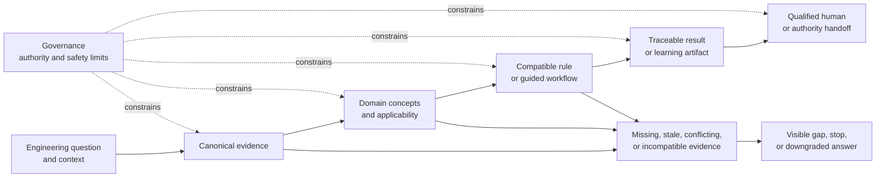

Text alternative: a question is resolved through evidence, domain/applicability reasoning, a
compatible rule or workflow, and a traceable output before qualified-human handoff. Governance
constrains every step. Missing or incompatible meaning leaves the success path and becomes a visible
gap, stop, or downgraded answer.

## What the project is—and is not

The project has three cooperating modules:

1. **Reference library** — holds the canonical, paraphrased evidence record.
2. **Field guide** — explains applicability, relationships, workflows, and limitations.
3. **`cst` toolkit** — evaluates explicit inputs and produces reproducible, cited engineering
   artifacts.

Together they should provide decision support. They should not claim:

- that a crosswalk proves compliance with another standard;
- that a calculated result is valid outside its cited edition and assumptions;
- that `Reviewed` means certified, approved, or accepted by an AHJ;
- that SAMPLE data are suitable for design;
- that a model, digital twin, or diagnostic has authority because it is sophisticated or current;
- that missing or paywalled evidence can be replaced by an inferred standard value.

## Behavioral contract

### 1. Scope before detail

The project should first establish the decision context: asset or system, jurisdiction, lifecycle
stage, governing edition, intended outcome, and relevant owner/AHJ constraints. It should then route
the reader to the smallest useful set of standards and tools.

Observable behavior:

- Entry pages lead with **Use this when**, **Does not apply when**, required inputs, and expected
  output.
- Crosswalks state the direction and context of a relationship.
- Calculators reject or warn on missing context that changes the result.
- Search and navigation support task, topic, lifecycle, industry, and standard routes without
  changing the governed top-level taxonomy.

### 2. Evidence before assertion

Every technical assertion or computed output should be traceable to the canonical corpus, a
user-supplied licensed table, an identified public primary source, or clearly labeled engineering
judgement.

Observable behavior:

- Site pages expose edition, coverage, review state, and canonical repository path where relevant.
- Calculator and generator results carry citations, assumptions, warnings, and input provenance.
- A missing source produces `Planned`, `Review pending`, `Needs revalidation`, or an actionable
  error—not an invented value.
- Derived site data identify the canonical record and generation activity from which they came.

### 3. Uncertainty next to the decision

Limitations should appear where a reader could act on the information, not only in a footer or About
page.

Observable behavior:

- Applicability caveats sit beside selection tables.
- SAMPLE warnings appear in the result and any generated design package.
- Unsupported mappings show a gap rather than disappearing from the comparison.
- Stale editions remain visible as `Needs revalidation` and do not inherit a positive aggregate
  badge.

### 4. Mapping is not equivalence

A relationship between two clauses or concepts is an editorial mapping, not a declaration that
compliance transfers. NIST IR 8477 supports relationship types such as equal, subset, superset,
intersects, and no relationship, combined with a rationale. The rationale may be syntactic,
semantic, or functional; the project normally needs semantic and functional reasoning, with human
review.

Observable behavior:

- Replace the informal `High / Medium / Very High` scale.
- Record relationship direction, rationale, scope, editions, author/reviewer, and review state.
- Display gaps and one-way relationships explicitly.
- Never render `equal` from similarity alone.
- Label all mappings informative; they support analysis but do not replace either source document.

### 5. One fact, many views

Canonical facts should be maintained once and rendered into the crosswalk, topic index, graph,
glossary, context panel, and comparison tool. A new presentation should become an adapter at the
existing seam, not another hand-maintained fact store.

Observable behavior:

- Editing a mapping once updates every correlation surface.
- Graph edges and comparison rows cannot disagree.
- Generated outputs have deterministic freshness checks.
- The deletion test removes shallow pass-through modules and duplicated datasets.

### 6. Provenance travels with the result

The project should treat provenance as part of the engineering artifact, not as display decoration.
W3C PROV distinguishes the thing produced, the activity that produced it, and the responsible agent;
the project can adopt that pattern without adopting RDF.

Observable behavior:

- A result preserves source identity and edition through calculation, rendering, download, and
  design-package assembly.
- A generated artifact identifies its source input, generation method/version, date, assumptions,
  and review status.
- A revised standard creates a distinct evidence state rather than silently changing the meaning of
  an old result.

### 7. Fail closed or degrade visibly

Failure behavior matters more than the happy path in engineering decision support.

| Condition | Required behavior |
|---|---|
| Licensed table missing | Stop design-use calculation with an actionable error |
| SAMPLE table requested | Require explicit demonstration mode and return a prominent SAMPLE warning |
| Table edition incompatible with embedded rules | Reject the combination |
| Standard edition superseded or unverified | Show `Needs revalidation`; do not imply current compliance |
| Mapping unsupported | Show an explicit gap and the individual source routes |
| Evidence conflicts | Present the conflict and governing context; do not silently choose |
| Input invalid or colliding | Reject before generating any artifact |
| JavaScript or CDN unavailable | Preserve core content, navigation, status, and download access |
| Learned model stale, out of envelope, or unavailable | Drop its authority or use the defined deterministic fallback |

### 8. Human authority remains explicit

Only the owner can mark AI-drafted work `Reviewed`. The governing standard, AHJ, qualified person,
listing body, employer/site program, or responsible engineer retains the authority appropriate to
the decision. The project should make handoff points obvious rather than merely disclaiming them.

### 9. Interaction is predictable and accessible

The site should preserve the same meaning and core workflow across desktop, mobile, keyboard,
screen reader, print, and no-JavaScript use. WCAG 2.2 specifically reinforces consistent navigation,
focus order and visibility, multiple ways to find content, reflow, name/role/value, and programmatic
status messages.

Accessibility should therefore be a release property, not a visual-polish phase.

### 10. Capability never grants authority

The existing AI/digital-twin rule should become a general project rule: sophistication, maturity,
connectivity, speed, or apparent confidence never raises the authority of an output. Authority comes
from evidence, applicable rules, review state, and independent protection.

## Research findings applied to this repository

### Standards correlation

The site currently has five correlation surfaces—pairwise crosswalks, a relationship graph, the
comparison tool, glossary relationships, and per-page related-standard links—but they use separate,
hand-maintained data.

| Surface | Current state | Behavioral weakness |
|---|---|---|
| Pairwise crosswalks | Topic tables embedded in Markdown | Informal equivalence scale; facts repeated elsewhere |
| Comparison tool | Pair-specific content and inline selection map | Can drift from the full crosswalk |
| Standards graph | 12 hand-positioned nodes and separate edge vocabulary | Hardcoded base URL and independent relationship claims |
| Glossary | Concept-shaped records with related terms/pages | Does not yet model regional or standard-specific designations |
| Context panel | Manually supplied related standards/crosswalks | Links, but does not explain the relationship |
| Corpus overlap notes | 3 of 28 planned notes exist | Evidence depth is the long-pole constraint |

NIST's OLIR approach is a strong model because it separates mappings from the source publications,
supports human-readable and machine-readable consumption, and treats mapping correctness as a
separate responsibility. The project should adopt that behavioral pattern, not claim NIST
conformance.

### Terminology

IEC Electropedia is concept-centered and carries equivalent designations across languages and
subject areas. ISO 860 addresses harmonization of concepts and terms. The project should likewise
model one concept with contextual designations rather than treating every term as a separate thing.

This is especially important for grounding/earthing, protective earth/equipment grounding conductor,
ground fault/earth fault, and standard-specific uses of words such as category, class, rating, and
integrity. A terminology link should mean “related designation in this context,” not automatically
“interchangeable.”

### Provenance

W3C PROV's entity/activity/agent separation maps cleanly to this repository:

- **Entity:** canonical note, mapping record, table transcription, calculation result, generated
  template, or published page.
- **Activity:** promotion, review, calculation, generation, or publication.
- **Agent:** author/reviewer, standards body, `cst` version, or generator.

This is a conceptual adoption only. A small native representation is preferable to introducing an
RDF stack unless a real second adapter appears.

### Trust and authority

NIST AI RMF describes trustworthiness in terms including validity and reliability, safety,
accountability and transparency, explainability and interpretability, privacy, and resilience. The
project's existing authority-first AI design is consistent with those qualities. The useful inference
for the whole project is that trust should be demonstrated through observable evidence and failure
behavior, not asserted through branding or a green badge.

## Multilayer operating model

The project should not be understood as a website sitting beside a Python package. It is a decision
support system with a vertical value path and crosscutting control planes. The value path turns
evidence into an engineer-facing handoff. The control planes preserve trust while information moves
through that path.

This model is deliberately behavioral. It identifies what each layer must guarantee before exact
schemas or Python interfaces are designed. The existing repository should be deepened at the seams
where those guarantees are currently lost; it should not be rearranged merely to resemble the layer
names below.

### Vertical value path

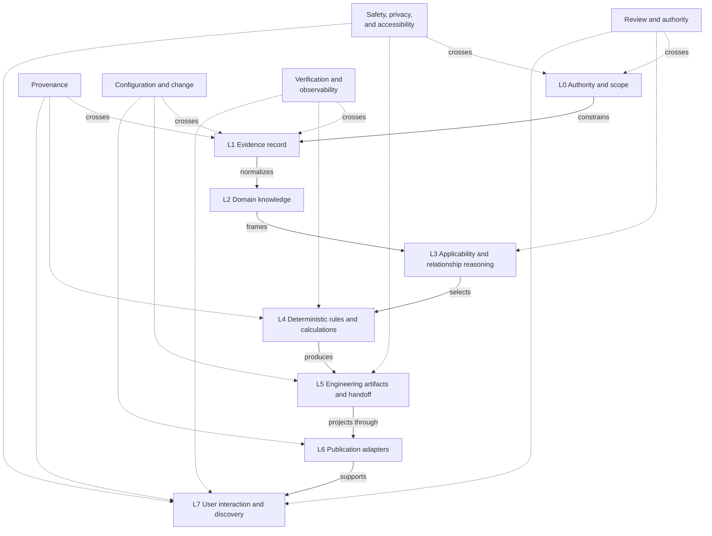

Text alternative: the value path descends from authority and evidence through knowledge,
applicability, rules, artifacts, publication, and interaction. Provenance, review/authority,
configuration/change, safety/privacy/accessibility, and verification cross several layers rather
than belonging to one final gate.

No higher layer may silently repair missing meaning from a lower layer. A presentation adapter may
shorten a citation for display, for example, but it may not invent an edition. A calculator may
derive a value from a governed rule, but it may not infer a licensed table entry that is absent. A
search interface may rank available pages, but it may not turn a weak mapping into an equivalence.

### L0 — Authority and scope

**Mission.** Define what the project is allowed to say and do, which sources are authoritative, and
where human or external authority begins. This is the constitutional layer.

**Current implementations.** `governance/`, the path trust tiers, review vocabulary, content
templates, the AI authority ladder, sample-data policy, and the read-only PLC and twin contracts.

**Required invariants.**

- Canonical, context-only, non-authoritative, and forbidden paths remain distinguishable in code as
  well as prose.
- A capability cannot raise its own authority. Review, certification, AHJ acceptance, and safety
  authorization remain explicit external acts.
- Copyright, privacy, employer/customer-data, and licensed-value restrictions survive every
  downstream transformation.
- A tailoring or exception decision identifies who has authority to make it and what scope it
  affects.

**Failure behavior.** If authority or scope is unresolved, downstream layers may offer routes,
questions, or clearly labeled general guidance, but not a design-use conclusion.

**Evidence of correct behavior.** Policy tests should exercise path classification, status
vocabularies, review-exemption honesty, privacy configuration, forbidden-path exclusion, and the
actuation/authorization ceiling. Governance text alone is not sufficient evidence that these rules
hold in shipped behavior.

### L1 — Evidence record

**Mission.** Preserve the smallest authoritative project record of what was researched, from which
edition and source, with what coverage and limitations. This layer is not a mirror of licensed
standards text; it is the project's governed paraphrase and source index.

**Current implementations.** `control-standards/rag/`, especially `standards_intelligence/`, plus
metadata, citations, source registers, table schemas, and user-supplied table provenance.

**Required invariants.**

- Every technical evidence record has valid access, content-class, status, source, edition, and
  coverage metadata appropriate to its type.
- Exact licensed values enter only through the declared external-data seam and never migrate into
  source control by convenience.
- Absence is represented as absence. A planned overlap note, unavailable edition, or incomplete
  review cannot be promoted by a renderer or aggregate count.
- Evidence identity is stable enough to trace a published claim or historical result after a source
  revision.

**Failure behavior.** Invalid metadata makes the record unavailable to design-use consumers. Missing
or conflicting evidence creates a gap report containing the affected question and next verification
step.

**Evidence of correct behavior.** One parser should enumerate corpus membership and validate allowed
values, required nonempty fields, exclusions, duplicate identities, edition form, mirror state, and
source references. The current `STATUS: AUTHORED` pass-through shows why presence checks are too
shallow.

### L2 — Domain knowledge

**Mission.** Turn evidence records into stable project concepts: standards, editions, topics,
requirements, guidance, terms, table identities, rule identities, lifecycle stages, and review
states. This is where vocabulary gains consistent meaning without claiming that unlike standards
are equivalent.

**Current implementations.** Glossary data, standards metadata, topic indexes, context panels,
crosswalk rows, graph nodes and edges, table identifiers, and citations embedded in `cst` modules.

**Required invariants.**

- A concept may have several contextual designations; a shared word does not prove a shared concept.
- Requirement, guidance, interpretation, example, project rule, and engineering judgement remain
  distinguishable.
- Standard identity includes edition. Table and rule identity are more specific than a display
  citation string.
- Mapping relationships carry direction, rationale, scope, evidence, and review state.
- One governed fact supplies every projection. The graph, comparison tool, crosswalk, glossary, and
  page context cannot own independent versions of the same relationship.

**Failure behavior.** Ambiguous terminology is shown with its competing contexts. Unsupported
relationships remain explicit gaps; they do not vanish and are not downgraded to vague “similarity.”

**Evidence of correct behavior.** Consistency checks should prove unique identities, valid
relationship vocabulary, reverse-direction semantics, edition references, and exact agreement among
all generated projections. A round-trip test should be able to identify the canonical record behind
any published relationship.

### L3 — Applicability and relationship reasoning

**Mission.** Frame the user's engineering decision before selecting detail. This layer asks what is
being designed or assessed, where, at which lifecycle stage, under which jurisdiction and editions,
and for what intended outcome.

**Current implementations.** Standards Finder questions, “Use this when” and “Does not apply when”
sections, crosswalk caveats, market and lifecycle routes, related-standard panels, and CLI inputs.

**Required invariants.**

- The route records enough context to explain why a source, topic, calculator, or workflow was
  selected.
- A relation is directional. “A helps interpret B for topic T” does not imply the reverse and never
  transfers compliance.
- Conflicting requirements remain associated with their governing contexts; ordering or visual
  prominence cannot silently resolve them.
- Unknown context is carried forward as an assumption or question, never silently replaced by a
  default when it could change the engineering outcome.

**Failure behavior.** Insufficient context yields a bounded set of clarifying questions or parallel
routes. It does not yield a falsely singular recommendation.

**Evidence of correct behavior.** Decision-table tests should cover jurisdiction, lifecycle,
industry, edition, equipment type, and intended-output branches, including unknown and conflicting
cases. Each route should expose its rationale and source set.

### L4 — Deterministic rules and calculations

**Mission.** Apply explicit, testable rules to explicit inputs. This is the project's arithmetic and
constraint layer, not its source of authority.

**Current implementations.** `src/cst/calc/`, `src/cst/common/tables.py`, validation helpers, PLC
address checks, I/O validation, twin contracts, and embedded rule citations.

**Required invariants.**

- Rule identity, table identity, source edition, and supported input domain are compatible before
  evaluation begins.
- Design mode fails closed when a required licensed input is missing. Demonstration mode is an
  explicit request and is preserved in every result and derivative artifact.
- Inputs are validated before partial output is emitted; units, phases, ranges, collisions, and
  missing required values have deterministic behavior.
- A standards-derived result cannot exist without provenance, assumptions, warnings, and the rule
  path used to obtain it.
- Rounding and conservative-selection behavior are explicit and regression-tested.

**Failure behavior.** Reject incompatible or unsupported combinations with an actionable message.
Where a partial result remains useful, identify exactly which sub-result is valid and prevent it from
being mistaken for a completed design.

**Evidence of correct behavior.** Tests should include known examples, edge and property cases,
metamorphic checks, edition mismatches, missing tables, sample/design transitions, and installed-wheel
execution. A citation string in CLI text is not by itself proof that the evaluated rule and loaded
table were compatible.

### L5 — Engineering artifacts and handoff

**Mission.** Preserve engineering meaning after a calculation or validated source record becomes a
BOM, wire schedule, nameplate set, address map, commissioning checklist, loop sheet, design package,
or other handoff artifact.

**Current implementations.** `src/cst/panel/`, `src/cst/plc/`, `src/cst/commissioning/`,
`src/cst/loop_sheets.py`, and `src/cst/docgen/design_package.py`.

**Required invariants.**

- Artifact content remains structured until the outer rendering seam. CSV, Markdown, and terminal
  text are projections, not the domain record.
- Citations, source edition, input identity, assumptions, warnings, demonstration state, generation
  activity, and review state travel with the artifact.
- Several outputs derived from one I/O list share the same validated input identity and cannot drift
  through independent reinterpretation.
- Re-generation is deterministic for the same inputs and tool version, apart from explicitly
  declared volatile fields such as generation time.
- A handoff states what another qualified person must verify before use.

**Failure behavior.** Artifact generation is atomic: invalid or colliding inputs do not leave a
plausible partial package. If an adapter cannot represent a warning or citation, generation fails or
the limitation is made prominent rather than dropping the field.

**Evidence of correct behavior.** Invariant tests should operate on the structured artifact, while a
smaller set of golden tests verifies each renderer. Cross-artifact tests should prove that a tag,
address, warning, or source change propagates to every affected output.

### L6 — Publication adapters

**Mission.** Project canonical records and engineering artifacts into Markdown, HTML, JSON, CSV,
downloadable templates, the RAG tree, search data, graph data, and package distributions without
creating new facts.

**Current implementations.** Jekyll layouts/includes, data files, document and template generators,
`generate_rag_tree.py`, `generate_site_templates.py`, package build configuration, and site assets.

**Required invariants.**

- Every committed generated output has a declared source and deterministic freshness check.
- An adapter may format, group, sort, or summarize; it may not change status, authority, edition,
  relationship meaning, warnings, or privacy posture.
- Base URLs, paths, and root discovery are configuration, not hardcoded alternate truths.
- The built wheel and deployed site contain the same governed resources that the source-tree tests
  exercised.

**Failure behavior.** Stale generated output fails the release gate with the owning generator and
repair command identified. Missing optional enhancement assets do not remove core content or trust
metadata.

**Evidence of correct behavior.** Pure build-versus-committed comparisons, reproducible package
inspection, base-URL variants, and source-to-projection trace tests should cover every adapter.

### L7 — User interaction and discovery

**Mission.** Help an engineer find, understand, compare, operate, download, and hand off information
without changing its governed meaning.

**Current implementations.** Navigation, search, Standards Finder, comparison and graph views,
filters, lightbox/diagram behavior, theme, print styles, CLI commands, and help text.

**Required invariants.**

- The same core meaning and routes remain available on desktop, mobile, keyboard, screen reader,
  print, and no-JavaScript paths.
- Control name, role, state, focus, errors, and status changes are programmatically exposed.
- Search or CDN failure is visible and offers an alternate route.
- Warnings and review state are adjacent to action points and cannot be hidden by viewport,
  interaction state, or a successful exit code.
- CLI and site vocabulary describe the same modes and authority limits.

**Failure behavior.** An enhanced interaction degrades to links, forms, static content, or a clear
unavailable state. It never fails silently while appearing to have searched, filtered, or validated.

**Evidence of correct behavior.** Browser tests should cover keyboard and pointer paths at desktop
and mobile widths, focus move/restore, live status, reflow, zoom, reduced motion, print, theme,
no-JavaScript, and dependency failure. Manual screen-reader and device checks remain part of the
release evidence because automation cannot establish usability by itself.

### Crosscutting control planes

The vertical layers explain how value is produced. Five control planes must cross every layer:

| Control plane | Question it must answer everywhere | Repository consequence |
|---|---|---|
| Provenance | Where did this fact or result come from, through which activity? | Stable evidence identity and derivation survive page, CLI, download, and design package |
| Review and authority | Who reviewed what, to which scope, and who can authorize use? | Page, claim, corpus, mapping, and artifact states are distinct and derived rather than conflated |
| Configuration and change | Which editions, inputs, rules, code, and projections formed this state? | Versioned compatibility and deterministic regeneration replace mutable “current” truth |
| Safety, privacy, and accessibility | What harm constraints apply even when the happy path works? | Safe defaults, shared analytics policy, progressive enhancement, and authority ceilings are release properties |
| Verification and observability | What evidence shows the promised behavior actually occurred? | Semantic gates, installed-package tests, browser checks, and derived metrics accompany static build checks |

NASA's systems-engineering guidance is useful here as a pattern, not as a project compliance claim:
it separates verification from validation and treats requirements, interfaces, risk, configuration,
technical data, assessment, and decision analysis as crosscutting work across the lifecycle. NIST SP
800-160 Vol. 1 Rev. 1 similarly treats trustworthiness as something engineered throughout the system
lifecycle rather than attached at delivery. The project should apply that pattern proportionately:
verify that each implementation meets its stated contract, and validate that the assembled product
actually supports a qualified engineer's decision without overstating authority.

## End-to-end behavior traces

Layer-level tests are necessary but insufficient. The release model should also trace representative
decisions through the whole system, because most current weaknesses occur where one module hands
meaning to another.

### Trace A — Evidence to field-guide claim

1. A canonical corpus record identifies source, edition, coverage, status, and the project paraphrase.
2. Domain knowledge identifies the topic, concept designations, relationship type, and applicability
   context.
3. A publication adapter renders the claim, citation route, caveat, and review state.
4. Search, navigation, crosswalk, comparison, graph, and context panels expose projections of the
   same record.
5. The reader sees why it is relevant, what it does not establish, and what source or authority to
   consult next.

**Current loss points.** `repo_path` is free text; relationship facts are duplicated; badges are
hand-authored; and freshness checks do not cover every projection.

**End-to-end assertion.** Given a visible technical claim or relationship, the release test can find
exactly one governed evidence record and show that edition, status, direction, and caveat agree in
every projection. Removing or superseding that record either updates all projections or fails the
build.

### Trace B — Licensed table to calculated decision

1. The user explicitly selects design or demonstration mode and supplies calculation context.
2. The table loader validates schema, provenance, table identity, and edition.
3. Applicability reasoning selects only a compatible deterministic rule implementation.
4. Input validation runs before calculation; the result records the actual rule and table path.
5. The returned engineering result carries value, units, citations, assumptions, warnings, mode,
   and next verification action.
6. CLI text, Python use, and any design-package adapter project the same structured result.

**Current loss points.** Samples default on; arbitrary table editions can meet fixed 2023 rules;
single-phase motor provenance disagrees with the loaded dataset; and citations are optional in the
common result type.

**End-to-end assertion.** A design-mode calculation cannot complete without compatible evidence.
Changing edition or phase either selects an explicitly supported rule/table pair or produces a clear
failure; every adapter exposes the same mode, source, and warning state.

### Trace C — Canonical I/O list to coordinated panel artifacts

1. One input record is parsed and assigned a stable input identity.
2. Shared validation resolves required fields, types, duplicate tags, address collisions, and
   mode-specific constraints.
3. Each artifact implementation consumes the same validated domain objects rather than reparsing
   raw dictionaries.
4. BOM, schedule, address map, nameplates, loop sheets, commissioning checks, and design-package
   sections preserve common provenance and warnings.
5. CSV, Markdown, and other renderers format those artifacts without redefining their fields.

**Current loss points.** Several implementations return raw dictionaries or strings; CSV writers
repeat schemas; citations defined by nameplate and wire-schedule modules do not travel; and design
package assembly can reinterpret output.

**End-to-end assertion.** A single tag, address, source, or warning change appears in every affected
artifact. A collision prevents the complete package from being emitted. Every artifact can identify
the exact input state and generator that produced it.

### Trace D — Standard revision through change impact

1. A new edition creates a new evidence state; the previous record remains historically identifiable.
2. Impact analysis enumerates affected concepts, mappings, rules, tables, pages, examples, tests,
   generated artifacts, and prior outputs whose currency claim changes.
3. Items awaiting comparison become `Needs revalidation` or remain on the older edition; they do not
   inherit the new edition label.
4. Reviewed changes pass through the owner-authorized status transition.
5. Publication and package adapters regenerate, and the release gate proves that no stale projection
   remains.

**Current loss points.** Source relationships are mostly documentary, volatile counts are
hand-maintained, and not all generated views have freshness enforcement.

**End-to-end assertion.** An edition change produces a finite, reviewable impact set. Until each item
is dispositioned, the system reports mixed currency honestly and blocks unsupported design-use
combinations.

### Trace E — Unsupported or conflicting evidence

1. The project recognizes that the requested decision lacks adequate evidence or has multiple
   context-dependent answers.
2. It preserves the user context and identifies the precise evidence gap or conflict.
3. It returns available source routes, assumptions that would change the answer, and the person or
   authority needed next.
4. No outer layer fills the gap with a sample value, nearest semantic match, stale edition, or
   confident prose.

**End-to-end assertion.** The unsupported path is as testable as the successful path. It produces a
useful handoff rather than an empty error, while remaining impossible to mistake for approval or a
completed design.

## Failure propagation and containment

Failures should move outward as explicit state and stop before they become more persuasive artifacts.

| Originating failure | May still be offered | Must be blocked |
|---|---|---|
| Authority or jurisdiction unknown | General routes and clarifying questions | Compliance conclusion or design-use recommendation |
| Evidence missing or unreviewed | Gap report, source route, review task | Invented requirement, value, or positive review badge |
| Terminology ambiguous | Contextual designations and alternatives | Automatic synonym replacement or equivalence |
| Mapping unsupported | Separate source summaries and visible gap | Implied relationship edge or inherited compliance |
| Table/rule edition mismatch | Supported-combination list | Calculation or design-package emission |
| SAMPLE data selected | Demonstration result with persistent warning | Unmarked result or conversion to design mode downstream |
| Artifact rendering fails | Structured artifact and alternate renderer, if safe | Partial file that looks complete |
| JavaScript/CDN fails | Static navigation, content, status, direct downloads | Silent empty search/filter or inaccessible core route |
| Review becomes stale | Historical state and revalidation queue | Continued current/Reviewed representation |

This containment model increases Depth: the inner modules handle hard evidence, compatibility, and
artifact rules once, while outer adapters become simpler. It also increases Locality: an edition
policy change should be made in the standards-rule implementation, not patched independently in a
calculator, CLI formatter, page, and warning banner.

## Layer-by-layer release evidence

| Layer | Minimum automated evidence | Human evidence that remains necessary |
|---|---|---|
| L0 Authority/scope | Policy vocabulary, path tiers, forbidden exclusions, authority-ceiling tests | Owner acceptance of governance and exceptions |
| L1 Evidence | Metadata semantics, source identity, edition, coverage, duplicate and mirror checks | Technical review against lawfully available sources |
| L2 Domain knowledge | Identity, terminology-context, mapping-direction, projection-consistency tests | Engineering judgement on semantic and functional rationale |
| L3 Applicability | Decision-table branch, unknown-context, conflict, and rationale tests | Owner/AHJ confirmation for project-specific applicability |
| L4 Rules | Examples, edge/property cases, compatibility, mode, provenance, wheel-install tests | Independent engineering verification of rule interpretation |
| L5 Artifacts | Structural invariants, atomic generation, cross-artifact consistency, renderer goldens | Field usability and handoff review by intended practitioners |
| L6 Publication | Deterministic freshness, base-URL, build/package-content, traceability checks | Editorial review of presentation and caveat placement |
| L7 Interaction | Keyboard, focus, state, reflow, no-JS/CDN-failure, CLI behavior tests | Screen-reader, device, print, and workflow validation |

The distinction between verification and validation matters. Passing the current 303 tests verifies
many implementation expectations; it does not by itself validate that an engineer can recognize an
unsupported edition, interpret a review badge correctly, recover from search failure, or hand a
generated package to another person without losing provenance.

## Novice-learning behavior

The field guide should support a learner with no industrial-controls experience without pretending
that reading a page creates field qualification. Beginner-friendly behavior means building an
accurate mental model in small steps, providing safe and fictional practice, checking understanding,
and showing exactly where supervised work, employer training, a qualified person, or the governing
standard is still required.

The learner-facing contract should be:

> Begin with a recognizable machine or process behavior. State what the learner will be able to
> explain or decide. Reveal only the vocabulary needed for that decision. Connect a physical or
> concrete representation to the formal model. Demonstrate one complete example while explaining
> why each step is taken. Let the learner complete a near example with support, then a changed
> example independently. Correct the likely misconception, retrieve the key idea later, and end with
> a safe next action—not an implication of qualification.

This recommendation is consistent with several primary guidance sources. The US Department of
Education practice guide recommends alternating worked examples with problem solving, combining
graphics and words, connecting concrete and abstract representations, retrieval practice, and deep
explanatory questions. OSHA's worker-training guidance emphasizes understandable language,
immediate workplace relevance, active participation, demonstrations and hands-on practice, and a
needs assessment. CAST UDL Guidelines 3.0 organize access around engagement, representation, and
action/expression. *How People Learn II* emphasizes learner prior understanding, models, explanation
of correct versus incorrect system behavior, and transfer. These are teaching patterns, not a claim
that a static field guide alone constitutes a training program.

### What “beginner” means in this project

The site should not treat all beginners as identical. A learner may know electrical work but not PLC
software, know software but not machinery safety, or understand process operations but not control
theory. Each page should declare prerequisites by concept rather than job title.

Use five learner stages:

| Stage | Learner can currently do | Page should provide |
|---|---|---|
| Orientation | Recognize a machine/process but lacks the project vocabulary | Purpose, system picture, safety boundary, route map |
| Foundation | Name major parts and describe simple cause/effect | Concrete model, vocabulary, annotated diagram, prediction questions |
| Guided application | Follow a demonstrated procedure with prompts | Worked example, decision explanation, supported practice, feedback |
| Independent application | Solve a bounded fictional case and justify choices | Varied practice, checks, evidence routes, failure cases |
| Integration/reference | Connect several domains during real engineering work | Standards relationships, lifecycle handoffs, calculators, templates, review gates |

“Beginner” pages should primarily serve Orientation through Guided application. Reference pages may
serve later stages, but must link back to the prerequisite route instead of compressing the
prerequisites into a glossary tooltip.

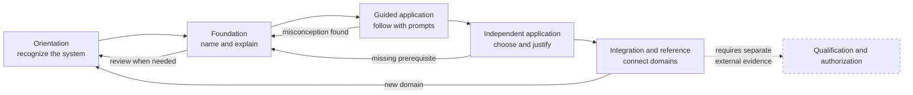

Text alternative: learners normally progress from recognition to explanation, guided work,
independent bounded work, and cross-domain integration, but may loop backward when prerequisites or
misconceptions surface. Qualification and authorization remain a separate external path; they are
not the next learner stage.

### One universal lesson spine

Every learner-facing topic should use the following sequence, tailored to its content type:

1. **Why this matters.** One short constructed situation showing the observable problem or decision.
2. **Learning outcome.** Two to four actions the learner should perform, using verbs such as
   identify, trace, predict, compare, calculate, diagnose, or explain. Avoid “understand.”
3. **Prerequisite check.** Three to five concepts with links and a short self-check. Do not assume
   field experience.
4. **Safety and authority boundary.** State whether the page is conceptual, a fictional exercise, or
   supervised practice. Name prohibited unsupervised actions early.
5. **System picture.** One original diagram showing the physical/module boundary, energy or
   information flow, input, decision, output, and feedback where applicable.
6. **Plain-language mental model.** Explain the smallest accurate causal story before symbols,
   clauses, or vendor terminology.
7. **Vocabulary in context.** Introduce no more than the terms needed for the first example; give
   each term a visible referent in the diagram or scenario.
8. **Formal representation.** Connect the mental model to the equation, schematic, ladder rung,
   state diagram, network frame, clause route, or lifecycle deliverable.
9. **Worked example.** Show the entire reasoning chain: knowns, unknown, selection, calculation or
   trace, result, reasonableness check, provenance, and limitations.
10. **Guided practice.** Use a near example with prompts or partially completed steps.
11. **Independent variation.** Change one important condition so the learner must choose rather than
    imitate.
12. **Misconception check.** Present a plausible wrong answer, explain why it seems reasonable, and
    show the observable contradiction or governing distinction.
13. **Retrieval check.** Ask three to five questions without requiring the learner to reread the
    preceding paragraph. Supply answers with reasoning, not only answer keys.
14. **Field handoff.** State what a qualified person would verify, what document or measurement is
    needed, and what the learner is not yet authorized to conclude.
15. **Next route.** Offer one easier review path, one natural next lesson, and one application path.

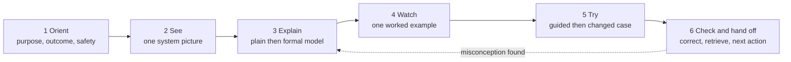

Text alternative: a lesson has six visible movements—orient, see, explain, watch, try, and check/hand
off. A discovered misconception returns the learner to the explanation rather than merely marking an
answer wrong. The detailed fifteen-item content contract above fits within these six simple movements.

Pages do not need fifteen equally large headings. The spine is a content contract; related elements
may be grouped visually. Reference-only pages should at minimum expose the prerequisite, system
context, caveat, worked use, and next route.

### Explanation rules for a learner with no experience

- Use the physical thing before the acronym: “the device that measures tank level (level
  transmitter)” before `LT`.
- Use one stable constructed system across early lessons—a small pump-and-tank skid is recommended—
  so the learner spends attention on the new concept rather than decoding a new plant every page.
- Make energy flow and information flow visually different. A control signal is not the power that
  drives a motor.
- Reveal diagrams in layers: equipment first, then power, then control I/O, then network, then safety.
  Also provide the complete static diagram and text alternative.
- Pair every symbol with words and units. Do not introduce an equation as a definition when a causal
  explanation is possible.
- State the system boundary. Many beginner errors come from silently changing what is inside the
  circuit, loop, safety function, network, or project scope.
- Teach normal behavior before abnormal behavior, then contrast them side by side.
- Treat analogies as temporary scaffolds. State where the analogy stops matching the engineering
  model; do not use water-flow analogies as proof of electrical behavior.
- Explain every choice in a worked example. A page that shows steps without selection rationale
  teaches copying rather than engineering judgement.
- Use accessible initial values and small datasets, then vary one dimension at a time. Realistic
  complexity belongs after the learner can predict the simple model.
- Expand acronyms on first use per page and retain a nearby local vocabulary list. Do not require a
  new learner to navigate away for every term.
- Prefer short sentences, direct verbs, descriptive headings, tables with explicit row/column
  questions, and diagrams with text alternatives. Simpler language must not erase technical
  distinctions.
- Never use quiz success, simulator success, or completion badges to imply field competency,
  certification, or authorization.

### A stable constructed teaching system

Use one fictional, non-customer system as the recurring beginner model:

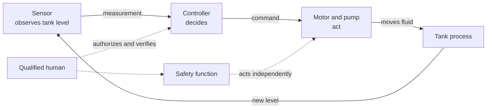

Text alternative: a sensor observes tank level, a controller decides, a motor/pump acts, and the tank
process produces a new level that is measured again. A safety function can act independently on the
actuator path. A qualified human separately authorizes and verifies ordinary control and safety. Power,
network, disturbance, and detailed protection views are introduced later rather than crowded into the
first picture.

The system can grow with the learner:

- Electrical lessons identify sources, loads, voltage, current, power, and protective paths.
- Control lessons regulate tank level or flow and introduce feedback.
- Motor lessons explain how the pump is driven and why a VFD changes speed.
- PLC lessons map inputs, execute a state sequence, and command outputs.
- Communications lessons separate physical links, Ethernet, and application protocols.
- Safety lessons introduce hazards, risk reduction, and an independent safety function without
  presenting a generic circuit as an approved design.
- Standards lessons show why different documents answer different questions about the same skid.
- Lifecycle lessons show how the model changes from concept through commissioning and maintenance.
- Toolkit lessons produce fictional I/O, BOM, schedule, checks, and calculations from the same input.

This continuity creates leverage, but examples must later vary equipment, failure modes, markets,
and processes so learners do not mistake the pump skid for the definition of control engineering.

## Visual explanation system

Visuals should expose relationships that prose makes costly to reconstruct. They should not decorate
the page, compress unresolved engineering complexity, or become the only carrier of meaning.

### Easy-first visualization standard

Every learner visual should be understandable before it is comprehensive. The first view answers one
question with one obvious reading path. Detail appears only after the learner can explain that view.

Easy-first limits for Orientation and Foundation pages:

- one learner question and one takeaway per visual;
- normally five to seven visible nodes or objects in the first view;
- one dominant reading direction—left-to-right for flows or top-to-bottom for stages;
- one main path, with no more than two secondary branches;
- labels use familiar words already introduced on the page, normally five words or fewer;
- arrows carry verbs such as `measures`, `commands`, `moves`, or `verifies` rather than existing
  unlabeled;
- no more than two relationship types in the first view;
- no more than three simultaneously compared states;
- no legend when direct labels fit; when unavoidable, keep it to four meanings or fewer;
- one changed condition per practice view;
- advanced detail, clause references, network layers, and failure branches appear in a later view or
  adjacent table rather than shrinking the first diagram;
- the important path remains clear in monochrome and without animation;
- the visual and its essential labels fit a 320 px layout by reflowing vertically, not by requiring
  horizontal scrolling or pinch zoom.

These are project design budgets, not universal learning-science thresholds. An author may exceed one
when the learner task genuinely requires it, but the visual specification must explain why and must
provide an easier overview first.

Use a three-pass explanation:

| Pass | Learner sees | Learner should be able to do |
|---|---|---|
| 1. Glance | Main objects and one path | Point to the start, action, and result |
| 2. Trace | Directional labels and one changed condition | Explain the causal sequence aloud |
| 3. Inspect | Units, formal symbols, evidence, warnings, and edge cases | Solve or diagnose the bounded task |

If the learner must inspect Pass 3 detail to discover the basic path, the visualization is too dense.

### Simplicity gate

Before technical or learner review, ask a person unfamiliar with the page to view the visual without
the surrounding explanation and answer:

1. Where does the visual start?
2. What is the main path or comparison?
3. What changes or happens?
4. What is the one takeaway?
5. Which part is safety-, uncertainty-, or authority-related?

If the first four answers are not apparent, revise the composition before adding interactivity or
styling. If the fifth is relevant but invisible, the visual is unsafe even if the main path is clear.

Common simplifications, in order:

1. Remove facts that do not answer the learner question.
2. Split power, control, network, safety, and evidence into coordinated views.
3. Replace noun-heavy labels with short subject/verb relationships.
4. Direct-label the important path and remove the legend.
5. Convert secondary detail into a small table below the visual.
6. Replace crossing connectors with a clearer reading order.
7. Use a step-through only when sequence—not mere disclosure—is the learning target.
8. If the diagram still needs a long explanation to decode its layout, replace it with prose or a
   table.

### Visual grammar

Use one stable grammar across the beginner path:

| Meaning | Primary visual encoding | Required redundant cue |
|---|---|---|
| Physical equipment/process | Named equipment nodes and physical-flow arrows | Equipment label and verb on the connection |
| Electrical energy | Solid path labeled `power` with source and load | Text states voltage/energy role; never color alone |
| Control or measurement signal | Directional arrow labeled with measured/commanded quantity | Source and destination named |
| Network communication | Link through a network/switch node | Protocol/layer named only when relevant |
| Safety function | Separate path and explicit “safety function” label | Text states independence and protective action |
| Evidence/provenance | Dotted relationship to source/edition/review record | Visible source route in surrounding text |
| Human/authority decision | Dashed relationship from named role/authority | Handoff statement identifies required action |
| Normal versus fault state | Side-by-side state labels or changed line style/shape | “Normal,” “fault,” or “unavailable” written explicitly |
| Unknown or unsupported | Open gap/stop node | Reason and next verification action written beside it |

Color may reinforce these meanings, but shape, label, direction, and line style must keep them
understandable in monochrome, print, high-contrast settings, and for color-vision differences.

### Progressive visual depth

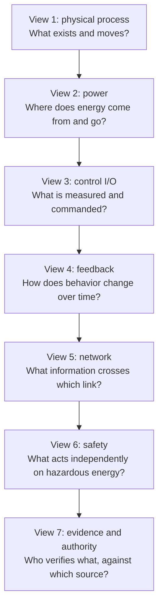

Text alternative: the recurring system is disclosed through seven coordinated views: physical
process, electrical energy, control I/O, feedback behavior, network communication, independent safety
action, and finally evidence/human authority. Each layer reuses the same equipment identifiers so the
learner adds meaning without relearning the scene.

### Visual types by teaching purpose

| Learner question | Preferred visual | Avoid |
|---|---|---|
| What belongs to the system? | Labeled system-context or physical-boundary diagram | Decorative factory image |
| What flows where? | Directional flow with named quantity | Unlabeled arrows |
| What happens over time? | Aligned state/time plot or sequence diagram | Static block diagram alone |
| Why was this choice made? | Decision tree with context and stop/gap outcomes | Universal ranking pyramid |
| How do parts relate? | Small architecture views with consistent identifiers | One unreadable “everything” diagram |
| How does a rule produce a result? | Annotated derivation or trace table | Formula without units/source |
| What changes between cases? | Side-by-side comparison on shared axes | Two unrelated screenshots |
| Where did this claim come from? | Evidence-to-claim trace | Citation list detached from claim |
| What should I check next? | Diagnostic split with expected/observed states | Long undifferentiated fault list |
| What stage owns this artifact? | Lifecycle swimlane or input/output flow | Checklist without handoffs |

### Visual accessibility contract

- Every essential visual has a nearby text alternative explaining relationships and conclusions, not
  merely listing shapes.
- Source order follows the intended reading order. A learner who cannot see the diagram receives the
  same causal sequence from text.
- Interactive disclosure supplements a complete static state; no core meaning requires hover,
  animation, JavaScript, a CDN, or precise pointer use.
- Controls use native semantics and expose name, role, state, instructions, errors, and updates.
- Diagrams reflow or switch to a vertical composition at 320 px and remain legible at 200% zoom.
- Print includes labels, legends, warnings, citations, and the complete static diagram.
- Motion is purposeful, user-controlled where applicable, and suppressed under reduced-motion
  preferences.
- Tables accompany quantitative charts when exact values matter.
- Diagram identifiers match prose, worked examples, I/O tags, and artifacts exactly.
- Original SVG/Mermaid/code-native assets are preferred so text alternatives, theme, print, and
  revision control remain maintainable. Raster images are reserved for visuals that genuinely need
  bitmap detail.

### Visual-selection decision tree

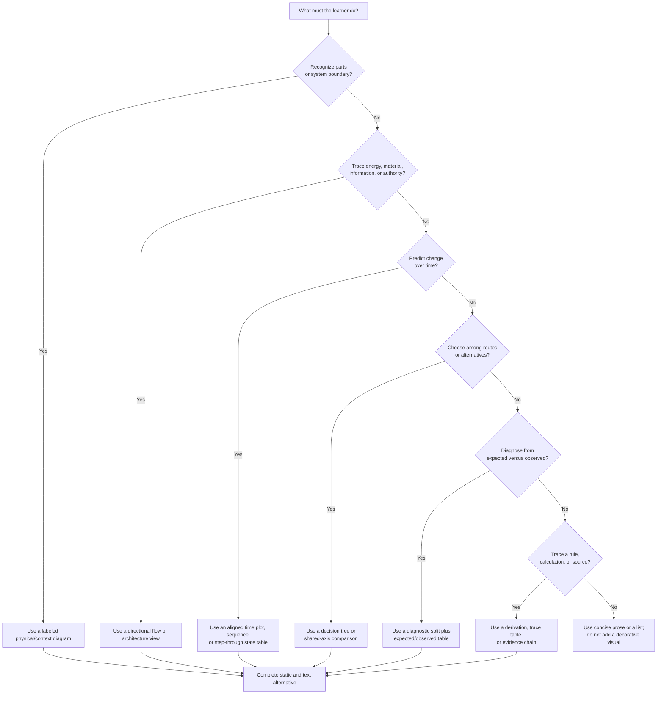

Text alternative: choose a visual from the learner action. Recognition uses a context diagram;
tracing uses a directional flow; time prediction uses a plot, sequence, or state table; selection
uses a decision tree or shared-axis comparison; diagnosis uses a split and expected/observed table;
rule/source tracing uses a derivation or evidence chain. When none applies, use prose rather than a
decorative visual. Every selected form needs a complete static and textual equivalent.

### Beginner-page visual anatomy

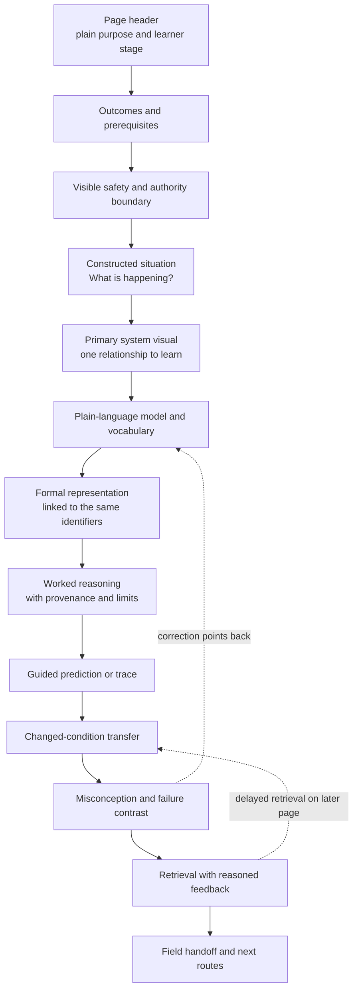

Text alternative: the visual page begins with purpose, outcomes, prerequisites, and safety boundary;
then introduces one constructed situation and one primary visual. Plain and formal models share
identifiers. Worked reasoning leads to guided and changed-condition practice, misconception
correction, retrieval, and field handoff. Wrong-model feedback returns to the explanation, while
later pages retrieve the concept through another transfer case.

This is an information hierarchy, not a requirement for thirteen visible cards. The page should feel
like one continuous explanation. A primary visual appears close to the question it answers; secondary
reference diagrams remain below the first learner action.

### Visual specification required before authoring

Every proposed visual should have a one-paragraph design record answering:

1. **Learner question:** what must the learner recognize, trace, predict, choose, diagnose, or
   explain?
2. **Single takeaway:** what relationship should be recoverable after the visual is removed?
3. **Source of truth:** which canonical evidence, fictional scenario data, calculation result, or
   project concept supplies the labels and relationships?
4. **Representation:** why is a system view, flow, time plot, state table, comparison, decision tree,
   or evidence chain the smallest useful form?
5. **Interaction, if any:** what learner action changes or reveals state, and why static reading is
   insufficient?
6. **Failure/unknown state:** how does the visual show missing data, SAMPLE mode, stale evidence,
   unsupported mapping, invalid input, unavailable dependency, or unsafe action?
7. **Text equivalent:** what ordered explanation conveys the same relationship and conclusion?
8. **Transfer:** what one changed condition checks that the learner understood rather than memorized?
9. **Review:** who checks technical meaning, learner use, accessibility, and freshness?

A visual without a learner question, takeaway, or source should not be built.

### Interaction patterns and their limits

| Pattern | Appropriate use | Required behavior | Do not use when |
|---|---|---|---|
| Predict then reveal | Circuit path, controller action, next diagnostic check | Learner commits to a choice; feedback explains all options | The answer is safety-critical field authorization |
| Step through | PLC scans, protocol transaction, lifecycle handoff | One current state, previous/next controls, complete state table fallback | Continuous motion adds no explanatory value |
| Change one variable | PID intuition, load/torque, signal scaling | One bounded control, units and current value visible, changed-condition explanation | Many coupled inputs would imply design simulation accuracy |
| Compare two cases | Normal/fault, protocol roles, motor/architecture choices | Shared axes/labels and explicitly changed condition | Cases differ on hidden assumptions |
| Trace highlight | Power, signal, network, provenance, artifact derivation | Selected path named in text; full path available without hover | Highlight could imply current is literally a moving substance |
| Error injection | Validation, diagnostics, artifact collision, stale evidence | Fictional/offline only; recovery and stop state included | It requires a real device, live network, or hazardous state |
| Layer reveal | Physical → power → control → network → safety | Same identifiers and stable layout where possible | Hiding a layer changes the system boundary without notice |
| Sort/filter | Large glossary or reference inventory | Results count/status announced; no-result and failure states visible | Filtering would conceal unmapped gaps or warnings |

Use buttons, radios, selects, or a single bounded range input rather than novel gestures. Dragging is
not a learning objective. Hover can add supplementary detail but cannot reveal required content.

### Visual state model

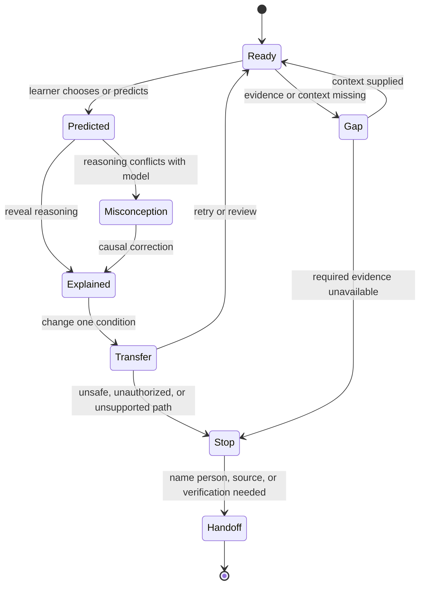

Text alternative: an interactive lesson begins ready, records a prediction, reveals reasoning, and
tests transfer before retry/review. Missing context creates a visible gap; a wrong model enters causal
correction; unsafe or unsupported conditions enter a stop state and then a named human/source
handoff. The visual never skips from gap or misconception directly to a successful completion state.

### Visual specifications by topic family

| Topic family | Primary novice visual | First learner action | Critical contrast | Transfer variation |
|---|---|---|---|---|
| Controls orientation | Physical system context with observe/decide/act/verify loop | Classify each element by role | Energy versus information versus authority | Replace pump with fan/conveyor |
| Electrical quantities | Physical circuit beside schematic | Trace closed path and label quantity/unit | Voltage across versus current through | Open path or parallel branch |
| Kirchhoff/equivalent circuits | Node/loop diagram with signed arrows | Predict conservation before calculation | Reference direction versus physical result | Change one branch value |
| Components/electronics | Input-output behavior and operating-region sketch | Predict diode/transistor/passive response | Ideal model versus device limit | Reverse polarity or different load |
| Feedback/PID | Process loop synchronized with time response | Predict controller direction | P/I/D effect and their costs | Disturbance, saturation, or noise |
| Advanced control | Multi-loop/coordination architecture plus aligned timelines | Locate coupling and delay | Local success versus system interaction | Add latency or resonance |
| Motors | Energy-conversion chain plus torque-speed/load view | Match physical job to motor behavior | Nameplate/rated data versus application demand | Higher inertia or starting load |
| VFD/servo | Separate power, command, and feedback paths | Trace speed/position command and response | Open-loop VFD versus closed-loop servo | Feedback loss or saturation |
| PLC ladder | Rung, I/O image, and scan-state table | Predict three scan results | Physical NC device versus logical instruction | Input changes between scans |
| PLC sequencing | State diagram plus transition/outputs table | Choose next valid state | State, mode, alarm, and safety trip | Interrupted/restarted sequence |
| NEC/code application | One-line diagram with scope brackets and source route | Classify circuit part and route question | Publication date versus enforced edition | Change jurisdiction or circuit boundary |
| Standards families | Directional applicability map | Select likely document and explain why | Related versus equivalent/compliance transfer | Change market or intended output |
| Functional safety | Hazard-to-function chain and independent input/logic/output | Identify safety function and safe behavior | Ordinary control versus safety function | Fault or diagnostic coverage gap |
| Cybersecurity | Asset/data-flow zones and allowed conduit | Trace allowed defensive communication | Connectivity versus trust/authorization | Add remote access or failed control |
| Hazardous areas | Release/source → classification → marking → installation chain | Identify missing classification input | Area designation versus equipment marking | Change release/ventilation assumption |
| Wiring | Physical layout beside schematic/terminal trace | Trace one conductor by function | Power/control/signal/safety paths | Shield/routing/vendor terminal changes |
| Communications | Physical topology plus layered transaction envelope | Trace one value end to end | Link health versus application health | Link works but transaction fails |
| Lifecycle | Requirement-to-artifact swimlane | Place evidence at stage and name consumer | Verification versus validation | Requirement changes after commissioning |
| Industry overlay | Simplified process flow plus stakeholder/standard overlay | Identify generic and site-specific decisions | Pattern versus approved design | Change industry/site constraint |
| Troubleshooting | Expected/observed split and diagnostic decision tree | Choose safest discriminating check | Symptom versus cause | New observation eliminates hypothesis |
| Toolkit/calculators | Input → validation → rule/evidence → result → artifact | Find mode, provenance, assumption, warning | SAMPLE success versus design-use validity | Wrong edition or missing source |
| AI/digital twin | Data/model/advice flow beside authority ladder and fallback | Classify allowed model role | Predictive accuracy versus decision authority | Stale/out-of-envelope/unavailable model |

Each topic later receives secondary reference visuals, but the first page visual answers one novice
question. It should not attempt to display the entire professional body of knowledge.

### Evidence-to-learning trace

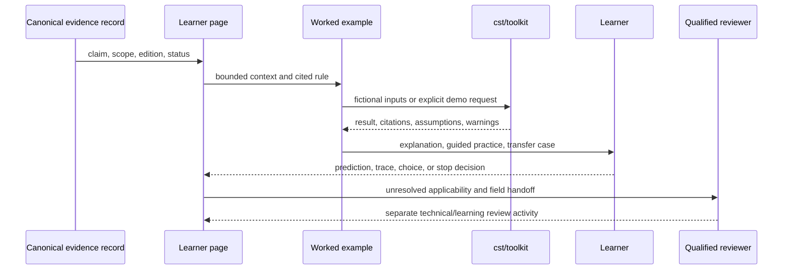

Text alternative: canonical evidence supplies the page; the page constrains a worked example; the
example may call the toolkit using fictional or explicit demonstration inputs; the toolkit returns a
provenance-bearing result; the learner predicts, traces, chooses, or stops; unresolved applicability
is handed to a qualified reviewer. Review remains a separate human activity rather than an automatic
consequence of completing the sequence.

## Teaching patterns by content type

### Concept and physical-principle topics

Use for voltage/current, feedback, slip, inertia, signal behavior, grounding concepts, and network
fundamentals.

Sequence: observe a phenomenon → predict what changes → identify parts/quantities → draw a simple
causal model → connect it to the formal representation → test a changed condition.

Required learner evidence: label an original diagram, predict direction of change, explain the
mechanism in words, and identify the limit of the model. Avoid beginning with a dense reference table
or equation sheet.

### Calculation topics

Use for Ohm's law, power, conductor correction, motor sizing, PID terms, scaling, and network timing.

Sequence: state the engineering question → list known values with units/source → identify the rule
and applicability → estimate direction/magnitude → calculate → select/round → perform a reasonableness
check → cite and state limitations.

Show three examples: one fully worked, one partially worked, and one transfer case that changes an
applicability condition. The first numbers may be accessible, but SAMPLE and fictional status must
remain visible. Never let an arithmetic exercise imply that code selection or design review is only
arithmetic.

### Procedure and installation topics

Use for wiring, commissioning, configuration, capture analysis, and template workflows.

Sequence: desired end state → hazards/authorization → prerequisites and documents → annotated before
state → steps with purpose and expected observation → hold points → verification → recovery/stop
criteria → handoff record.

Separate “watch/read only,” “safe fictional/offline practice,” and “qualified supervised field work.”
Photographic or vendor-manual dependencies should be replaced by original diagrams and instructions
to consult the actual device documentation.

### Standards and code-navigation topics

Use for NEC, NFPA 79, UL 508A, IEC 60204-1, functional safety, hazardous areas, cybersecurity, and
SEMI material.

Begin with the question each document helps answer, not its clause list. Teach source authority,
scope, edition, jurisdiction, requirement/guidance distinction, and how to route to the licensed
source. Use a constructed decision where two documents apply differently. Show a visible “this page
can help you locate and interpret; it cannot establish compliance” boundary.

Required learner evidence: select the likely document route, explain why, identify missing context,
and state who or what confirms applicability. Memorizing clause numbers is not the primary outcome.

### Diagnostic topics

Use for motor faults, VFD faults, analog signals, communications dropouts, and capture interpretation.

Sequence: make safe → define the symptom precisely → compare expected/observed state → split the
system at a safe measurement boundary → choose the next discriminating check → update hypotheses →
record result → escalate.

Provide one decision tree plus a reasoning narrative. Ask the learner to choose the next check before
revealing it. Teach “what evidence would distinguish these causes?” instead of presenting long fault
lists. Live work, energized measurements, and controller access retain their qualification boundaries.

### Comparison and selection topics

Use for motor families, protocols, standards crosswalks, architectures, vendors, and model families.

Start with the job and constraints, then define comparison axes. Include “not enough information” and
“not applicable” as valid outcomes. Use paired cases where the preferred option changes when one
constraint changes. Do not rank products or standards on one universal scale.

Required learner evidence: choose for a bounded constructed case, justify against stated axes,
identify the tradeoff, and name the fact that would reverse the choice.

### Lifecycle and documentation topics

Use for concept, risk assessment, requirements, design, build, installation, commissioning,
maintenance, and management of change.

Teach each stage as a transformation: entry evidence → engineering questions → activities →
deliverables → review gate → downstream consumer. Use one artifact thread through the entire
lifecycle so learners see why documents exist and how a weak early assumption becomes a later defect.

Required learner evidence: identify missing entry information, produce or critique a small fictional
deliverable, and explain who uses it next. A checklist alone does not demonstrate stage understanding.

### Architecture and system-integration topics

Use for machine architecture, compliance stack, safety architecture, software stack, AI integration,
and digital twins.

Build views one at a time: physical equipment → energy → control → safety → communication → data/model
→ human authority. For each interface show what crosses, timing/failure behavior, ownership, and what
must not cross. Ask learners to trace one normal event and one failure through all views.

Required learner evidence: redraw a simplified architecture, locate an Interface and authority
ceiling, and explain how a failure is contained. Visual sophistication must not substitute for causal
explanation.

### Topic learning map

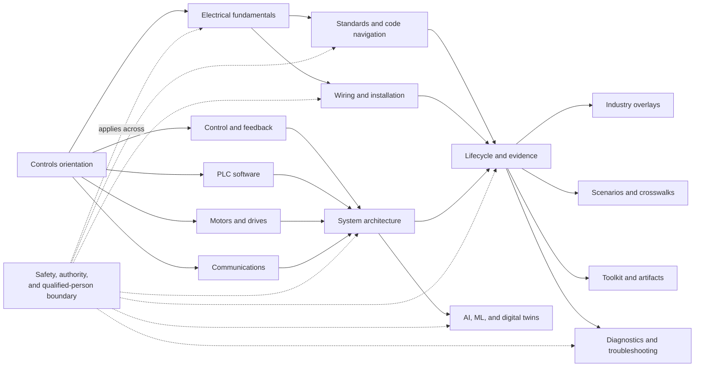

Text alternative: controls orientation branches into electrical, feedback, PLC, motors, and
communications foundations. Those foundations support wiring, standards, and architecture, which
converge in lifecycle evidence. Later application includes industries, scenarios, toolkit artifacts,
troubleshooting, and AI/digital-twin topics. Safety and human authority constrain the route across
levels rather than appearing as a final elective.

## Topic-family recommendations

### Electrical fundamentals

**Start with:** a battery/supply, switch, conductor, and lamp or resistor; identify source, path, and
load before introducing equations.

**Progression:** quantities and units → closed/open paths → series/parallel → voltage/current
measurement idea → resistance and power → Kirchhoff reasoning → equivalent circuits → components →
ampacity and earthing as separate application routes.

**Teach visually:** highlight the closed current path; place voltage arrows across two points and
current arrows through a path; keep schematic and physical layout side by side.

**Likely misconceptions:** voltage is “used up” like a material; current leaves only one terminal;
ground is a universal zero-current sink; a fuse protects every downstream hazard; schematic distance
equals physical distance.

**First mastery evidence:** trace current in a simple circuit, predict what opens/shorts change,
choose the correct measurement relationship, calculate one value with units, and explain why the
answer is reasonable. Any hands-on activity should use an isolated educational low-energy setup
under an appropriate instructor, never a live industrial panel.

### Control theory and PID

**Start with:** maintaining tank level while demand changes. Identify setpoint, measured value,
error, controller decision, actuator, process, and disturbance using words before symbols.

**Progression:** open versus closed loop → feedback and disturbance → response over time → P action →
I action → D action → combined behavior → saturation/anti-windup/noise → tuning and stability →
multi-loop and distributed effects.

**Teach visually:** synchronized process sketch, signal-flow diagram, and time plot. Let the learner
predict the plot before revealing it. Show each PID term on the same disturbance rather than three
unrelated equations.

**Likely misconceptions:** feedback always improves behavior; larger gain always responds better;
integral removes every error without cost; derivative predicts the future; a good simulation proves
field tuning; control logic and a safety function are interchangeable.

**First mastery evidence:** label a loop, explain how a disturbance propagates, predict direction of
controller action, distinguish the three terms qualitatively, and recognize saturation or unstable
behavior. Use simulation or plotted data before any live-loop tuning.

### Motors, starters, VFDs, and servo systems

**Start with:** the mechanical job—move a load with required speed, torque, positioning accuracy,
and duty—before cataloguing motor families.

**Progression:** electrical input to magnetic field to mechanical output → torque/speed/load → DC
and induction foundations → slip/nameplates/losses → starter versus VFD → feedback and servo →
inertia and tuning → selection tradeoffs.

**Teach visually:** energy conversion chain, rotating field animation or sequential diagram, torque-
speed plot linked to an actual load, and separate power/control/feedback paths.

**Likely misconceptions:** horsepower alone selects a motor; VFD output is ordinary sine-wave mains;
slip means mechanical damage; a servo is simply a more accurate motor; encoder feedback makes a
system safe; nameplate current is interchangeable with code-table current.

**First mastery evidence:** match a bounded load case to a motor/control family, explain one rejected
option, read a fictional nameplate, trace power/control/feedback, and identify what still requires
manufacturer and standards verification.

### PLC software

**Start with:** one input, one internal decision, and one output over repeated scans. Show the physical
device, I/O image, logic, and output device as distinct things.

**Progression:** scan cycle and Boolean state → contacts/coils → start/stop seal-in → I/O mapping →
timers/counters/one-shots → program structure → modes/state machines → alarms/scaling → equipment
staging → ISA-88/PackML/ISA-95 context → vendor architecture → safety separation.

**Teach visually:** animate or step through scans; maintain a truth/state table beside the rung; show
normally closed wiring separately from a logical instruction's true/false state.

**Likely misconceptions:** ladder executes like electrical current flowing continuously; a contact
symbol proves the field contact type; two writers to one coil are harmless; a retained value is always
desirable; ordinary PLC logic becomes safety-rated by adding an emergency-stop tag.

**First mastery evidence:** trace three scans, predict output state, explain the seal-in behavior,
separate physical and logical state, find a multiple-writer defect, and express a small sequence as a
state model. Practice should use paper, a simulator, or an isolated training controller; no live
production writes.

### NEC and US panel/machine application

**Start with:** a fictional machine panel question and ask which part of the system, installation,
and jurisdiction is actually being decided.

**Progression:** Code organization and scope → index/headings/definitions → branch circuit versus
feeder → conductors and OCPD roles → disconnecting means → motor workflow → industrial control panel
and SCCR workflow → grounding/bonding → Class 1/Class 2 → working-space navigation → relationship to
NFPA 79 and UL 508A.

**Teach visually:** one-line diagram with colored scope brackets; a route map from question to Article,
table, exception, and AHJ check; worked examples that show why the first search result is insufficient.

**Likely misconceptions:** the newest published edition is automatically locally enforced; NEC,
NFPA 79, and UL 508A are interchangeable; an OCPD protects equipment, conductors, overload, and
personnel in the same way; SCCR is simply the largest breaker rating; a page summary replaces the
licensed text or AHJ.

**First mastery evidence:** classify the circuit part, choose a source route, state the edition/AHJ
question, distinguish protection functions, and list the inputs still needed before calculation.

### Standards families

**Start with:** “What decision are you trying to make?” then show which document family addresses
electrical installation, machine equipment, panel construction, risk reduction, functional safety,
cybersecurity, hazardous location, or industry overlay.

**Progression:** authority/scope/edition → standards family map → one standard's purpose and exclusions
→ clause route → worked applicability case → related-standard relationship → evidence/review status.

**Teach visually:** layered applicability map and decision routes, never a pyramid that implies one
document universally outranks another. Use relationship arrows with direction and rationale.

**Likely misconceptions:** a standard title establishes applicability; two standards discussing the
same topic are equivalent; a crosswalk transfers compliance; `Reviewed` means certified; an
international standard automatically governs every market.

**First mastery evidence:** route a constructed question to likely sources, explain why each may
apply, identify a gap or conflict, and name the responsible confirming authority.

#### Functional safety

Begin with hazard → risk reduction → safety function → required behavior → architecture → verification
and validation. Keep ISO 12100 risk assessment, ISO 13849-1, IEC 62061, IEC 61508, and IEC 61511 in
their actual contexts rather than teaching a single SIL/PL ladder. Use a fictional guard-door or
process-trip example, but do not provide a generic circuit as a validated solution.

The learner should distinguish a safety function from ordinary control, identify input/logic/output,
state the safe behavior and fault response, and explain why component ratings alone do not validate
the function.

#### Cybersecurity

Begin with asset, consequence, trust relationship, and allowed communication—not attack mechanics.
Build from inventory and data flow to zones/conduits, access, least privilege, monitoring, backup,
and lifecycle maintenance. Use defensive constructed diagrams and configuration review.

The learner should trace an allowed data flow, identify an unnecessary trust path, propose a bounded
defensive control, and explain why cybersecurity controls do not replace functional safety.

#### Hazardous areas

Begin with the fire triangle and the decision chain: material release → area classification →
equipment/protection concept → installation → inspection. Clearly separate North American Classes/
Divisions/Zones from IEC zones and avoid casual conversion.

The learner should identify required missing information, recognize the difference between area and
equipment marking, and stop before making an unsupervised classification or equipment approval.

#### Semiconductor and other industry standards

Begin with the industry's system boundary and why generic machinery/electrical guidance needs an
overlay. Separate standard requirements, facility practice, owner criteria, permits, and vendor
instructions. Do not teach an industry page as a universal recipe.

The learner should locate overlay decisions, identify governing stakeholders, and explain which
generic principles remain stable and which require site-specific verification.

### Wiring and installation

**Start with:** an original physical-layout diagram and the question “what energy or information must
travel between these terminals?” Do not start with a finished dense schematic.

**Progression:** identify device/terminal groups → separate power/control/signal/communication/safety
→ source and load → protective and return paths → conductor/cable selection inputs → routing and EMC
→ grounding/shielding → termination → inspection and test → documentation.

**Teach visually:** terminal-to-terminal trace, conductor function, cable/shield boundary, and
physical routing. Pair schematics with enclosure/layout views. Mark vendor-defined terminals as
examples.

**Likely misconceptions:** matching colors proves correct wiring; all commons may be joined; shield
termination has one universal rule; control and safety wiring are interchangeable; a schematic alone
defines cable routing; de-energized appearance proves absence of hazardous energy.

**First mastery evidence:** trace a fictional circuit, identify required source documents, classify
each conductor's function, find a deliberate mismatch, and describe verification steps. Actual panel
work remains for qualified personnel using the employer's safe-work program and device manuals.

### Machine architecture, compliance stack, and software stack

**Start with:** the recurring skid and ask the learner to name what must keep operating, what must
stop safely, what must communicate, and who decides.

**Progression:** physical/process view → control view → safety view → power view → network/data view →
human/authority view → standards and lifecycle overlays.

**Teach visually:** small coordinated views with consistent identifiers rather than one “everything”
diagram. Trace a start command, a sensor failure, an emergency stop, and a network loss across views.

**Likely misconceptions:** the PLC is the entire control system; segmentation is only a network idea;
redundancy automatically gives safety; a compliance stack is a hierarchy of universal authority;
software layers can repair missing physical safety.

**First mastery evidence:** draw a simplified multi-view model, locate interfaces/owners, identify one
single point of failure, and explain the containment path.

### AI, machine learning, and digital twins

**Start with:** a deterministic controller operating the system safely, then add an advisory model
that may be useful, stale, wrong, or unavailable.

**Progression:** purpose and evidence → deterministic law versus fitted model → data/feature path →
advisory output → confidence and operating envelope → synchronization/freshness → fallback → human
review → lifecycle monitoring. Introduce model families only after authority and failure behavior.

**Teach visually:** authority ladder beside data flow; show the independent protection path and the
model-unavailable state. Compare a good prediction with a safe decision—these are not identical.

**Likely misconceptions:** accuracy grants authority; a current digital twin is the physical asset;
more data removes uncertainty; explainability proves correctness; a model can validate itself; an AI
recommendation may participate in a safety function if confidence is high.

**First mastery evidence:** classify a model's allowed role, identify evidence needed, trace stale or
out-of-envelope behavior, name the deterministic fallback, and preserve the zero-authority ceiling
over safety functions.

### Lifecycle

**Start with:** one requirement—such as “prevent pump dry running”—and follow what evidence and
artifacts it creates from concept to maintenance.

**Progression:** concept → standards selection → risk assessment → safety requirements → architecture
→ detailed design/documentation → build → installation → pre-commissioning → commissioning →
maintenance → management of change.

**Teach visually:** each stage as an input/output box, plus one continuous traceability thread. Show
the cost of a missing assumption by carrying it forward to a commissioning failure.

**Likely misconceptions:** lifecycle is a one-way checklist; commissioning is the first real test;
documents are administrative rather than engineering interfaces; a passed FAT covers site
installation; maintenance changes do not reopen design assumptions.

**First mastery evidence:** place an activity/deliverable at the correct stage, identify an entry/exit
gap, trace one requirement across stages, and recognize when management of change is required.

### Industrial communications

**Start with:** two devices exchanging one value. Separate physical medium, signaling/link behavior,
network addressing, transport/session behavior where applicable, and application meaning.

**Progression:** bits/frames and physical media → Ethernet/switching or serial bus → addressing and
topology → one protocol transaction → timing/update behavior → configuration → commissioning →
diagnostics → security/segmentation.

**Teach visually:** layered envelope plus a physical topology; animate one request/response; show
where a switch, router, scanner/client, adapter/server, and device-description file participate.

**Likely misconceptions:** Modbus means RS-485; Ethernet means EtherNet/IP; an IP address identifies
the process variable; a successful ping proves application health; packet capture proves the root
cause; managed switches automatically secure a network.

**First mastery evidence:** classify physical and application layers, trace one transaction, choose a
basic topology, distinguish connectivity from application health, and select the next offline/read-
only diagnostic check.

### Industry overlays

**Start with:** a generic control pattern and show what changes because of the industry's hazards,
process, regulations, owner practices, reliability needs, and stakeholders.

**Progression:** process purpose → material/energy flow → major equipment → control objectives →
abnormal situations → safety/environmental overlay → standards/permits → lifecycle and handoff.

**Teach visually:** a simplified process flow and control architecture with explicit limits. Keep
chemical-process and biological-process language within defensive control and environmental/safety
contexts.

**Likely misconceptions:** an industry example is a reusable design; similar equipment implies the
same risk; owner/site practice is a universal standard; a control narrative authorizes operation;
high-level descriptions settle process-safety details.

**First mastery evidence:** explain the process at a safe systems level, identify control objectives
and abnormal conditions, distinguish generic from site-specific decisions, and route to the required
qualified disciplines and authorities.

### Scenarios, crosswalks, and decision workflows

**Start with:** a constrained fictional decision and a visible list of knowns, unknowns, and intended
output.

**Progression:** context → candidate routes → evidence → relationship/gap reasoning → decision →
limitations → next verification. Offer a “pause and choose” point before showing the worked route.

**Likely misconceptions:** the worked path is universally correct; mapping strength means compliance
equivalence; omitted standards do not apply; a tool's output has authority; the shortest route is the
best route.

**First mastery evidence:** reproduce the route for a near case, revise it when one context variable
changes, and explain what prevents a final compliance conclusion.

### Toolkit calculators, generators, and templates

**Start with:** the engineering decision or handoff artifact, not the command syntax. Show the input,
validation, rule/evidence, structured result, and human review chain.

**Progression:** inspect fictional inputs → predict expected result shape → run explicit demonstration
mode → read citations/assumptions/warnings → introduce a validation failure → supply design-use data
where authorized → compare generated artifacts → perform review/handoff.

**Teach visibly:** SAMPLE/demo state on input, terminal output, downloaded artifact, and package.
Explain each CLI option when it changes engineering meaning. Provide copyable commands plus an
annotated result and a deliberately failing example.

**Likely misconceptions:** successful exit means approved design; SAMPLE is close enough for field
use; a generated document is complete because it looks polished; changing CSV text is equivalent to
changing the governed input; citations prove the local edition applies.

**First mastery evidence:** distinguish design/demo mode, identify provenance and warnings, correct a
fictional input error, explain one generated field's origin, and state the required review before use.

### Troubleshooting

**Start with:** safe state, exact symptom, and last known change. Teach the learner to observe before
resetting or changing configuration.

**Progression:** define expected state → divide system into energy/control/process/communication
paths → form two or three hypotheses → choose a safe discriminating check → interpret → continue or
escalate → document.

**Teach visually:** decision tree plus expected/observed table and measurement boundaries. Use
fictional readings and offline captures. Include “stop here” branches for energized work, defeated
guards, unknown process hazards, or required controller writes.

**Likely misconceptions:** the alarm text names the root cause; replacing parts is diagnosis; a reset
is a test; continuity proves operation under load; the most common cause should be checked first even
when another check is safer or more discriminating.

**First mastery evidence:** state a precise symptom, select the next check with reasoning, revise a
hypothesis from evidence, recognize an unsafe/unauthorized branch, and produce a concise handoff note.

### Manufacturer and vendor reference topics

**Start with:** capability/role categories and the need to verify current official documentation.
Use vendors only as neutral examples of product-family organization or architecture.

**Progression:** engineering requirement → device role → required interfaces/ratings → candidate
family → official publication ID/current manual → compatibility and lifecycle checks.

**Likely misconceptions:** inclusion is endorsement; family position guarantees performance;
cross-vendor role similarity means interchangeability; a current website summary replaces the
manual; a suffix means the same thing across product generations.

**First mastery evidence:** find the official documentation route, identify the revision/publication
ID, compare against explicit requirements, and list unresolved compatibility questions without
ranking brands globally.

## Beginner pathways through the project

The project should offer task routes in addition to section navigation. Recommended initial paths:

### Path 1 — “I have never worked with a control system”

1. What a control system observes, decides, and changes.
2. The recurring pump-and-tank system picture.
3. Electrical source/path/load and safe-work boundary.
4. Sensor → PLC → output → actuator signal flow.
5. Open loop, closed loop, and disturbance.
6. PLC scan and one start/stop sequence.
7. Motor/starter/VFD roles.
8. Physical link versus protocol.
9. Ordinary control versus safety function.
10. Project lifecycle and where standards enter.

Exit task: explain the complete fictional system in plain language, trace one command and one fault,
and identify decisions that require a qualified person.

### Path 2 — “I need to read a control drawing”

Electrical quantities → symbols and reference designations → power versus control circuits → terminal
and wire identities → PLC I/O → motor starter/VFD → grounding/shielding → safety circuits → drawing
cross-references → verification/handoff.

Exit task: trace one fictional device from source through control and field wiring without claiming
that the drawing proves the installation is safe or complete.

### Path 3 — “I need to understand PLC programming”

Digital inputs/outputs → scan cycle → ladder contacts/coils → seal-in example → timers/one-shots → I/O
mapping → program structure → state machines/modes → alarms and analog scaling → equipment staging →
safety boundary → vendor architecture.

Exit task: explain and simulate a small fictional sequence, identify unsafe assumptions, and separate
ordinary logic from a safety function.

### Path 4 — “I need to understand standards”

Authority/scope/edition → standards family map → NEC/NFPA 79/UL 508A relationship or IEC machinery
route → risk assessment → functional safety route → crosswalk limitations → lifecycle evidence →
licensed-source/AHJ handoff.

Exit task: route a constructed question, identify applicable context and gaps, and explain why the
field guide cannot certify compliance.

### Path 5 — “I need to troubleshoot safely”

Hazard/authorization boundary → expected versus observed → energy/control/process/network paths →
measurement concepts → motor-will-not-start tree → analog-signal tree → communication-dropout tree →
offline capture interpretation → escalation and documentation.

Exit task: choose a safe discriminating check in a fictional case and recognize when to stop.

## Learner assessment without false authority

Use assessment to reveal understanding, not reward page completion.

- **Pre-question:** one prediction or route choice before instruction; do not score it as competence.
- **Embedded checks:** label, predict, calculate, trace, compare, or explain after each major model.
- **Worked-example fading:** complete example → missing step → changed-condition problem.
- **Misconception item:** a plausible wrong model with an explanation prompt.
- **Retrieval later:** repeat key questions in later related pages rather than only at page end.
- **Transfer case:** change equipment, market, failure, or lifecycle stage and ask what changes.
- **Confidence plus reason:** ask learners to state confidence and evidence, then compare to feedback.
- **Answer feedback:** explain why the correct route works and why alternatives fail or need more
  context.
- **No competence badge:** use “practice completed” or “self-check,” never certified, qualified,
  approved, or competent.

For higher-risk topics, assessment should include an explicit stop/escalate option. Choosing to stop
when authorization, evidence, or safe conditions are absent is a correct engineering outcome.

## Learning accessibility and delivery

- Provide the purpose, prerequisite route, and expected time/effort near the start.
- Combine text with original diagrams, tables, and interactive practice, while preserving equivalent
  static and text alternatives.
- Do not encode normal/fault, safe/unsafe, or power/control distinctions through color alone.
- Support keyboard, screen reader, zoom/reflow, print, and no-JavaScript study paths.
- Caption narrated media and provide transcripts if media are later introduced; do not make video the
  only explanation.
- Let learners choose representation where the learning goal permits: written explanation, labeled
  diagram, trace table, or bounded calculation.
- Keep vocabulary technically accurate and readable; define unavoidable terms rather than replacing
  them with imprecise “easy” words.
- Use fictional names, RFC1918 addresses, synthetic traces, and original diagrams throughout.
- Make downloads usable as learning worksheets, with solution/rationale kept separate so retrieval is
  possible.

## Learning-content quality gate

A page should not receive a beginner-ready designation merely because it has a “Simple explanation”
heading. A beginner-ready page should demonstrate:

- declared prerequisite concepts and a route to acquire them;
- observable learning outcomes;
- an early safety/authority boundary proportional to the topic;
- one concrete system context and one accurate formal representation;
- one complete worked explanation and one learner action;
- one misconception with causal correction;
- retrieval questions with reasoned feedback;
- a field handoff and honest limit of learning;
- accessible representations and no required third-party runtime for core meaning;
- canonical evidence and `Review pending` status until owner review.

The project should track three independent states: technical review, learner-readiness review, and
accessibility validation. A technically reviewed page can still be poor instruction; a clear lesson
can still contain unreviewed technical claims; and neither state proves accessibility.

## Learning metrics to derive

- Pages by learner stage and declared prerequisite coverage.
- Beginner-route steps with missing or circular prerequisites.
- Pages with observable outcomes, worked examples, guided practice, misconception checks, retrieval
  feedback, safety handoff, and next-route links.
- Technical-review, learner-readiness, and accessibility states without conflation.
- Worked examples whose inputs/results are verified by `cst` where applicable.
- Topic families with at least one complete novice path and one transfer case.
- Learner self-check error patterns collected only with the approved privacy posture; do not collect
  behavioral analytics by default.
- Manual validation sessions showing whether new learners can explain, predict, choose, and stop—not
  merely find or reread text.

## Current contradictions and risks

### P0 — The homepage bypasses the trust and privacy behavior used elsewhere

The homepage declares `review_exempt` as a navigation hub even though it directly states standards
selection, legal-baseline, and safety-architecture claims and displays a `Reviewed` badge. This does
not satisfy the documented exemption rule for pages with no technical claims. Its separate layout
also configures analytics without the `allow_google_signals: false` and
`allow_ad_personalization_signals: false` settings present in the default layout.

Required direction: treat the homepage as a governed routing page with honest review metadata, or
move every technical claim into governed child data and render only derived summaries. Put analytics
configuration in one shared module so layout choice cannot change privacy behavior.

### P0 — Corpus status policy is not enforced semantically

Governance allows corpus `STATUS` values of `DRAFT`, `COMPLETE`, or `PROMOTED`, but the release gate
checks only whether the field exists. At least one canonical file currently declares `AUTHORED` and
still passes the full gate.

Required direction: parse corpus metadata once, validate allowed values and required nonempty fields,
and have all validators and generators consume that same parsed record. This is a concrete example of
why metadata shape alone is not a sufficient trust check.

The same shallow-validation problem appears inside evidence content. The canonical IEC 60204-1
Clause 18 note contains unresolved numeric blanks such as ranges and test values with units but no
numbers, yet the corpus quality validator passes. Its patterns recognize some drafting artifacts but
not semantically empty statements after Markdown and units are normalized.

Required direction: validate meaning-bearing fields and known placeholder shapes, not just headers.
Add a bounded evidence-quality rule for empty numeric claims, unfinished alternatives, and firm
normative wording without a resolvable source route. A finding should block promotion and curated
claim generation while leaving the draft visible as a gap for research.

### P0 — Edition compatibility is not enforced at the calculation seam

`cst.common.tables` accepts provenance fields, but calculators independently apply embedded rules
from NEC 2023. A differently dated user table can therefore be combined with 2023 constants. The
motor implementation also loads the `430.250` dataset for both phase modes while labeling a
single-phase result as Table 430.248.

Required direction: deepen the standards-rule module so a table, edition, and compatible rule set
are selected and validated together. Reject unsupported combinations and preserve exact source
provenance.

### P0 — SAMPLE data are the default behavior

Governance defines `allow_sample=False` as design-use mode, but the table-backed calculation
interfaces default to `allow_sample=True`, and the CLI does not expose a design/demo choice. A
plausible SAMPLE result is therefore easier to obtain than a fail-closed design-use result.

Required direction: make design-use behavior the default at public interfaces and require explicit
demo/sample opt-in. Keep SAMPLE fixtures convenient for examples and tests, but never let convenience
set the safety posture of the shipped interface.

### P0 — Visible review claims can disagree with governed metadata

The repository has 232 `Review pending` governed reader pages, two `Reviewed` pages, one
`Needs revalidation` page, and 68 hand-authored `badge--reviewed` occurrences in reader-facing source.
Those badges may refer to corpus coverage rather than page review, but the visual language does not
reliably communicate the distinction.

Required direction: derive badges and aggregate status summaries from governed records. Finish the
badge-honesty audit before expanding content breadth. IEC 62061 remains parked until the consolidated
edition is available for owner review.

### P1 — Generated-artifact enforcement is incomplete

The release gate protects the RAG mirror and AI register, but it does not universally check generated
site templates, `rag_tree.json`, or `STRUCTURE_SUMMARY.md`. Manual regeneration instructions are not
equivalent to freshness enforcement.

Required direction: give every generator a deterministic check mode and register it with the release
gate.

### P1 — Engineering artifacts lose structure and provenance

Several generators return raw dictionaries or rendered strings. Wire-schedule and nameplate
implementations define citations that do not travel with their returned artifacts. `CalcResult` also
allows an empty citation list even though governance says a calculation without provenance does not
ship.

Required direction: deepen the engineering-artifact module so typed content, citations, assumptions,
warnings, and render adapters remain together until publication.

The I/O pipeline also loses engineering semantics before rendering. Wire schedules and BOM
descriptions select 24 VDC defaults from `io_type` while ignoring a point's declared `signal`; a
discrete point declared `120VAC` can therefore receive 24 VDC descriptions and conductor defaults.
Distinct tags such as `A/B` and `A_B` pass domain validation but normalize to the same loop-sheet
filename in the CLI, allowing one output to overwrite the other. A header-only I/O list can produce
plausible empty deliverables, and generated download policy differs from design-package defaults
without a manifest explaining why.

Required direction: preserve signal class, source-row identity, explicit-versus-inferred fields,
input revision/checksum, generation policy, and collision-safe output identity in the structured
artifact. Validate deliverable-level invariants before any file write and generate a package manifest
that proves all outputs came from the same input and policy state.

### P1 — Site interaction behavior is not tested at its user seam

The release gate proves static build and link integrity, but not keyboard behavior, focus restoration,
screen-reader state, mobile navigation, search interaction, or CDN/no-JavaScript fallbacks. The main
JavaScript and stylesheet are large shared change surfaces, and repeated local-sidebar implementations
reduce locality.

Required direction: deepen interaction modules around navigation, search, diagram viewing, and
filtering; consolidate repeated navigation rendering; add a focused browser/accessibility gate.

### P2 — Project memory obscures current behavior

`project_state/project_state.md` mixes the current handoff with extensive completed-phase history,
and volatile counts already drift between the README, runbook, and verified release output. There is
no compact domain `CONTEXT.md` or ADR collection, so load-bearing decisions are difficult for a future
maintainer or agent to locate.

Required direction: keep a small current-state interface, move closed narratives to dated history,
derive volatile metrics, and record durable decisions separately.

## Recommended deepening sequence

### Phase A — Truth and failure behavior

1. Unify analytics configuration so every layout honors the same privacy settings.
2. Correct the homepage review exemption or remove its direct technical claims.
3. Enforce the corpus metadata vocabulary and nonempty required values.
4. Make SAMPLE use explicit and design-use failure the public default.
5. Bind table editions to compatible rule implementations.
6. Require provenance on standards-derived calculation and engineering artifacts.
7. Derive visible review status from governed records and complete the badge-honesty audit.
8. Preserve the IEC 62061 `Needs revalidation` state until owner review against the consolidated
   source is possible.

### Phase B — One correlation record, multiple views

1. Create one canonical mapping dataset governed by the corpus evidence.
2. Replace ordinal equivalence labels with directional relationship types plus rationale.
3. Render the pairwise crosswalk, comparison tool, graph, and context links from that dataset.
4. Build a topic-first index: emergency stop, disconnecting means, SCCR, grounding/bonding,
   conductor sizing, enclosure ratings, verification/testing, and other evidenced topics.
5. Extend the glossary as a terminology bridge using concept-specific designations.

### Phase C — Reproducible publication

1. Add deterministic freshness checks for every committed generated artifact.
2. Consolidate corpus discovery and metadata parsing into one governance module.
3. Make publication adapters consume canonical records instead of duplicating facts.
4. Add built-wheel installation tests at Python 3.12 and 3.13.

### Phase D — Accessible field behavior

1. Consolidate navigation, search, diagram, and filter interaction modules.
2. Preserve useful fallbacks when JavaScript or external assets fail.
3. Add browser checks for keyboard flow, focus, status announcements, 320 px reflow, 200% zoom,
   reduced motion, print, dark mode, and no-JavaScript use.

### Phase E — Durable project memory

1. Reduce `project_state.md` to current phase, decisions, blockers, validation baseline, and next
   actions.
2. Move completed phase narratives to dated history.
3. Create a compact domain glossary and ADR collection lazily as decisions are accepted.
4. Apply the deletion test to dead entry points, stale migration tooling, duplicate assets, and
   shallow pass-through modules.

### Phase F — Novice learning paths

1. Declare learner stages, prerequisite concepts, and independent technical/learner/accessibility
   review states without changing the top-level taxonomy.
2. Create the recurring fictional pump-and-tank teaching system with original layered diagrams and
   text alternatives.
3. Convert one tracer path—electrical source/path/load → PLC scan → motor command → feedback → safety
   boundary—using the universal lesson spine.
4. Add worked-example fading, misconception checks, retrieval feedback, transfer cases, and explicit
   stop/escalate outcomes.
5. Validate the tracer path with true novices and instructors/qualified practitioners before
   applying the pattern to every topic family.

## Next-phase readiness package

The research is sufficiently developed to begin implementation once the owner accepts the behavior
contract and resolves the small set of decisions below. Work should proceed as narrow, independently
reviewable slices. Each slice begins on its own branch, updates `project_state/`, and runs the
verification matrix required by governance. No slice may mark its own content `Reviewed`.

### Dependency order

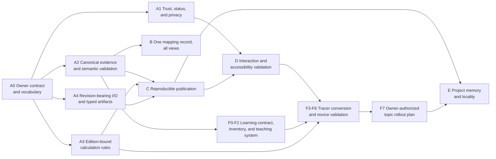

Text alternative: owner vocabulary decisions unlock four truth/safety foundations. Canonical evidence
feeds mapping and publication; edition-bound rules and typed artifacts also feed publication. Stable
trust/publication behavior feeds interaction validation. Learning-contract, inventory, and teaching-
system work can begin from canonical evidence, while tracer conversion waits for accessible patterns
and stable demonstration-mode behavior. Only validated tracer evidence unlocks the rollout plan;
memory cleanup records the stabilized decisions.

The sequence is not purely serial. A1 can run independently. A2, A3, and A4 can be developed in
parallel only if they share the accepted product-level provenance vocabulary. B must wait for A2's
canonical evidence and relationship ownership decision. C should follow the first stable generators
from A2/A4. D should test stable behavior rather than a moving interaction contract. E can start with
derived metrics, but historical restructuring should wait until active implementation phases have
settled. F can inventory prerequisites and draft original teaching models early, but learner-ready
conversion should use A2 evidence identity and D's accessible interaction patterns.

### Phase-entry baseline

Before the first implementation branch, capture one reproducible baseline in the change log:

- full release gate result and test/doctest/page/link/corpus counts;
- governed reader-page status counts and body-level status-badge counts;
- corpus metadata values outside the allowed vocabulary;
- committed generators and generated outputs, with current freshness coverage;
- table-backed public interfaces and their current sample/design defaults;
- calculation and artifact implementations that can return without structured provenance;
- browser-critical interactions and current automated coverage;
- current wheel contents and supported Python versions.

Counts should be produced by a script or release output, not copied into several documents. The
baseline is evidence for change assessment, not a ratchet that prevents intentional deletion or
consolidation.

### Common definition of done for every slice

A slice is complete only when all applicable items below are true:

1. The change has one named behavioral outcome and does not broaden authority.
2. Canonical ownership is explicit; no second fact store is introduced accidentally.
3. Failure, unsupported, stale, and conflict paths are tested alongside the happy path.
4. Provenance, edition, review state, assumptions, warnings, and generation policy are preserved or
   the slice documents why a field does not apply.
5. Existing public behavior changes are documented with a migration or clear release note.
6. Generated artifacts have deterministic check behavior before being committed.
7. Source-tree tests and installed-wheel behavior agree where packaging is relevant.
8. Site changes build at the configured base URL and preserve core no-JavaScript use.
9. Accessibility and privacy are checked at the actual user interface affected by the slice.
10. `project_state/project_state.md` records current state and next action; `change_log.md` records
    evidence and owner decisions.
11. The full governed release gate passes, or the slice remains incomplete with the exact known
    failure recorded.
12. Human review state remains honest: agent-authored content is `Review pending`.

### A0 — Owner contract and vocabulary gate

**Purpose.** Prevent implementation modules from inventing incompatible meanings for review,
evidence, mappings, modes, and provenance.

**Owner decisions required.**

- Accept or amend the evidence-backed, safety-constrained decision-support contract.
- Choose canonical ownership for mapping records; corpus ownership is recommended.
- Separate page review, evidence-record review, mapping review, and artifact issue/release state.
- Approve directional mapping vocabulary and required semantic/functional rationale.
- Approve design mode as the default and explicit demonstration mode as the only SAMPLE path.
- Approve WCAG 2.2 AA as the interaction target, with documented exceptions if any.

**Prepared output.** Record accepted decisions in governance and, when durable alternatives or
tradeoffs exist, short ADRs. Update this planning document to point to those authoritative records
rather than duplicating their text.

**Gate.** No production code changes. Governance links resolve; status/mode/relationship vocabulary
is internally consistent; owner approval is recorded. If the contract is not accepted, stop and
revise the remaining phase packets before implementation.

### A1 — Trust-surface and privacy correction

**Purpose.** Make visible trust and analytics behavior agree with governed metadata on every layout.

**Primary change surfaces.** `docs/index.md`, `docs/_layouts/home.html`,
`docs/_layouts/default.html`, shared includes/configuration, body-level status badges, and semantic
site validation in `tools/release_check.py`.

**Recommended slices.**

1. Move analytics configuration into one shared implementation and test both layouts against the
   owner-approved access-logging policy.
2. Reclassify the homepage as a governed technical routing page or remove its independent technical
   assertions; render its status through the standard review adapter.
3. Inventory body-level `Reviewed` badges, classify whether each refers to page, evidence coverage,
   or source review, and replace ambiguous badges with derived, explicitly scoped labels.
4. Add semantic checks for review exemptions, nonempty review fields, valid dates, and impossible
   combinations.

**Tests prepared.** Layout rendering assertions; analytics-config equality; exemption page with a
technical-claim fixture; page/body badge contradiction fixtures; positive routing-only exemption;
base-URL build and link checks.

**Exit evidence.** No layout can broaden analytics collection; homepage trust state is honest; zero
ambiguous positive badges; every exemption is demonstrably nontechnical; full gate green.

**Stop condition.** If badge scope cannot be determined from canonical records, use a neutral
`Review pending` or coverage label and create an owner-review queue. Do not infer `Reviewed`.

### A2 — Canonical evidence and semantic corpus validation

**Purpose.** Replace repeated path scanning and header-presence checks with one deep evidence module
used by validators, mirror generation, the RAG tree, and future site projections.

**Primary change surfaces.** Corpus discovery/metadata logic in `tools/release_check.py`,
`validate_corpus_quality.py`, `validate_ai_boundaries.py`, `generate_rag_tree.py`,
`generate_standards_overview.py`, and related tests. The first repair target is the IEC 60204-1
Clause 18 record with empty numeric placeholders; correction of the technical values remains source-
and owner-review dependent.

**Recommended slices.**

1. Extract root-safe corpus discovery, trust-tier exclusion, metadata parsing, stable identity, and
   structured findings into one module. Use `__file__`-derived roots.
2. Enforce allowed metadata values, nonempty fields, duplicate identities, edition form, and
   explicit forbidden-path exclusion.
3. Add semantic draft-artifact checks: empty numeric statements after formatting normalization,
   unfinished alternatives, placeholder units, and other precisely evidenced patterns. Keep rules
   narrow to avoid claiming technical validation through text linting.
4. Give mirror and RAG-tree generation deterministic expected-output/check modes.
5. Add an evidence-source route from curated pages to a stable record rather than a directory-only
   `repo_path`; keep claim-level linkage incremental and owner-reviewed.

**Tests prepared.** Valid/invalid status enum; blank required value; duplicate ID; cwd-independent
execution; excluded forbidden fixture; numeric blank variants; false-positive prose fixtures; stale
mirror; stale tree; curated source ID resolution; draft evidence prevented from acquiring a stronger
derived state.

**Exit evidence.** All corpus consumers enumerate the same allowed file set; `AUTHORED` fails;
semantic placeholders are reported; mirror and tree drift fail deterministically; every newly linked
curated claim resolves to a stable evidence record.

**Stop condition.** A validator may flag but must not rewrite technical prose automatically. When a
finding requires a licensed body or owner interpretation, leave it `DRAFT`/`Review pending` and open
the review task.

### A3 — Safe-by-default, edition-bound calculation rules

**Purpose.** Make design-use success require compatible evidence and make demonstration behavior an
explicit, persistent state.

**Primary change surfaces.** `src/cst/common/tables.py`, `src/cst/common/cite.py`,
`src/cst/calc/ampacity.py`, `src/cst/calc/motor_branch.py`, CLI parser/dispatch, table schemas and
fixtures, design-package calculation adapter, packaging tests, and user documentation.

**Recommended slices.**

1. Add semantic table validation for standard, edition, table identity, schema constraints, and
   supported loader purpose; preserve structured table provenance.
2. Bind the supported edition, table identities, constants/formulas, and citation set in one deep
   rule implementation. Reject unsupported combinations.
3. Separate single-phase Table 430.248 from three-phase Table 430.250 behavior and test exact
   provenance.
4. Change public Python and CLI defaults to design mode; require an explicit demonstration option
   for bundled SAMPLE data. Treat this as a documented compatibility change.
5. Make provenance mandatory for standards-derived results and preserve structured calculation
   activity through design-package assembly.
6. Test the built wheel on Python 3.12 and 3.13 with a user-supplied table path.

**Tests prepared.** Wrong standard; wrong table ID; unsupported edition; compatible and incompatible
rule/table pairs; absent licensed table in design mode; explicit sample success; sample state in every
adapter; phase-specific motor table; zero-citation rejection; input/rule/table provenance round trip;
installed-wheel CLI.

**Exit evidence.** The easiest successful public path is safe design mode; SAMPLE cannot appear
without explicit opt-in and persistent warning; table/rule/edition mismatch cannot calculate;
single-phase provenance is correct; every standards-derived result has structured evidence.

**Stop condition.** Do not add guessed compatibility for unreviewed editions. Supporting a new
edition requires a reviewed rule implementation and tests, not a broader accepted-version range.

### A4 — Revision-bearing I/O and typed engineering artifacts

**Purpose.** Ensure “one I/O list drives everything” remains true across files, time, policies, and
handoffs rather than only within one Python process.

**Primary change surfaces.** `src/cst/panel/io_list.py`, BOM, wire-schedule and nameplate
implementations, PLC address maps, loop sheets, FAT/SAT, design-package assembly, CLI file writers,
site-template generation, sample data, and artifact tests.

**Recommended slices.**

1. Preserve source document identity/revision/checksum, original row identity, unknown columns, and
   explicit-versus-inferred fields through I/O parsing and validation.
2. Validate signal class independently of `io_type`; remove 24 VDC assumptions for declared
   non-24-V points and report inferred defaults.
3. Introduce structured artifact content with common provenance, citations, assumptions, warnings,
   generation policy, issue state, and source identity. Keep CSV/Markdown/text rendering outermost.
4. Validate nonempty deliverables and normalized output identities before writes. Reject filename
   collisions such as `A/B` versus `A_B`; make multi-file generation atomic.
5. Make all design-package sections consume artifacts and emit a manifest containing input identity,
   toolkit version, policies, included outputs, and derivation relationships.
6. Regenerate site downloads through the same adapters and add deterministic freshness checks.

**Tests prepared.** Mixed signal classes; explicit 120 VAC discrete point; inferred-default report;
unknown-column report; source-row preservation; header-only deliverable rejection; normalized filename
collision; no partial directory on failure; citations through every renderer; same input/policy gives
same output; different policy is visible; package-manifest consistency; committed-download freshness.

**Exit evidence.** Every artifact identifies its input revision and generation policy; signal
semantics survive; no filename overwrite is possible; citations reach CSV/Markdown/package outputs;
site downloads are reproducible and checked.

**Stop condition.** Do not force every artifact into one oversized type. Share the evidence envelope
and invariant vocabulary while allowing domain-specific structured content behind small interfaces.

### B — One mapping record, all correlation views

**Purpose.** Make standards correlation a governed evidence projection instead of five editorially
independent surfaces.

**Entry dependency.** A0 relationship vocabulary accepted and A2 canonical evidence identity stable.

**Primary change surfaces.** Corpus overlap notes, crosswalk Markdown/data, Standards Finder topic
routes, comparison tool, standards graph, glossary relationships, context panels, generators, and
tests.

**Recommended slices.**

1. Define a minimal corpus-owned mapping record for source/target edition, topic/scope, direction,
   relationship type, semantic/functional rationale, evidence routes, author/reviewer, and state.
2. Migrate one tracer topic—emergency stop or disconnecting means—across at least three standards.
3. Generate a small pairwise crosswalk, comparison view, graph edges, glossary/context routes, and
   gap list from the tracer records.
4. Validate projection agreement, reverse-direction behavior, missing relationships, and review
   state with tests and owner review.
5. Expand topic by topic in risk order; do not bulk-migrate unsupported informal ratings.

**Exit evidence.** One mapping edit changes every intended view; direction and gaps are visible;
there is no `High/Medium/Very High` equivalence scale; no mapping claims compliance transfer; each
row resolves to evidence and rationale.

**Stop condition.** If evidence supports related topics but not a relationship type, publish the two
source routes and an explicit gap. Never choose `equal` to complete a matrix.

### C — Reproducible publication and package delivery

**Purpose.** Make every committed projection and shipped package reproducible from declared sources.

**Entry dependency.** At least one A2 generator and the A4 artifact generator expose deterministic
expected output.

**Recommended slices.**

1. Establish a small generator protocol around expected outputs and check diagnostics; adapt one
   existing generator first rather than building a framework speculatively.
2. Register site templates, twin schema/payload, RAG tree, standards overview, and
   `STRUCTURE_SUMMARY.md` as each becomes deterministic.
3. Verify source-tree and built-wheel resource parity, clean-checkout generation, base-URL variants,
   and absence of undeclared volatile bytes.
4. Emit a derived generation manifest for observability without making it a second source of truth.

**Exit evidence.** Editing a generator without regenerating its committed outputs fails the full
gate with exact paths; a clean checkout reproduces the committed bytes; built artifacts contain the
tested schemas and samples.

### D — Interaction, accessibility, and failure-mode validation

**Purpose.** Verify that the product's meaning and core workflows survive actual interaction modes
and dependency failure.

**Entry dependency.** Trust/status rendering and the principal navigation/search/diagram behaviors
are stable enough to test.

**Recommended slices.**

1. Normalize navigation rendering and state semantics, including mobile `aria-expanded` and target
   relationships.
2. Deepen search around one explicit combobox contract with visible loading, empty, error, and
   dependency-failure states.
3. Deepen diagram/lightbox behavior with keyboard-operable triggers, focus move/trap/restore,
   escape behavior, and reduced-motion handling.
4. Load third-party assets only where needed, pin versions, and provide core fallbacks.
5. Add a small browser matrix for desktop/mobile keyboard paths, focus/status semantics, 320 px
   reflow, 200% zoom, print, dark mode, reduced motion, no JavaScript, and failed external assets.
6. Record a manual screen-reader/device matrix and evidence cadence.

**Exit evidence.** Core routes and trust information remain available without JavaScript; silent
search failure is impossible; mobile navigation and dialog state are programmatic; browser checks
join the full gate; manual validation findings are recorded.

**Stop condition.** Automated accessibility tooling is evidence, not a conformance declaration.
Unverified manual paths remain explicitly pending.

### F — Novice learner pathways and lesson conversion

**Purpose.** Give a learner with no controls experience a coherent path from observable systems to
bounded engineering reasoning without implying qualification.

**Entry dependency.** A0 accepts the learner-state vocabulary; A2 supplies stable evidence routes;
D supplies accessible interaction patterns. A read-only content inventory and prerequisite map can
begin earlier.

**Primary change surfaces.** Fundamentals modules, section landing pages, topic frontmatter or
derived lesson data, recurring original diagrams, worked scenarios, self-check patterns, printable
worksheets, navigation routes, and learner-readiness validation tooling.

**Recommended slices.**

1. Inventory every technical page by content type, learner stage, prerequisites, current worked
   example/practice/misconception/feedback coverage, and safety boundary. Derive the inventory rather
   than manually copying page counts.
2. Accept a small learner metadata vocabulary and keep technical review, learner readiness, and
   accessibility validation as separate states.
3. Produce the original recurring pump-and-tank system in layered physical, power, control, network,
   and safety views with consistent identifiers and text alternatives.
4. Build the tracer path across electrical fundamentals, PLC scan/ladder, motor command, feedback
   control, and safety-function boundary. Use the universal lesson spine and fictional low-risk
   practice.
5. Add a reusable self-check pattern with prediction, worked-example fading, misconception feedback,
   delayed retrieval links, transfer cases, and a correct stop/escalate outcome.
6. Run moderated validation with learners who lack controls experience. Separately review technical
   accuracy with qualified practitioners and accessibility with representative users/tools.
7. Revise the lesson contract from observed confusion before expanding by topic family in risk and
   prerequisite order.

**Prepared tests and review evidence.** Prerequisite links resolve and contain no cycles in the
beginner path; learning outcomes use observable actions; constructed examples are labeled; worked
numeric results are verified; answers include reasoning; safety-critical pages contain stop/handoff
language; diagrams have equivalent text; core practice works without JavaScript; technical,
learner-readiness, and accessibility states cannot overwrite one another. Human sessions test whether
learners can explain, predict, choose, transfer, and stop.

**Recommended conversion order.**

1. Orientation page and recurring-system overview.
2. Electrical source/path/load and control-system signal flow.
3. PLC scan plus start/stop sequence.
4. Motor/starter/VFD roles.
5. Feedback/PID intuition.
6. Communications layer separation.
7. Ordinary control versus safety function.
8. Standards routing and lifecycle.
9. Toolkit demonstration-mode workflow.
10. Diagnostics, wiring, industry overlays, and advanced architecture after prerequisites work.

**Exit evidence.** A true novice can follow one continuous route, accurately explain the fictional
system, predict a simple state change, trace a command and fault, use an explicit demonstration tool,
distinguish ordinary control from safety, identify missing evidence, and choose to stop/escalate when
appropriate. No completion state resembles certification or field authorization.

**Stop condition.** Do not scale the template across hundreds of pages until novice validation shows
that the tracer path improves explanation and transfer. Do not simplify away editions, authority,
failure behavior, or engineering distinctions to achieve a lower reading level.

#### Phase F implementation dossier

This dossier prepares the learner phase for execution without authorizing the content rollout. All
proposed metadata, readiness terms, and reusable includes require the A0 owner/governance decision
before they become site contracts.

##### Current baseline

The seven main content sections currently contain 242 `index.md` pages:

| Section | Pages |
|---|---:|
| Fundamentals | 66 |
| Standards | 20 |
| Design | 37 |
| Lifecycle | 25 |
| Communications | 22 |
| Industries | 34 |
| Tools | 38 |

A case-insensitive keyword scan of page source found the following directional baseline:

| Learner feature | Pages with a matching phrase |
|---|---:|
| Learning outcome, “what you will learn,” or prerequisite | 7 |
| Worked example or constructed teaching example | 24 |
| Guided practice, “try it,” or practice problem | 0 |
| Misconception or explicit wrong-model explanation | 1 |
| Knowledge check, self-check, check-your-understanding, or quiz | 0 |
| Common-mistake language | 52 |
| Safety/qualified-person/LOTO language | 178 |
| Related-page or next-route language | 66 |

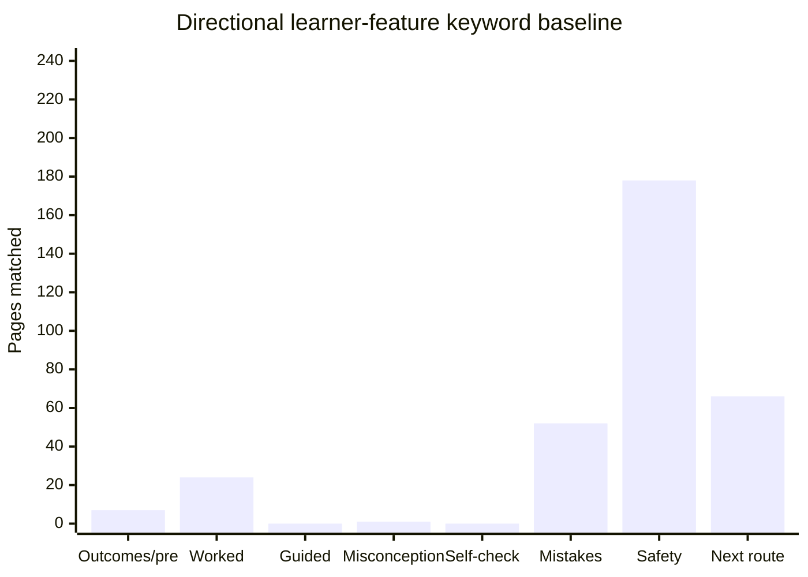

Text alternative: among 242 section pages, the keyword scan matched 7 for outcomes/prerequisites, 24
for worked examples, none for guided practice, 1 for misconceptions, none for knowledge/self-checks,
52 for common mistakes, 178 for safety/qualification language, and 66 for related or next routes. The
table above provides the exact values.

These counts do not measure instructional quality. A page may teach well without the scanned phrase,
and a heading may exist without meaningful instruction. They show that the repository already has
stronger safety and mistake coverage than active practice, learner feedback, and prerequisite
routing. Phase F0 should replace the keyword scan with a structured inventory before setting any
ratchet.

##### Scope and non-goals

**In scope:** learning routes inside the existing taxonomy, structured prerequisite/outcome data,
original teaching diagrams, constructed examples, practice and feedback blocks, printable/offline
worksheets, accessibility behavior, evidence links, learner validation, and derived coverage checks.

**Not in scope:** a new top-level “Courses” taxonomy, learning-management accounts, behavioral
tracking by default, completion certificates, field qualification, copied training content, vendor
screenshots, real captures or customer examples, live-controller exercises, energized-work
instruction, or browser-side copies of `cst` calculators.

##### Proposed lesson metadata contract

The minimal proposed page data are shown below for design discussion. The exact names are not
authoritative until governance accepts them:

```yaml
learning:
  stage: "Foundation"            # one of the five accepted learner stages
  content_type: "concept"        # concept, calculation, procedure, standard,
                                  # diagnostic, comparison, lifecycle, architecture
  estimated_effort: "20–30 min"  # optional orientation, never a performance promise
  outcomes:
    - "Trace current through a simple closed circuit."
    - "Predict what changes when the path opens."
  prerequisites:
    - label: "No controls experience required"
    - label: "Units and quantities"
      url: "/fundamentals/electrical/electrical-quantities/"
  practice_mode: "fictional/offline"
  next:
    review: "/fundamentals/electrical/electrical-quantities/"
    continue: "/fundamentals/electrical/series-parallel-dividers/"
    apply: "/tools/scenarios/<accepted-recurring-scenario>/"

learning_review:
  status: "Review pending"       # existing five-term vocabulary
  coverage: "Lesson structure drafted; novice validation not yet performed."
  last_reviewed: "July 2026"
```

Rules for the eventual contract:

- `review:` remains technical-source review; `learning_review:` describes instructional review.
- Both use the governed five-term site vocabulary unless governance explicitly adopts another
  vocabulary. Their labels must be visually distinct.
- Accessibility evidence is recorded separately; it cannot be inferred from either review block.
- Prerequisite labels without URLs mean genuinely assumed general knowledge, not a missing page.
- Every URL prerequisite resolves and sits at the same or earlier learner stage unless an explicit
  “reference while learning” relationship is used.
- Outcomes contain observable learner actions, not “understand,” “know,” or “be familiar with.”
- `practice_mode` is one of conceptual, fictional/offline, supervised-training, or
  qualified-field-work. A static page must not present the last two as activities the learner can
  independently complete.
- Effort estimates describe expected reading/practice scope only and should disappear if validation
  shows they mislead learners.

##### Prerequisite graph rules

The prerequisite graph should be a derived view, not a second navigation taxonomy.

1. The beginner route has one explicit entry node requiring no controls experience.
2. Required prerequisite edges form a directed acyclic graph.
3. A page may have several valid incoming paths; learners should not be forced through irrelevant
   domain material.
4. Cross-domain prerequisites identify the smallest needed concept, not an entire section.
5. “Review” links may point backward; “continue” links normally move one conceptual step; “apply”
   links may move to a scenario or tool.
6. A later page retrieves earlier knowledge in context rather than only linking back.
7. Missing prerequisite content becomes `Planned`; it is not silently embedded as a long sidebar.
8. Standards, wiring, safety, and diagnostics routes must not be reachable as implied independent
   field practice solely because conceptual prerequisites are complete.

Prepared graph checks:

- all internal URLs resolve under the configured base URL;
- every declared stage and content type is allowed;
- no required-prerequisite cycle exists;
- every learner page is reachable from at least one declared route or is explicitly reference-only;
- every beginner path ends in a bounded outcome and next route rather than a dead end;
- no redirect or navigation parent is accidentally treated as instruction;
- technical, learner, and accessibility states remain distinct in generated indexes.

##### Reusable learner-facing blocks

Create these only after the tracer content proves that reuse is real:

| Block | Purpose | Required behavior |
|---|---|---|
| Lesson orientation | Outcomes, effort, stage, prerequisites | Visible early; plain text and print-safe |
| Safety/authority boundary | What may be observed/practiced and where to stop | Cannot collapse by default or disappear in print |
| System view | Diagram plus explanatory text | Original asset, consistent identifiers, full text alternative |
| Worked reasoning | Knowns → decision → result → check → limits | Provenance and SAMPLE/constructed state adjacent |
| Guided practice | Partially completed near example | Usable without JavaScript; prompts do not reveal all answers |
| Misconception check | Plausible wrong model and causal correction | Explains why it seems plausible and what evidence contradicts it |
| Retrieval check | Three to five unprompted questions | Reasoned feedback; accessible disclosure or separate answer section |
| Transfer case | One important changed condition | Requires a new choice; identifies what should and should not change |
| Field handoff | Documents, measurements, person/authority, unresolved items | Never implies completion or qualification |
| Next route | Review, continue, and apply options | Derived from accepted lesson data; URLs validated |

Avoid one large include with dozens of parameters. Favor small blocks around stable meanings and keep
lesson prose in Markdown. The blocks should improve consistency without forcing control theory,
wiring, standards, and troubleshooting into identical visual narratives.

##### Exact tracer path

Use existing pages first so the phase tests conversion rather than taxonomy expansion:

| Order | Page | Prepared learner outcome | Main conversion gap |
|---:|---|---|---|
| 1 | `docs/fundamentals/index.md` | Explain observe → decide → act → verify at system level | Needs novice route and recurring-system orientation |
| 2 | `docs/fundamentals/electrical/electrical-quantities/index.md` | Identify voltage, current, resistance, and power in the fictional system | Short reference prose; needs physical model and learner action |
| 3 | `docs/fundamentals/control/control-theory-overview/index.md` | Label input, output, setpoint, feedback, and disturbance | Needs concrete recurring-system bridge and prediction |
| 4 | `docs/fundamentals/plc-software/ladder-logic/index.md` | Trace three PLC scans and a start/stop state | Deep content; needs prerequisite gate, fading, and retrieval |
| 5 | `docs/fundamentals/motors/induction-motor-basics/index.md` | Explain why the motor turns and connect it to the pump load | Needs worked observation and transfer beyond definitions |
| 6 | `docs/fundamentals/control/interlocks-permissives-safety-trips/index.md` | Separate ordinary interlock/permissive/trip from a safety function | High-risk distinction; needs explicit stop/authority outcome |
| 7 | `docs/communications/ethernet-fundamentals/index.md` | Separate power, control signal, network link, and application data | Long reference page; needs layered transaction exercise |
| 8 | `docs/lifecycle/general/index.md` | Place the same fictional system across lifecycle evidence gates | Needs one artifact thread and downstream-consumer reasoning |
| 9 | `docs/tools/engineering-toolkit/index.md` | Run an explicit demonstration workflow and interpret warnings | Must wait for A3 design/demo behavior to stabilize |

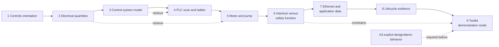

Text alternative: the tracer begins with controls orientation, then electrical quantities, feedback
control, PLC scanning, motor/pump behavior, the interlock-versus-safety distinction, communication
layers, lifecycle evidence, and finally an explicit toolkit demonstration. Later pages retrieve
electrical and control knowledge. The toolkit step is blocked until A3 establishes stable explicit
design/demo behavior.

A new recurring-scenario page should be created only if the first conversions prove that the shared
system cannot be explained cleanly from the Fundamentals landing page. If created, it belongs under
`docs/tools/scenarios/`, uses a constructed-teaching-example label, and is linked into the existing
scenario index—never a new top-level section.

##### Prepared original visual set

The tracer needs a coordinated set of original, code-native diagrams rather than decorative images:

1. Physical pump, tank, sensor, valve/load, and flow boundary.
2. Electrical source, protective device, motor controller, motor, and bonding path.
3. Control I/O and PLC scan relationship.
4. Feedback loop with setpoint, measured value, actuator, process, and disturbance.
5. Network link showing device, switch, controller/HMI, and application-data boundary.
6. Safety function shown separately from ordinary control, with human authority and independent
   protective action.
7. Lifecycle evidence thread connecting requirement, design record, test evidence, and change.

All views use the same fictional identifiers and a small legend. Each ships with a concise text
alternative that explains relationships, not merely the visual appearance. Animated or interactive
versions are optional enhancements to the complete static view.

##### Visual source ownership and delivery

- Give the recurring system one governed visual manifest identifying view ID, title, equipment/tag
  vocabulary, source format, rendered output if any, text alternative, evidence dependencies, and
  pages that consume it.
- Prefer inline, hand-maintainable Mermaid for relationship diagrams and original SVG for layouts
  that need precise spatial composition. Use raster output only when the information truly depends on
  pixel detail.
- If source and rendered output are both committed, declare the source canonical, add a deterministic
  generation/check command, and prohibit hand editing of the derivative.
- Keep learner visual assets in one clearly owned subtree such as
  `docs/assets/images/learning/pump-tank/` if static files are selected; do not mix them with the RAG
  mirror or generated engineering templates.
- Reuse identifiers and underlying scenario data, not screenshots. A changed tag or system relation
  should have a finite impact list across diagrams, prose, exercises, and generated artifacts.
- Record source edition/review dependencies for standards-bearing diagrams. Purely conceptual
  original diagrams still carry technical and learner review state through their page/manifest.
- Pin third-party rendering libraries and preserve a complete server-rendered/static fallback where
  Mermaid or another runtime is used.

Proposed manifest shape for owner review:

```yaml
id: "pump-tank-control-loop"
title: "Pump-and-tank feedback loop"
learner_question: "How does measured level change the pump command?"
takeaway: "The sensor reports process state; PLC logic commands the actuator; the process feeds back."
view: "feedback"
source_kind: "constructed_teaching_example"
scenario_revision: "pump-tank-r1"
evidence_ids: []                 # required when standards-bearing claims appear
identifiers: ["LT-101", "PLC-1", "VFD-101", "MTR-101", "TK-101"]
canonical_source: "<accepted source path>"
rendered_outputs: []             # populated only if derivatives are committed
consumers:
  - "/fundamentals/control/control-theory-overview/"
text_alternative: "<relationship-focused alternative>"
states: ["normal", "disturbance", "sensor_unavailable"]
interaction: "none"
technical_review: "Review pending"
learning_review: "Review pending"
accessibility_validation: "Review pending"
```

The manifest is a planning proposal, not an approved schema. It should exist only if it provides
leverage across several diagrams; single inline figures can keep their specification beside the page.
The manifest must not become a separate technical-fact store.

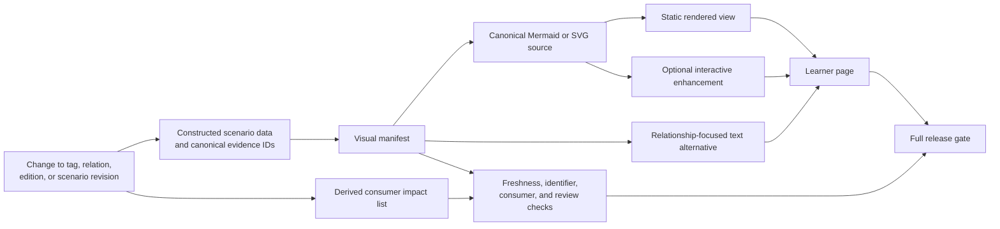

Text alternative: constructed scenario data and evidence identities feed a visual manifest, which
owns canonical Mermaid/SVG source, rendered static output where needed, optional enhancement, and the
text alternative. All projections reach the learner page and release checks. A changed tag,
relationship, edition, or scenario revision updates source data and produces a consumer impact list
before the gate can pass.

Prepared visual QA matrix:

| Check | Desktop | 320 px / 200% | Keyboard/screen reader | Print/no JS | Dark/high contrast |
|---|---|---|---|---|---|
| Labels and arrows remain distinguishable | Required | Required | Text sequence equivalent | Required | Required |
| No meaning depends on color alone | Required | Required | Named relationships | Required | Required |
| Text alternative reaches same conclusion | Review | Review | Required | Required | Review |
| Warning/authority boundary remains adjacent | Required | Required | Required | Required | Required |
| Diagram identifiers match lesson/artifacts | Required | Required | Required | Required | Required |
| Interactive state has complete static form | If interactive | If interactive | Required | Required | If interactive |
| Source/render freshness check passes | Required | Same artifact | Same artifact | Same artifact | Same artifact |

Prepared automated visual checks:

- every manifest ID and page-local diagram ID is unique;
- Orientation/Foundation first views stay within the accepted node/branch/relationship budgets or
  carry a reviewed exception reason;
- every listed consumer exists and every actual shared-visual consumer appears in the manifest;
- every scenario identifier used in a diagram exists in the accepted fictional dataset;
- evidence IDs resolve when a diagram contains standards-bearing meaning;
- a visual cannot declare `Reviewed` through generation;
- every essential diagram has nonblank relationship-focused alternative text;
- source-to-rendered freshness fails deterministically when derivatives drift;
- SVG has a title/description and no external resource or script dependency;
- Mermaid/runtime version is pinned where the site renders Mermaid;
- diagram labels contain no hardcoded base URL, customer/employer term, real address, or forbidden
  path;
- generated visual files are reproducible apart from explicitly declared nonsemantic metadata;
- page source preserves safety/SAMPLE/review warnings outside an interactive-only region;
- screenshot regression, if adopted, covers desktop, 320 px, 200% zoom, dark theme, print, and failed
  runtime/CDN states, with human review for meaningful rather than pixel-only differences.

Prepared manual simplicity checks:

- unfamiliar learner identifies the start and main path without coaching;
- learner can state the takeaway in one sentence without copying labels;
- the first view does not require its legend to reveal the main relationship;
- abbreviations and formal symbols appear only after their plain-language referents;
- secondary branches do not visually compete with the main path;
- the changed-condition view changes exactly one declared factor;
- removal of color, animation, hover, or enhancement preserves the conclusion;
- a reviewer can remove at least one nonessential mark or justify every remaining mark;
- the visual does not look more authoritative or certain than its evidence/review state.

##### Tracer visual storyboard

| Tracer page | First visual | Learner interaction | Changed-condition visual | Required static fallback |
|---|---|---|---|---|
| Fundamentals landing | Complete but simple system context | Choose what is energy, signal, process, or authority | Same system with one missing path | Labeled context diagram and classification table |
| Electrical quantities | Source/path/load schematic beside physical layout | Predict current path before reveal | Open path, changed resistance, or alternate branch | Two annotated schematics with word/unit explanation |
| Control overview | Process view beside feedback loop | Drag-free/paper prediction of direction of response | Demand disturbance or failed measurement | Ordered signal-flow list and expected/observed table |
| Ladder logic | Rung plus three-scan state table | Select next state before answer | Stop input changes between scans | Complete state table and textual scan narrative |
| Induction motor | Energy conversion chain and rotating-field sequence | Order the conversion stages | Load torque increases | Static numbered sequence and torque/slip explanation |
| Interlocks/safety | Ordinary control and independent safety paths side by side | Classify functions and choose stop/escalate | PLC/network unavailable | Comparison table and failure-containment narrative |
| Ethernet fundamentals | Physical topology plus layered message envelope | Trace one value from device to controller | Link works but application transaction fails | Numbered transaction trace and layer table |
| Lifecycle | Requirement-to-evidence swimlane | Place artifact at stage and name next consumer | Requirement changes after commissioning | Stage input/output table with change path |
| Toolkit | Input → validation → result → artifact → review trace | Find mode, provenance, assumption, and warning | SAMPLE input or invalid source edition | Captured text output generated from fictional data |

The storyboard specifies the relationship each visual must teach before anyone chooses Mermaid, SVG,
HTML, or another implementation. Static code-native diagrams are the default. Interactive behavior is
added only where prediction, state transition, or comparison materially benefits and the static
fallback remains complete.

##### Detailed tracer lesson blueprints

These blueprints prepare content decisions without drafting unreviewed technical prose into the site.
All numerical values, circuit behavior, standards routes, and safety assertions must be verified
against canonical sources during their implementation slice.

###### 1. Fundamentals landing — “What a control system does”

- **Entry:** no controls experience; ability to read simple arrows and labels.
- **Outcome:** identify the observed process, decision mechanism, actuator, resulting physical change,
  feedback, and human/authority role.
- **Opening situation:** a tank level falls while demand continues; ask what must notice, decide, and
  act.
- **Primary visual:** complete recurring-system context with power, signal, fluid, safety, and human
  authority explicitly distinguished.
- **Vocabulary introduced:** process, sensor, controller, actuator, setpoint, feedback, disturbance.
  PLC, VFD, HMI, and safety function are named but deferred.
- **Worked reasoning:** trace one ordinary refill event from falling level through measurement,
  decision, motor command, fluid movement, and new measurement.
- **Guided item:** label the same roles when demand rises.
- **Misconception:** “the PLC powers the motor.” Correction traces low-energy information separately
  from motor power.
- **Transfer:** classify observe/decide/act/verify roles on a fan or conveyor.
- **Retrieval:** which element changes the physical process; which only reports; what remains external
  human authority?
- **Handoff:** conceptual only; it does not authorize wiring, programming, or operation.

###### 2. Electrical quantities — “Energy and the closed path”

- **Entry:** tracer step 1; basic arithmetic and unit notation.
- **Outcome:** distinguish voltage across two points, current through a path, resistance to current,
  and power transfer; trace a closed low-energy fictional circuit.
- **Opening prediction:** ask whether a lamp/load operates when one path is open and where voltage may
  still exist.
- **Primary visual:** physical source/switch/load beside the matching schematic, with reference arrows
  and a system boundary.
- **Formal bridge:** quantity, symbol, unit, measurement relationship, and one verified small-value
  calculation with units.
- **Worked reasoning:** identify known/unknown, predict direction/magnitude, calculate, check units,
  and compare to the physical model.
- **Guided item:** complete the missing current or power step.
- **Misconceptions:** voltage flows; current is consumed; ground is a universal return; an open switch
  means every point is de-energized.
- **Transfer:** add a second branch or change resistance and ask what stays shared versus changes.
- **Handoff:** any physical activity uses an isolated educational low-energy setup with appropriate
  instructor oversight; no industrial-panel measurements.

###### 3. Control overview — “Feedback responds to change”

- **Entry:** tracer steps 1–2; distinguish signal from energy.
- **Outcome:** label setpoint, measurement, error/decision, command, actuator, process, feedback, and
  disturbance; predict the initial direction of response.
- **Opening prediction:** demand opens and level begins falling—should pump command increase,
  decrease, or remain unchanged, and why?
- **Primary visual:** pump/tank process and feedback flow beside an aligned level/command timeline.
- **Formal bridge:** introduce signed error and controller action only after the causal explanation;
  defer PID equations.
- **Worked reasoning:** normal steady condition, disturbance, measurement change, controller response,
  process delay, and new state.
- **Guided item:** fill the expected direction at each step of a demand decrease.
- **Misconceptions:** feedback is instantaneous; larger correction is always better; a good setpoint
  makes the system safe; sensor output and actual level are identical.
- **Transfer:** sensor becomes unavailable or actuator saturates; learner identifies what the model can
  no longer conclude.
- **Handoff:** simulation/plots only; field tuning and control changes require the responsible engineer
  and operating procedure.

###### 4. Ladder logic — “One rung across three scans”

- **Entry:** tracer steps 1–3; Boolean true/false and the role of physical I/O.
- **Outcome:** distinguish physical device state, I/O image, logical instruction result, coil result,
  and physical output; trace a start/stop seal-in example over three scans.
- **Opening prediction:** press Start for one scan, release it, then activate Stop—what changes at each
  scan boundary?
- **Primary visual:** physical controls, input image, rung, output image, and motor-command output
  aligned with a three-row scan table.
- **Worked reasoning:** input snapshot → rung evaluation → output update → next scan, explaining the
  holding branch and the NC-wired stop distinction.
- **Guided item:** complete the second scan state with the start input released.
- **Misconceptions:** logic symbols are the field contact construction; current continuously flows
  left-to-right in software; rung order never matters; a coil instruction directly powers a motor.
- **Transfer:** stop changes between scans or another rung writes the same coil; learner predicts the
  ambiguity/failure and selects the safer design review outcome.
- **Retrieval:** trace signal versus power again from earlier lessons.
- **Handoff:** paper/simulator/isolated training controller only; no production writes; ordinary ladder
  is not a safety function.

###### 5. Induction motor — “Electrical input becomes pump torque”

- **Entry:** electrical quantities and recurring system; rotational vocabulary introduced locally.
- **Outcome:** identify stator, rotor, rotating magnetic field, shaft/load, torque, speed, and slip;
  connect the motor to the pump duty without selecting a field motor.
- **Opening prediction:** if mechanical load rises, which quantities are likely to change before a new
  operating point?
- **Primary visual:** source → stator field → rotor interaction → shaft torque → pump/load chain plus a
  simple torque-speed/load intersection.
- **Worked reasoning:** describe how rotating field and relative speed permit torque; relate the
  operating point to the load without presenting slip as damage.
- **Guided item:** order energy-conversion stages and label power versus command paths.
- **Misconceptions:** horsepower alone selects the motor; rotor normally runs exactly at synchronous
  speed; VFD command is motor power; nameplate current equals every standards table value.
- **Transfer:** raise load torque/inertia or change speed command; learner identifies which additional
  data and manufacturer curves are required.
- **Handoff:** selection, protection, wiring, and commissioning remain qualified design tasks using
  device data and governing rules.

###### 6. Interlocks, permissives, trips, and safety functions

- **Entry:** tracer steps 1–5; normal control sequence and power/signal separation.
- **Outcome:** explain permissive, interlock, ordinary trip, and safety function in context; identify
  the independent protective path and choose stop/escalate when evidence is missing.
- **Opening comparison:** loss of an ordinary “tank ready” permissive versus activation of an
  emergency-stop safety function.
- **Primary visual:** ordinary PLC control path and separately identified safety input/logic/output
  and energy-removal path, including fault/unavailable states.
- **Worked reasoning:** state intended behavior, triggering condition, ordinary response, protective
  response, reset/restart distinction, and required validation evidence.
- **Guided item:** classify several fictional functions by purpose while allowing “insufficient
  information” as a correct answer.
- **Misconceptions:** any trip is safety-rated; redundancy proves a safety function; standard PLC code
  becomes safe when an E-stop tag is used; component ratings validate the complete function.
- **Transfer:** PLC or network unavailable; learner identifies which protective behavior must not
  depend on the ordinary path.
- **Handoff:** no circuit recipe; risk assessment, safety requirements, architecture, calculation,
  validation, and responsible approval remain external.

###### 7. Ethernet fundamentals — “A value crosses several layers”

- **Entry:** recurring system and PLC/device roles; no packet-analysis experience.
- **Outcome:** separate physical link, Ethernet frame/switching role, network addressing where used,
  and application transaction/meaning; distinguish connectivity from application health.
- **Opening situation:** link indicators and ping succeed, but the PLC does not receive a level value.
- **Primary visual:** sensor/device → switch → PLC/HMI physical topology beside one layered message
  envelope and request/response sequence.
- **Worked reasoning:** trace a value from application object/register through network delivery and
  back, identifying what each layer can and cannot prove.
- **Guided item:** place switch, IP address, protocol request, and process variable at the appropriate
  layer/role.
- **Misconceptions:** Ethernet equals EtherNet/IP; Modbus equals RS-485; ping proves application
  operation; IP address identifies the process variable; packet capture alone proves root cause.
- **Transfer:** physical link works but application response is absent or semantically wrong; choose
  the next offline/read-only discriminating check.
- **Handoff:** synthetic descriptions/offline captures only; live networks require site authorization
  and defensive procedures.

###### 8. Lifecycle — “One requirement becomes evidence”

- **Entry:** the recurring system and the control-versus-safety distinction.
- **Outcome:** trace one fictional requirement through concept, risk/requirements, design, build,
  installation, verification, validation, operation, and change; identify the consumer at each handoff.
- **Opening problem:** “prevent pump dry running” exists as an informal statement—what must be known
  before anyone implements it?
- **Primary visual:** swimlane for requirement/evidence, engineering roles, and lifecycle gates, with
  the changed-after-commissioning path visible.
- **Worked reasoning:** refine scope and rationale, identify acceptance evidence, show design artifact,
  verification result, validation question, and configuration/change record.
- **Guided item:** place a test record, wiring drawing, risk assumption, and change request at the
  stage that creates/uses it.
- **Misconceptions:** lifecycle is strictly one-way; documentation is administrative; FAT proves site
  installation; commissioning is the first validation; maintenance changes never reopen assumptions.
- **Transfer:** sensor or operating mode changes after commissioning; learner identifies impact review
  and management-of-change route.
- **Handoff:** the page teaches evidence flow, not a project approval procedure for every organization.

###### 9. Engineering toolkit — “A result is an evidence-bearing handoff”

- **Entry:** tracer steps 1–8; basic terminal reading. Stable A3 design/demo behavior is a hard
  dependency.
- **Outcome:** select explicit demonstration mode, inspect fictional input, interpret value/artifact,
  citation, assumptions, warnings, and source mode, correct a validation error, and name required
  design review.
- **Opening prediction:** before running the command, ask what a trustworthy result must contain
  besides a number or polished file.
- **Primary visual:** input identity → validation → compatible rule/evidence → structured result →
  rendering/artifact → qualified review.
- **Worked reasoning:** run one documented command against fictional data, map each output line/field
  to its origin, and show the persistent SAMPLE warning.
- **Guided item:** identify the offending value in a deliberately invalid input and predict the
  actionable error.
- **Misconceptions:** exit code zero means approved; SAMPLE is an approximate design value; citation
  proves local applicability; generated formatting proves completeness; changing rendered CSV is the
  same as changing the governed input.
- **Transfer:** change source edition, tag, or signal class; learner predicts rejection or all affected
  artifacts and verifies the manifest.
- **Handoff:** design mode requires licensed/user-supplied evidence and responsible engineering review;
  no page/tool output is certification or AHJ acceptance.

##### Constructed teaching dataset

Prepare one small, internally consistent fictional dataset after A3/A4 behavior is accepted:

- invented equipment and tags;
- RFC1918 network addresses;
- a small I/O list with explicit source revision/checksum;
- declared power/control/signal classes;
- a motor and process duty described without licensed table values;
- SAMPLE table use only through explicit demonstration mode;
- expected calculations generated by `cst` with citations, assumptions, and warnings;
- one deliberate but safe validation error for correction practice;
- one deliberate cross-artifact change for traceability practice;
- synthetic diagnostic observations, never a real network capture.

The dataset should drive diagrams, examples, worksheets, toolkit output, and transfer cases where
appropriate. It remains a teaching input, not a canonical standards source.

##### Page-level conversion checklist

For each tracer page, the author records:

- exact intended learner and assumed prior concepts;
- two to four observable outcomes;
- safety/authority boundary and practice mode;
- canonical evidence records supporting technical claims;
- system boundary and physical/concrete representation;
- terms introduced and terms deliberately deferred;
- formal representation and link to the concrete model;
- complete worked explanation;
- partially completed guided item;
- one-condition transfer item;
- likely misconception, its root cause, and corrective evidence;
- retrieval questions and reasoned answers;
- field handoff and next routes;
- original visual/text alternative requirements;
- technical, learner, and accessibility review states;
- validation observations and revisions after novice sessions.

##### Branch-sized execution plan

| Slice | Suggested branch | Deliverable | Required evidence |
|---|---|---|---|
| F0 | `docs/phaseF0-learning-contract` | Governance proposal for learner metadata, states, and safety modes | Owner decision; YAML fixtures; no page rollout |
| F1 | `chore/phaseF1-learning-inventory` | Read-only structured inventory and prerequisite-graph checker | Unit fixtures; deterministic derived report; full gate |
| F2 | `docs/phaseF2-teaching-system` | Original recurring-system static diagrams, text alternatives, and constructed dataset plan | Technical review pending; copyright/privacy check; render QA |
| F3 | `docs/phaseF3-foundation-tracer` | Fundamentals landing, electrical quantities, and control overview conversions | Page checklist; example verification; novice dry run |
| F4 | `docs/phaseF4-control-tracer` | Ladder logic, induction motor, and interlock/safety-boundary conversions | Scan-state golden cases; safety review; keyboard/print checks |
| F5 | `docs/phaseF5-integration-tracer` | Ethernet, lifecycle, and toolkit demonstration route | A3 mode dependency met; no-JS and wheel-path checks |
| F6 | `docs/phaseF6-learner-validation` | Moderated findings, revisions, accepted lesson contract, rollout decision | Novice + practitioner + accessibility evidence |
| F7 | `docs/phaseF7-topic-rollout-plan` | Risk/prerequisite-ordered backlog for remaining topic families | Owner acceptance; no bulk conversion until F6 passes |

Every slice updates project state, keeps AI-authored technical and learner review at `Review pending`,
runs the full governed gate, and remains independently revertible. F0–F2 may proceed while A phases
are underway; F5 cannot claim a stable toolkit lesson until explicit design/demo behavior is shipped.

##### F2 visual work breakdown

F2 should itself remain a sequence of reviewable commits or sub-slices:

| F2 unit | Output | Acceptance evidence |
|---|---|---|
| F2.1 visual grammar | Accepted meanings, identifiers, line/label conventions, text-alt template | Owner + accessibility review; monochrome/print proof |
| F2.2 scenario identity | Fictional equipment/tag list, system boundary, revision and privacy statement | No customer/employer data; consistent with future A4 artifact identity |
| F2.3 physical/process view | Pump, tank, sensor, material flow, disturbance | Novice locates equipment and process boundary |
| F2.4 electrical view | Source, protection, controller, motor/load, bonding concept | Energy path distinct from control/safety; no installation recipe |
| F2.5 I/O and scan view | Field device, I/O image, PLC logic, output command | Three-scan trace agrees with ladder example |
| F2.6 feedback/time view | Setpoint, measurement, command, process, disturbance and response plot | Learner predicts direction before formal PID terms |
| F2.7 network view | Device, switch, controller/HMI, message layers | Physical link and application health remain distinct |
| F2.8 safety/authority view | Safety input/logic/output, energy removal, qualified-human handoff | Independent path and zero implied approval |
| F2.9 lifecycle/evidence view | Requirement, design record, test, issue/review, change | Verification/validation and consumers distinguished |
| F2.10 projection adapters | Static views, text alternatives, optional enhancement hook | Same identifiers; no-JS complete; deterministic freshness |
| F2.11 visual QA | Multi-width/theme/print/accessibility review record | No clipping, color-only meaning, missing warning, or stale derivative |

Do not combine F2 with technical expansion of the recurring system. When a visual needs a claim that
the canonical corpus does not support, record the evidence gap and simplify or hold the view.

##### Visual acceptance record template

For each F2 view, capture:

```text
Visual ID:
Learner question:
Single takeaway:
First-view node/branch/relationship count:
Easy-first exception and rationale, if any:
Scenario/evidence revision:
Identifiers used:
Normal state:
Changed/failure state:
Interaction and why needed:
Static fallback:
Text alternative conclusion:
Technical-review finding:
Learner-validation finding:
Accessibility finding:
Unfamiliar-learner simplicity finding:
Freshness/check result:
Unresolved issue and owner:
```

This record can begin as a review checklist. It should become structured data only if automation or
multiple consumers justify the additional contract.

##### Prepared validation protocol

Use moderated task-based sessions, not satisfaction alone. Recommended minimum before rollout:

- three to five people with no controls experience;
- two or more people with adjacent electrical, software, mechanical, or process experience but no
  integrated controls experience;
- at least one qualified practitioner/instructor for technical and field-handoff review;
- accessibility review covering keyboard, screen reader, 200% zoom/reflow, print, and no-JavaScript
  paths.

Prepared tasks:

1. Explain the recurring system without using page wording verbatim.
2. Trace energy separately from control information.
3. Predict the result of an opened path or changed sensor value.
4. Trace three PLC scans through the start/stop example.
5. Explain why motor power, PLC output, and safety action are different paths.
6. Distinguish Ethernet from an application protocol.
7. Choose the lifecycle stage and evidence needed for one change.
8. Run the toolkit in explicit demonstration mode and locate SAMPLE/provenance warnings.
9. Respond to a case with missing edition, authorization, or safe conditions by stopping and naming
   the correct handoff.
10. Apply the model to a changed fictional conveyor or fan case to test transfer.

Record task outcome, reasoning, navigation path, misconception, point of confusion, unsafe inference,
and successful recovery. Do not record employer/customer information or unnecessary personal data.
Use participant codes and aggregate findings. The owner should approve any collection method before
sessions begin.

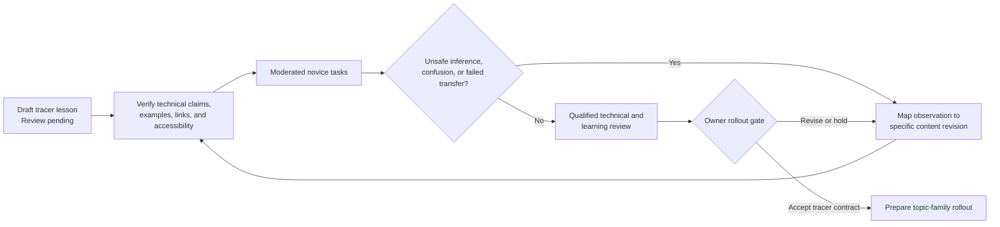

Text alternative: a Review-pending lesson is technically and accessibly verified, tested through
moderated novice tasks, and revised whenever unsafe inference, confusion, or failed transfer occurs.
Only after qualified technical/learning review does the owner decide whether to hold, revise, or
accept the tracer contract for broader rollout.

##### Rollout decision thresholds

The tracer is ready to scale only when:

- all participants can locate prerequisites and safety boundaries;
- most novices can explain the system causal chain and transfer it to the changed case without
  copying a memorized sequence;
- no participant interprets lesson completion, quiz feedback, or SAMPLE output as approval or
  qualification;
- high-risk misconceptions cause a visible stop/escalate outcome;
- technical reviewers find no simplification that changes engineering meaning;
- accessibility blockers on the core route are resolved or the affected route remains explicitly
  not learner-ready;
- observed confusion has been mapped to specific content revisions and retested;
- the lesson contract remains small enough that authors can apply it consistently.

Avoid a universal numeric pass score until actual sessions establish useful thresholds. The critical
release blockers are unsafe inference, authority confusion, inaccessible core meaning, broken
prerequisites, incorrect technical simplification, and failure to transfer—not a low satisfaction
rating.

##### Phase F owner decisions

1. Accept, modify, or reject the five learner stages.
2. Approve the proposed separate `learning_review` concept using the existing five-term vocabulary.
3. Approve prerequisite and content-type metadata as frontmatter, derived data, or another governed
   canonical representation. Page-local frontmatter is recommended initially because the learning
   relationship belongs to the page, with derived route/index views.
4. Approve the tracer pages and whether the recurring system begins on the Fundamentals landing page
   or a scenario page.
5. Approve the fictional pump-and-tank model and required transfer cases.
6. Name the owner/instructor role allowed to mark learner material `Reviewed`.
7. Approve the participant groups and privacy method for moderated validation.
8. Decide whether effort estimates add useful orientation or should be omitted.
9. Confirm that no completion badges, accounts, certificates, or behavioral tracking are part of the
   initial phase.
10. Approve the F6 evidence threshold before any all-site conversion backlog is authorized.

##### Phase F responsibility model

| Role | Responsible for | Cannot infer or approve |
|---|---|---|
| Owner | Accept contract, vocabulary, scope, privacy method, and rollout decision | Technical correctness without source review |
| Technical reviewer | Check engineering claims, examples, editions, and field handoff | Learner readiness from accuracy alone |
| Learning reviewer/instructor | Check outcomes, scaffolding, feedback, transfer, and observed novice use | Technical `Reviewed` status unless also authorized for it |
| Accessibility reviewer | Check equivalent access and actual assistive-technology behavior | Technical or learner review from automated results |
| Maintainer | Implement templates, validators, routes, and deterministic reports | Any positive review state automatically |
| AI drafting agent | Draft at `Review pending`, run checks, report gaps and evidence | Mark its own technical or learner work `Reviewed` |
| Learner participant | Attempt tasks and explain confusion/reasoning | Compliance, qualification, or design approval |

One person may hold several human roles when genuinely qualified, but each review act should remain
separately recorded so authority does not flow from job title or convenience.

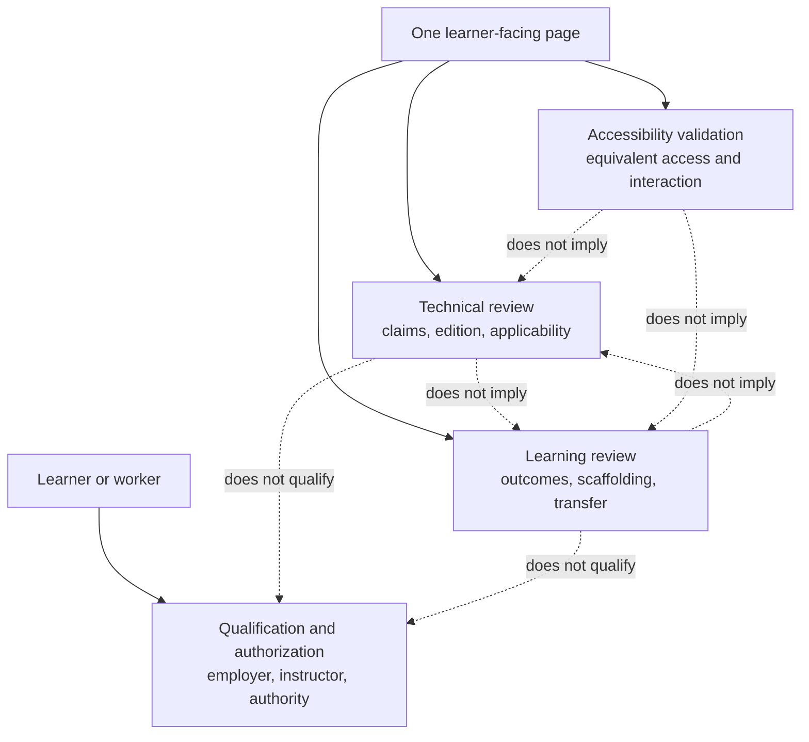

Text alternative: one page has three independent evidence tracks—technical review, learning review,
and accessibility validation. None implies another. A person's qualification and authorization are
separate external decisions and cannot be produced by any page review state.

##### Phase F risk register

| Risk | Early signal | Prepared response |
|---|---|---|
| Technical meaning is simplified away | Learners give an easy but false causal explanation | Restore the distinction, improve representation, keep page Review pending |
| Lesson template becomes bureaucratic | Authors repeat empty headings or boilerplate | Retain only blocks that improve tracer validation; allow content-type variation |
| Prerequisite graph becomes a second taxonomy | Navigation and learning routes disagree | Keep existing taxonomy; generate routes from page relationships |
| Recurring scenario causes overgeneralization | Learners apply pump assumptions to motors/networks generally | Require changed conveyor/fan/process transfer cases |
| Practice implies field authority | Learners say they are ready to wire/tune/approve | Strengthen early boundary and handoff; block learner-ready status |
| Quiz becomes trivia | Learners recall terms but cannot predict or transfer | Replace recall-only items with trace/explain/changed-condition tasks |
| Interactive content hides core meaning | No-JS, keyboard, or print route loses instruction | Treat static content as complete; interaction remains progressive enhancement |
| Learning state is confused with technical review | Clear page displays stronger trust than evidence | Render separate labels and fail impossible status combinations |
| Behavioral data exceeds privacy scope | Proposal includes session replay, profiles, or per-user tracking | Reject by default; use moderated, consented, minimal aggregate evaluation |
| Conversion creates unmaintainable volume | Many pages change before tracer evidence stabilizes | Stop after F5, complete F6 validation, then authorize topic rollout |
| Worked examples drift from toolkit behavior | Page arithmetic differs from current `cst` output | Generate/verify examples deterministically and gate freshness |
| Safety material becomes a generic design recipe | Learner copies a fictional circuit as approved | Teach function/decision reasoning, label construction, require governing design review |

##### F0 ready-to-start checklist

The first learner-phase branch may start when the owner answers the Phase F decisions. Its exact
scope is prepared:

- update `governance/CONTENT_STANDARDS.md` with accepted learner metadata, independent review meaning,
  constructed-example rules, practice modes, and the beginner-ready floor;
- add valid and invalid frontmatter fixtures before any page rollout;
- add semantic validation for allowed stage/content/practice values, observable outcomes, review
  vocabulary, and resolvable prerequisites;
- document that prerequisite cycles and route reachability arrive in F1, not a rushed F0 parser;
- update project state and the author runbook only if commands change;
- run focused validator tests, Jekyll/base-URL build, internal links, corpus boundaries, full pytest
  and doctests;
- leave all drafted learning review states at `Review pending`;
- stop after governance and fixtures—do not combine the first tracer-page rewrite into F0.

### E — Project memory and repository locality

**Purpose.** Give maintainers and agents a small, accurate current-state interface after the new
behavioral modules stabilize.

**Recommended slices.**

1. Derive volatile release metrics and remove hand-maintained copies where possible.
2. Reduce `project_state.md` to current phase, decisions, blockers, validation baseline, and next
   actions; move closed narratives to dated history without losing traceability.
3. Add a compact domain-language context and create ADRs only for accepted, load-bearing decisions.
4. Apply the deletion test to dead root entry points, stale migration/fixer tooling, duplicate assets,
   and shallow adapters superseded by the deep modules above.
5. Change hooks to report missing state updates rather than silently staging unrelated files.

**Exit evidence.** A new maintainer can identify active work, authority limits, canonical modules,
accepted decisions, blockers, and the exact release command from the first screen of project state;
volatile counts match derived output; deletions preserve the full gate.

### Prepared first implementation branch

Once A0 is accepted, the lowest-risk first branch is **A1.1 shared analytics configuration**:

- narrow scope: two layouts become consumers of one configuration adapter;
- no technical content, corpus, calculation, or authority change;
- direct acceptance: rendered configuration is identical and retains the owner-approved disabled
  Google Signals/ad-personalization settings;
- tests: render both layouts, assert the same config values, run Jekyll build and link check, then the
  full release gate;
- rollback: revert the shared include/config change as one slice if rendered behavior differs.

The highest-value early safety branch is **A3 design/demo default**, but it should follow the A0 mode
decision and ship with explicit migration notes because it intentionally changes public Python and
CLI success behavior.

The first learner-specific branch is **F0 learning contract**, after the ten Phase F owner decisions.
It changes governance and validation fixtures only; the first content conversion begins in F3 after
the inventory, prerequisite checks, and recurring teaching model are prepared.

## Acceptance criteria for project behavior

The project behaves as recommended when:

- every user-visible engineering result states applicability, provenance, assumptions, warnings,
  and review state;
- incompatible editions cannot be combined silently;
- every layout applies the same declared privacy behavior;
- review exemptions contain no independent technical claims;
- corpus metadata outside the governed vocabulary fails the release gate;
- semantically empty evidence placeholders fail even when the Markdown field or unit is present;
- every curated technical claim can resolve to canonical evidence at the claimed edition and cannot
  silently outrank that evidence's review state;
- no generated artifact can drift without failing the release gate;
- one mapping edit updates all correlation views;
- relationship gaps and direction are visible;
- visible review badges cannot contradict canonical metadata;
- SAMPLE data require explicit demonstration mode and cannot be mistaken for design-use data;
- artifact filename normalization cannot overwrite distinct source records, and empty inputs cannot
  produce deliverables that appear complete;
- signal class and other explicit input semantics survive into BOM, schedule, nameplate,
  commissioning, and package outputs;
- an unsupported question produces a useful gap report and next verification step;
- core navigation, status, and content remain usable without JavaScript;
- keyboard and screen-reader behavior is verified in CI plus a small manual device matrix;
- the first screen of project state accurately states what is active, blocked, and next;
- learned or advisory capability never changes the authority ceiling without a separately reviewed
  evidence decision;
- every beginner route declares prerequisites, observable outcomes, safety limits, a concrete and
  formal representation, worked reasoning, guided and transfer practice, misconception feedback,
  retrieval checks, and a field handoff;
- technical review, learner-readiness review, and accessibility validation cannot be conflated;
- a novice can explain, predict, trace, choose, transfer, and correctly stop within the tracer path
  without interpreting completion as field qualification.

## Metrics that should be derived, not hand-maintained

- Reader pages by review status and pages awaiting owner review.
- Visible status badges by canonical status and contradiction count.
- Mapping topics, mapped pairs, unmapped pairs, and mappings awaiting review.
- Corpus-to-site provenance coverage for technical pages.
- Generated artifacts covered by freshness checks.
- Calculators and generators whose outputs structurally require citations.
- Curated technical claims with stable evidence identity, edition agreement, and non-weaker status.
- Evidence records containing unresolved placeholders or semantically blank values.
- Artifact fields that remain structured through the final adapter, including explicit/inferred
  origin and source revision.
- Cross-artifact consistency failures, normalized-name collisions, and empty-input rejection paths.
- Browser behavior paths covered at desktop and mobile widths.
- Python versions and installed-wheel paths verified in CI.
- Pages and learner routes by stage, prerequisite coverage, worked-example/practice coverage,
  misconception feedback, retrieval, transfer, and stop/escalate behavior.
- Topic families with a novice-validated route and unresolved learner confusion from moderated
  sessions.

## Decisions required before implementation

1. Is this behavioral contract accepted as the product-level direction?
2. Should mapping records live canonically in the RAG corpus and generate site data, or should a
   separate committed data tier be declared canonical? The existing one-way information-flow rule
   favors the corpus.
3. Does `Reviewed` describe a page, a corpus module, an individual claim, or all three through
   separate labels? The current visual vocabulary conflates them.
4. Which relationship rationale is required for engineering crosswalks: semantic, functional, or
   both? Syntactic similarity alone should not drive design guidance.
5. Which browser/accessibility target becomes the release floor: WCAG 2.2 A, AA, or a project-specific
   subset plus manual checks? AA is the recommended target.
6. What constitutes one traceable technical claim for this project: paragraph, table row, mapping,
   calculation rule, or another deliberately bounded unit? Claim granularity determines whether
   traceability is useful or becomes metadata noise.
7. Which deliverables require a source document identity/revision and package manifest? The
   recommendation is every artifact intended to leave the generating session; transient previews
   may use a lighter record but must retain warnings and mode.
8. Who performs product validation with intended users, separately from source review and automated
   verification? This role should test whether engineers understand modes, caveats, handoffs, and
   recovery paths—not re-review every standards claim.
9. Is the five-stage learner vocabulary accepted, and who may mark a page learner-ready? The
   recommendation is a separate owner/instructor decision after novice validation, never an automatic
   result of technical review.
10. Is the fictional pump-and-tank skid accepted as the recurring beginner model, with later transfer
    cases required to prevent overgeneralization?
11. Which learner cohort validates the first path: no controls experience, adjacent electrical or
    software experience, or both? Both groups are recommended because their misconceptions differ.
12. May the site store self-check responses? The recommendation is no behavioral collection by
    default; use moderated studies or privacy-approved aggregate evaluation only.

## Primary research sources

- [NIST IR 8477 — Mapping Relationships Between Documentary Standards, Regulations, Frameworks, and Guidelines](https://csrc.nist.gov/pubs/ir/8477/final): relationship styles, direction, rationale, and human-/machine-readable mappings.
- [NIST IR 8278 Rev. 1 — National OLIR Program](https://www.nist.gov/publications/national-online-informative-references-olir-program-overview-benefits-and-use): separating informative mappings from source documents and supporting comparison/reuse.
- [NIST OSCAL Control Mapping Model](https://pages.nist.gov/OSCAL/learn/concepts/layer/control/mapping/): machine-readable directional mappings using set-theory relationships without duplicating source requirements.
- [NIST CSF 2.0 Informative References](https://www.nist.gov/cyberframework/informative-references): mappings inform outcomes; publication or catalog inclusion does not itself establish correctness or endorsement.
- [W3C PROV-O](https://www.w3.org/TR/prov-o/): provenance chains across entities, generation activities, derivation, and responsible agents.
- [W3C WCAG 2.2](https://www.w3.org/TR/WCAG22/): predictable navigation, multiple ways to find content, reflow, focus behavior, programmatic control state, and status messages.
- [NIST AI RMF FAQ](https://www.nist.gov/itl/ai-risk-management-framework/ai-risk-management-framework-faqs): validity, reliability, safety, resilience, accountability, transparency, explainability, interpretability, and privacy as trustworthiness characteristics.
- [IEC Electropedia](https://www.electropedia.org/): concept-centered electrotechnical terminology with contextual and multilingual designations.
- [ISO 860:2007](https://www.iso.org/standard/40130.html): harmonization of concepts, concept systems, definitions, and terms.
- [NASA Systems Engineering Handbook, Rev. 2](https://www.nasa.gov/wp-content/uploads/2018/09/nasa_systems_engineering_handbook_0.pdf): lifecycle separation of verification and validation, plus crosscutting requirements, interface, risk, configuration, technical-data, assessment, and decision-analysis practices. Used as systems-engineering guidance, not as a project compliance basis.
- [NIST SP 800-160 Vol. 1 Rev. 1](https://csrc.nist.gov/pubs/sp/800/160/v1/r1/final): engineering trustworthiness through principles, activities, and tasks across system type, complexity, and lifecycle stage. Applied here as a general trust-engineering pattern; the project does not claim conformance.
- [US Department of Education, What Works Clearinghouse — Organizing Instruction and Study to Improve Student Learning](https://ies.ed.gov/ncee/wwc/PracticeGuide/1): spacing, worked-example/problem alternation, combined graphical and verbal representations, concrete-to-abstract connections, retrieval practice, metacognitive checks, and deep explanatory questions.
- [OSHA — Best Practices for Development, Delivery, and Evaluation of Susan Harwood Training](https://www.osha.gov/harwoodgrants/best-practices): understandable language, learner needs assessment, workplace relevance, active participation, demonstrations, hands-on practice, evaluation, and quality control for worker safety training. Used as guidance, not as a declaration that the field guide is OSHA training.
- [CAST Universal Design for Learning Guidelines 3.0](https://udlguidelines.cast.org/more/about-guidelines-3-0/): learner variability and multiple means of engagement, representation, and action/expression.
- [National Academies — How People Learn II](https://nap.nationalacademies.org/catalog/24783/how-people-learn-ii-learners-contexts-and-cultures): prior understanding, construction and use of models, explanation of correct and incorrect system behavior, metacognition, and transfer to new situations.

## Research limits

- NIST OLIR and OSCAL are cybersecurity/privacy mapping systems. Applying their relationship model to
  machinery, electrical, process-safety, and hazardous-area standards is a project inference, not a
  claim of NIST endorsement or project conformance.
- This research did not read licensed standards bodies. It recommends a mapping method and project
  behavior; it does not validate the technical correctness of any specific crosswalk row.
- WCAG conformance cannot be established by source inspection alone. Automated checks must be paired
  with keyboard, screen-reader, zoom/reflow, and device testing.
- NASA and NIST SP 800-160 address much broader and, in places, more safety- or security-critical
  systems than this repository. Their lifecycle and assurance structures are used proportionately as
  research patterns, not imported wholesale or cited as certification criteria.
- The learning research spans school, postsecondary, workplace, and safety-training settings. The
  recommended teaching spine is a project synthesis that must be validated with this project's actual
  novice learners; source publication does not prove that a specific page teaches effectively.
- A static website, simulator, quiz, or generated worksheet cannot provide employer-required
  training, supervised practical experience, qualification, certification, or authorization.
- This document is planning context. If accepted, its load-bearing behavioral rules should move into
  governance and durable decisions rather than remaining only in `planning/`.
