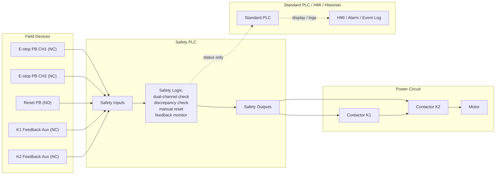
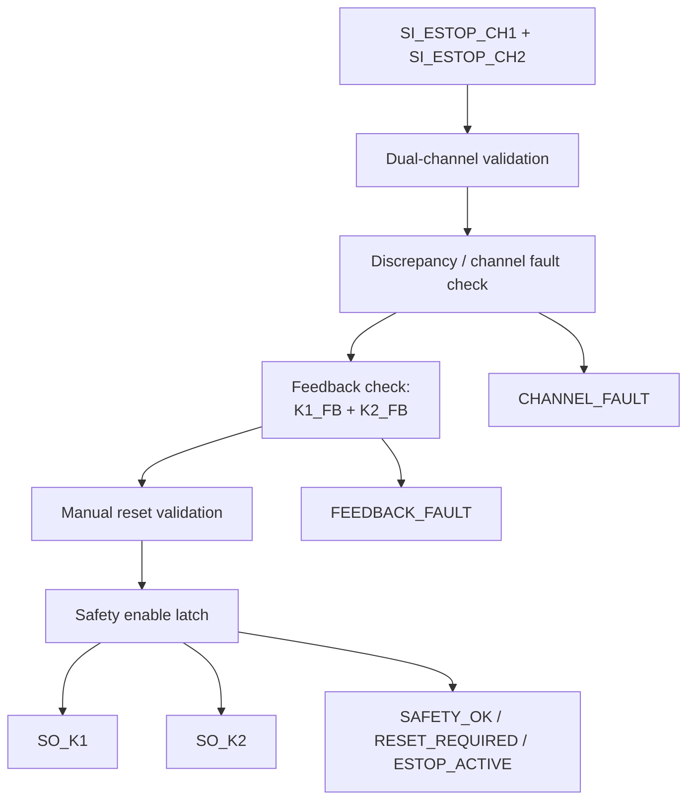
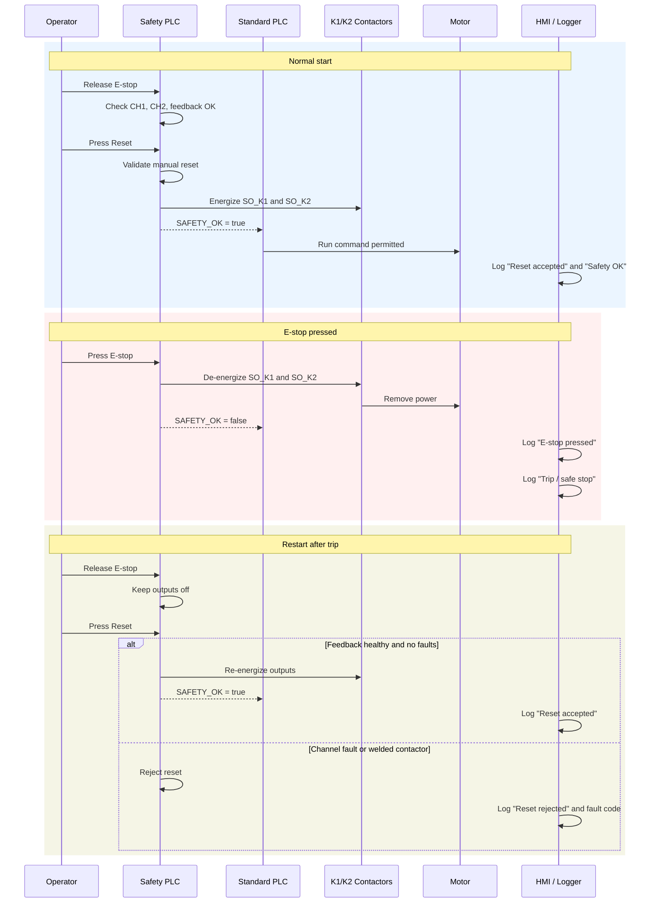
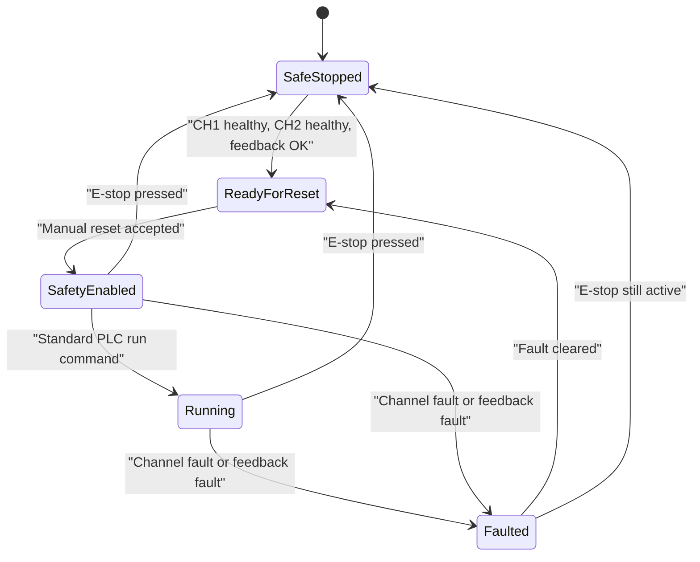
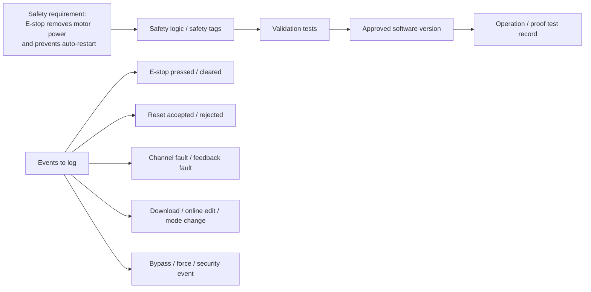
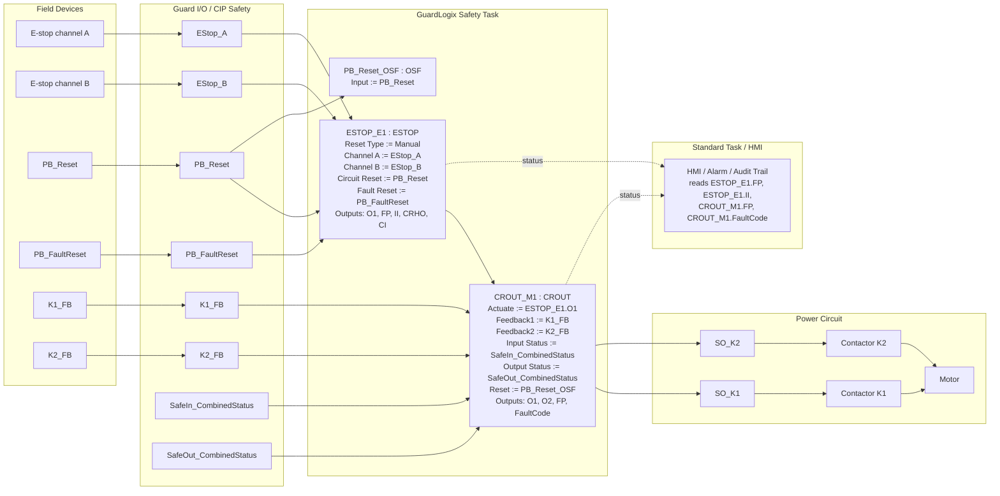
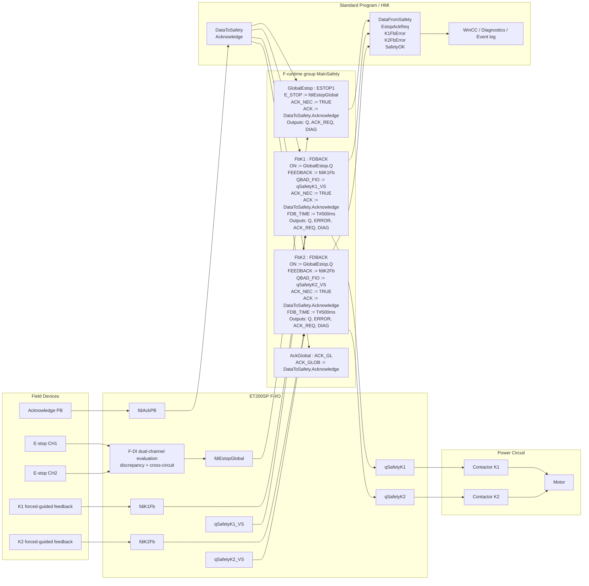

Here is the practical meaning.

Your page is useful as a routing map, and it correctly says two important things:

- [IEC 61131-3:2025](https://webstore.iec.ch/en/publication/68533) is a programming-language standard, not a safety-certification standard.
- A SIL/PL claim belongs to the full safety function chain, not just the ladder code, which your page also says explicitly ([site page](https://kyawminthu20.github.io/Control-System-Tools/software-stack/)).

What that means in real projects is this:

1. `Using ladder logic does not automatically trigger safety requirements.`
   If the logic is normal machine control, sequencing, timers, conveyors, recipes, etc., then ladder is just an implementation language under [IEC 61131-3](https://webstore.iec.ch/en/publication/68533).

2. `If the ladder logic performs a safety function, then the code becomes part of a safety-related control system.`
   For machinery, that pushes you toward [ISO 13849-1:2023](https://www.iso.org/standard/73481.html) or [IEC 62061:2021+AMD1:2024](https://webstore.iec.ch/en/publication/93654).
   For process plants, that pushes you toward [IEC 61511-1:2016+AMD1:2017](https://webstore.iec.ch/en/publication/61289).
   For generic safety software lifecycle requirements, [IEC 61508-3:2010](https://webstore.iec.ch/en/publication/5517) is the base reference.

3. `The standards usually care more about lifecycle control than about the fact that the code is “ladder.”`
   From the official summaries:

- [IEC 61508-3:2010](https://webstore.iec.ch/en/publication/5517) requires software safety functions to be specified, and requires lifecycle activities, modification control, and supporting tools.
- [IEC 62061:2021+AMD1:2024](https://webstore.iec.ch/en/publication/93654) explicitly adds a functional safety plan, configuration management, software verification independence, validation independence, and periodic testing.
- [ISO 13849-1:2023](https://www.iso.org/standard/73481.html) says it covers safety-related parts of control systems, including software design.
- [IEC 61511-1:2016+AMD1:2017](https://webstore.iec.ch/en/publication/61289) includes specification, design, installation, operation, maintenance, and application programming requirements for SIS.

So the answer to “should ladder logic be traceable?” is:

`Yes, if it is safety-related logic.`
But traceability usually means:

- Safety requirement -> safety function definition
- Safety function -> I/O, logic, blocks, reset behavior, fault response
- Code version -> test results
- Code change -> approval/change record
- Installed version -> validation/proof test record

It usually does **not** mean “record every PLC scan” or “log every rung transition forever.”

For logging:

`Logging is expected for important events, not necessarily every instruction.`
Typical things to log are:

- Downloads and online edits
- Mode changes
- Bypasses/inhibits/forces
- Trips and shutdowns
- Resets
- Operator overrides
- Alarm acknowledgements
- User access and security events

That logging often lives in the safety PLC diagnostics, controller audit trail, HMI, historian, or SCADA layer, not inside every rung itself. If the system is networked or remotely maintained, [IEC 62443-4-1:2018](https://webstore.iec.ch/en/publication/33615), [IEC 62443-4-2:2019](https://webstore.iec.ch/en/publication/34421), and [IEC 62443-3-3:2013](https://webstore.iec.ch/en/publication/7033) become relevant for secure development, component requirements, and system security requirements.

For redundancy:

`Not always double redundancy.`
That is the wrong default assumption. Redundancy is one possible architectural measure used when the required risk reduction demands it. In practice, depending on the target PL/SIL and architecture, you may see:

- Single-channel with diagnostics
- Dual-channel inputs
- Feedback monitoring of contactors
- Redundant outputs
- Cross-monitoring
- Voting architectures
- Separate safety CPU / safety task

So “ladder logic” does not mean “must be duplicated.”
What matters is whether the **safety function** needs fault tolerance and diagnostics to meet the target integrity.

A concrete example:

If you code an `E-stop` in ladder:

- It should not just be an ordinary PLC input turning off an ordinary bit.
- The safety function usually needs a defined safe state, defined reset behavior, validated hardware path, and controlled fault response.
- Inference from the safety standards: that commonly means certified safety inputs/outputs, monitored contactors, manual reset rules, documented testing, and managed changes.

One useful way to think about it is:

- `IEC 61131-3` tells you how to write the logic.
- `IEC 62061 / ISO 13849 / IEC 61511 / IEC 61508` tell you how that logic must be engineered if it reduces risk.
- `IEC 62443` tells you how to secure the software/system if it is networked or maintained digitally.

One note on your page: as of March 14, 2026, the current IEC language standard is [IEC 61131-3:2025](https://webstore.iec.ch/en/publication/68533), published on May 22, 2025. So if the page still frames things around the older 2013 edition and IL deprecation, it is worth updating.

If you want, I can continue with either:

- a worked `E-stop ladder` example showing what must be documented and what should be logged, or
- a `simple table` of “normal PLC logic vs safety PLC logic vs SIS logic.”

Here is a worked `E-stop` example first, then a short comparison table.

**Worked E-Stop**
Important point first: an emergency stop is usually **not** implemented as ordinary PLC logic alone. For machinery, the function principles come from [ISO 13850:2015](https://www.iso.org/standard/59970.html), and the electrical realization is covered by [IEC 60204-1:2016+A1:2021](https://webstore.iec.ch/en/publication/71256). If the stop is safety-related, the control system design is then governed by [ISO 13849-1:2023](https://www.iso.org/standard/73481.html) or [IEC 62061:2021+AMD1:2024](https://webstore.iec.ch/en/publication/93654).

A typical architecture is:

- `E-stop PB` with `2 NC channels`
- `Safety PLC` or `safety relay` checks both channels, discrepancy time, shorts, faults
- `K1` and `K2` contactors remove power to the motor
- `K1_FB` and `K2_FB` auxiliary contacts feed back into the safety logic
- `Reset PB` is separate and manual
- Standard PLC/HMI only reads status; it does not own the safety function

Simplified safety-ladder intent:

```text
Rung 1: ESTOP_HEALTHY := CH_A_OK AND CH_B_OK AND NOT CHANNEL_FAULT
Rung 2: FEEDBACK_OK   := K1_FB_OFF AND K2_FB_OFF when stopped, or valid monitored state
Rung 3: RESET_VALID   := RisingEdge(RESET_PB) AND ESTOP_HEALTHY AND FEEDBACK_OK
Rung 4: SAFE_ENABLE   := ESTOP_HEALTHY AND FEEDBACK_OK AND RESET_VALID
Rung 5: SO_K1         := SAFE_ENABLE
Rung 6: SO_K2         := SAFE_ENABLE
Rung 7: STATUS bits   := ESTOP_PRESSED, RESET_REQUIRED, FEEDBACK_FAULT, SAFETY_FAULT
```

What should happen:

- Pressing E-stop drops `SO_K1` and `SO_K2` immediately to the safe state.
- Releasing E-stop does **not** auto-restart the machine.
- Restart requires a deliberate manual reset and valid contactor feedback.
- If one channel fails, channels disagree too long, or a contactor welds, the system stays faulted.

What must be documented for that E-stop:

- Hazard and risk assessment, including required `PLr` or `SIL`
- Safety function description: “Pressing E-stop removes motor torque and de-energizes outputs within X ms”
- Safe state definition
- Reset behavior: manual reset, no automatic restart
- Wiring and I/O mapping for both channels, feedbacks, and outputs
- Hardware list with safety-rated device part numbers
- Logic mapping: which safety blocks/rungs implement the function
- Verification and validation tests
- Fault tests: single-channel open, short between channels, welded contactor, feedback failure, power cycle, module fault
- Change control: version, who approved, what changed, retest evidence

What should be logged:

- E-stop pressed and cleared
- Reset attempted and reset accepted
- Safety fault codes
- Channel discrepancy / cross-fault / module fault
- Contactor feedback mismatch
- Safety program download / online edit / controller mode change
- Bypass, inhibit, force, or maintenance override attempts
- User login and security-relevant events if networked, per [IEC 62443-3-3](https://webstore.iec.ch/en/publication/7033), [IEC 62443-4-1:2018](https://webstore.iec.ch/en/publication/33615), and [IEC 62443-4-2:2019](https://webstore.iec.ch/en/publication/34421)

What usually does **not** need logging:

- Every rung state on every PLC scan
- Every internal bit transition forever
- Normal non-safety sequence details unless they help incident analysis

**Simple Table**

| Topic                | Normal PLC logic                                                 | Safety PLC logic                                                                                                                                                                                                                                                                | SIS logic                                                                  |
| -------------------- | ---------------------------------------------------------------- | ------------------------------------------------------------------------------------------------------------------------------------------------------------------------------------------------------------------------------------------------------------------------------- | -------------------------------------------------------------------------- |
| Main purpose         | Machine control                                                  | Risk reduction on machinery                                                                                                                                                                                                                                                     | Process hazard reduction                                                   |
| Typical standards    | [IEC 61131-3:2025](https://webstore.iec.ch/en/publication/68533) | [ISO 13849-1:2023](https://www.iso.org/standard/73481.html), [IEC 62061:2021+AMD1:2024](https://webstore.iec.ch/en/publication/93654), [ISO 13850:2015](https://www.iso.org/standard/59970.html), [IEC 60204-1:2021 consolidated](https://webstore.iec.ch/en/publication/71256) | [IEC 61511-1:2016+AMD1:2017](https://webstore.iec.ch/en/publication/61289) |
| Typical function     | Sequence motors, valves, conveyors                               | E-stop, guard door, safety interlock                                                                                                                                                                                                                                            | High pressure trip, burner trip, reactor shutdown                          |
| Hardware expectation | Standard PLC I/O                                                 | Safety-rated I/O / safety relay / safety PLC                                                                                                                                                                                                                                    | SIS logic solver, separate field devices common                            |
| Redundancy           | Usually not required                                             | Often used if risk target demands it                                                                                                                                                                                                                                            | Common when SIL target demands it                                          |
| Coding expectation   | Functional correctness                                           | Safety lifecycle, validation, controlled reset, fault response                                                                                                                                                                                                                  | Safety lifecycle, SRS, validation, proof testing                           |
| Traceability         | Helpful                                                          | Expected                                                                                                                                                                                                                                                                        | Expected                                                                   |
| Logging              | Ops/alarm history                                                | Safety events and changes                                                                                                                                                                                                                                                       | Trips, bypasses, proof tests, demand/fault history                         |

The short answer to your original question is: `ladder logic itself is not automatically required to be duplicated or fully logged`. If the ladder implements a safety function, then it must be `traceable, validated, change-controlled, fault-aware`, and often paired with `diagnostics or redundancy` if the required risk reduction demands it.

If you want, I can do the next step and draw the same E-stop example as:

- a `real PLC I/O list + rung-by-rung explanation`, or
- a `wiring diagram + sequence of operation`.

Here is a realistic `safety PLC` example. This is conceptual, not vendor-specific; exact instruction names vary between GuardLogix, S7 F, Pilz, etc. The main rule stays the same: the `safety path` must not depend on ordinary PLC logic alone.

**I/O List**
Assume one motor starter with two safety contactors.

Safety inputs:

- `SI_ESTOP_CH1`: E-stop channel 1, NC
- `SI_ESTOP_CH2`: E-stop channel 2, NC
- `SI_RESET_PB`: manual reset pushbutton, NO
- `SI_K1_FB`: contactor K1 feedback aux, NC when de-energized
- `SI_K2_FB`: contactor K2 feedback aux, NC when de-energized

Safety outputs:

- `SO_K1`: safety output to contactor K1 coil
- `SO_K2`: safety output to contactor K2 coil

Standard PLC or HMI tags, read-only from safety status:

- `ESTOP_ACTIVE`
- `SAFETY_OK`
- `RESET_REQUIRED`
- `FEEDBACK_FAULT`
- `CHANNEL_FAULT`
- `MOTOR_RUN_CMD`
- `MOTOR_RUNNING`

A typical ladder-style structure is:

```text
Rung 1: Evaluate E-stop channels
Rung 2: Detect channel mismatch / fault
Rung 3: Validate output feedback
Rung 4: Require manual reset
Rung 5: Seal in safety enable
Rung 6: Drive redundant outputs
Rung 7: Publish status to standard PLC/HMI
Rung 8: Standard PLC motor command allowed only when safety is healthy
```

**Rung By Rung**
`Rung 1: E-stop healthy`

```text
ESTOP_HEALTHY := SI_ESTOP_CH1 AND SI_ESTOP_CH2
```

Both NC channels must be closed for healthy operation. Pressing the mushroom opens both channels, so `ESTOP_HEALTHY` goes false.

`Rung 2: Channel fault`

```text
CHANNEL_FAULT := (SI_ESTOP_CH1 XOR SI_ESTOP_CH2) for longer than discrepancy time
```

This catches one broken wire, one welded contact, or channel mismatch. The timer/discrepancy check is usually a certified safety function block, not hand-built timer logic if you are doing this for a real safety function.

`Rung 3: Feedback valid`

```text
FEEDBACK_OK := SI_K1_FB AND SI_K2_FB
```

This confirms both contactors are actually dropped out when expected. If one contact welds and stays closed, feedback will show a fault and prevent reset.

`Rung 4: Reset request logic`

```text
RESET_REQUIRED := NOT SAFETY_ENABLE
RESET_VALID := RisingEdge(SI_RESET_PB) AND ESTOP_HEALTHY AND NOT CHANNEL_FAULT AND FEEDBACK_OK
```

Reset must be manual and deliberate. Releasing the E-stop is not enough.

`Rung 5: Safety enable`

```text
SAFETY_ENABLE := ESTOP_HEALTHY AND NOT CHANNEL_FAULT AND FEEDBACK_OK AND RESET_LATCH
```

`RESET_LATCH` is set only by a valid manual reset and cleared by any fault or E-stop demand.

`Rung 6: Safety outputs`

```text
SO_K1 := SAFETY_ENABLE
SO_K2 := SAFETY_ENABLE
```

Both contactors energize only when the safety function is healthy.

`Rung 7: Status bits`

```text
ESTOP_ACTIVE := NOT ESTOP_HEALTHY
SAFETY_OK := SAFETY_ENABLE
FEEDBACK_FAULT := NOT FEEDBACK_OK
```

These are exported for diagnostics and HMI display.

`Rung 8: Standard PLC permissive`

```text
MOTOR_START_PERMISSIVE := SAFETY_OK
MOTOR_RUN := MOTOR_RUN_CMD AND MOTOR_START_PERMISSIVE
```

Important distinction: the standard PLC can request a run, but it cannot override the safety outputs. If `SAFETY_OK` drops, power is removed by the safety chain regardless of standard PLC logic.

**Wiring Diagram**
Simplified:

```text
24Vdc ----[E-STOP NC CH1]----> SI_ESTOP_CH1
24Vdc ----[E-STOP NC CH2]----> SI_ESTOP_CH2

24Vdc ----[RESET PB NO]------> SI_RESET_PB

SO_K1 ----> K1 coil
SO_K2 ----> K2 coil

K1 aux NC feedback ---------> SI_K1_FB
K2 aux NC feedback ---------> SI_K2_FB

Power to motor:
L1/L2/L3 -> K1 main contacts -> K2 main contacts -> Motor
```

That gives you:

- dual-channel input monitoring
- redundant output interruption
- feedback monitoring of final elements

**Sequence Of Operation**
Normal start:

1. E-stop released, both channels healthy.
2. Both contactor feedbacks indicate de-energized/ready.
3. Operator presses `Reset`.
4. Safety PLC validates channels and feedback, then enables `SO_K1` and `SO_K2`.
5. Standard PLC may now start the motor if normal run conditions are met.

E-stop pressed:

1. One action opens both NC channels.
2. `ESTOP_HEALTHY` drops immediately.
3. `SAFETY_ENABLE` clears.
4. `SO_K1` and `SO_K2` de-energize.
5. Contactors open and remove power to the motor.
6. HMI logs E-stop event and shows reset required.

After E-stop release:

1. Channels may return healthy.
2. Outputs remain off.
3. Manual reset is still required.
4. If feedback is wrong or channels disagree, reset is rejected.

Contactor welded fault:

1. E-stop is pressed or stop is demanded.
2. One contactor fails to open.
3. Feedback does not match expected state.
4. `FEEDBACK_OK` goes false.
5. Reset is blocked and fault is logged.

**What Must Be Documented**
For this exact example, document:

- Safety function statement: “E-stop removes motor power and prevents restart until manual reset”
- Required `PLr` or `SIL`
- Safe state: both contactors de-energized
- Reset philosophy: manual, no automatic restart
- Input/output list and terminal mapping
- Device part numbers and safety ratings
- Logic description or block diagram tied to tags/rungs
- Validation tests for pressed, released, broken wire, welded contactor, power cycle, module fault
- Program version, download record, change approval

**What Should Be Logged**

- E-stop pressed
- E-stop cleared
- Reset attempted
- Reset accepted/rejected
- Channel fault
- Feedback fault
- Safety program download or edit
- Bypass/force/inhibit attempts
- User access/security events on connected systems

This is the practical answer to your question: `traceability` usually means you can prove which requirement, device, rung/block, and test correspond to the E-stop function. `Logging` means safety-relevant events and changes. `Redundancy` is used where the required risk reduction demands it, and an E-stop commonly uses dual channels plus monitored final elements for that reason.

If you want, I can next turn this into:

- a `Rockwell GuardLogix style` example with tag names and safety instruction blocks, or
- a `Siemens fail-safe PLC style` example.

Below are clean conceptual diagrams for the `E-stop with safety PLC + dual contactors` implementation.

**1. Wiring / Architecture**



**2. Safety Logic Structure**



**3. Sequence Of Operation**



**4. State Diagram**



**5. Traceability / Logging View**



If you want, I can turn these into either:

- `draw.io-style block diagrams` in a file you can keep in the repo, or
- `Rockwell GuardLogix` / `Siemens F-PLC` specific diagrams with actual tag names and function blocks.

Below are vendor-specific `E-stop + dual contactor` diagrams using the official block names.

One important difference first:

- `Rockwell GuardLogix`: the safety logic commonly uses `ESTOP` for the dual-channel E-stop and `CROUT` for redundant outputs plus feedback monitoring.
- `Siemens S7-1500F / ET200SP`: the `F-DI` module often does the dual-channel discrepancy/cross-circuit evaluation first, then the F-program uses `ESTOP1`, `FDBACK`, and `ACK_GL`.

The tag names below are realistic project tags. The `instruction/block names and operands` are the official ones.

**Rockwell GuardLogix**

Typical safety tags:

- `EStop_A`, `EStop_B`
- `PB_Reset`, `PB_FaultReset`
- `K1_FB`, `K2_FB`
- `SafeIn_CombinedStatus`, `SafeOut_CombinedStatus`
- `ESTOP_E1` as the `ESTOP` backing tag
- `CROUT_M1` as the `CROUT` backing tag



Minimal ladder-style structure:

```text
Rung 1
ESTOP(
  ESTOP_E1,
  ResetType := 1,
  ChannelA := EStop_A,
  ChannelB := EStop_B,
  CircuitReset := PB_Reset,
  FaultReset := PB_FaultReset
)

Rung 2
OSF(PB_Reset, PB_Reset_OSF)

Rung 3
CROUT(
  CROUT_M1,
  Actuate := ESTOP_E1.O1,
  Feedback1 := K1_FB,
  Feedback2 := K2_FB,
  InputStatus := SafeIn_CombinedStatus,
  OutputStatus := SafeOut_CombinedStatus,
  Reset := PB_Reset_OSF
)

Rung 4
SO_K1 := CROUT_M1.O1
SO_K2 := CROUT_M1.O2
```

What to log on the Rockwell side:

- `ESTOP_E1.FP`
- `ESTOP_E1.II`
- `ESTOP_E1.CRHO`
- `CROUT_M1.FP`
- `CROUT_M1.FaultCode`
- safety signature/download/change events from controller/HMI/audit layer

Official references:

- [Rockwell ESTOP](https://www.rockwellautomation.com/en-au/docs/studio-5000-logix-designer/38-00/contents-ditamap/instruction-set/safety-instructions/emergency-stop--estop-.html)
- [Rockwell CROUT](https://www.rockwellautomation.com/en-us/docs/studio-5000-logix-designer/37-01/contents-ditamap/instruction-set/safety-instructions/configurable-redundant-output--crout-.html)
- [Rockwell safety I/O status guidance](https://www.rockwellautomation.com/en-us/docs/technical/logix5000/_online/1756-rm012/guardlogix-5580-and-compact-guardlogix-5580-safety/monitor-safety-status-and-handle-faults/monitor-guardlogix-safety-status.html)

**Siemens S7-1500F / ET200SP F-I/O**

Typical safety tags:

- `fdiEstopGlobal`
- `DataToSafety.Acknowledge`
- `DataFromSafety.EstopAckReq`
- `fdiK1Fb`, `fdiK2Fb`
- `qSafetyK1`, `qSafetyK2`
- `qSafetyK1_VS`, `qSafetyK2_VS`
- `GlobalEstop` as instance of `ESTOP1`
- `FbK1`, `FbK2` as instances of `FDBACK`
- `AckGlobal` as instance of `ACK_GL`



Minimal F-program structure:

```text
Network 1
GlobalEstop : ESTOP1
  E_STOP  := fdiEstopGlobal
  ACK_NEC := TRUE
  ACK     := DataToSafety.Acknowledge

Network 2
FbK1 : FDBACK
  ON       := GlobalEstop.Q
  FEEDBACK := fdiK1Fb
  QBAD_FIO := qSafetyK1_VS
  ACK_NEC  := TRUE
  ACK      := DataToSafety.Acknowledge
  FDB_TIME := T#500ms
  Q        := qSafetyK1

Network 3
FbK2 : FDBACK
  ON       := GlobalEstop.Q
  FEEDBACK := fdiK2Fb
  QBAD_FIO := qSafetyK2_VS
  ACK_NEC  := TRUE
  ACK      := DataToSafety.Acknowledge
  FDB_TIME := T#500ms
  Q        := qSafetyK2

Network 4
AckGlobal : ACK_GL
  ACK_GLOB := DataToSafety.Acknowledge
```

What to log on the Siemens side:

- `GlobalEstop.ACK_REQ`
- `FbK1.ERROR`, `FbK1.ACK_REQ`, `FbK1.DIAG`
- `FbK2.ERROR`, `FbK2.ACK_REQ`, `FbK2.DIAG`
- F-I/O passivation / reintegration events
- safety compile/download/signature/change events

Official references:

- [Siemens ESTOP1 and ACK_GL manual excerpt](https://support.industry.siemens.com/cs/attachments/109779348/S210_MC_SI_commiss_man_0220_en-US.pdf)
- [Siemens feedback monitoring example with ESTOP1/FDBACK/ACK_GL](https://support.industry.siemens.com/cs/attachments/21331098/21331098_Feedback_DOC_V6_0_en.pdf)
- [Siemens safety programming guideline](https://support.industry.siemens.com/cs/attachments/download/109750255/109750255_Programming-Guideline-Safety_DOC_V1_6_en.pdf)

If you want, I can do the next step and generate:

- a `Rockwell rung-by-rung screenshot-style layout`, or
- a `TIA Portal network-by-network layout` with exact network names and HMI alarm tags.
