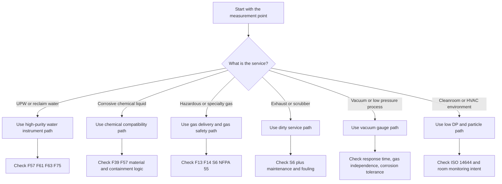

<!--
AI_READ_ACCESS: ALLOWED (with caution)
CONTENT_CLASS: WORK_IN_PROGRESS
STATUS: DRAFT
CATEGORY: SEMI_FACILITY_INSTRUMENT_USE_MATRIX
-->

# Semiconductor Facility Instrumentation Use Matrix

## Purpose

This note expands the semiconductor facility instrumentation list into a system-by-system use matrix.

It focuses on:

- what each instrument family is used for
- which measurement technology is usually preferred
- what standards or compliance lens applies
- what product-level approvals or interface items should be checked before selection
- which major manufacturer families are commonly relevant

Product families and official public pages were checked on April 9, 2026.

## Read this correctly

- The `Standards/compliance lens` column tells you which standards family shapes the application.
- The `Verify on selected product` column tells you what product-level approvals, protocols, or material certificates should be checked on the exact configured part number.
- A listed manufacturer family is a common fit, not an automatic approval.

## Selection flow

## Compliance lenses used in this note

| Lens | What it means in practice |
| --- | --- |
| `SEMI utility lens` | semiconductor-specific utility, purity, enclosure, or water-quality guidance shapes the application |
| `Code and fire lens` | NFPA, NEC, adopted code, and gas quantity or hazardous-use context shapes the installation |
| `Documentation lens` | ISA-5.1 and related documentation rules shape tag names and drawings |
| `Safety-execution lens` | SIL, hazardous-area approvals, or formal shutdown architecture shape the device choice |
| `Cleanroom lens` | ISO 14644 and contamination-control goals shape the measurement |

## Detailed use matrix

| System/use | Variable | Preferred technology | Why this technology is usually preferred | Common alternatives | Standards/compliance lens | Verify on selected product | Common manufacturer families |
| --- | --- | --- | --- | --- | --- | --- | --- |
| UPW generation and distribution | flow | electromagnetic flowmeter with compatible liner and electrodes | direct liquid measurement with no moving parts and no pressure-loss element; strong fit for conductive high-purity water if materials are right | clamp-on ultrasonic for retrofit or temporary measurement | SEMI utility lens: `F61`, `F63`, `F75`, materials lens: `F57`; documentation lens: `ISA-5.1` | wetted materials, liner chemistry, surface finish, calibration traceability, digital protocol, hazardous-area need if any | Endress+Hauser `Promag H`, Siemens `SITRANS FM MAG`, Emerson/Flexim clamp-on ultrasonic for non-invasive checks |
| UPW generation and distribution | pressure | high-stability pressure transmitter using piezoresistive, thin-film, or resonant sensor technology depending range and packaging | water systems need stable utility pressure more than exotic sensor physics; long-term stability and material documentation matter | compact OEM transmitters for skids | SEMI utility lens: `F61`; documentation lens: `ISA-5.1`; execution lens if used in shutdown logic | 316L or equivalent wetted parts, material certificates, output type, long-term stability, proof-test method if trip-related | Yokogawa `EJX A` or `EJX S`, WIKA `HYDRA`, `WUD-2x`, `S-20`, Emerson `Rosemount 3051/3051S`, Endress+Hauser `Cerabar` |
| UPW quality | resistivity or conductivity | contacting 2-electrode resistivity or conductivity sensors with high-purity water analyzers | the UPW problem is not just measurement, it is traceable low-level measurement with controlled sample path and temperature compensation | multi-parameter analyzers with different sensor styles where plant standardization matters | SEMI utility lens: `F61`, `F63`, `F75`; documentation lens: `ISA-5.1` | ASTM/NIST traceable calibration, semiconductor water suitability, sample integrity, temperature compensation method, digital analyzer compatibility | METTLER TOLEDO Thornton `M800`, `770MAX`, `UniCond`; Yokogawa `FLXA402`; Endress+Hauser `Liquiline` family |
| UPW quality | TOC | online TOC analyzer purpose-built for high-purity water | TOC quality decisions need fast, low-background measurement and clear maintenance status | lab TOC for offline confirmation, but slower response | SEMI utility lens: `F63`, `F75`; documentation lens: `ISA-5.1` | oxidation method, response time, maintenance interval, sample conditioning, alarm-state visibility | Veolia/Sievers `M500/M9` family context, METTLER TOLEDO Thornton multi-parameter ecosystem for integrated pure-water analytics |
| UPW and reclaim | dissolved ozone or special water chemistry | dedicated water analytics platform with compatible pure-water sensors | special chemistry loops require analyzer-and-sensor pairing, not generic transmitters | standalone specialty analyzers | SEMI utility lens: `F61`, `F75` | sample conditioning, calibration standard traceability, temperature effects, maintenance burden | METTLER TOLEDO Thornton, Yokogawa, Endress+Hauser depending parameter |
| Bulk chemical storage and day tanks | level | non-contact radar level measurement | keeps sensor body out of aggressive chemistry, reduces coating and maintenance when installation is correct | ultrasonic for simpler or lower-cost applications, guided-wave radar for difficult vessels, backup point switches for overfill | SEMI utility lens: `F39`, `F57`; code and fire lens for storage class; documentation lens: `ISA-5.1` | antenna and process connection material, chemical compatibility, buildup tolerance, false echo handling, independent overfill device | VEGA `VEGAPULS 6X`, Endress+Hauser `Micropilot`, Siemens `SITRANS Probe` for simpler ultrasonic duty |
| Bulk chemical transfer | flow | Coriolis flowmeter when dosing accuracy and density awareness matter | direct mass flow and density support are useful for transfer, blend, and concentration-sensitive duty | magmeter if fluid is conductive and materials fit, clamp-on ultrasonic for non-invasive checks | SEMI utility lens: `F39`, `F57`; documentation lens: `ISA-5.1` | compatibility of wetted parts, entrained-gas behavior, cleaning method, required turn-down, digital diagnostics | Emerson `Micro Motion ELITE/G-Series`, Endress+Hauser `Promass`, Endress+Hauser `Promag H` when mag fits |
| Chemical storage and transfer | pressure | flush or chemically isolated pressure transmitter | corrosive service and deposits drive connection design as much as accuracy | remote seal assemblies, compact OEM sensors | SEMI utility lens: `F39`, `F57`; code and fire lens depending chemical class | diaphragm material, fill fluid if any, flush geometry, material certs, hazardous-area approvals if installed in classified zone | WIKA, Yokogawa, Emerson, Endress+Hauser |
| Chemical blend or prep skid | pH/ORP | electrochemical pH/ORP system with application-matched sensor body and reference system | chemistry systems need maintainable analyzers with calibration discipline, not generic utility probes | ISFET in some applications, lab confirmation | SEMI utility lens: `F39`; documentation lens: `ISA-5.1`; safety-execution lens if tied to neutralization limits | sensor chemistry fit, temperature compensation, calibration access, cleaning method, analyzer outputs | Yokogawa `FLXA402`, Endress+Hauser `Liquiline`, METTLER TOLEDO process analytics lines |
| Gas cabinets, VMBs, gas panels | mass flow | metal-sealed thermal MFC for high-purity gas, or pressure-based MFC where pressure insensitivity is the main challenge | semiconductor gas control needs low leak, stable zero, multi-gas support, compact panel fit, and clean metal flow paths | elastomer-sealed digital MFCs for less severe utility or lab duty | SEMI utility lens: `F13`, `F14`, `S6`; code and fire lens: `NFPA 55`; safety-execution lens where flow participates in shutdown or safe-delivery logic | seal type, gas compatibility, pressure transient behavior, communication option, panel footprint, safe-delivery features | Brooks `GF100/GF80/GP200/GF120xHT`, HORIBA `SEC-Z500X/S600/DZ-107`, MKS `GM50A/C-Series` |
| Gas cabinets and hazardous gas areas | pressure at source and regulated line | compact high-purity pressure transducer or switch | gas systems need leak-tight pressure measurement with compact form factor and strong electrical noise immunity | general industrial transmitters at non-UHP utility boundaries | SEMI utility lens: `F13`, `F14`; code and fire lens: `NFPA 55`; safety-execution lens for trip service | UHP cleanliness, pressure boundary integrity, fitting style, response time, digital interface such as EtherCAT where tool architecture needs it | WIKA `HYDRA` and `WUD-2x`, MKS pressure and vacuum lines, Yokogawa and Rosemount at non-UHP utility boundaries |
| Hazardous gas monitoring | toxic gas or oxygen | electrochemical fixed detector for point toxic/oxygen monitoring | strong fit for specific toxic gases and oxygen with mature transmitter platforms | paper-based Chemcassette systems for very low concentration specialty toxic monitoring, MOS or IR in selected cases | SEMI utility lens: `S6`, `S2`; code and fire lens: `NFPA 55`, `NFPA 318`; safety-execution lens: `IEC 61508`, Ex approvals | target-gas list, cross-sensitivity, bump-test method, SIL capability, ATEX/IECEx/UL/CSA, HART/Modbus/Fieldbus | Dräger `Polytron 7000/8100`, Honeywell high-tech toxic gas systems such as `Vertex Edge` and Chemcassette-based platforms, Teledyne `DG7` and `OLCT 100` |
| Chemical leak or liquid presence monitoring | leak detection | rope, point, or conductive leak sensor matched to chemical area | leak sensors are simple devices but zoning, placement, and cable survivability decide whether they work | float switches in contained sumps, optical leak sensors in selected services | SEMI utility lens for containment; code and fire lens depending chemical class | cable compatibility, sensing liquid compatibility, reset method, failsafe behavior | TTK and similar leak-detection specialists; many PLC-integrated sensor families are possible |
| Exhaust ducts, cabinets, and scrubber inlets | exhaust proof or airflow | thermal mass flow or carefully designed differential pressure proof | the goal is to prove capture, not merely that a fan motor is energized | vane or airflow switches, static pressure proof, fan status plus DP combination | SEMI utility lens: `S6`; code and fire lens; safety-execution lens if exhaust loss forces isolation | fouling tolerance, duct mounting, maintenance access, alarm validation method | Kurz thermal flow, Teledyne and other airflow families, DP transmitters from Rosemount, Yokogawa, Setra |
| Wet scrubbers and wastewater neutralization | pH/ORP | industrial analyzer with chemical-duty electrodes | wet chemistry loops need maintainable analyzers with cleaning and calibration plan | lab confirmation | SEMI utility lens: wastewater and chemical handling context; documentation lens: `ISA-5.1` | electrode chemistry, cleaning interval, relay or digital outputs, sample conditioning | Yokogawa, Endress+Hauser, METTLER TOLEDO process analytics |
| Vacuum foreline and process vacuum | pressure or vacuum | capacitance manometer for gas-independent accurate pressure in relevant range | for control-critical vacuum pressure, gas independence and repeatability are often more important than broad range | combination Pirani/capacitance gauges for wider range, other vacuum gauges by regime | semiconductor process lens, safety-execution lens when pressure is in control loop | pressure range, heated or unheated body, corrosion tolerance, communication protocol, response time, fitting style | MKS `Baratron`, INFICON `PCG/Stripe/Porter`, Pfeiffer `CenterLine CNR/CMR` |
| Cleanroom room cascade | low differential pressure | very low differential pressure transducer based on stable capacitance sensing | room-pressure work needs stability and low drift more than broad range | room monitors with integrated display and alarming | cleanroom lens: `ISO 14644`; documentation lens: `ISA-5.1` | zero stability, display, BACnet/Modbus/analog output, calibration method, install location | Setra `264` and `FLEX`, Dwyer `MagneSense` family, TSI room monitoring platforms |
| Cleanroom and critical utilities | particles | optical airborne particle counter or condensation particle counter depending class and particle-size concern | particle monitoring splits into routine cleanroom counting and sub-100 nm monitoring | handheld, portable, or fixed counters | cleanroom lens: `ISO 14644-1`; product-level calibration lens: `ISO 21501-4` | particle size channels, flow rate, fixed vs portable deployment, cleanroom standard support, data export | TSI `AeroTrak+ A100`, `AeroTrak 9001 CPC`, Lighthouse product families |
| Rotating utility equipment | vibration or condition | vibration sensor or condition monitor | useful for fans, pumps, and scrubber motors where failure trend matters more than one trip point | current-based condition inference, temperature monitoring | documentation lens: `ISA-5.1`; plant maintenance program lens | mount style, signal type, frequency range, integration with maintenance software | IFM and broader condition monitoring vendors |

## Technology details by device family

## Pressure transmitters

- `Piezoresistive`: common for compact industrial transmitters and many hygienic models; good for broad utility use.
- `Thin-film / welded metal cell`: good fit for rugged OEM and general utility pressure service.
- `Silicon resonant`: used by Yokogawa EJX family; valued for accuracy and long-term stability.
- `Capacitance diaphragm`: central to high-accuracy vacuum and low-pressure process measurement, especially in semiconductor vacuum service.

## Flowmeters

- `Electromagnetic`: strongest fit for conductive liquids such as UPW, reclaim water, and some chemicals when liner and electrode materials fit.
- `Coriolis`: strong fit when direct mass flow, density, and dosing precision matter.
- `Clamp-on ultrasonic`: strong retrofit tool when non-invasive installation is more important than ultimate purity of an in-line wetted meter.
- `Thermal mass`: useful for gas and exhaust measurement but heavily dependent on gas assumptions and contamination control.

## Gas flow control

- `Thermal metal-sealed MFC`: common semiconductor gas-panel choice.
- `Pressure-based MFC`: attractive for difficult low-vapor-pressure or highly dynamic pressure conditions.
- `MEMS MFC`: strong fit for fast-response compact gas control, especially where corrosive gas duty is not the main issue.

## Gas detection

- `Electrochemical`: common for toxic gases and oxygen.
- `Catalytic bead`: common for combustible gas detection.
- `MOS`: useful in selected gas-detection platforms but must be checked carefully for specificity and stability.
- `Paper-based Chemcassette / spectroscopic methods`: strong fit for some high-tech toxic gas systems where low-level detection and selectivity matter.

## Particle monitoring

- `Optical particle counter`: standard cleanroom particle monitoring route.
- `Condensation particle counter`: chosen when nanoscale particles below conventional optical range matter.

## Standards and compliance checklist by device type

| Device type | Standards/compliance families that often matter | Product-level items often checked |
| --- | --- | --- |
| UPW sensors and analyzers | `SEMI F57`, `F61`, `F63`, `F75`, `ISA-5.1` | calibration traceability, material certs, high-purity suitability, analyzer protocol |
| Chemical-duty sensors | `SEMI F39`, `F57`, local code, `ISA-5.1` | chemical compatibility, containment fit, material certs, hazardous-area need |
| Gas-panel instrumentation | `SEMI F13`, `F14`, `S6`, `NFPA 55`, `ISA-5.1` | UHP cleanliness, metal seals, gas list, communication option, proof-test method |
| Fixed gas detectors | `SEMI S2`, `S6`, `NFPA 55`, `NFPA 318`, `IEC 61508` | target-gas list, SIL, Ex approvals, controller interface, bump-test workflow |
| Cleanroom monitors | `ISO 14644`, `ISA-5.1` | calibration method, low-DP stability, ISO 21501-4 for particle counters |
| Vacuum gauges | process-tool or utility requirements, documentation and safety-execution lens | range fit, gas independence, corrosion resistance, response time, EtherCAT or analog option |

## Engineering cautions

- Do not treat a hygienic approval such as `3-A` or `EHEDG` as equivalent to semiconductor high-purity suitability.
- Do not treat `SIL` or hazardous-area approvals as present on a family page and therefore present on every configured model.
- Do not assume a protocol shown on one family option is available on every size or body style.
- For semiconductor gas duty, check whether the product line is elastomer-sealed, metal-sealed, or explicitly positioned for UHP service.
- For UPW, treat sample tubing, sensor mounting, calibration fluid, and maintenance procedure as part of the measurement system.

## Official public product-family pages checked

- Brooks GF100 / GF80 / GP200 family context: [GF100](https://www.brooksinstrument.com/product/gf100-series-high-flow), [GF80](https://www.brooksinstrument.com/products/mass-flow-controllers/metal-sealed/gf80-series), [GP200](https://www.brooksinstrument.com/en/products/mass-flow-controllers/metal-sealed/gp200-series)
- Brooks semiconductor gas page: [High-purity gas MFCs](https://www.brooksinstrument.com/en-GB/products/semiconductor-products/high-purity-gas-mfc)
- HORIBA semiconductor MFC families: [SEC-E](https://www.horiba.com/usa/semiconductor/products/detail/action/show/Product/sec-e-series-724/), [SEC-Z500X](https://www.horiba.com/usa/semiconductor/products/detail/action/show/Product/sec-z500x-series-729/), [DZ-107 release](https://www.horiba.com/usa/company/news/detail/news/1/2025/20250114dz/)
- MKS gas flow and vacuum families: [GM50A](https://www.mks.com/f/gm50a-mass-flow-controller), [C-Series](https://www.mks.com/c/c-series-mass-flow-controllers), [Baratron family](https://www.mks.com/c/capacitance-manometers/), [DA05A EtherCAT manometer](https://www.mks.com/f/f/da05A-ethercat-capacitance-manometers)
- Yokogawa pressure and analyzer families: [EJX A Series](https://www.yokogawa.com/us/solutions/products-and-services/measurement/field-instruments-products/pressure-transmitters/differential-pressure/ejx-a/), [EJX S Series release](https://www.yokogawa.com/news/press-releases/2026/2026-02-26/), [FLXA402 conductivity analyzers](https://www.yokogawa.com/us/solutions/products-and-services/measurement/analyzers/liquid-analyzers/conductivity-analyzers/)
- WIKA semiconductor and pressure lines: [HYDRA Sensor](https://www.wika.com/en-us/hydra_sensor.WIKA), [WUD-2x](https://www.wika.com/en-us/wud_20_wud_25_wud_26.WIKA), [Pressure sensors overview](https://www.wika.com/en-en/pressure_sensors.WIKA)
- Endress+Hauser flow, pressure, level, and analyzer families: [Promag H 200](https://www.us.endress.com/en/field-instruments-overview/flow-measurement-product-overview/electromagnetic-flowmeter-promag-h200-5h2b), [Cerabar PMP43](https://www.us.endress.com/en/field-instruments-overview/pressure/Pressure-Cerabar-PMP43), [Cerabar PMP71](https://www.us.endress.com/en/field-instruments-overview/pressure/Absolute-Gauge-Cerabar-PMP71), [Micropilot FMR67](https://www.us.endress.com/en/field-instruments-overview/level-measurement/Radar-Micropilot-FMR67), [Liquiline CM44P](https://www.us.endress.com/liquiline-cm44p)
- Siemens flow and level families: [SITRANS FM MAG 3100](https://www.siemens.com/ro-ro/products/sitrans/f-m-mag-3100/), [SITRANS Probe LU240](https://www.siemens.com/global/en/products/automation/process-instrumentation/level-measurement/continuous/ultrasonic/sitrans-probe-lu240.html)
- Dräger gas detection families: [Polytron 7000](https://www.draeger.com/en-us_us/Products/Polytron-7000), [Polytron 8100 EC](https://www.draeger.com/en-us_us/Products/Draeger-Polytron-8100)
- Honeywell high-tech gas detection context: [High-tech gas protection brochure](https://sps.honeywell.com/content/dam/honeywell-edam/sps/his/en-us/services/sensing-and-software-technologies/industrial-processing-and-safety/calibration-services/documents/sps-his-honeywell-fixed-or-high-tech-gas-protection-0621-brochure.pdf), [Vertex Edge brochure](https://sps.honeywell.com/content/dam/honeywell-edam/sps/his/en-us/industries/manufacturing/infrastructure/gas-detection-for-the-high-tech-industry/sps-his-hon-dts-vertex-edge-a4-en-0820-20-08.pdf)
- Teledyne gas detection families: [DG7 series](https://www.teledynegasandflamedetection.com/en-us/dg7-series-intelligent-toxic-and-flammable-gas-detectors), [OLCT 100](https://www.teledynegasandflamedetection.com/en-us/olct-100-olc-100-toxic-and-combustible-gas-detector)
- METTLER TOLEDO Thornton pure-water context: [Water purification applications](https://www.mt.com/gb/en/home/applications/Top_application_browse/Water_Purification_application_browse.html), [UniCond water sensor page](https://www.mt.com/us/en/home/products/Process-Analytics/conductivity-resistivity-analyzers/conductivity-sensor/cond-sensor-1-5tri-0-1c-ti.html), [M800 process transmitter](https://www.mt.com/us/en/home/products/Process-Analytics/transmitter/multi-parameter-digital-transmitter-M800/m800-process-transmitter-1-ch.html)
- Setra and cleanroom monitoring: [Model 264](https://www.setra.com/product/pressure/model-264), [Room pressure monitors](https://www.setra.com/product/room-pressure-monitors), [Cleanroom monitoring solution](https://www.setra.com/cleanroom-monitoring)
- Vacuum alternatives: [INFICON PCG55x](https://www.inficon.com/en/products/vacuum-gauge-and-controller/pcg55x), [INFICON Stripe CDG100Dhs](https://www.inficon.com/en/products/vacuum-gauge-and-controller/stripe-cdg100dhs), [Pfeiffer CenterLine CNR release](https://www.pfeiffer-vacuum.com/us/en/company/news-media/pfeiffer-vacuum-fab-solutions-introduces-the-centerline-cnr-series.html)
- Particle monitoring: [TSI AeroTrak+ A100](https://tsi.com/discover-tsi/latest-news/2023/new-tsi-aerotrak-plus-portable-particle-counter-a100-series-now-available), [TSI AeroTrak 9001 CPC](https://tsi.com/discover-tsi/latest-news/2017/tsi-introduces-the-aerotrak-9001-cleanroom-condensation-particle-counter)
