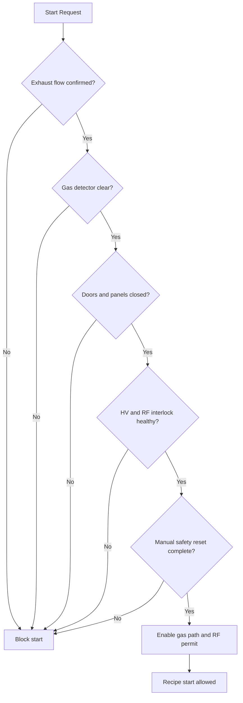
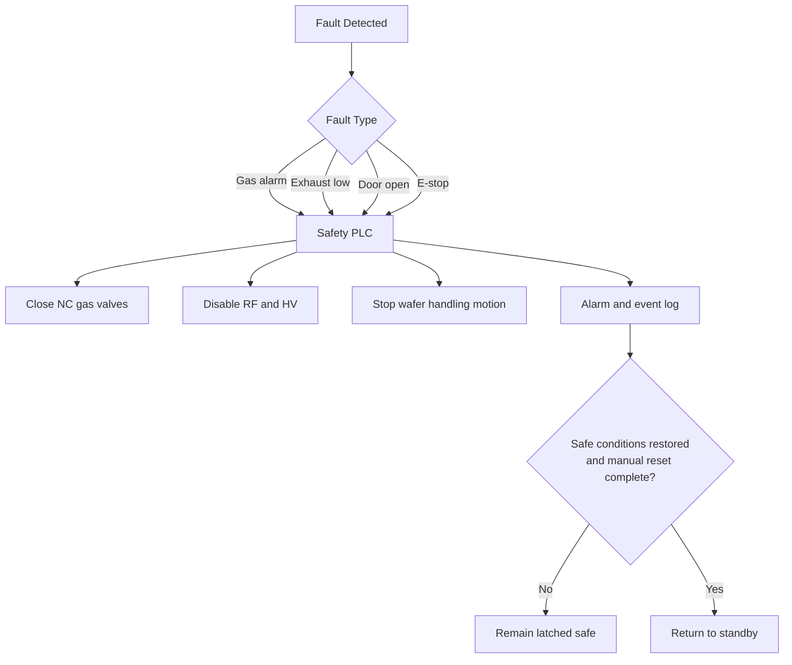
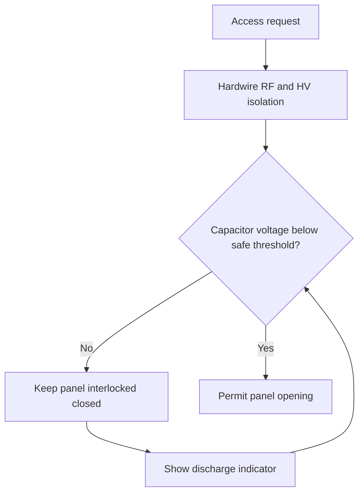
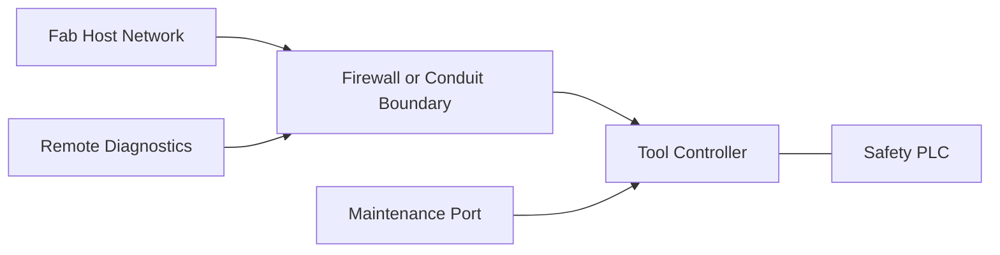

# Semiconductor Fab Tool Visual Aid Reference

## Source Page

- Scenario: Semiconductor Fab Tool - Etch / CVD Process Equipment
- URL: <https://kyawminthu20.github.io/Control-System-Tools/scenarios/semiconductor-fab-tool/>

## Purpose

This note captures recommended visual aids for the semiconductor fab tool scenario page. The goal is to make the workflow, interlocks, and fault behavior easier to scan than prose alone.

## Recommended Visuals

### 1. Design Workflow Overview

**Value:** Gives readers a fast top-level view of the full engineering path.

**Placement:** Near the top of the page, after Project Summary or Standard Stack.

**Content:**

- Phase 1: Risk Assessment and Safety Architecture
- Phase 2: Electrical Design
- Phase 3: Ergonomics and Documentation
- Phase 4: Fab Qualification

**Mermaid starter:**


### 2. Process Start Permissive Flow

**Value:** Shows the exact logic path for when gas flow and RF are allowed to start.

**Placement:** Before or after the existing Gas Delivery Control System diagram.

**Content:**

- Exhaust flow confirmed
- Gas detector clear
- Doors and access panels closed
- HV/RF interlock healthy
- Safety reset completed
- Permit recipe start

**Mermaid starter:**



### 3. Fault Trip Sequence

**Value:** This is the highest-value operational visual because it makes the fail-safe behavior explicit.

**Placement:** Immediately after the gas delivery diagram or in Key Engineering Decisions.

**Content:**

- Gas alarm
- Exhaust loss
- Door open
- E-stop
- Safety PLC trip response
- Close NC valves
- Disable RF/HV
- Stop motion
- Alarm and log
- Manual reset required

**Mermaid starter:**



### 4. HV Access Interlock Flow

**Value:** Supports the capacitor discharge discussion and makes personnel protection logic clear.

**Placement:** In Key Engineering Decisions, near the capacitor discharge paragraph.

**Content:**

- Access request
- Isolate RF/HV
- Verify stored energy reduced below threshold
- If not, block access
- If yes, permit panel opening

**Mermaid starter:**



### 5. Fire Risk Bow-Tie

**Value:** Best format for SEMI S14-oriented communication. This is not a standard flowchart, but it explains hazard logic very well.

**Placement:** In Phase 1 or Key Engineering Decisions.

**Content:**

- Left side threats: gas leak, ignition source, oxidizer
- Center event: enclosure fire
- Right side consequences and protections: shutoff, detection, suppression, facility alarm

**Implementation note:** Mermaid can approximate this with a left-to-right flow, but a custom SVG or static image would communicate the bow-tie structure better.

### 6. Cybersecurity Zone Diagram

**Value:** Makes IEC 62443 coverage more concrete for networked tools.

**Placement:** In Fab Qualification near the cybersecurity assessment section.

**Content:**

- Fab host network
- Tool controller
- Safety PLC
- Maintenance laptop or maintenance port
- Remote diagnostics path
- Zone and conduit boundary

**Mermaid starter:**



## Priority Order

If only three visuals are added, use this order:

1. Design Workflow Overview
2. Process Start Permissive Flow
3. Fault Trip Sequence

## Visual Conventions

Use one visual language across the page:

- Blue nodes: normal process path
- Amber nodes: permissive checks
- Red nodes: trip, isolation, or shutdown actions
- Solid arrows: hardwired control or physical flow
- Dashed arrows: status, alarm, or monitoring signals

## Page-Level Recommendation

The current gas delivery control system diagram is useful as a structural system map. It should be complemented by at least one logic-oriented flowchart so readers can see both:

- what is connected to what
- what happens when a permissive fails or a safety fault occurs

That combination will make the scenario page read more like an engineering reference and less like a text-only checklist.

Below is a **formal, field-usable semiconductor panel wiring standard**. It’s written so you can drop it into your control design package or turn it into a company spec.

---

# **Semiconductor Control Panel Wiring Standard**

**Document ID:** SEMI-CS-WIRE-STD-001
**Scope:** PLC panels, gas cabinets, chemical delivery systems, facility skids, and OEM tools
**Applies to:** 24 VDC control systems, AC control circuits, instrumentation, safety circuits

---

# 1. **Wire Color Code Standard**

## 1.1 Mandatory Color Assignments

| Function                                | Color                                     | Requirement                      |
| --------------------------------------- | ----------------------------------------- | -------------------------------- |
| Protective Earth (PE)                   | **Green/Yellow**                          | Dedicated only for grounding     |
| AC Neutral (grounded conductor)         | **White / Gray**                          | Per NEC                          |
| AC Line Power (ungrounded)              | **Black**                                 | Internal panel power             |
| AC Control Circuits                     | **Red**                                   | 120/230 VAC control              |
| DC Control (+24 VDC)                    | **Blue**                                  | Standard control voltage         |
| DC Control Common (0V)                  | **White with Blue stripe**                | Required differentiation         |
| External/UPS-fed circuits (always live) | **Orange**                                | Must remain consistent           |
| External DC circuits (always live)      | **Orange with Blue stripe**               | Required if DC                   |
| Safety Circuits (internal panel)        | **Yellow** _(or Orange if site requires)_ | Must be consistent across system |
| Analog Signal Wiring                    | **Blue pair (shielded)**                  | Twisted pair required            |
| Network/Communication                   | **Gray or vendor cable**                  | Labeling required                |
| EPO Field Wiring                        | **Red jacket or labeled cable**           | Field-level identification       |

---

## 1.2 Rules

- Color **shall not be reused across functions**
- Orange is **reserved only for energized circuits with disconnect OFF**
- Green/Yellow **shall never be used for current-carrying conductors**
- All deviations require **engineering approval + drawing note**

---

# 2. **Terminal Naming Rules**

## 2.1 Standard Terminal Structure

```
[Panel]-[Voltage Level]-[Function]-[Sequence]
```

### Examples:

- `P1-24VDC-PWR-001`
- `P1-24VDC-DI-023`
- `P1-120VAC-CTRL-005`
- `P1-SAFE-LOOP-002`

---

## 2.2 Terminal Block Grouping

| Terminal Block Prefix | Function               |
| --------------------- | ---------------------- |
| TB-PWR                | Power distribution     |
| TB-CTRL               | Control circuits       |
| TB-IO                 | PLC I/O marshalling    |
| TB-SAFE               | Safety circuits        |
| TB-ANLG               | Analog signals         |
| TB-COMM               | Communication          |
| TB-FLD                | Field wiring interface |

---

## 2.3 Physical Layout Rules

- Separate terminal blocks by:
  - Power
  - Control
  - Safety
  - Analog

- Maintain **minimum spacing or physical barriers**
- Safety terminals must be **visibly segregated**

---

# 3. **Wire Numbering Rules**

## 3.1 Wire Number Format

```
[Panel]-[Voltage]-[Source]-[Destination]-[Sequence]
```

### Example:

- `P1-24V-PS1-TBIO-001`
- `P1-24V-PLC-DI23-002`
- `P1-120V-RLY1-TBCTRL-004`

---

## 3.2 Rules

- Each wire must have:
  - Unique ID
  - Printed ferrule or heat-shrink label

- Same signal = same wire number across terminals
- Wire numbers must match:
  - Schematic
  - PLC tag
  - I/O drawing

---

## 3.3 Special Identification

| Type                   | Requirement               |
| ---------------------- | ------------------------- |
| Safety wiring          | Prefix with `SAFE-`       |
| Analog signals         | Prefix with `AI-` / `AO-` |
| Network                | Prefix with `NET-`        |
| External live circuits | Prefix with `EXT-`        |

---

# 4. **PLC I/O Marshalling Rules**

## 4.1 Structure

Field → Terminal Block → PLC

```
FIELD DEVICE → TB-IO → PLC MODULE
```

---

## 4.2 Naming Convention

| I/O Type       | Format   |
| -------------- | -------- |
| Digital Input  | `DI-###` |
| Digital Output | `DO-###` |
| Analog Input   | `AI-###` |
| Analog Output  | `AO-###` |

---

## 4.3 Example

| Signal          | Terminal   | PLC Tag |
| --------------- | ---------- | ------- |
| Door Closed     | TB-IO-01   | DI-001  |
| Gas Valve Open  | TB-IO-12   | DO-012  |
| Pressure Sensor | TB-ANLG-03 | AI-003  |

---

## 4.4 Rules

- One signal per terminal (no doubling)
- Shield termination:
  - Ground at **one end only**

- Analog wiring:
  - Routed separately from power

- Maintain:
  - Consistent left-to-right mapping
  - Sequential numbering

---

# 5. **Safety / EPO Conventions**

## 5.1 Safety Philosophy

- **De-energize to trip**
- **Fail-safe design**
- **No software-only safety**

---

## 5.2 Safety Wiring Rules

| Requirement           | Description                   |
| --------------------- | ----------------------------- |
| Dual channel          | Required for all safety loops |
| Redundancy            | Independent paths             |
| Monitoring            | Safety relay / safety PLC     |
| Cross-fault detection | Required                      |

---

## 5.3 EPO (Emergency Power Off)

### Requirements:

- Hardwired
- Independent of PLC
- Cuts:
  - Power contactors
  - Gas supply valves
  - Chemical pumps

---

## 5.4 EPO Wiring Standard

| Element      | Requirement               |
| ------------ | ------------------------- |
| Cable        | Red jacket or labeled     |
| Circuit type | Normally Closed (NC loop) |
| Monitoring   | Safety relay feedback     |
| Location     | Accessible and visible    |

---

## 5.5 Safety Terminal Rules

- Dedicated terminal blocks (TB-SAFE)
- No mixing with standard control wiring
- Clearly labeled:
  - `SAFETY CIRCUIT – DO NOT MODIFY`

---

# 6. **Panel Layout Requirements**

## 6.1 Segregation Zones

| Zone   | Content          |
| ------ | ---------------- |
| Zone 1 | Power (AC mains) |
| Zone 2 | Control (24VDC)  |
| Zone 3 | Safety           |
| Zone 4 | Analog           |
| Zone 5 | Communications   |

---

## 6.2 Routing Rules

- Power and signal wiring must be separated
- Analog and communication wiring:
  - Shielded
  - Routed away from VFD/motor cables

- Use wire ducts with covers

---

# 7. **Example Drawing Notes**

## 7.1 General Wiring Note

```
All wiring shall comply with SEMI-CS-WIRE-STD-001.
Wire colors shall follow defined standards.
All conductors shall be labeled with wire numbers matching schematics.
```

---

## 7.2 Safety Note

```
Safety circuits shall be hardwired, dual-channel, and fail-safe.
No safety function shall rely solely on PLC logic.
All safety wiring shall terminate in TB-SAFE terminals.
```

---

## 7.3 External Power Warning

```
WARNING: ORANGE WIRES INDICATE CIRCUITS THAT MAY REMAIN ENERGIZED
EVEN WHEN MAIN DISCONNECT IS OFF.
```

---

## 7.4 Analog Signal Note

```
All analog signals shall use shielded twisted pair cables.
Shield shall be grounded at one end only (panel side).
```

---

## 7.5 Grounding Note

```
All metal parts shall be bonded to protective earth.
Ground conductors shall be green/yellow only.
```

---

# 8. **Compliance References**

- NFPA 79 – Industrial Machinery
- NEC (NFPA 70)
- IEC 60204-1
- SEMI S2 (Safety Guideline)
- IEC 61508 / ISO 13849 (Functional Safety)

---

# 9. **What Actually Matters (Engineering Reality)**

If you want this to work in real semiconductor environments:

- Consistency > perfection
- Labeling > color
- Separation > everything
- Safety isolation > convenience

Most failures in the field come from:

- mixed voltage wiring
- unclear “always live” circuits
- poor terminal organization
- undocumented deviations

---

If you want next step, I can build:

- **Full panel layout drawing (AutoCAD-style structure)**
- **PLC tag + wiring auto-generation template**
- **Gas cabinet / chemical skid safety interlock template**

That’s where this becomes a real engineering system, not just a document.
