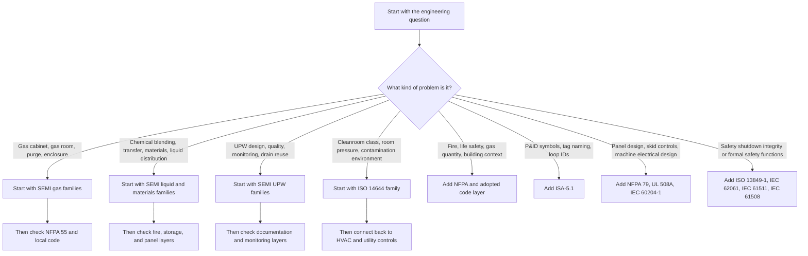

<!--
AI_READ_ACCESS: ALLOWED (with caution)
CONTENT_CLASS: WORK_IN_PROGRESS
STATUS: DRAFT
CATEGORY: SEMI_FACILITY_STANDARDS_README
-->

# Standards Reference Notes

## Purpose

This folder explains which standards families matter to semiconductor facility engineering, what each family is for, and when each family should be opened.

These notes are orientation and routing aids. They are not substitutes for licensed standards text.

## Current files

- [Candidate Standards and Code Map](candidate_standards_map.md)
- [Semiconductor Facility Standards Landscape](semiconductor_facility_standards_landscape.md)

## How to use this folder

1. Start with the system you are working on.
2. Decide whether your question is mainly about semiconductor-specific utility design, building and fire code, control execution, or cleanroom performance.
3. Use the routing flow below to select the first standards family.
4. Then add the supporting layers that apply to the same problem.

## Standards routing flow

## Practical reading rule

Do not ask one standard family to do the job of all the others.

- SEMI families usually tell you what semiconductor utility or equipment topic you are in.
- NFPA and adopted code tell you building and fire constraints.
- ISA-5.1 tells you how to document signals and instruments.
- NFPA 79, UL 508A, and IEC 60204-1 help when the problem becomes a packaged panel or machine-skid execution issue.
- ISO 14644 helps when the question is about cleanroom environment rather than gas or liquid utility hardware.
