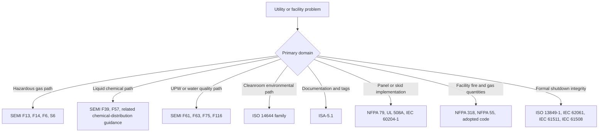

<!--
AI_READ_ACCESS: ALLOWED (with caution)
CONTENT_CLASS: WORK_IN_PROGRESS
STATUS: DRAFT
CATEGORY: SEMI_FACILITY_STANDARDS_MAP
-->

# Candidate Standards and Code Map

## Purpose

This is a planning map for standards and code families that matter to semiconductor facility engineering.

Confirm the current edition before promoting any of these into authoritative content.

## What this file should help you answer

- What is this standards family actually about?
- Is it a semiconductor-utility document, a building-code document, a control-execution document, or an environmental document?
- Is it current, local-only, or mainly historical context?
- Which systems in the fab should trigger me to open it?

## Quick reading legend

- `Current`: the public standards page indicates a current or published edition.
- `Confirmed`: the public standards page indicates the edition remains current.
- `Historical context`: still useful for architecture vocabulary, but not something to treat as the final current requirement without more checking.
- `Local derived`: the repo already has a paraphrased local note.

## Selection flow

## Current map

| Family | What it is | Why it matters | Typical systems | Status |
| --- | --- | --- | --- | --- |
| SEMI S2 / S8 / S14 | equipment-safety, ergonomics, and fire-risk guidance for semiconductor manufacturing equipment | frames the EHS baseline around tools, skids, and equipment packages | tools, gas or chemical skids, packaged equipment | Local derived |
| SEMI S6 | a semiconductor-specific exhaust ventilation guideline for manufacturing equipment | helps answer what exhaust-related conditions matter before a hazardous utility path is enabled | gas cabinets, exhausted enclosures, wet process tools | Current |
| SEMI F13 | a guide for gas source control equipment from cylinder to point of use | explains what the gas control train is supposed to do and what minimum functions matter | gas panels, source control assemblies, cabinet internals | Historical context |
| SEMI F14 | a guide for gas source equipment enclosures | explains enclosure-level design thinking around gas source equipment | gas cabinets, enclosed gas source equipment | Historical context |
| SEMI F6 | a guide for secondarily contained hazardous gas piping systems | useful when the question is about contained gas routing rather than the cabinet itself | hazardous gas distribution piping | Historical context |
| SEMI S18 | an EHS guideline for flammable silicon compounds | relevant to a narrower gas-hazard slice, not a generic gas-monitoring document | silane-family handling and abatement context | Current |
| SEMI F39 | a guide for chemical blending systems | explains the blending-equipment side of liquid chemical preparation and qualification | blend skids, make-up systems | Current |
| SEMI F57 | a specification for high-purity polymer materials and components used in UPW and liquid chemical distribution | anchors material qualification, contamination contribution, and validation expectations for polymer fluid paths | UPW distribution, liquid chemical distribution | Current |
| SEMI F61 | a guide to design and operation of a semiconductor UPW system | gives the system-level view of treatment, distribution, hookup, quality, and operations | UPW plant and distribution | Current |
| SEMI F63 | a guide for UPW used in semiconductor processing | helps define what water quality means at the point of use | UPW quality and acceptance | Current |
| SEMI F75 | a guide for monitoring UPW quality | helps determine how quality is watched, not just how it is produced | UPW analyzers and monitoring programs | Current |
| SEMI F116 | a guide for drain segregation to support site water reuse | helps structure drain routing for reclaim and reuse strategy | tool drains, reclaim, wastewater segregation | Current |
| SEMI F20 | a material specification for 316L stainless used in high-purity semiconductor applications | important when metallic purity hardware is part of the contamination-control strategy | high-purity metallic tubing and components | Current |
| SEMI E5 / E30 / E37 | communications and host-integration standards for semiconductor equipment | matter when the facility-tool boundary includes equipment communications or host behavior | tool interface, host or MES integration | Not yet mapped locally for facility use |
| NFPA 318 | semiconductor-fab fire and life-safety code context | gives the fab-wide fire and building layer above individual utility systems | fab-wide facility design | Needs local note |
| NFPA 55 | compressed-gas and cryogenic-fluid code context | important for gas storage, use quantities, and handling constraints | gas storage and distribution | Needs local note |
| NEC / NFPA 70 | electrical installation code | governs wiring methods, grounding, installation context, and adopted code compliance | electrical distribution and installation | Local derived |
| NFPA 79 | electrical standard for industrial machinery | matters when the semiconductor utility package is effectively a machine or packaged skid | tool skids, packaged utility skids | Local derived |
| UL 508A | industrial control panel construction and SCCR standard | matters when a utility panel is built and labeled as an industrial control panel | local control panels | Local derived |
| IEC 60204-1 | electrical equipment of machines | global machine-skid electrical-design reference | global equipment packages and machine skids | Local derived |
| ISO 13849-1 / IEC 62061 | machinery safety-function design standards | matter when safety functions need a formal design approach | tool safety and packaged skid safety logic | Local derived |
| IEC 61511 / IEC 61508 | process safety lifecycle standards | matter when shutdown integrity and safety lifecycle depth look more like process-industry work than machine guarding | process safety and critical shutdown logic | Local derived |
| ISA-5.1 | instrumentation and control symbols and identification standard | gives you the language for readable P&IDs and instrument tags | P&IDs, tag naming, loop documentation | Current |
| ISO 14644 family | cleanroom classification, design, startup, and contamination-control standards | defines cleanroom environmental discipline rather than gas or liquid utility hardware | cleanroom, airflow, room pressure, contamination environment | Current or confirmed |

## Plain-language explanations

### SEMI gas family

This family tells you how semiconductor gas source hardware is thought about.

- `F13` is about the gas control train.
- `F14` is about the enclosure around that train.
- `F6` is about secondarily contained hazardous gas piping.
- `S6` is about the exhaust side that often makes the gas system safe enough to operate.

This family is usually your first stop when the question is about a gas cabinet, VMB, purge panel, or exhausted gas enclosure.

### SEMI liquid and materials family

This family is more about liquid chemical handling quality and suitability than about generic plant piping.

- `F39` focuses on blending equipment.
- `F57` focuses on whether polymer materials and components are suitable for high-purity liquid service.
- `F20` supports the metallic-material side when 316L stainless purity hardware is part of the solution.

This family matters when contamination control is part of the design requirement, not just corrosion resistance.

### SEMI UPW family

This family behaves like a stack:

- `F61` is the system-level design and operation guide.
- `F63` is the quality target layer.
- `F75` is the monitoring layer.
- `F116` extends into drain segregation and water reuse support.

### Building and fire code layer

These documents usually do not tell you how to design a gas panel or UPW skid in detail. They tell you the facility context those systems must fit inside.

- `NFPA 318` is fab-wide context.
- `NFPA 55` matters for gases.
- `NEC` matters for electrical installation.

### Documentation and execution layer

These documents are often opened after the process and utility standards:

- `ISA-5.1` for symbols and IDs
- `NFPA 79`, `UL 508A`, `IEC 60204-1` for panels and packaged execution hardware
- `ISO 13849-1`, `IEC 62061`, `IEC 61511`, `IEC 61508` when shutdown integrity must be formalized

## Immediate gap-closing priorities

- Gas-system standards and guides: `SEMI F13`, `SEMI F14`, `SEMI F6`, `SEMI S6`
- Liquid chemical and UPW standards and guides: `SEMI F39`, `SEMI F57`, `SEMI F61`, `SEMI F63`, `SEMI F75`, `SEMI F116`
- Facility code overlays: `NFPA 318`, `NFPA 55`
- Facility documentation standards: `ISA-5.1`
- Cleanroom environmental standards: `ISO 14644`

## Promotion rule

When a standards-family note is created, it should state:

- what the family governs
- where it applies in a fab or utility system
- whether it is current, confirmed, local-derived, or historical context
- what questions it can answer well
- what questions it cannot answer by itself
- what local repo material already covers the topic
- what still requires external validation
