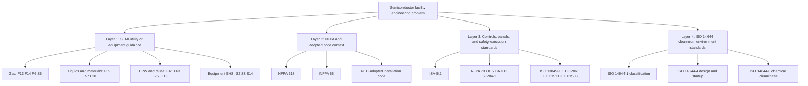
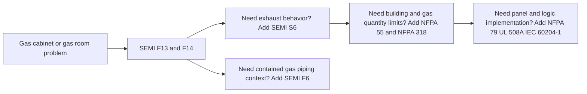
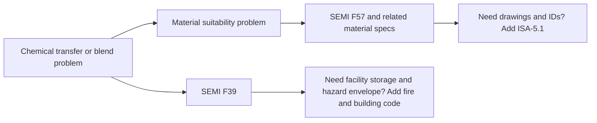
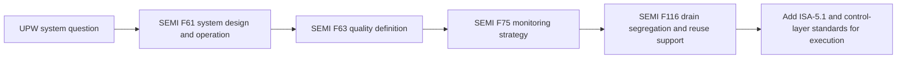
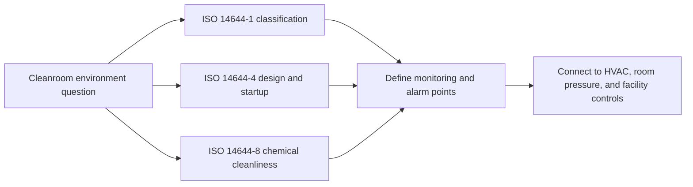

<!--
AI_READ_ACCESS: ALLOWED (with caution)
CONTENT_CLASS: WORK_IN_PROGRESS
STATUS: DRAFT
CATEGORY: SEMI_FACILITY_STANDARDS_LANDSCAPE
-->

# Semiconductor Facility Standards Landscape

## Purpose

This note organizes standards families by practical facility-engineering use instead of by acronym alone.

This is a planning aid based on public abstracts and official standards-body summaries. It is not a substitute for the licensed standards themselves.

## The core idea

Semiconductor facility engineering rarely uses one standard at a time. Most real design problems sit inside a layered stack:

1. semiconductor-specific utility or equipment guidance
2. building, fire, and adopted electrical code
3. control-panel, machine-skid, and documentation standards
4. environmental or cleanroom standards where contamination control matters

## Visual stack

## Standards layers

## Layer 1: semiconductor-specific facility and equipment guidance

- SEMI S2, S8, S14: equipment safety, ergonomics, and fire-risk framing
- SEMI S6: exhaust ventilation of semiconductor manufacturing equipment
- SEMI F13 and F14: gas source control equipment and gas source equipment enclosures
- SEMI F6: historical guide for secondary containment of hazardous gas piping systems
- SEMI F39: chemical blending systems
- SEMI F57: polymer materials and components used in UPW and liquid chemical distribution systems
- SEMI F61, F63, F75: UPW design, quality, and monitoring
- SEMI F116: drain segregation for water reuse
- SEMI F20: 316L stainless material specification for high-purity semiconductor manufacturing applications

### What Layer 1 really does

Layer 1 tells you the semiconductor-specific engineering problem space.

- It is where gas cabinets stop being generic gas equipment and become semiconductor gas equipment.
- It is where UPW stops being generic high-purity water and becomes fab-grade UPW through to point of use.
- It is where material selection starts including contamination contribution and qualification, not only corrosion resistance.

What Layer 1 does not do well by itself:

- adopted code compliance
- building egress and occupancy issues
- panel labeling and SCCR detail
- universal instrument-tagging conventions

## Layer 2: facility code and fire-life-safety context

- NFPA 318: semiconductor fabrication facility fire and life safety context
- NFPA 55: compressed gases and cryogenic fluids
- NEC and other adopted electrical code for installation

### What Layer 2 really does

Layer 2 tells you what the building, fire, and installation envelope will allow.

- `NFPA 318` is fab-wide context.
- `NFPA 55` is the compressed-gas quantity and handling context.
- `NEC` is the electrical-installation context.

This layer usually answers "what is allowed at facility scale?" rather than "how should I design one valve manifold?"

## Layer 3: control, documentation, and machinery-support standards

- ISA-5.1 for symbols and identification
- NFPA 79, UL 508A, IEC 60204-1 for packaged equipment and panels
- ISO 13849-1, IEC 62061, IEC 61511, IEC 61508 where safety functions and shutdown integrity become formal design concerns

### What Layer 3 really does

Layer 3 is the execution layer.

- `ISA-5.1` makes drawings and tag names legible to others.
- `NFPA 79`, `UL 508A`, and `IEC 60204-1` matter when a utility package becomes a real built control package.
- `ISO 13849-1`, `IEC 62061`, `IEC 61511`, and `IEC 61508` matter when shutdown performance and lifecycle evidence need formal structure.

## Layer 4: cleanroom environmental standards

- ISO 14644-1 for particle-based classification
- ISO 14644-4 for design, construction, and start-up
- ISO 14644-8 for chemical cleanliness classification

### What Layer 4 really does

Layer 4 tells you how to think about the environment around the process.

- `ISO 14644-1` classifies air cleanliness by particle concentration.
- `ISO 14644-4` covers the process from requirements through design, construction, and startup of cleanrooms.
- `ISO 14644-8` covers air cleanliness by chemical concentration when airborne chemistry matters to the process.

This layer is critical when room environment is part of product quality, not just comfort.

## System-by-system routing

### Gas systems

## Practical use pattern

### Gas systems

- start with SEMI gas and enclosure guidance
- add NFPA 55 and local code
- add shutdown, panel, and documentation standards as needed

### Chemical systems

- start with SEMI liquid chemical and material-qualification guidance
- add local fire and building code based on storage and hazard class
- add ISA-5.1 and panel or control standards for the execution layer

### UPW and water reuse

- start with SEMI F61, F63, F75, and F116
- add instrumentation and documentation standards
- add site environmental compliance requirements outside this folder as needed

### Cleanroom and environmental control

- start with ISO 14644 family
- add local mechanical and building code
- connect to utility and alarm architecture

## Standard-family explainer table

| Family | In plain language | Best first use | Weak spot if used alone |
| --- | --- | --- | --- |
| SEMI gas families | how semiconductor gas source hardware and enclosures are supposed to behave | gas cabinet, VMB, purge, source-control questions | does not replace building and fire code |
| SEMI liquid and materials families | how liquid chemical equipment and high-purity materials are qualified and applied | blend skids, liquid chemical distribution, materials questions | does not by itself define all facility storage rules |
| SEMI UPW families | how fab-grade water systems are designed, judged, and monitored | UPW system architecture and quality programs | does not replace local environmental compliance obligations |
| NFPA and adopted code | what the building and utility installation envelope allows | gas quantities, fire-life-safety, installation code | does not tell you detailed semiconductor utility architecture |
| ISA-5.1 | how to label and draw instruments consistently | P&IDs, loop IDs, symbol discipline | does not tell you what technology to choose |
| Panel and machine execution standards | how to build and document the execution hardware safely | local panels and packaged skids | not a substitute for utility-specific SEMI guidance |
| ISO 14644 | how to define and realize cleanroom environmental performance | room class, startup, contamination-control environment | does not tell you how to design a gas cabinet or chemical skid |

## Caution

- Some SEMI documents are equipment-facing rather than full facility design documents.
- Several useful SEMI references are guides and specifications, not direct design mandates.
- Several gas-related SEMI documents in this planning set are inactive or historical. They still help explain architecture, but they should not be treated as the only current requirement source.
- Always confirm the current edition and scope before promoting a standards note into authoritative RAG content.
